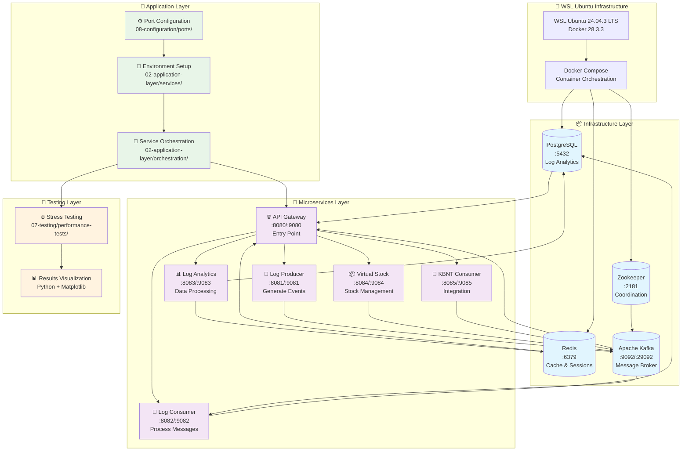
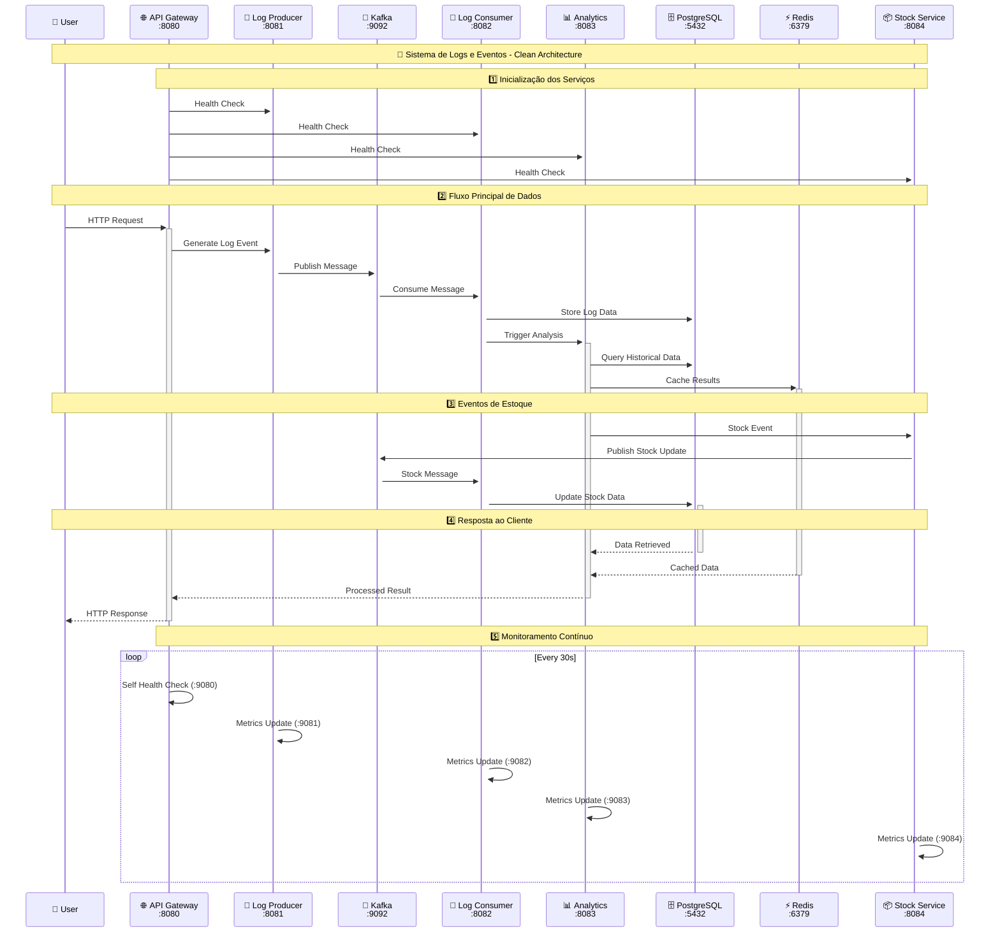

# 🔄 Diagramas Mermaid - Clean Architecture

## Arquitetura de Componentes

```mermaid
graph TD
    %% Clean Architecture Execution Flow
    
    subgraph "🐧 WSL Ubuntu Infrastructure"
        WSL["WSL Ubuntu 24.04.3 LTS<br/>Docker 28.3.3"]
        DOCKER["Docker Compose<br/>Container Orchestration"]
    end
    
    subgraph "📦 Infrastructure Layer"
        POSTGRES[("PostgreSQL<br/>:5432<br/>Log Analytics")]
        REDIS[("Redis<br/>:6379<br/>Cache & Sessions")]
        ZOOKEEPER[("Zookeeper<br/>:2181<br/>Coordination")]
        KAFKA[("Apache Kafka<br/>:9092/:29092<br/>Message Broker")]
    end
    
    subgraph "🚀 Microservices Layer"
        GATEWAY["🌐 API Gateway<br/>:8080/:9080<br/>Entry Point"]
        PRODUCER["📝 Log Producer<br/>:8081/:9081<br/>Generate Events"]
        CONSUMER["📨 Log Consumer<br/>:8082/:9082<br/>Process Messages"]
        ANALYTICS["📊 Log Analytics<br/>:8083/:9083<br/>Data Processing"]
        STOCK["📦 Virtual Stock<br/>:8084/:9084<br/>Stock Management"]
        KBNT["🏪 KBNT Consumer<br/>:8085/:9085<br/>Integration"]
    end
    
    subgraph "🎯 Application Layer"
        CONFIG["⚙️ Port Configuration<br/>08-configuration/ports/"]
        SETUP["🔧 Environment Setup<br/>02-application-layer/services/"]
        ORCHESTRATION["🎼 Service Orchestration<br/>02-application-layer/orchestration/"]
    end
    
    subgraph "🧪 Testing Layer"
        STRESS["🔥 Stress Testing<br/>07-testing/performance-tests/"]
        VISUAL["📊 Results Visualization<br/>Python + Matplotlib"]
    end
    
    %% Execution Flow
    WSL --> DOCKER
    DOCKER --> POSTGRES
    DOCKER --> REDIS
    DOCKER --> ZOOKEEPER
    ZOOKEEPER --> KAFKA
    
    %% Configuration Flow
    CONFIG --> SETUP
    SETUP --> ORCHESTRATION
    ORCHESTRATION --> GATEWAY
    
    %% Service Dependencies
    KAFKA --> GATEWAY
    POSTGRES --> GATEWAY
    REDIS --> GATEWAY
    
    GATEWAY --> PRODUCER
    GATEWAY --> CONSUMER
    GATEWAY --> ANALYTICS
    GATEWAY --> STOCK
    GATEWAY --> KBNT
    
    %% Data Flow
    PRODUCER --> KAFKA
    KAFKA --> CONSUMER
    CONSUMER --> POSTGRES
    ANALYTICS --> POSTGRES
    ANALYTICS --> REDIS
    
    STOCK --> KAFKA
    KBNT --> KAFKA
    
    %% Testing Flow
    ORCHESTRATION --> STRESS
    STRESS --> VISUAL
    
    %% Styling
    classDef infrastructure fill:#e1f5fe
    classDef microservice fill:#f3e5f5
    classDef application fill:#e8f5e8
    classDef testing fill:#fff3e0
    
    class POSTGRES,REDIS,ZOOKEEPER,KAFKA infrastructure
    class GATEWAY,PRODUCER,CONSUMER,ANALYTICS,STOCK,KBNT microservice
    class CONFIG,SETUP,ORCHESTRATION application
    class STRESS,VISUAL testing
```

## Diagrama de Sequência

```mermaid
sequenceDiagram
    participant User as 👤 User
    participant Gateway as 🌐 API Gateway<br/>:8080
    participant Producer as 📝 Log Producer<br/>:8081
    participant Kafka as 🔄 Kafka<br/>:9092
    participant Consumer as 📨 Log Consumer<br/>:8082
    participant Analytics as 📊 Analytics<br/>:8083
    participant Postgres as 🗄️ PostgreSQL<br/>:5432
    participant Redis as ⚡ Redis<br/>:6379
    participant Stock as 📦 Stock Service<br/>:8084
    
    Note over User,Stock: 🚀 Sistema de Logs e Eventos - Clean Architecture
    
    %% Inicialização
    Note over Gateway,Stock: 1️⃣ Inicialização dos Serviços
    Gateway->>+Producer: Health Check
    Gateway->>+Consumer: Health Check  
    Gateway->>+Analytics: Health Check
    Gateway->>+Stock: Health Check
    
    %% Fluxo Principal
    Note over User,Stock: 2️⃣ Fluxo Principal de Dados
    User->>+Gateway: HTTP Request
    Gateway->>+Producer: Generate Log Event
    Producer->>+Kafka: Publish Message
    Kafka->>+Consumer: Consume Message
    Consumer->>+Postgres: Store Log Data
    Consumer->>+Analytics: Trigger Analysis
    Analytics->>+Postgres: Query Historical Data
    Analytics->>+Redis: Cache Results
    
    %% Stock Events
    Note over User,Stock: 3️⃣ Eventos de Estoque
    Analytics->>+Stock: Stock Event
    Stock->>+Kafka: Publish Stock Update
    Kafka->>+Consumer: Stock Message
    Consumer->>+Postgres: Update Stock Data
    
    %% Response
    Note over User,Stock: 4️⃣ Resposta ao Cliente
    Postgres-->>-Analytics: Data Retrieved
    Redis-->>-Analytics: Cached Data
    Analytics-->>-Gateway: Processed Result
    Gateway-->>-User: HTTP Response
    
    %% Health Monitoring
    Note over Gateway,Stock: 5️⃣ Monitoramento Contínuo
    loop Every 30s
        Gateway->>Gateway: Self Health Check (:9080)
        Producer->>Producer: Metrics Update (:9081)
        Consumer->>Consumer: Metrics Update (:9082)
        Analytics->>Analytics: Metrics Update (:9083)
        Stock->>Stock: Metrics Update (:9084)
    end
```

## Gerado em: 2025-09-06 20:14:15
