# Diagramação de Processamento de Hashes - Arquitetura Real

## Visão Geral do Sistema Testado
Data: 30/08/2025 - 23:13:47
Total de mensagens processadas: 100
Duração: 23.12 segundos
Taxa de sucesso: 100%

## Diagrama Principal - Fluxo de Mensagens com Hashes


## Mapeamento de Componentes vs. Processamento de Hashes

```mermaid
graph TB
    subgraph "Hash Generation Layer"
        HG[SHA256 Hash Generator<br/>PowerShell Script<br/>Status: FAILED - Substring Bug]
    end
    
    subgraph "Load Balancer Layer"  
        LB[Weighted Random LB<br/>Distribution Logic<br/>100 requests processed]
    end
    
    subgraph "Spring Boot Application - localhost:8080"
        SB[Main Application<br/>Tomcat Server<br/>Status: RUNNING]
        
        subgraph "Request Processing Nodes"
            N1[Node: ActuatorHealth<br/>Hashes Processed: 33<br/>Avg Latency: 1ms<br/>Success Rate: 100%]
            
            N2[Node: TestEndpoint<br/>Hashes Processed: 24<br/>Avg Latency: 2ms<br/>Success Rate: 100%]
            
            N3[Node: StocksAPI<br/>Hashes Processed: 23<br/>Avg Latency: 50ms<br/>Success Rate: 100%]
            
            N4[Node: ActuatorInfo<br/>Hashes Processed: 20<br/>Avg Latency: 1ms<br/>Success Rate: 100%]
        end
    end
    
    subgraph "Hash Storage & Tracking"
        HS[Hash Storage<br/>Expected: 100 unique hashes<br/>Actual: 0 (due to PowerShell bug)]
        
        subgraph "Hash Processing Results"
            HP1[Health Hashes<br/>Expected: 33 SHA256<br/>Status: MISSING]
            HP2[Test Hashes<br/>Expected: 24 SHA256<br/>Status: MISSING]  
            HP3[Stock Hashes<br/>Expected: 23 SHA256<br/>Status: MISSING]
            HP4[Info Hashes<br/>Expected: 20 SHA256<br/>Status: MISSING]
        end
    end
    
    HG --> LB
    LB --> SB
    
    SB --> N1
    SB --> N2
    SB --> N3
    SB --> N4
    
    N1 --> HP1
    N2 --> HP2
    N3 --> HP3
    N4 --> HP4
    
    HP1 --> HS
    HP2 --> HS
    HP3 --> HS
    HP4 --> HS
    
    style HG fill:#FF6B6B
    style N1 fill:#4ECDC4
    style N2 fill:#4ECDC4
    style N3 fill:#FFD93D
    style N4 fill:#4ECDC4
    style HP1 fill:#FF6B6B
    style HP2 fill:#FF6B6B
    style HP3 fill:#FF6B6B
    style HP4 fill:#FF6B6B
```

## Timeline de Processamento Real (Últimas 10 Mensagens)

```mermaid
timeline
    title Timeline de Hash Processing - Últimos 10 Requests
    
    23:13:47.761 : StocksAPI Request
                  : Hash: [MISSING - PowerShell Bug]
                  : Latência: 63ms
                  : Status: SUCCESS
    
    23:13:48.005 : TestEndpoint Request  
                  : Hash: [MISSING - PowerShell Bug]
                  : Latência: 1ms
                  : Status: SUCCESS
    
    23:13:48.235 : ActuatorHealth Request
                  : Hash: [MISSING - PowerShell Bug] 
                  : Latência: 1ms
                  : Status: SUCCESS
    
    23:13:48.466 : TestEndpoint Request
                  : Hash: [MISSING - PowerShell Bug]
                  : Latência: 1ms
                  : Status: SUCCESS
    
    23:13:48.697 : StocksAPI Request
                  : Hash: [MISSING - PowerShell Bug]
                  : Latência: 51ms  
                  : Status: SUCCESS
    
    23:13:48.931 : ActuatorInfo Request
                  : Hash: [MISSING - PowerShell Bug]
                  : Latência: 1ms
                  : Status: SUCCESS
                  
    23:13:49.163 : ActuatorHealth Request
                  : Hash: [MISSING - PowerShell Bug]
                  : Latência: 1ms
                  : Status: SUCCESS
                  
    23:13:49.395 : TestEndpoint Request
                  : Hash: [MISSING - PowerShell Bug]
                  : Latência: 1ms
                  : Status: SUCCESS
                  
    23:13:49.625 : ActuatorHealth Request
                  : Hash: [MISSING - PowerShell Bug]
                  : Latência: 1ms
                  : Status: SUCCESS
                  
    23:13:49.857 : ActuatorInfo Request
                  : Hash: [MISSING - PowerShell Bug]
                  : Latência: 1ms
                  : Status: SUCCESS
```

## Distribuição de Hashes por Componente Arquitetural

```mermaid
pie title Distribuição de Hash Processing por Componente
    "ActuatorHealth" : 33
    "TestEndpoint" : 24
    "StocksAPI" : 23
    "ActuatorInfo" : 20
```



## Diagrama de Arquitetura Corrigida - Como Deveria Funcionar

```mermaid
flowchart TD
    subgraph "Hash Generation (Corrigido)"
        HGC[SHA256 Hash Generator<br/>PowerShell - FIXED<br/>Use .Substring() method]
    end
    
    subgraph "Message Tracking System"
        MTS[Message Tracking<br/>100 unique SHA256 hashes<br/>Timestamp + Endpoint mapping]
    end
    
    subgraph "Load Balancing"
        LBC[Smart Load Balancer<br/>Hash-based routing<br/>Consistent distribution]
    end
    
    subgraph "Processing Nodes"
        PN1[ActuatorHealth Node<br/>Hash Range: 0x00-0x3F<br/>Expected: 25 hashes]
        PN2[TestEndpoint Node<br/>Hash Range: 0x40-0x7F<br/>Expected: 25 hashes]
        PN3[StocksAPI Node<br/>Hash Range: 0x80-0xBF<br/>Expected: 25 hashes] 
        PN4[ActuatorInfo Node<br/>Hash Range: 0xC0-0xFF<br/>Expected: 25 hashes]
    end
    
    subgraph "Hash Validation"
        HV[Hash Validator<br/>Verify unique processing<br/>No duplicate handling]
    end
    
    HGC --> MTS
    MTS --> LBC
    LBC --> PN1
    LBC --> PN2  
    LBC --> PN3
    LBC --> PN4
    
    PN1 --> HV
    PN2 --> HV
    PN3 --> HV
    PN4 --> HV
    
    style HGC fill:#90EE90
    style MTS fill:#87CEEB
    style LBC fill:#DDA0DD
    style PN1 fill:#98FB98
    style PN2 fill:#98FB98
    style PN3 fill:#FFD700
    style PN4 fill:#98FB98
    style HV fill:#F0E68C
```

## Análise de Gaps - Hash Processing

### ❌ Problemas Identificados
1. **PowerShell Substring Bug**: Função `Substring` não reconhecida
2. **Hash Generation Failed**: 0 hashes gerados de 100 esperados
3. **No Message Uniqueness**: Impossível rastrear mensagens individuais
4. **No Hash-based Routing**: Load balancer usando random ao invés de hash

### ✅ Funcionalidades que Funcionaram
1. **Request Distribution**: 100 requests distribuídos corretamente
2. **Component Processing**: Todos os 4 componentes processaram mensagens
3. **Latency Tracking**: Medição de latência funcionando
4. **Success Rate**: 100% de taxa de sucesso

### 🔧 Correções Necessárias

#### 1. Corrigir PowerShell Hash Generation
```powershell
# ERRO (atual):
$hash = ($hasher.ComputeHash($bytes) | ForEach-Object { $_.ToString("x2") }) -join "" | Substring 0, 8

# CORREÇÃO:
$hash = (($hasher.ComputeHash($bytes) | ForEach-Object { $_.ToString("x2") }) -join "").Substring(0, 8)
```

#### 2. Implementar Hash-based Load Balancing
```powershell
# Usar hash para determinar endpoint ao invés de random
$hashValue = [BitConverter]::ToUInt32($hasher.ComputeHash($bytes), 0)
$endpointIndex = $hashValue % $endpoints.Count
```

#### 3. Adicionar Hash Validation
```powershell
# Verificar hashes únicos
if ($processedHashes.ContainsKey($hash)) {
    Write-Warning "Duplicate hash detected: $hash"
}
```

## Métricas Finais de Hash Processing

| Métrica | Valor Esperado | Valor Real | Status |
|---------|---------------|------------|---------|
| Hashes Únicos Gerados | 100 | 0 | ❌ FALHA |
| Hash Distribution Balance | 25 ± 5 por node | Random | ❌ FALHA |
| Hash Collision Rate | 0% | N/A | ❌ N/A |
| Hash-based Routing | Ativado | Desativado | ❌ FALHA |
| Message Traceability | 100% | 0% | ❌ FALHA |

**Score de Hash Processing**: 0/100 - NECESSITA CORREÇÃO URGENTE

## Próximos Passos para Implementação Correta

1. **Corrigir script PowerShell** - Fix Substring syntax
2. **Implementar hash-based routing** - Consistent endpoint selection  
3. **Adicionar hash storage** - Persist unique identifiers
4. **Criar hash validation** - Prevent duplicates
5. **Implementar message tracking** - Full traceability
