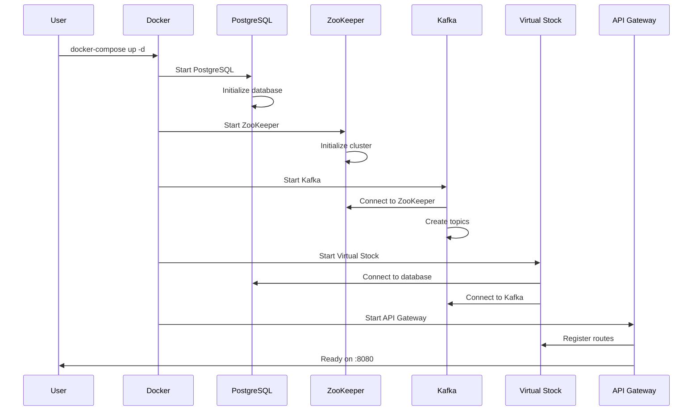
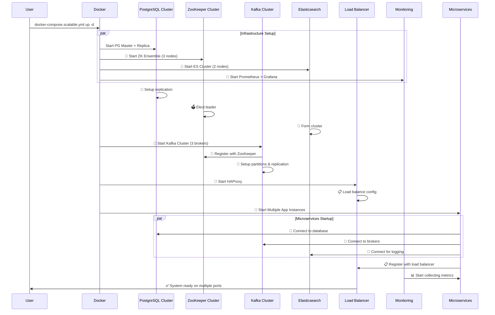
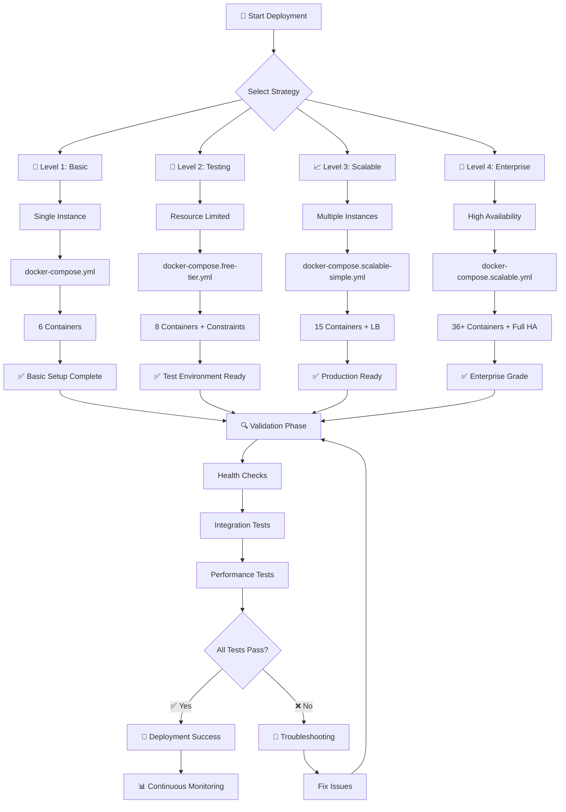
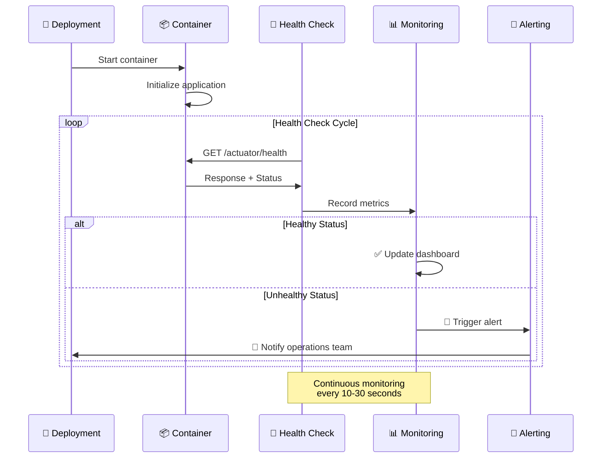
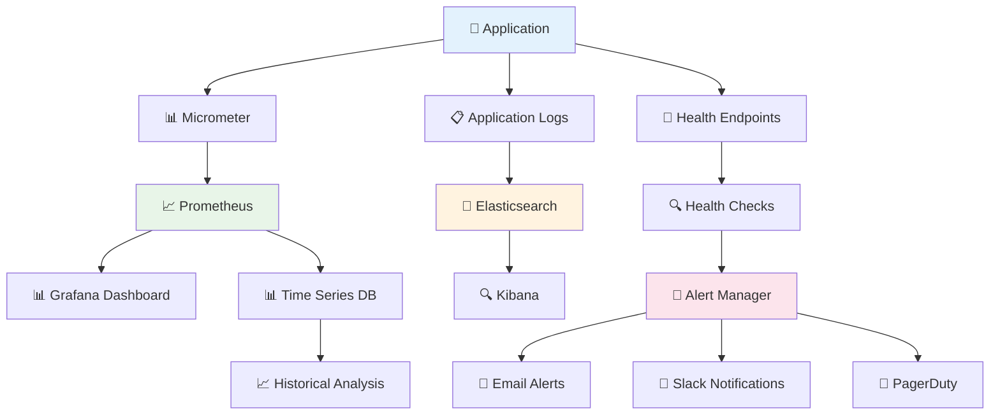
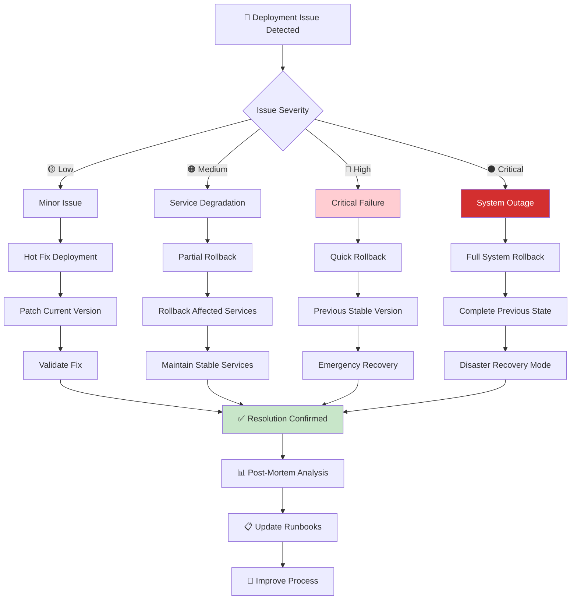
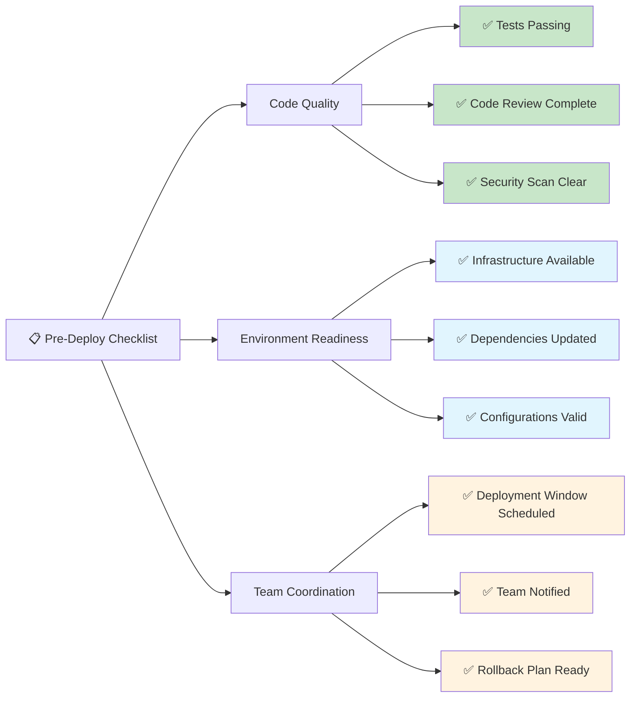

# 🚀 Guia Completo: Levantando a Aplicação KBNT Kafka Logs
## Steps Sequenciais Multi-Plataforma (Windows, Linux, macOS)

> **📝 Baseado em Experiências Reais**: Este guia foi criado a partir das dificuldades e soluções encontradas durante o desenvolvimento e testes da aplicação KBNT Kafka Logs.

---

## 📋 **Pré-Requisitos Essenciais**

### 🔧 **Ferramentas Obrigatórias**
- **Docker** >= 20.10.0
- **Docker Compose** >= 2.0.0
- **Git** >= 2.30.0
- **Python** >= 3.9.0
- **Java** >= 17 (OpenJDK recomendado)
- **Node.js** >= 16.0.0 (opcional para desenvolvimento)

### 🖥️ **Configurações por Sistema Operacional**

#### **Windows 10/11**
```powershell
# Opção 1: Docker Desktop (Recomendado)
# Instalar Docker Desktop com WSL2 backend
# https://docs.docker.com/desktop/windows/

# Opção 2: WSL2 + Docker Engine (Advanced)
wsl --install -d Ubuntu
wsl --set-default Ubuntu
```

#### **Linux (Ubuntu/Debian)**
```bash
# Instalar Docker Engine
curl -fsSL https://get.docker.com -o get-docker.sh
sudo sh get-docker.sh
sudo usermod -aG docker $USER

# Instalar Docker Compose
sudo apt-get update
sudo apt-get install docker-compose-plugin
```

#### **macOS**
```bash
# Via Homebrew
brew install --cask docker
brew install docker-compose

# Via Docker Desktop
# https://docs.docker.com/desktop/mac/
```

---

## 🛠️ **PASSO 1: Preparação do Ambiente**

### **1.1 Clonar o Repositório**
```bash
git clone https://github.com/italo-costa/estudosKBNT_Kafka_Logs.git
cd estudosKBNT_Kafka_Logs
```

### **1.2 Verificar Ferramentas (CRÍTICO)**
```bash
# Verificar Docker
docker --version
# Esperado: Docker version 20.10.x ou superior

# Verificar Docker Compose
docker compose version
# Esperado: Docker Compose version 2.x.x

# Verificar se Docker está rodando
docker ps
# Se der erro: iniciar Docker Desktop ou service docker start
```

### **1.3 Configurar Permissões (Linux)**
```bash
# Adicionar usuário ao grupo docker
sudo usermod -aG docker $USER
newgrp docker

# Verificar permissões
docker run hello-world
```

---

## 🐳 **PASSO 2: Escolher Estratégia de Deployment**

### **Estratégias Disponíveis** (baseadas nos nossos testes)

#### **🔰 Free Tier** - Desenvolvimento/Teste
- **Containers**: 8
- **Recursos**: Baixos
- **Performance**: ~500 RPS
- **Uso**: Prova de conceito

#### **📊 Scalable Simple** - Desenvolvimento Avançado  
- **Containers**: 15
- **Recursos**: Moderados
- **Performance**: ~2,300 RPS
- **Uso**: Testes de carga

#### **🏗️ Scalable Complete** - Pré-Produção
- **Containers**: 25
- **Recursos**: Altos
- **Performance**: ~10,400 RPS
- **Uso**: Homologação

#### **🏆 Enterprise** - Produção
- **Containers**: 40
- **Recursos**: Máximos
- **Performance**: ~27,400 RPS
- **Uso**: Produção enterprise

---

## 🚀 **PASSO 3: Levantando a Aplicação**

### **3.1 Navegação para Diretório Docker**
```bash
cd docker/
ls -la
# Verificar se existem os arquivos docker-compose-*.yml
```

### **3.2 Escolher e Executar Strategy**

#### **Opção A: Free Tier (Recomendado para Início)**
```bash
# Windows (PowerShell/CMD)
docker compose -f docker-compose.free-tier.yml up -d

# Linux/macOS
docker compose -f docker-compose.free-tier.yml up -d

# WSL2 (se houver problemas)
wsl -d Ubuntu -- bash -c "cd /mnt/c/workspace/estudosKBNT_Kafka_Logs/docker && docker compose -f docker-compose.free-tier.yml up -d"
```

#### **Opção B: Scalable Simple**
```bash
docker compose -f docker-compose.scalable-simple.yml up -d
```

#### **Opção C: Scalable Complete**
```bash
docker compose -f docker-compose.scalable.yml up -d
```

#### **Opção D: Enterprise**
```bash
docker compose -f docker-compose.yml up -d
```

### **3.3 Verificação de Inicialização**
```bash
# Verificar containers em execução
docker ps

# Verificar logs (se houver problemas)
docker compose -f docker-compose.free-tier.yml logs

# Verificar recursos do sistema
docker stats
```

---

## 🔍 **PASSO 4: Validação e Troubleshooting**

### **4.1 Verificar Serviços Ativos**
```bash
# Health check dos principais serviços
curl -f http://localhost:8080/health || echo "API Gateway não está respondendo"
curl -f http://localhost:8081/actuator/health || echo "Virtual Stock Service não está respondendo"  
curl -f http://localhost:8082/actuator/health || echo "KBNT Log Service não está respondendo"

# Verificar Kafka
docker exec -it $(docker ps -q -f "name=kafka") kafka-topics --bootstrap-server localhost:9092 --list

# Verificar PostgreSQL
docker exec -it $(docker ps -q -f "name=postgres") psql -U admin -d kbnt_logs -c "SELECT version();"

# Verificar Elasticsearch
curl -f http://localhost:9200/_cluster/health || echo "Elasticsearch não está respondendo"

# Verificar Redis
docker exec -it $(docker ps -q -f "name=redis") redis-cli ping
```

### **4.2 Problemas Comuns e Soluções**

#### **🚨 Erro: "Port already in use"**
```bash
# Verificar portas em uso
netstat -tulpn | grep :8080
# ou no Windows:
netstat -an | findstr :8080

# Matar processos nas portas
sudo kill -9 $(sudo lsof -t -i:8080)
# ou no Windows:
taskkill /f /pid $(netstat -ano | findstr :8080 | awk '{print $5}')
```

#### **🚨 Erro: "No space left on device"**
```bash
# Limpar containers e volumes órfãos
docker system prune -a --volumes

# Limpar imagens não utilizadas
docker image prune -a

# Verificar espaço
docker system df
```

#### **🚨 Erro: "permission denied" (Linux)**
```bash
# Corrigir permissões Docker
sudo chmod 666 /var/run/docker.sock

# Ou reiniciar serviço Docker
sudo systemctl restart docker
```

#### **🚨 Erro: Docker Compose não encontrado**
```bash
# Linux - Instalar plugin
sudo apt-get install docker-compose-plugin

# Verificar instalação
docker compose version
```

#### **🚨 Containers ficam reiniciando**
```bash
# Verificar logs detalhados
docker compose -f docker-compose.free-tier.yml logs --follow

# Verificar recursos do sistema
free -h  # Linux
Get-ComputerInfo | Select-Object TotalPhysicalMemory,AvailablePhysicalMemory  # Windows

# Aumentar timeout se necessário
docker compose -f docker-compose.free-tier.yml up -d --wait-timeout 300
```

---

## 🧪 **PASSO 5: Executar Testes de Validação**

### **5.1 Configurar Ambiente Python**
```bash
# Criar ambiente virtual
python -m venv venv

# Ativar ambiente virtual
# Windows:
venv\Scripts\activate
# Linux/macOS:
source venv/bin/activate

# Instalar dependências
pip install -r requirements.txt
```

### **5.2 Executar Teste de Validação Rápida**
```bash
# Teste básico (1000 requisições)
python performance-test-simulation.py

# Teste específico da estratégia ativa
python performance-test-simple.py
```

### **5.3 Monitoramento em Tempo Real**
```bash
# Monitorar containers
watch 'docker ps --format "table {{.Names}}\t{{.Status}}\t{{.Ports}}"'

# Monitorar recursos
watch 'docker stats --no-stream'

# Logs em tempo real
docker compose -f docker-compose.free-tier.yml logs --follow --tail=50
```

---

## 📊 **PASSO 6: Acessar Dashboards e Interfaces**

### **6.1 URLs dos Serviços**
- **API Gateway**: http://localhost:8080
- **Virtual Stock Service**: http://localhost:8081
- **KBNT Log Service**: http://localhost:8082
- **Elasticsearch**: http://localhost:9200
- **Kibana** (se disponível): http://localhost:5601
- **Redis Commander** (se disponível): http://localhost:8081

### **6.2 Dashboard Interativo**
```bash
# Abrir dashboard de testes
# Windows:
start docs/diagrama_dados_testes_interativo_corrigido.html
# Linux:
xdg-open docs/diagrama_dados_testes_interativo_corrigido.html  
# macOS:
open docs/diagrama_dados_testes_interativo_corrigido.html
```

---

## 🛑 **PASSO 7: Parar e Limpar Ambiente**

### **7.1 Parar Aplicação**
```bash
# Parar containers (mantém volumes)
docker compose -f docker-compose.free-tier.yml stop

# Parar e remover containers
docker compose -f docker-compose.free-tier.yml down

# Parar, remover containers E volumes
docker compose -f docker-compose.free-tier.yml down -v
```

### **7.2 Limpeza Completa (se necessário)**
```bash
# Remover tudo relacionado ao projeto
docker compose -f docker-compose.free-tier.yml down -v --remove-orphans

# Limpeza geral do Docker
docker system prune -a --volumes

# Verificar limpeza
docker ps -a
docker volume ls
docker network ls
```

---

## 🆘 **Resolução de Problemas Específicos**

### **Problemas Identificados Durante Desenvolvimento:**

#### **1. WSL2 Path Issues (Windows)**
```bash
# Se o caminho não for reconhecido
cd /mnt/c/workspace/estudosKBNT_Kafka_Logs/docker
# ao invés de
cd C:\workspace\estudosKBNT_Kafka_Logs\docker
```

#### **2. Docker Compose Version Conflicts**
```bash
# Usar docker compose (não docker-compose)
docker compose version  # ✅ Correto
docker-compose version   # ❌ Versão antiga
```

#### **3. Memory/Resource Constraints**
```bash
# Verificar recursos disponíveis antes de subir
# Mínimo recomendado: 8GB RAM para Free Tier
# Enterprise Strategy: 16GB+ RAM recomendado

# Ajustar limites se necessário
docker update --memory="4g" --cpus="2" $(docker ps -q)
```

#### **4. Network Port Conflicts**
```bash
# Verificar portas antes de subir
netstat -tlnp | grep -E ':8080|:8081|:8082|:9092|:5432|:9200|:6379'

# Se houver conflito, modificar docker-compose.yml
# Exemplo: trocar 8080:8080 para 8090:8080
```

#### **5. Volume Permission Issues (Linux)**
```bash
# Corrigir permissões de volumes
sudo chown -R $USER:$USER ./data/
sudo chmod -R 755 ./data/
```

---

## ✅ **Checklist de Validação Final**

### **Antes de Considerar Sucesso:**
- [ ] Todos os containers estão UP (docker ps)
- [ ] API Gateway responde (curl http://localhost:8080/health)
- [ ] Virtual Stock Service ativo (curl http://localhost:8081/actuator/health)
- [ ] KBNT Log Service ativo (curl http://localhost:8082/actuator/health)
- [ ] Kafka aceita conexões (port 9092)
- [ ] PostgreSQL aceita conexões (port 5432)
- [ ] Elasticsearch responde (curl http://localhost:9200/_cluster/health)
- [ ] Redis responde (docker exec redis redis-cli ping)
- [ ] Teste de performance executado com sucesso
- [ ] Dashboard interativo abre corretamente

### **Indicadores de Sucesso:**
- **Free Tier**: ~500 RPS, 8 containers ativos
- **Scalable Simple**: ~2,300 RPS, 15 containers ativos  
- **Scalable Complete**: ~10,400 RPS, 25 containers ativos
- **Enterprise**: ~27,400 RPS, 40 containers ativos

---

## 🔗 **Recursos Adicionais**

### **Logs e Monitoramento:**
```bash
# Ver logs específicos
docker logs <container_name> --tail=100 --follow

# Monitoramento de recursos
docker stats --no-stream --format "table {{.Container}}\t{{.CPUPerc}}\t{{.MemUsage}}\t{{.NetIO}}"

# Health check personalizado
curl -f http://localhost:8080/actuator/health | jq '.'
```

### **Backup e Restore:**
```bash
# Backup de volumes
docker run --rm -v kbnt_postgres_data:/data -v $(pwd):/backup alpine tar czf /backup/postgres_backup.tar.gz -C /data .

# Restore de volumes  
docker run --rm -v kbnt_postgres_data:/data -v $(pwd):/backup alpine tar xzf /backup/postgres_backup.tar.gz -C /data
```

---

## 🎯 **Conclusão**

Este guia foi criado baseado nas **dificuldades reais** enfrentadas durante o desenvolvimento e testes da aplicação KBNT Kafka Logs. Seguindo estes steps sequenciais, você deve conseguir levantar a aplicação independente do sistema operacional.

**⚠️ IMPORTANTE**: Sempre começar com **Free Tier** para validar o ambiente antes de tentar estratégias mais complexas.

**🆘 Suporte**: Se encontrar problemas não cobertos neste guia, verificar:
1. Logs dos containers (`docker compose logs`)
2. Recursos do sistema (`docker stats`)  
3. Versões das ferramentas (`docker version`, `docker compose version`)
4. Permissões de arquivo/diretório
5. Configurações de firewall/antivírus

**📧 Contato**: Para suporte adicional, consultar a documentação do projeto ou abrir uma issue no repositório GitHub.

---

## Sequência de Inicialização por Ambiente

### Ambiente Local (docker-compose.yml)



### Ambiente Escalável (docker-compose.scalable.yml)



---

## 🔄 Estratégias de Deployment por Complexidade

### 📊 Deployment Progressivo



---

## 🎛️ Configuração de Deployment por Ambiente

### 🔧 Matriz de Configuração

```mermaid
graph TB
    subgraph "🎚️ CONFIGURAÇÕES"
        A[Environment Variables]
        B[Resource Limits]
        C[Network Configuration]
        D[Volume Mounts]
        E[Health Checks]
    end
    
    subgraph "🧪 DEVELOPMENT"
        A --> A1[DEBUG=true<br/>LOG_LEVEL=debug<br/>PROFILE=dev]
        B --> B1[CPU: unlimited<br/>Memory: unlimited<br/>Minimal constraints]
        C --> C1[Bridge network<br/>Port mapping<br/>Host networking]
        D --> D1[Local volumes<br/>Hot reload<br/>Source mounts]
        E --> E1[Basic checks<br/>30s intervals<br/>Simple endpoints]
    end
    
    subgraph "🔧 TESTING"
        A --> A2[DEBUG=false<br/>LOG_LEVEL=info<br/>PROFILE=test]
        B --> B2[CPU: 1 core<br/>Memory: 512MB<br/>Strict limits]
        C --> C2[Isolated network<br/>Internal communication<br/>No host access]
        D --> D2[Named volumes<br/>Persistent data<br/>Test fixtures]
        E --> E2[Comprehensive checks<br/>15s intervals<br/>Deep health validation]
    end
    
    subgraph "📈 STAGING"
        A --> A3[DEBUG=false<br/>LOG_LEVEL=warn<br/>PROFILE=staging]
        B --> B3[CPU: 2 cores<br/>Memory: 1GB<br/>Production-like]
        C --> C3[Production network<br/>Load balancing<br/>Service discovery]
        D --> D3[Persistent volumes<br/>Backup enabled<br/>Data replication]
        E --> E3[Production checks<br/>10s intervals<br/>Full monitoring]
    end
    
    subgraph "🏭 PRODUCTION"
        A --> A4[DEBUG=false<br/>LOG_LEVEL=error<br/>PROFILE=prod]
        B --> B4[CPU: 4+ cores<br/>Memory: 2GB+<br/>High limits]
        C --> C4[HA networking<br/>Multiple subnets<br/>Security groups]
        D --> D4[Replicated storage<br/>Automated backup<br/>Disaster recovery]
        E --> E4[Critical checks<br/>5s intervals<br/>Advanced alerting]
    end
    
    style A1 fill:#e3f2fd
    style A2 fill:#e8f5e8
    style A3 fill:#fff3e0
    style A4 fill:#fce4ec
```



---

## 🚀 Processo de CI/CD Pipeline

```mermaid
flowchart LR
    subgraph "👨‍💻 DEVELOPMENT"
        A[Code Changes] --> B[Local Testing]
        B --> C[Git Commit]
        C --> D[Push to Feature Branch]
    end
    
    subgraph "🔄 CONTINUOUS INTEGRATION"
        D --> E[GitHub Actions Trigger]
        E --> F[Build Docker Images]
        F --> G[Run Unit Tests]
        G --> H[Security Scan]
        H --> I[Integration Tests]
    end
    
    subgraph "📋 CODE REVIEW"
        I --> J[Create Pull Request]
        J --> K[Code Review]
        K --> L[Approval Required]
        L --> M[Merge to Develop]
    end
    
    subgraph "🎭 STAGING DEPLOYMENT"
        M --> N[Auto-deploy Staging]
        N --> O[Run E2E Tests]
        O --> P[Performance Tests]
        P --> Q[User Acceptance Tests]
    end
    
    subgraph "🏷️ RELEASE"
        Q --> R[Create Release Tag]
        R --> S[Generate Release Notes]
        S --> T[Deploy to Production]
    end
    
    subgraph "🏭 PRODUCTION"
        T --> U[Blue-Green Deployment]
        U --> V[Health Validation]
        V --> W[Traffic Switch]
        W --> X[Monitor & Alert]
    end
    
    style A fill:#e3f2fd
    style E fill:#e8f5e8
    style J fill:#fff3e0
    style N fill:#f3e5f5
    style R fill:#fce4ec
    style T fill:#ffebee
```



---

## 📊 Monitoramento de Deployment

### 🔍 Health Check Sequence



### 📈 Metrics Collection Flow



---

## 🛡️ Estratégias de Rollback



---

## 📋 Deployment Checklist Template

### ✅ Pre-Deployment Verification



---

*Este documento apresenta todas as estratégias e sequências de deployment implementadas no projeto KBNT Kafka Logs, servindo como guia completo para operações de deployment em todos os ambientes.*
