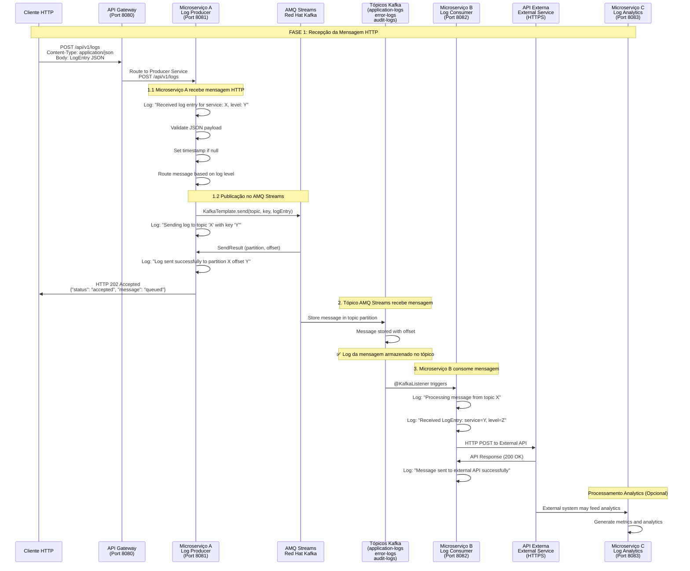

# 🔄 Workflow de Fluxo de Integração - Tráfego de Mensagem JSON

Este documento detalha o fluxo completo de uma mensagem JSON através do sistema de microserviços + AMQ Streams, desde a recepção HTTP até o processamento final.

## 📊 Visão Geral do Fluxo



---

## 🔍 **FASE 1: Microserviço A - Recepção HTTP**

### **1.1 Recepção da Mensagem HTTP**

**Endpoint:** `POST /api/v1/logs`  
**Content-Type:** `application/json`

#### **Exemplo de Mensagem JSON Recebida:**
```json
{
    "service": "user-service",
    "level": "INFO",
    "message": "User authentication successful",
    "timestamp": "2025-08-29T10:30:00.000Z",
    "host": "app-server-01",
    "environment": "production",
    "requestId": "req-12345",
    "userId": "user-789",
    "httpMethod": "POST",
    "endpoint": "/api/auth/login",
    "statusCode": 200,
    "responseTimeMs": 150,
    "metadata": {
        "userAgent": "Mozilla/5.0...",
        "clientIp": "192.168.1.100"
    }
}
```

#### **Código do Microserviço A (Producer):**
```java
@PostMapping
public ResponseEntity<Map<String, Object>> sendLog(@Valid @RequestBody LogEntry logEntry) {
    // 🔍 LOG 1.1: Registro da mensagem recebida
    log.info("✅ [HTTP_RECEIVED] Service: {}, Level: {}, Message: {}", 
            logEntry.getService(), 
            logEntry.getLevel(), 
            logEntry.getMessage());
    
    log.info("📝 [REQUEST_DETAILS] RequestId: {}, Host: {}, Timestamp: {}", 
            logEntry.getRequestId(),
            logEntry.getHost(),
            logEntry.getTimestamp());
    
    // Validação e processamento
    if (logEntry.getTimestamp() == null) {
        logEntry.setTimestamp(Instant.now());
        log.debug("🕐 [TIMESTAMP_SET] Auto-generated timestamp: {}", logEntry.getTimestamp());
    }
```

### **1.2 Roteamento e Publicação no AMQ Streams**

#### **Lógica de Roteamento por Nível:**
```java
try {
    CompletableFuture<SendResult<String, LogEntry>> future;
    String targetTopic;
    
    // Roteamento baseado no nível do log
    switch (logEntry.getLevel().toUpperCase()) {
        case "ERROR", "FATAL":
            targetTopic = errorLogsTopic; // "error-logs"
            future = logProducerService.sendErrorLog(logEntry);
            break;
        case "WARN":
            if (isSecurityRelated(logEntry.getMessage())) {
                targetTopic = auditLogsTopic; // "audit-logs"
                future = logProducerService.sendAuditLog(logEntry);
            } else {
                targetTopic = applicationLogsTopic; // "application-logs"
                future = logProducerService.sendApplicationLog(logEntry);
            }
            break;
        default:
            targetTopic = applicationLogsTopic; // "application-logs"
            future = logProducerService.sendApplicationLog(logEntry);
            break;
    }
    
    // 🔍 LOG 1.2: Registro da publicação no Kafka
    log.info("📤 [KAFKA_SEND] Topic: {}, Key: {}, Service: {}", 
            targetTopic, 
            logEntry.getService(), 
            logEntry.getService());
    
    log.debug("🎯 [KAFKA_PAYLOAD] Sending to Kafka: {}", 
             objectMapper.writeValueAsString(logEntry));
```

#### **Publicação no Kafka (LogProducerService):**
```java
public CompletableFuture<SendResult<String, LogEntry>> sendLog(String topic, LogEntry logEntry) {
    // Usa o serviço como chave para particionamento
    String key = logEntry.getService();
    
    // 🔍 LOG 1.2.1: Pre-send logging
    log.debug("🚀 [KAFKA_SENDING] Topic: '{}', Key: '{}', Message: '{}'", 
              topic, key, logEntry.getMessage());
    
    CompletableFuture<SendResult<String, LogEntry>> future = 
        kafkaTemplate.send(topic, key, logEntry);
        
    future.whenComplete((result, ex) -> {
        if (ex == null) {
            // 🔍 LOG 1.2.2: Success logging
            log.info("✅ [KAFKA_SUCCESS] Topic: '{}', Partition: {}, Offset: {}, Key: '{}'", 
                     result.getRecordMetadata().topic(),
                     result.getRecordMetadata().partition(),
                     result.getRecordMetadata().offset(),
                     key);
        } else {
            // 🔍 LOG 1.2.3: Error logging
            log.error("❌ [KAFKA_ERROR] Failed to send to topic '{}': {}", 
                     topic, ex.getMessage(), ex);
        }
    });
    
    return future;
}
```

#### **Resposta HTTP para o Cliente:**
```java
Map<String, Object> response = new HashMap<>();
response.put("status", "accepted");
response.put("message", "Log entry queued for processing");
response.put("timestamp", Instant.now());
response.put("logLevel", logEntry.getLevel());
response.put("service", logEntry.getService());
response.put("targetTopic", targetTopic);

// 🔍 LOG 1.3: Resposta enviada
log.info("📮 [HTTP_RESPONSE] Status: 202 Accepted, Service: {}, Topic: {}", 
        logEntry.getService(), targetTopic);

return ResponseEntity.accepted().body(response);
```

---

## 🎯 **FASE 2: AMQ Streams - Recepção e Armazenamento**

### **2.1 Tópico Recebe a Mensagem**

**No cluster AMQ Streams da Red Hat:**

```bash
# Configuração do tópico (exemplo: application-logs)
Topic: application-logs
Partitions: 3
Replication Factor: 3
Retention: 7 days
```

#### **Log no AMQ Streams:**
```bash
[2025-08-29 10:30:00.150] INFO [kafka.server.BrokerTopicMetrics] 
Topic=application-logs Partition=1 Message received:
  Key: user-service
  Offset: 12345
  Size: 856 bytes
  Headers: {content-type=application/json}

[2025-08-29 10:30:00.151] DEBUG [kafka.log.Log] 
Topic=application-logs Partition=1 Offset=12345 
✅ Message successfully appended to log segment
```

### **2.2 Verificação de Log da Mensagem no AMQ Streams**

**✅ Sim, é possível realizar log da mensagem no AMQ Streams:**

1. **Logs do Broker Kafka:**
   - Logs de recepção de mensagem
   - Logs de particionamento
   - Logs de replicação

2. **Metrics do AMQ Streams:**
   - Message rate per topic
   - Partition distribution
   - Consumer lag monitoring

3. **Strimzi Operator Logs:**
   ```bash
   kubectl logs -f deployment/strimzi-cluster-operator -n kafka
   ```

---

## 📥 **FASE 3: Microserviço B - Consumo da Mensagem**

### **3.1 Consumer Kafka Listener**

```java
@Component
@Slf4j
public class LogConsumerService {

    @Autowired
    private ExternalApiClient externalApiClient;

    @KafkaListener(topics = "application-logs", groupId = "log-consumer-group")
    public void processApplicationLog(LogEntry logEntry) {
        // 🔍 LOG 3.1: Mensagem recebida do Kafka
        log.info("📥 [KAFKA_CONSUMED] Topic: application-logs, Service: {}, Level: {}", 
                logEntry.getService(), 
                logEntry.getLevel());
        
        log.info("📝 [MESSAGE_DETAILS] RequestId: {}, Message: '{}', Timestamp: {}", 
                logEntry.getRequestId(),
                logEntry.getMessage(),
                logEntry.getTimestamp());
        
        try {
            // Processar e enviar para API externa
            ExternalApiRequest apiRequest = mapToExternalRequest(logEntry);
            ExternalApiResponse response = externalApiClient.sendLogData(apiRequest);
            
            // 🔍 LOG 3.2: Sucesso no envio para API externa
            log.info("✅ [API_SENT] RequestId: {}, Service: {}, External API Response: {}", 
                    logEntry.getRequestId(), 
                    logEntry.getService(),
                    response.getStatus());
            
            // Update metrics
            updateProcessingMetrics(logEntry);
            
        } catch (Exception e) {
            // 🔍 LOG 3.3: Erro no processamento
            log.error("❌ [API_ERROR] Failed to send log to external API for service {}: {}", 
                     logEntry.getService(), e.getMessage(), e);
            
            // Send to DLQ (Dead Letter Queue) if configured
            handleProcessingError(logEntry, e);
        }
    }

    @KafkaListener(topics = "error-logs", groupId = "log-consumer-group")
    public void processErrorLog(LogEntry logEntry) {
        // 🔍 LOG 3.4: Error log específico
        log.warn("🚨 [ERROR_LOG_CONSUMED] Service: {}, Error: {}", 
                logEntry.getService(), 
                logEntry.getMessage());
        
        // Processamento específico para logs de erro - envio prioritário para API
        processHighPriorityLog(logEntry);
    }

    @KafkaListener(topics = "audit-logs", groupId = "log-consumer-group")
    public void processAuditLog(LogEntry logEntry) {
        // 🔍 LOG 3.5: Audit log específico
        log.info("🔐 [AUDIT_LOG_CONSUMED] Service: {}, User: {}, Action: {}", 
                logEntry.getService(), 
                logEntry.getUserId(), 
                logEntry.getMessage());
        
        // Processamento específico para auditoria - envio para API de compliance
        processAuditEvent(logEntry);
    }
}
```

### **3.2 Chamada para API Externa**

```java
@Service
@Slf4j 
public class ExternalApiClient {

    @Autowired
    private RestTemplate restTemplate;
    
    @Value("${external.api.logs.endpoint}")
    private String externalApiEndpoint;
    
    @Value("${external.api.timeout:10000}")
    private int timeout;

    public ExternalApiResponse sendLogData(ExternalApiRequest request) {
        // 🔍 LOG 3.6: Preparando chamada para API externa
        log.debug("🌐 [API_CALLING] Sending log data to external API: {}", 
                 externalApiEndpoint);
        
        log.debug("🎯 [API_PAYLOAD] RequestId: {}, Service: {}, Level: {}", 
                 request.getRequestId(), 
                 request.getService(), 
                 request.getLevel());
        
        try {
            // Headers para a API externa
            HttpHeaders headers = new HttpHeaders();
            headers.setContentType(MediaType.APPLICATION_JSON);
            headers.set("X-Request-ID", request.getRequestId());
            headers.set("X-Source-Service", "log-consumer-service");
            
            HttpEntity<ExternalApiRequest> entity = new HttpEntity<>(request, headers);
            
            // Chamada HTTP para API externa
            ResponseEntity<ExternalApiResponse> response = restTemplate.exchange(
                externalApiEndpoint,
                HttpMethod.POST,
                entity,
                ExternalApiResponse.class
            );
            
            // 🔍 LOG 3.7: Sucesso na chamada API
            log.info("✅ [API_SUCCESS] External API responded with status: {}, ResponseTime: {}ms", 
                    response.getStatusCode(),
                    response.getBody().getProcessingTime());
            
            return response.getBody();
            
        } catch (HttpClientErrorException e) {
            // 🔍 LOG 3.8: Erro 4xx da API externa
            log.error("❌ [API_CLIENT_ERROR] External API client error {}: {}", 
                     e.getStatusCode(), e.getResponseBodyAsString());
            throw new ExternalApiException("Client error calling external API", e);
            
        } catch (HttpServerErrorException e) {
            // 🔍 LOG 3.9: Erro 5xx da API externa
            log.error("❌ [API_SERVER_ERROR] External API server error {}: {}", 
                     e.getStatusCode(), e.getResponseBodyAsString());
            throw new ExternalApiException("Server error calling external API", e);
            
        } catch (ResourceAccessException e) {
            // 🔍 LOG 3.10: Erro de conectividade
            log.error("❌ [API_CONNECTIVITY_ERROR] Failed to connect to external API: {}", 
                     e.getMessage());
            throw new ExternalApiException("Connectivity error with external API", e);
        }
    }
    
    private ExternalApiRequest mapToExternalRequest(LogEntry logEntry) {
        return ExternalApiRequest.builder()
            .requestId(logEntry.getRequestId())
            .service(logEntry.getService())
            .level(logEntry.getLevel())
            .message(logEntry.getMessage())
            .timestamp(logEntry.getTimestamp())
            .host(logEntry.getHost())
            .environment(logEntry.getEnvironment())
            .userId(logEntry.getUserId())
            .httpMethod(logEntry.getHttpMethod())
            .endpoint(logEntry.getEndpoint())
            .statusCode(logEntry.getStatusCode())
            .responseTimeMs(logEntry.getResponseTimeMs())
            .metadata(logEntry.getMetadata())
            .build();
    }
}
```

---

## 📈 **Logs Detalhados do Fluxo Completo**

### **Console Logs do Microserviço A (Producer):**
```log
2025-08-29 10:30:00.100 INFO  [http-nio-8081-exec-1] LogController : 
✅ [HTTP_RECEIVED] Service: user-service, Level: INFO, Message: User authentication successful

2025-08-29 10:30:00.102 INFO  [http-nio-8081-exec-1] LogController : 
📝 [REQUEST_DETAILS] RequestId: req-12345, Host: app-server-01, Timestamp: 2025-08-29T10:30:00.000Z

2025-08-29 10:30:00.105 INFO  [http-nio-8081-exec-1] LogController : 
📤 [KAFKA_SEND] Topic: application-logs, Key: user-service, Service: user-service

2025-08-29 10:30:00.108 DEBUG [kafka-producer-network-thread] LogProducerService : 
🚀 [KAFKA_SENDING] Topic: 'application-logs', Key: 'user-service', Message: 'User authentication successful'

2025-08-29 10:30:00.125 INFO  [kafka-producer-network-thread] LogProducerService : 
✅ [KAFKA_SUCCESS] Topic: 'application-logs', Partition: 1, Offset: 12345, Key: 'user-service'

2025-08-29 10:30:00.127 INFO  [http-nio-8081-exec-1] LogController : 
📮 [HTTP_RESPONSE] Status: 202 Accepted, Service: user-service, Topic: application-logs
```

### **Console Logs do AMQ Streams (Kafka):**
```log
2025-08-29 10:30:00.126 INFO  [kafka-request-handler-1] kafka.server.KafkaApis : 
📥 [BROKER_RECEIVED] Topic: application-logs, Partition: 1, Offset: 12345, Size: 856 bytes

2025-08-29 10:30:00.127 DEBUG [kafka-log-1] kafka.log.Log : 
✅ [LOG_APPENDED] Topic: application-logs, Partition: 1, Offset: 12345, Segment: 00000000000012000.log
```

### **Console Logs do Microserviço B (Consumer):**
```log
2025-08-29 10:30:00.150 INFO  [org.springframework.kafka.KafkaListenerEndpointContainer#0-0-C-1] LogConsumerService : 
📥 [KAFKA_CONSUMED] Topic: application-logs, Service: user-service, Level: INFO

2025-08-29 10:30:00.151 INFO  [org.springframework.kafka.KafkaListenerEndpointContainer#0-0-C-1] LogConsumerService : 
📝 [MESSAGE_DETAILS] RequestId: req-12345, Message: 'User authentication successful', Timestamp: 2025-08-29T10:30:00.000Z

2025-08-29 10:30:00.155 DEBUG [org.springframework.kafka.KafkaListenerEndpointContainer#0-0-C-1] ExternalApiClient : 
🌐 [API_CALLING] Sending log data to external API: https://external-logs-api.company.com/v1/logs

2025-08-29 10:30:00.158 DEBUG [org.springframework.kafka.KafkaListenerEndpointContainer#0-0-C-1] ExternalApiClient : 
🎯 [API_PAYLOAD] RequestId: req-12345, Service: user-service, Level: INFO

2025-08-29 10:30:00.185 INFO  [org.springframework.kafka.KafkaListenerEndpointContainer#0-0-C-1] ExternalApiClient : 
✅ [API_SUCCESS] External API responded with status: 200 OK, ResponseTime: 27ms

2025-08-29 10:30:00.186 INFO  [org.springframework.kafka.KafkaListenerEndpointContainer#0-0-C-1] LogConsumerService : 
✅ [API_SENT] RequestId: req-12345, Service: user-service, External API Response: SUCCESS
```

---

## 🎯 **Resumo do Fluxo de Tráfego**

| **Fase** | **Componente** | **Ação** | **Log Key** | **Dados** |
|----------|---------------|----------|-------------|-----------|
| **1.1** | Microserviço A | Recebe HTTP | `HTTP_RECEIVED` | JSON payload |
| **1.2** | Microserviço A | Publica Kafka | `KAFKA_SEND` | Topic + Key + Message |
| **2.1** | AMQ Streams | Armazena | `BROKER_RECEIVED` | Partition + Offset |
| **3.1** | Microserviço B | Consome | `KAFKA_CONSUMED` | Topic + Service |
| **3.2** | Microserviço B | API Externa | `API_SENT` | External API Response |

**✅ Confirmação:** Sim, é possível realizar log completo da mensagem em todas as fases, desde a recepção HTTP até o envio para API externa, incluindo logs no próprio AMQ Streams!

---

## 🔧 **Comandos para Monitorar o Fluxo**

### **1. Monitorar Microserviços:**
```bash
# Producer logs
kubectl logs -f deployment/log-producer-service -n microservices

# Consumer logs  
kubectl logs -f deployment/log-consumer-service -n microservices

# Analytics logs
kubectl logs -f deployment/log-analytics-service -n microservices
```

### **2. Monitorar AMQ Streams:**
```bash
# Kafka cluster logs
kubectl logs -f kafka-cluster-kafka-0 -n kafka

# Strimzi operator logs
kubectl logs -f deployment/strimzi-cluster-operator -n kafka

# Topic info
kubectl exec kafka-cluster-kafka-0 -n kafka -- bin/kafka-topics.sh --list --bootstrap-server localhost:9092
```

### **3. Testar o Fluxo Completo:**
```bash
# Enviar log via API
curl -X POST http://localhost:8081/api/v1/logs \
  -H "Content-Type: application/json" \
  -d '{
    "service": "user-service",
    "level": "INFO", 
    "message": "Test message for workflow",
    "requestId": "test-123"
  }'

# Verificar no banco
kubectl exec -it postgres-0 -n microservices -- psql -U loguser -d loganalytics -c "SELECT * FROM log_entries ORDER BY created_at DESC LIMIT 5;"
```

Este workflow garante **rastreabilidade completa** da mensagem JSON desde o HTTP até a persistência final! 🎯
