# DIAGRAMAÇÃO COMPLETA DA ARQUITETURA KBNT - KAFKA LOGS
## Documentação Técnica Interna - NÃO PUBLICAR NO GITHUB

---

## 🏗️ VISÃO GERAL DA ARQUITETURA IMPLEMENTADA

```mermaid
graph TB
    subgraph "AMBIENTE LOCAL DE DESENVOLVIMENTO"
        subgraph "APLICAÇÕES SIMPLIFICADAS"
            SA[SimpleStockApplication<br/>Spring Boot Monolito<br/>Porta: 8080]
            TE[TestEnvironmentApplication<br/>Ambiente de Testes<br/>Porta: 8081]
        end
        
        subgraph "SCRIPTS DE AUTOMAÇÃO"
            WF[complete-validation-workflow.ps1<br/>Workflow 300 Mensagens<br/>Score: 92/100]
            ST[simple-real-test-300.ps1<br/>Teste de Tráfego<br/>Performance: 29.84 req/s]
        end
    end

    subgraph "ARQUITETURA HEXAGONAL (MICROSERVIÇOS)"
        subgraph "DOMAIN LAYER"
            DM[Domain Models<br/>Stock.java<br/>LogMessage.java<br/>StockUpdateMessage.java]
            UC[Use Cases<br/>StockManagementUseCase<br/>LogProcessingUseCase]
            DP[Domain Ports<br/>Input/Output Interfaces]
        end
        
        subgraph "APPLICATION LAYER"
            AS[Application Services<br/>StockService.java<br/>LogAnalyticsService.java]
        end
        
        subgraph "INFRASTRUCTURE LAYER"
            subgraph "INPUT ADAPTERS"
                RC[REST Controllers<br/>StockController<br/>LogController]
                KC[Kafka Consumers<br/>@KafkaListener]
            end
            
            subgraph "OUTPUT ADAPTERS"
                KP[Kafka Producers<br/>LogProducerService]
                DB[Database Adapters<br/>PostgreSQL<br/>Redis Cache]
                EX[External Services<br/>HTTP Clients]
            end
        end
    end

    subgraph "INFRAESTRUTURA DE DADOS"
        subgraph "KAFKA ECOSYSTEM"
            ZK[Zookeeper<br/>Porta: 2181<br/>Coordenação de Cluster]
            KB[Kafka Brokers<br/>Porta: 9092<br/>3 Réplicas]
            
            subgraph "TÓPICOS KAFKA"
                T1[application-logs<br/>3 partições, 2 réplicas<br/>Retenção: 3 dias]
                T2[error-logs<br/>3 partições, 2 réplicas<br/>Retenção: 7 dias]
                T3[audit-logs<br/>2 partições, 2 réplicas<br/>Retenção: 30 dias]
                T4[financial-logs<br/>3 partições, 2 réplicas<br/>Retenção: 90 dias]
                T5[stock-updates<br/>Para testes de tráfego]
            end
        end
        
        subgraph "BANCOS DE DADOS"
            PG[PostgreSQL<br/>Porta: 5432<br/>Database: loganalytics<br/>User: loguser]
            RD[Redis Cache<br/>Porta: 6379<br/>Cache de Performance]
            H2[H2 Database<br/>Testes In-Memory]
        end
    end

    subgraph "MICROSERVIÇOS IMPLEMENTADOS"
        subgraph "PRODUCER SERVICES"
            LPS[log-producer-service<br/>Porta: 8081<br/>Produz logs para Kafka]
            VSS[virtual-stock-service<br/>Porta: 8080<br/>API de Ações Virtuais]
        end
        
        subgraph "CONSUMER SERVICES"  
            LCS[log-consumer-service<br/>Porta: 8082<br/>Processa logs do Kafka]
            SCS[stock-consumer-service<br/>Porta: 8083<br/>Processa atualizações de ações]
        end
        
        subgraph "ANALYTICS SERVICES"
            LAS[log-analytics-service<br/>Porta: 8083<br/>Análise de logs<br/>+ Redis Cache]
        end
        
        subgraph "GATEWAY"
            AG[api-gateway<br/>Porta: 8080<br/>Roteamento e Load Balance]
        end
    end

    %% Conexões Principais
    SA --> WF
    WF --> ST
    
    RC --> AS
    AS --> UC
    UC --> DM
    AS --> KP
    AS --> DB
    KC --> AS
    
    LPS --> KB
    KB --> LCS
    KB --> SCS
    LCS --> PG
    LAS --> RD
    
    KB --> T1
    KB --> T2  
    KB --> T3
    KB --> T4
    KB --> T5
    
    ZK --> KB
    
    AG --> LPS
    AG --> LAS
```



---

## 🐳 CONTAINERIZAÇÃO E ORQUESTRAÇÃO

### Docker Compose - Ambiente Local


### Docker Compose - Simulação Local


---

## ☸️ KUBERNETES - ORQUESTRAÇÃO AVANÇADA

### Kafka Cluster no Kubernetes


### Microserviços no Kubernetes

```mermaid
graph TB
    subgraph "KUBERNETES NAMESPACE: microservices"
        subgraph "ConfigMaps & Secrets"
            CM1[kafka-external-config<br/>Bootstrap servers<br/>Security protocol<br/>Consumer groups]
            S1[kafka-external-credentials<br/>kafka-username<br/>kafka-password<br/>truststore.jks]
        end
        
        subgraph "Deployments"
            subgraph "Producer Services"
                DP1[log-producer-service<br/>Replicas: 2<br/>Image: kbnt/log-producer-service:1.0.0<br/>Port: 8081]
            end
            
            subgraph "Consumer Services"
                DC1[log-consumer-service<br/>Replicas: 2<br/>Image: kbnt/log-consumer-service:1.0.0<br/>Port: 8082]
                DC2[stock-consumer-service<br/>Replicas: 1<br/>Image: kbnt/stock-consumer-service:1.0.0<br/>Port: 8083]
            end
        end
        
        subgraph "Services"
            SVC1[log-producer-service<br/>ClusterIP<br/>Port: 8081]
            SVC2[log-consumer-service<br/>ClusterIP<br/>Port: 8082]  
            SVC3[stock-consumer-service<br/>ClusterIP<br/>Port: 8083]
        end
        
        subgraph "Ingress"
            ING[microservices-ingress<br/>nginx/traefik<br/>Host: microservices.local]
        end
        
        subgraph "Volume Mounts"
            VM1[/etc/kafka<br/>kafka-truststore<br/>readOnly: true]
        end
    end
    
    CM1 --> DP1
    CM1 --> DC1
    CM1 --> DC2
    S1 --> DP1
    S1 --> DC1
    S1 --> DC2
    
    DP1 --> SVC1
    DC1 --> SVC2
    DC2 --> SVC3
    
    SVC1 --> ING
    SVC2 --> ING
    SVC3 --> ING
    
    VM1 --> DP1
    VM1 --> DC1
    VM1 --> DC2
```

---

## 🔗 CONFIGURAÇÃO HÍBRIDA - RED HAT AMQ STREAMS

### Conexão Local + Red Hat AMQ Streams


---

## 🔄 FLUXO DE DADOS E PROCESSING

### Pipeline de Processamento de Logs


### Fluxo de Stock Updates (Teste de Tráfego)


---

## 📊 MÉTRICAS E MONITORAMENTO

### Observabilidade Stack

```mermaid
graph TB
    subgraph "APLICAÇÕES"
        A1[SimpleStockApplication<br/>Actuator Endpoints]
        A2[Microservices<br/>Micrometer Metrics]
        A3[Kafka Brokers<br/>JMX Metrics]
    end
    
    subgraph "COLETA DE MÉTRICAS"
        subgraph "Application Metrics"
            AM1[/actuator/health<br/>Health Status]
            AM2[/actuator/metrics<br/>Application Metrics]
            AM3[/actuator/prometheus<br/>Prometheus Format]
        end
        
        subgraph "Infrastructure Metrics"
            IM1[Kafka JMX<br/>Broker Metrics<br/>Topic Metrics<br/>Consumer Lag]
            IM2[System Metrics<br/>CPU, Memory<br/>Network, Disk]
        end
    end
    
    subgraph "ARMAZENAMENTO"
        P[Prometheus Server<br/>Time Series DB<br/>Scraping: 15s interval]
    end
    
    subgraph "VISUALIZAÇÃO"
        G[Grafana<br/>Dashboards<br/>Alerting Rules]
        
        subgraph "Dashboards"
            D1[Application Performance<br/>Throughput, Latency<br/>Error Rate]
            D2[Kafka Cluster<br/>Broker Health<br/>Topic Metrics<br/>Consumer Lag]
            D3[System Overview<br/>Resource Usage<br/>Network Traffic]
        end
    end
    
    subgraph "ALERTAS"
        AL[Alert Manager<br/>Notification Rules<br/>Channels: Slack, Email]
    end
    
    A1 --> AM1
    A1 --> AM2
    A1 --> AM3
    A2 --> AM2
    A2 --> AM3
    A3 --> IM1
    
    AM1 --> P
    AM2 --> P
    AM3 --> P
    IM1 --> P
    IM2 --> P
    
    P --> G
    G --> D1
    G --> D2
    G --> D3
    
    P --> AL
```

---

## 🚀 DEPLOYMENT WORKFLOWS

### Pipeline de Deploy Local


### Pipeline de Deploy Kubernetes

```mermaid
graph TD
    subgraph "PREPARAÇÃO"
        P1[Kubernetes Cluster<br/>Local: Kind/Minikube<br/>Remote: OpenShift]
        P2[Namespace Creation<br/>microservices, kafka<br/>RBAC Configuration]
        P3[Secrets & ConfigMaps<br/>Database Credentials<br/>Kafka Configuration]
    end
    
    subgraph "INFRASTRUCTURE DEPLOY"
        I1[Strimzi Operator<br/>Kafka CRDs<br/>Operator Deployment]
        I2[Kafka Cluster<br/>3 Brokers + Zookeeper<br/>Persistent Storage]
        I3[Database Services<br/>PostgreSQL + Redis<br/>StatefulSets]
    end
    
    subgraph "APPLICATION DEPLOY"
        A1[ConfigMap Apply<br/>Application Configuration<br/>Environment Variables]
        A2[Service Deployment<br/>Producer + Consumer<br/>Analytics Services]
        A3[Service Exposure<br/>LoadBalancer/Ingress<br/>External Access]
    end
    
    subgraph "VALIDATION & TESTING"
        T1[Health Checks<br/>Readiness/Liveness<br/>Probe Configuration]
        T2[Integration Testing<br/>Service-to-Service<br/>Kafka Connectivity]
        T3[Performance Testing<br/>Load Testing<br/>Resource Monitoring]
    end
    
    P1 --> P2
    P2 --> P3
    P3 --> I1
    I1 --> I2
    I2 --> I3
    I3 --> A1
    A1 --> A2
    A2 --> A3
    A3 --> T1
    T1 --> T2
    T2 --> T3
```



---

## 🔧 CONFIGURAÇÕES TÉCNICAS DETALHADAS

### Configuração JVM Otimizada

```yaml
# JVM Settings para Ambiente Local (usado no workflow)
heap:
  initial: 128m          # -Xms128m
  maximum: 256m          # -Xmx256m
  
garbage_collector:
  type: G1GC             # -XX:+UseG1GC
  max_pause: 100ms       # -XX:MaxGCPauseMillis=100

network:
  prefer_ipv4: true      # -Djava.net.preferIPv4Stack=true
  
application:
  server_address: 127.0.0.1    # -Dserver.address=127.0.0.1
  server_port: 8080            # -Dserver.port=8080
  spring_profile: local        # -Dspring.profiles.active=local
  
logging:
  level:
    springframework: WARN     # -Dlogging.level.org.springframework=WARN
    
performance_results:
  memory_usage: 213.52MB      # Working Set
  cpu_time: 7.08s             # Total CPU Time
  threads: 69                 # Active Threads
  throughput: 29.84_req_per_s # Requests per Second
  average_latency: 3.67ms     # Average Response Time
```

### Configuração Kafka (Kubernetes)

```yaml
# Kafka Cluster Configuration
apiVersion: kafka.strimzi.io/v1beta2
kind: Kafka
metadata:
  name: kafka-cluster
  namespace: kafka
spec:
  kafka:
    version: 3.4.0
    replicas: 3
    listeners:
      - name: plain
        port: 9092
        type: internal
        tls: false
      - name: tls  
        port: 9093
        type: internal
        tls: true
    config:
      # Replicação e durabilidade
      offsets.topic.replication.factor: 3
      transaction.state.log.replication.factor: 3
      transaction.state.log.min.isr: 2
      default.replication.factor: 3
      min.insync.replicas: 2
      
      # Performance
      num.network.threads: 8
      num.io.threads: 8
      socket.send.buffer.bytes: 102400
      socket.receive.buffer.bytes: 102400
      
      # Logs
      log.retention.hours: 168
      log.segment.bytes: 1073741824
      log.retention.check.interval.ms: 300000
      compression.type: "snappy"
      
      # Topics
      auto.create.topics.enable: true
      delete.topic.enable: true
      num.partitions: 3
      
    storage:
      type: jbod
      volumes:
      - id: 0
        type: persistent-claim
        size: 100Gi
        deleteClaim: false
    
    resources:
      requests:
        memory: 2Gi
        cpu: 1000m
      limits:
        memory: 4Gi
        cpu: 2000m
        
  zookeeper:
    replicas: 3
    storage:
      type: persistent-claim
      size: 20Gi
      deleteClaim: false
    resources:
      requests:
        memory: 1Gi
        cpu: 500m
      limits:
        memory: 2Gi
        cpu: 1000m
```

---

## 📈 RESULTADOS DE PERFORMANCE VALIDADOS

### Métricas do Workflow Executado

```yaml
execution_results:
  execution_id: "20250830-205417"
  environment: "Local-Development"
  total_duration: 13.69s
  
  test_configuration:
    total_messages: 300
    distribution:
      health_endpoint: 90    # 30%
      stocks_endpoint: 150   # 50%  
      test_endpoint: 45      # 15%
      info_endpoint: 15      # 5%
  
  performance_metrics:
    success_rate: 100.0%
    throughput: 29.84 req/s
    latency:
      average: 3.67ms
      minimum: 1.15ms
      maximum: 6.5ms
    
  resource_usage:
    memory_working_set: 213.52MB
    memory_peak: 235.77MB
    cpu_time: 7.08s
    threads: 69
    
  quality_score:
    total: 92/100
    breakdown:
      success_rate_weight: 40% # 40 points
      latency_score_weight: 30% # 29 points  
      throughput_score_weight: 20% # 20 points
      stability_score_weight: 10% # 10 points
      
  optimization_applied:
    - "JVM otimizada para ambiente local"
    - "Configuração de rede localhost para reduzir latência"
    - "Sistema estável - pronto para aumentar carga"
    
  classification: "EXCELLENT"
  recommendation: "Pronto para aumentar carga de testes"
```

---

## 🎯 COMPONENTES CRÍTICOS IDENTIFICADOS

### Pontos de Atenção para Produção

```mermaid
graph TD
    subgraph "GAPS ARQUITETURAIS"
        G1[Arquitetura Monolítica<br/>SimpleStockApplication<br/>Viola princípios hexagonais]
        G2[Ausência de Testes Unitários<br/>Cobertura: 0%<br/>Meta: 80%+]
        G3[Configurações Hardcoded<br/>Sem profiles por ambiente<br/>Needs: local/test/staging/prod]
        G4[Tratamento de Erros Básico<br/>Sem padronização<br/>Needs: GlobalExceptionHandler]
    end
    
    subgraph "MELHORIAS PRIORITÁRIAS"
        M1[Refatoração Hexagonal<br/>Domain/Application/Infrastructure<br/>Separação de responsabilidades]
        M2[Implementação de Cache<br/>Redis para performance<br/>@Cacheable annotations]
        M3[Validação de Entrada<br/>Bean Validation<br/>@Valid annotations]
        M4[Observabilidade<br/>Metrics, Tracing<br/>Prometheus, Jaeger]
    end
    
    subgraph "SEGURANÇA"
        S1[Autenticação/Autorização<br/>JWT, OAuth2<br/>Spring Security]
        S2[Network Policies<br/>Kubernetes isolation<br/>Egress/Ingress rules]
        S3[Secrets Management<br/>Encrypted credentials<br/>Vault integration]
        S4[TLS Encryption<br/>Service-to-service<br/>Certificate management]
    end
    
    G1 --> M1
    G2 --> M2
    G3 --> M3
    G4 --> M4
    
    M1 --> S1
    M2 --> S2
    M3 --> S3
    M4 --> S4
```



---

## 🔄 ROADMAP DE IMPLEMENTAÇÃO

### Sprint Planning

```yaml
sprint_1: # 1-2 semanas
  objetivo: "Refatoração Arquitetural Básica"
  tasks:
    - refatorar_simple_stock_application_para_hexagonal
    - implementar_testes_unitarios_basicos
    - configurar_profiles_ambiente: [local, test, staging]
    - adicionar_bean_validation
  deliverables:
    - arquitetura_hexagonal_implementada
    - cobertura_testes: 60%
    - configuracao_por_ambiente
    
sprint_2: # 2-3 semanas  
  objetivo: "Performance e Observabilidade"
  tasks:
    - implementar_global_exception_handler
    - adicionar_cache_redis_local
    - implementar_testes_contrato
    - configurar_prometheus_metrics
  deliverables:
    - tratamento_erro_padronizado
    - cache_implementado
    - metricas_observabilidade
    
sprint_3: # 1 semana
  objetivo: "Segurança e Testes Avançados"
  tasks:
    - testes_seguranca_basicos
    - testes_resiliencia_circuit_breaker
    - analise_cobertura_codigo
    - documentacao_api_openapi
  deliverables:
    - security_tests_implementados
    - circuit_breaker_configurado
    - documentacao_api_completa

quality_gates:
  cobertura_testes: ">= 80%"
  performance: ">= 25 req/s"  
  latencia_media: "< 10ms"
  score_sonarqube: ">= 80%"
  security_score: ">= 85%"
```

---

## 📋 CONCLUSÕES E RECOMENDAÇÕES

### Status Atual do Sistema

```yaml
sistema_funcional:
  status: "✅ OPERACIONAL"
  score_workflow: "92/100"
  classificacao: "EXCELENTE"
  
pontos_fortes:
  performance:
    - throughput: "29.84 req/s"
    - latencia_media: "3.67ms"  
    - taxa_sucesso: "100%"
  automacao:
    - workflow_completo: "7 fases automatizadas"
    - zero_intervencao_manual: true
    - custo_execucao: "R$ 0,00"
  infraestrutura:
    - containerizacao: "Docker + Docker Compose"
    - orquestracao: "Kubernetes ready"
    - kafka_ecosystem: "Completo e configurado"
    
gaps_criticos:
  arquitetura:
    - monolitico_vs_hexagonal: "❌ Violação de princípios"
    - separacao_responsabilidades: "❌ Tudo em uma classe"
  testes:
    - cobertura_unitaria: "❌ 0%"
    - testes_integracao: "✅ Funcionais"
  configuracao:
    - hardcoded_values: "❌ Sem profiles"
    - environment_specific: "❌ Apenas local"
    
proximos_passos:
  imediatos:
    1: "Refatoração arquitetural para hexagonal"
    2: "Implementação de testes unitários" 
    3: "Configuração de profiles por ambiente"
  medio_prazo:
    1: "Implementação de segurança (authn/authz)"
    2: "Observabilidade completa (metrics, tracing)"
    3: "Testes de resiliência e chaos engineering"
  longo_prazo:
    1: "Deploy em ambiente produtivo"
    2: "CI/CD pipeline completo"
    3: "Multi-cloud deployment strategy"
    
avaliacao_final:
  workflow_score: "92/100 - EXCELENTE"
  arquitetura_score: "60/100 - NECESSITA MELHORIAS"
  recomendacao: "Sistema funcional e performático, mas requer refatoração arquitetural antes de produção"
  prioridade: "ALTA - Refatoração imediata recomendada"
```

---

**📝 NOTA IMPORTANTE:** Esta documentação é **INTERNA** e contém detalhes técnicos sensíveis da arquitetura. **NÃO DEVE SER PUBLICADA** no repositório GitHub público.
