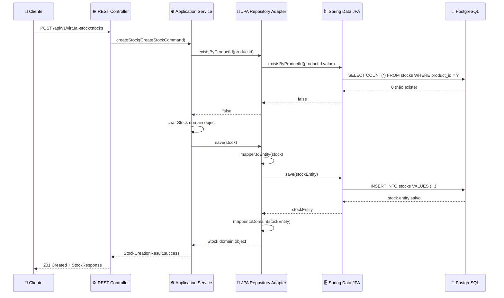

# 🚨 Necessidade Crítica: JPA Repository Adapter

[](../README.md)
[](#)
[](#)

## 🔍 **Por que o JPA Adapter é CRÍTICO?**

### 🚨 **Problema Atual: Aplicação NÃO INICIA**

```bash
***************************
APPLICATION FAILED TO START
***************************

Description:
Field stockRepository in com.kbnt.virtualstock.application.service.StockManagementApplicationService 
required a bean of type 'com.kbnt.virtualstock.domain.port.output.StockRepositoryPort' that could not be found.

Action:
Consider defining a bean of type 'StockRepositoryPort' in your configuration.
```

### 🏗️ **Análise Arquitetural**

#### **✅ O que ESTÁ Implementado:**
```java
// 📂 Domain Layer - Interface (Output Port)
public interface StockRepositoryPort {
    Stock save(Stock stock);
    Optional<Stock> findById(Stock.StockId stockId);
    List<Stock> findAll();
    boolean existsByProductId(Stock.ProductId productId);
    // ... outros métodos
}

// 📂 Application Layer - Service que PRECISA do Repository
@Service @RequiredArgsConstructor @Transactional
public class StockManagementApplicationService implements StockManagementUseCase {
    
    private final StockRepositoryPort stockRepository; // ❌ ERRO: Não encontra implementação
    private final StockEventPublisherPort eventPublisher; // ✅ OK: Tem implementação
    
    @Override
    public StockCreationResult createStock(CreateStockCommand command) {
        // ❌ FALHA AQUI: stockRepository.existsByProductId() 
        if (stockRepository.existsByProductId(command.getProductId())) {
            return StockCreationResult.failure("Stock already exists");
        }
        
        Stock stock = /* cria stock */;
        Stock savedStock = stockRepository.save(stock); // ❌ FALHA AQUI TAMBÉM
        
        return StockCreationResult.success(savedStock);
    }
}
```

#### **❌ O que está FALTANDO:**
```java
// 📂 Infrastructure Layer - IMPLEMENTAÇÃO CONCRETA (NÃO EXISTE!)
// ESTE ARQUIVO NÃO EXISTE NO SEU PROJETO:
@Component
public class JpaStockRepositoryAdapter implements StockRepositoryPort {
    // Esta classe PRECISA ser criada!
}
```

---

## 🔧 **Por que Spring Boot Precisa do Adapter?**

### **1. Dependency Injection (DI) do Spring**

```java
// Spring Boot faz isso automaticamente na inicialização:
@Service
public class StockManagementApplicationService {
    private final StockRepositoryPort stockRepository;
    
    // Spring precisa encontrar UMA classe que implementa StockRepositoryPort
    public StockManagementApplicationService(StockRepositoryPort stockRepository) {
        this.stockRepository = stockRepository; // ❌ Não encontra nenhuma implementação!
    }
}
```

**Spring Boot busca:**
1. Alguma classe com `@Component`, `@Repository`, ou `@Service`
2. Que implemente `StockRepositoryPort`
3. Para injetar no `StockManagementApplicationService`
4. **NÃO ENCONTRA NENHUMA** → **APPLICATION FAILS TO START**

### **2. Arquitetura Hexagonal Quebrada**

```
┌─────────────────────────────────────────────────┐
│                 HEXAGONAL ARCHITECTURE          │
├─────────────────────────────────────────────────┤
│  INPUT ADAPTERS    │    DOMAIN CORE    │ OUTPUT ADAPTERS │
│                    │                   │                 │
│  ✅ REST Controller │ ✅ Stock Entity   │ ✅ Kafka Adapter │
│      ↓             │       ↓           │       ↑         │
│  ✅ Use Case Port  │ ✅ Business Logic │ ✅ Event Port    │
│      ↓             │       ↓           │       ↑         │
│  ✅ App Service    │ ✅ Domain Service │ ❌ MISSING!     │
│      ↓             │                   │                 │
│      ↓             │                   │ ❌ Repository   │
│      ↓             │                   │    Port         │
│      └─────────────┼───────────────────┼─────────────────┤
│                    │                   │ ❌ JPA ADAPTER  │
│                    │                   │    (NOT FOUND)  │
└─────────────────────────────────────────────────┘
```

**Resultado**: Arquitetura hexagonal **INCOMPLETA** - falta o Output Adapter para persistência.

---

## 💾 **O que o JPA Adapter faz?**

### **Responsabilidades do JPA Repository Adapter:**

#### **1. Converte Domain Objects ↔ JPA Entities**
```java
@Component
@RequiredArgsConstructor
public class JpaStockRepositoryAdapter implements StockRepositoryPort {
    
    private final StockJpaRepository jpaRepository;  // Spring Data JPA Repository
    private final StockEntityMapper mapper;          // Domain ↔ Entity Converter
    
    @Override
    public Stock save(Stock domainStock) {
        // Converte: Domain Object → JPA Entity
        StockJpaEntity entity = mapper.toEntity(domainStock);
        
        // Salva no banco PostgreSQL
        StockJpaEntity savedEntity = jpaRepository.save(entity);
        
        // Converte: JPA Entity → Domain Object
        return mapper.toDomain(savedEntity);
    }
    
    @Override
    public Optional<Stock> findById(Stock.StockId stockId) {
        return jpaRepository.findById(stockId.getValue())
                .map(mapper::toDomain); // Entity → Domain
    }
}
```

#### **2. Isola Domain Layer do Banco de Dados**
```java
// ✅ DOMAIN LAYER - Fica "limpo", sem conhecer banco
public class Stock {
    private StockId stockId;
    private ProductId productId;  // Value Objects do Domain
    private Integer quantity;
    // SEM anotações @Entity, @Table, @Column!
}

// ✅ INFRASTRUCTURE LAYER - Conhece detalhes do banco
@Entity
@Table(name = "stocks")
public class StockJpaEntity {
    @Id
    private String stockId;
    
    @Column(name = "product_id", nullable = false)
    private String productId;      // Strings simples para JPA
    
    @Column(name = "quantity")
    private Integer quantity;
}
```

#### **3. Implementa Todas as Operações de Persistência**
```java
@Override
public boolean existsByProductId(Stock.ProductId productId) {
    return jpaRepository.existsByProductId(productId.getValue());
}

@Override
public List<Stock> findByStatus(Stock.StockStatus status) {
    List<StockJpaEntity> entities = jpaRepository.findByStatus(status.name());
    return entities.stream()
            .map(mapper::toDomain)
            .collect(Collectors.toList());
}

@Override
public List<Stock> findLowStock(Integer threshold) {
    List<StockJpaEntity> entities = jpaRepository.findByQuantityLessThan(threshold);
    return entities.stream()
            .map(mapper::toDomain)
            .collect(Collectors.toList());
}
```

---

## 🗄️ **Integração com PostgreSQL**

### **Configuração Já Existente (OK):**
```yaml
# application.yml - JÁ CONFIGURADO
spring:
  datasource:
    url: jdbc:postgresql://localhost:5432/virtualstock
    username: virtualstock_user
    password: virtualstock_pass
  
  jpa:
    database-platform: org.hibernate.dialect.PostgreSQLDialect
    hibernate:
      ddl-auto: validate  # Esperando tabelas existirem
```

### **O que Precisa Ser Criado:**

#### **1. JPA Entity (Representação da Tabela)**
```sql
-- Tabela PostgreSQL esperada:
CREATE TABLE stocks (
    stock_id VARCHAR(255) PRIMARY KEY,
    product_id VARCHAR(255) NOT NULL UNIQUE,
    symbol VARCHAR(10),
    product_name VARCHAR(255),
    quantity INTEGER NOT NULL,
    unit_price DECIMAL(10,2),
    status VARCHAR(50),
    created_at TIMESTAMP DEFAULT CURRENT_TIMESTAMP,
    last_updated TIMESTAMP DEFAULT CURRENT_TIMESTAMP,
    last_updated_by VARCHAR(255)
);
```

```java
// JPA Entity correspondente:
@Entity
@Table(name = "stocks")
@Data @Builder @NoArgsConstructor @AllArgsConstructor
public class StockJpaEntity {
    @Id
    @Column(name = "stock_id")
    private String stockId;
    
    @Column(name = "product_id", nullable = false, unique = true)
    private String productId;
    
    private String symbol;
    
    @Column(name = "product_name")
    private String productName;
    
    @Column(nullable = false)
    private Integer quantity;
    
    @Column(name = "unit_price", precision = 10, scale = 2)
    private BigDecimal unitPrice;
    
    @Enumerated(EnumType.STRING)
    private StockStatus status;
    
    @Column(name = "created_at")
    private LocalDateTime createdAt;
    
    @Column(name = "last_updated")
    private LocalDateTime lastUpdated;
    
    @Column(name = "last_updated_by")
    private String lastUpdatedBy;
}
```

#### **2. Spring Data JPA Repository**
```java
@Repository
public interface StockJpaRepository extends JpaRepository<StockJpaEntity, String> {
    
    boolean existsByProductId(String productId);
    
    Optional<StockJpaEntity> findByProductId(String productId);
    
    Optional<StockJpaEntity> findBySymbol(String symbol);
    
    List<StockJpaEntity> findByStatus(String status);
    
    List<StockJpaEntity> findByQuantityLessThan(Integer threshold);
    
    @Query("SELECT COUNT(s) FROM StockJpaEntity s WHERE s.status = :status")
    long countByStatus(@Param("status") String status);
}
```

#### **3. Domain ↔ Entity Mapper**
```java
@Component
public class StockEntityMapper {
    
    public StockJpaEntity toEntity(Stock domain) {
        return StockJpaEntity.builder()
                .stockId(domain.getStockId().getValue())
                .productId(domain.getProductId().getValue())
                .symbol(domain.getSymbol())
                .productName(domain.getProductName())
                .quantity(domain.getQuantity())
                .unitPrice(domain.getUnitPrice())
                .status(domain.getStatus())
                .createdAt(domain.getCreatedAt())
                .lastUpdated(domain.getLastUpdated())
                .lastUpdatedBy(domain.getLastUpdatedBy())
                .build();
    }
    
    public Stock toDomain(StockJpaEntity entity) {
        return Stock.builder()
                .stockId(Stock.StockId.of(entity.getStockId()))
                .productId(Stock.ProductId.of(entity.getProductId()))
                .symbol(entity.getSymbol())
                .productName(entity.getProductName())
                .quantity(entity.getQuantity())
                .unitPrice(entity.getUnitPrice())
                .status(entity.getStatus())
                .createdAt(entity.getCreatedAt())
                .lastUpdated(entity.getLastUpdated())
                .lastUpdatedBy(entity.getLastUpdatedBy())
                .build();
    }
}
```

---

## 🔄 **Fluxo Completo: Como Funcionará**



---

## ⚡ **Consequências SEM o JPA Adapter:**

### **❌ Problemas Imediatos:**
1. **Aplicação não inicia** - Spring Boot falha na inicialização
2. **Dependency injection falha** - Não consegue injetar StockRepositoryPort
3. **Todos os endpoints falham** - Nenhuma operação funciona
4. **Testes impossíveis** - Não consegue testar funcionalidades

### **❌ Problemas Arquiteturais:**
1. **Hexagonal Architecture incompleta** - Output Adapter faltando
2. **Domain isolado do mundo externo** - Não consegue persistir dados
3. **Business logic inútil** - Não consegue armazenar resultados
4. **Event publishing limitado** - Sem dados persistidos para eventos

---

## ✅ **Benefícios COM o JPA Adapter:**

### **🚀 Funcionalidades Habilitadas:**
- ✅ **Create Stock** → Salvar novos produtos no PostgreSQL
- ✅ **Update Stock** → Atualizar quantidades e preços
- ✅ **Reserve Stock** → Reservar quantidades para pedidos
- ✅ **Query Stock** → Buscar por ID, símbolo, status
- ✅ **List Stocks** → Listar todos os produtos
- ✅ **Low Stock Detection** → Identificar produtos com estoque baixo

### **🏗️ Arquitetura Completa:**
- ✅ **Full Hexagonal Pattern** → Input + Domain + Output adapters
- ✅ **Domain Isolation** → Business logic separada da infraestrutura
- ✅ **Database Abstraction** → Pode trocar PostgreSQL por outro banco
- ✅ **Testability** → Pode mockar o repository para testes unitários

---

## 🎯 **Conclusão: Necessidade CRÍTICA**

O **JPA Repository Adapter** é **OBRIGATÓRIO** porque:

1. **🚨 BLOQUEADOR**: Sem ele, a aplicação **NÃO INICIA**
2. **🏗️ ARQUITETURAL**: Completa o padrão Hexagonal Architecture
3. **💾 FUNCIONAL**: Habilita todas as operações de persistência
4. **🔧 TÉCNICO**: Satisfaz Dependency Injection do Spring Boot
5. **📋 BUSINESS**: Permite que business logic seja persistida

**Status**: 🔴 **CRÍTICO** - **Implementação obrigatória para sistema funcionar**

**Prioridade**: 🔥 **URGENTE** - **Deve ser implementado IMEDIATAMENTE**
