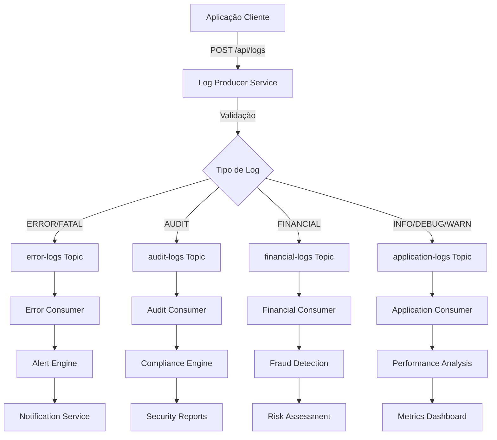
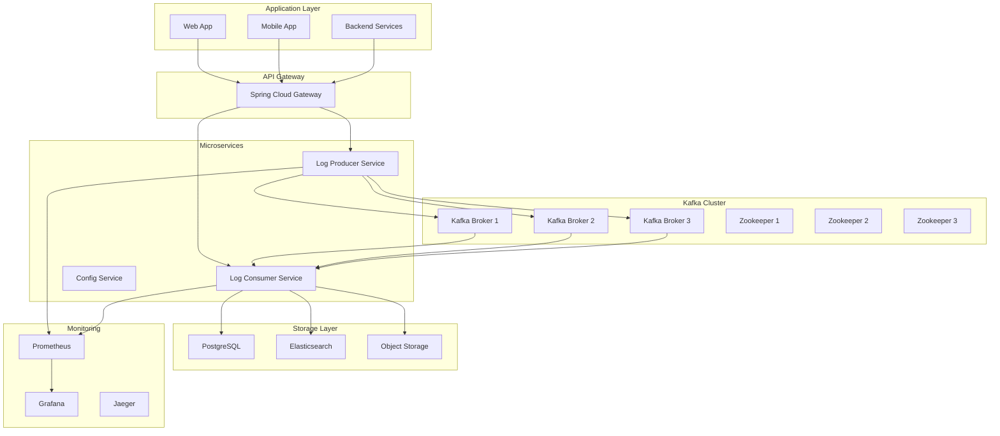
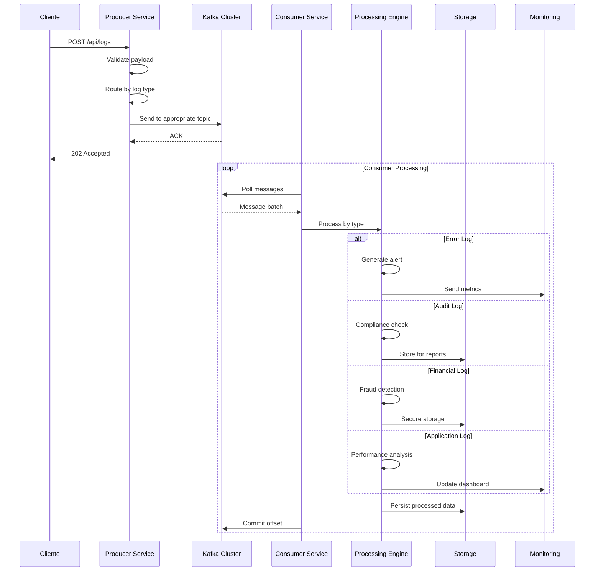
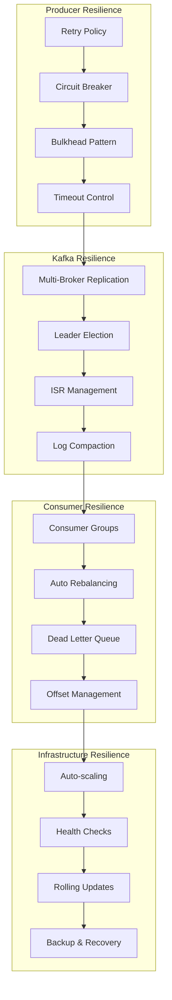
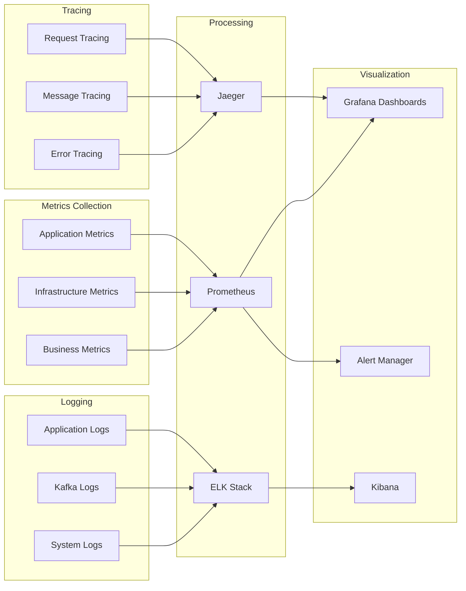

# 🔄 Mermaid Diagrams - Workflow de Tráfego de Mensagens

## 📊 Diagrama 1: Fluxo Geral de Mensagens

## 🏗️ Diagrama 2: Arquitetura de Componentes

## ⚡ Diagrama 3: Fluxo de Processamento por Tipo

## 🛡️ Diagrama 4: Padrões de Resiliência

## 📊 Diagrama 5: Pipeline de Observabilidade

