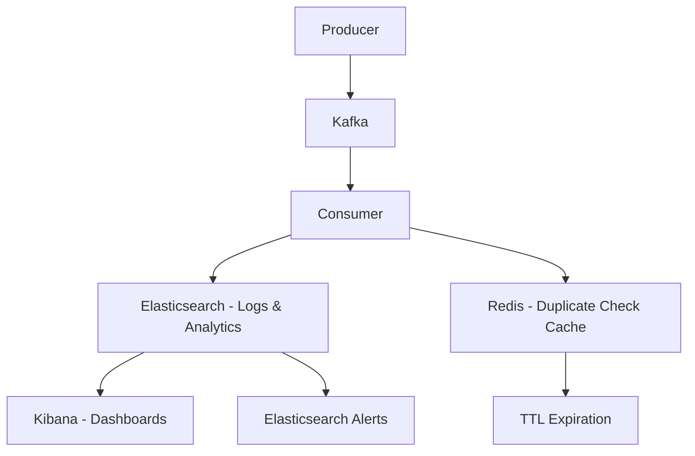

# 🔍 Elasticsearch-Based Logging Solution
## Alternative to PostgreSQL for KBNT Kafka Workflow

### 🎯 **Estratégias Sem Banco de Dados Tradicional**

#### **1. 📊 Elasticsearch + Kibana Stack (ELK)**
```yaml
Architecture:
  Producer → Kafka → Consumer → Elasticsearch → Kibana Dashboard
  
Benefits:
  ✅ Search & Analytics otimizados
  ✅ Visualizações ricas no Kibana
  ✅ Escalabilidade horizontal
  ✅ Real-time aggregations
  ✅ Retention policies automáticas
  
Challenges:
  ⚠️ Complexidade de setup
  ⚠️ Mais recursos computacionais
  ⚠️ Backup/disaster recovery
```

#### **2. 📈 Prometheus + Grafana (Metrics-First)**
```yaml
Architecture:
  Consumer → Micrometer → Prometheus → Grafana
  
Benefits:
  ✅ Métricas em tempo real
  ✅ Alerting integrado
  ✅ Dashboards interativos
  ✅ PromQL queries poderosas
  
Limitations:
  ❌ Não armazena logs detalhados
  ❌ Sem auditoria granular
  ❌ Retenção limitada
```

#### **3. 🔄 Hybrid: Structured Logging + In-Memory Cache**
```yaml
Architecture:
  Consumer → Structured Logs → Redis/Hazelcast → REST APIs
  
Benefits:
  ✅ Ultra-fast queries
  ✅ Simple implementation
  ✅ Low latency metrics
  
Limitations:
  ❌ Dados voláteis
  ❌ Sem histórico longo
  ❌ Single point of failure
```

### 🚀 **Implementação: Elasticsearch-Based Solution**

#### **Stack Technology:**
```yaml
Components:
  - Elasticsearch: Storage & search engine
  - Logstash/Fluentd: Log processing
  - Kibana: Visualization & dashboards
  - Beats: Log shipping
```

---

## 🛠️ **Implementation Plan**

### **Phase 1: Replace PostgreSQL with Elasticsearch**

#### **1.1 Document Structure for Consumption Logs**
```json
{
  "@timestamp": "2025-08-30T10:15:30.123Z",
  "correlation_id": "abc123-def456",
  "message_hash": "sha256:789xyz",
  "topic": "stock-updates",
  "partition": 1,
  "offset": 12345,
  "product_id": "SMARTPHONE-XYZ123",
  "quantity": 100,
  "price": 599.99,
  "operation": "INCREASE",
  "status": "SUCCESS",
  "processing_time_ms": 1250,
  "api_response": {
    "code": 200,
    "message": "Stock updated successfully",
    "duration_ms": 850
  },
  "external_api": {
    "endpoint": "https://api.example.com/stock/update",
    "method": "POST",
    "response_time_ms": 750
  },
  "retry_count": 0,
  "priority": "HIGH",
  "metadata": {
    "consumer_instance": "consumer-pod-1",
    "environment": "production",
    "version": "1.0.0"
  }
}
```

#### **1.2 Index Template for Optimized Storage**
```json
{
  "index_patterns": ["kbnt-consumption-logs-*"],
  "template": {
    "settings": {
      "number_of_shards": 3,
      "number_of_replicas": 1,
      "index.lifecycle.name": "kbnt-logs-policy",
      "index.lifecycle.rollover_alias": "kbnt-consumption-logs"
    },
    "mappings": {
      "properties": {
        "@timestamp": { "type": "date" },
        "correlation_id": { "type": "keyword" },
        "message_hash": { "type": "keyword" },
        "topic": { "type": "keyword" },
        "partition": { "type": "integer" },
        "offset": { "type": "long" },
        "product_id": { "type": "keyword" },
        "status": { "type": "keyword" },
        "processing_time_ms": { "type": "long" },
        "api_response.code": { "type": "integer" },
        "retry_count": { "type": "integer" }
      }
    }
  }
}
```

#### **1.3 ILM Policy for Automatic Retention**
```json
{
  "policy": {
    "phases": {
      "hot": {
        "actions": {
          "rollover": {
            "max_size": "10GB",
            "max_age": "7d"
          }
        }
      },
      "warm": {
        "min_age": "7d",
        "actions": {
          "allocate": { "number_of_replicas": 0 }
        }
      },
      "delete": {
        "min_age": "30d"
      }
    }
  }
}
```

---

### **Phase 2: Service Implementation Changes**

#### **2.1 New Elasticsearch Service**
```java
@Service
@RequiredArgsConstructor
@Slf4j
public class ElasticsearchLoggingService {
    
    private final ElasticsearchClient elasticsearchClient;
    private final ObjectMapper objectMapper;
    
    private static final String INDEX_PATTERN = "kbnt-consumption-logs";
    
    public void logConsumption(ConsumptionLogDocument logDocument) {
        try {
            IndexRequest<ConsumptionLogDocument> indexRequest = IndexRequest.of(i -> i
                .index(getCurrentIndex())
                .document(logDocument)
            );
            
            elasticsearchClient.index(indexRequest);
            
        } catch (Exception e) {
            log.error("Failed to log consumption to Elasticsearch", e);
            // Fallback to application logs
            logToApplicationLog(logDocument);
        }
    }
    
    public CompletableFuture<ProcessingStatistics> getProcessingStatistics(Duration period) {
        return CompletableFuture.supplyAsync(() -> {
            try {
                String query = buildStatisticsQuery(period);
                SearchRequest searchRequest = SearchRequest.of(s -> s
                    .index(INDEX_PATTERN + "-*")
                    .query(q -> q.queryString(qs -> qs.query(query)))
                    .aggregations("status_counts", a -> a
                        .terms(t -> t.field("status.keyword"))
                    )
                    .aggregations("avg_processing_time", a -> a
                        .avg(avg -> avg.field("processing_time_ms"))
                    )
                );
                
                SearchResponse<ConsumptionLogDocument> response = 
                    elasticsearchClient.search(searchRequest, ConsumptionLogDocument.class);
                
                return buildStatisticsFromResponse(response);
                
            } catch (Exception e) {
                log.error("Failed to get statistics from Elasticsearch", e);
                return ProcessingStatistics.empty();
            }
        });
    }
    
    public CompletableFuture<Boolean> checkDuplicateMessage(String correlationId, String messageHash) {
        return CompletableFuture.supplyAsync(() -> {
            try {
                SearchRequest searchRequest = SearchRequest.of(s -> s
                    .index(INDEX_PATTERN + "-*")
                    .query(q -> q.bool(b -> b
                        .must(m -> m.term(t -> t.field("correlation_id.keyword").value(correlationId)))
                        .must(m -> m.term(t -> t.field("message_hash.keyword").value(messageHash)))
                        .must(m -> m.term(t -> t.field("status.keyword").value("SUCCESS")))
                    ))
                    .size(1)
                );
                
                SearchResponse<ConsumptionLogDocument> response = 
                    elasticsearchClient.search(searchRequest, ConsumptionLogDocument.class);
                
                return response.hits().total().value() > 0;
                
            } catch (Exception e) {
                log.error("Failed to check duplicate in Elasticsearch", e);
                return false; // Fail-safe: allow processing
            }
        });
    }
}
```

#### **2.2 Updated Consumer Service**
```java
@Service
@RequiredArgsConstructor
@Slf4j
public class KafkaConsumerService {
    
    private final ExternalApiService externalApiService;
    private final ElasticsearchLoggingService elasticsearchLoggingService;
    private final ObjectMapper objectMapper;
    
    @KafkaListener(topics = {"stock-updates", "high-priority-stock-updates"})
    public void consumeStockUpdateMessage(
            @Payload String messagePayload,
            @Header(KafkaHeaders.RECEIVED_TOPIC) String topic,
            @Header(KafkaHeaders.RECEIVED_PARTITION) int partition,
            @Header(KafkaHeaders.OFFSET) long offset,
            ConsumerRecord<String, String> record,
            Acknowledgment acknowledgment) {
        
        LocalDateTime consumedAt = LocalDateTime.now();
        StockUpdateMessage message = null;
        ConsumptionLogDocument logDocument = null;
        
        try {
            // Parse message
            message = objectMapper.readValue(messagePayload, StockUpdateMessage.class);
            
            // Create initial log document
            logDocument = ConsumptionLogDocument.builder()
                .timestamp(consumedAt)
                .correlationId(message.getCorrelationId())
                .messageHash(message.getHash())
                .topic(topic)
                .partition(partition)
                .offset(offset)
                .productId(message.getProductId())
                .quantity(message.getQuantity())
                .price(message.getPrice())
                .operation(message.getOperation())
                .status("RECEIVED")
                .retryCount(0)
                .build();
            
            // Log initial state
            elasticsearchLoggingService.logConsumption(logDocument);
            
            // Check for duplicates (async)
            elasticsearchLoggingService.checkDuplicateMessage(
                message.getCorrelationId(), 
                message.getHash()
            ).thenAccept(isDuplicate -> {
                if (isDuplicate) {
                    log.warn("Duplicate message detected: {}", message.getCorrelationId());
                    updateLogStatus(logDocument, "DISCARDED", "Duplicate message");
                    acknowledgment.acknowledge();
                    return;
                }
                
                // Process message
                processMessageAsync(message, logDocument, acknowledgment);
            });
            
        } catch (Exception e) {
            log.error("Error processing message", e);
            if (logDocument != null) {
                updateLogWithError(logDocument, e);
            }
            throw new RuntimeException("Processing failed", e);
        }
    }
    
    private void processMessageAsync(StockUpdateMessage message, 
                                   ConsumptionLogDocument logDocument,
                                   Acknowledgment acknowledgment) {
        CompletableFuture.runAsync(() -> {
            LocalDateTime processingStart = LocalDateTime.now();
            
            try {
                // Update status to processing
                logDocument.setStatus("PROCESSING");
                logDocument.setProcessingStartedAt(processingStart);
                elasticsearchLoggingService.logConsumption(logDocument);
                
                // Process via external API
                ApiResponse apiResponse = externalApiService.processStockUpdate(message).block();
                
                LocalDateTime processingEnd = LocalDateTime.now();
                long processingTimeMs = Duration.between(processingStart, processingEnd).toMillis();
                
                // Update final status
                logDocument.setStatus(apiResponse.isSuccess() ? "SUCCESS" : "FAILED");
                logDocument.setProcessingCompletedAt(processingEnd);
                logDocument.setProcessingTimeMs(processingTimeMs);
                logDocument.setApiResponse(ApiResponseDocument.builder()
                    .code(apiResponse.getHttpStatus())
                    .message(apiResponse.getMessage())
                    .durationMs(apiResponse.getDurationMs())
                    .build());
                
                // Final log
                elasticsearchLoggingService.logConsumption(logDocument);
                
                acknowledgment.acknowledge();
                
            } catch (Exception e) {
                updateLogWithError(logDocument, e);
                acknowledgment.acknowledge(); // Or let retry mechanism handle
            }
        });
    }
}
```

#### **2.3 New Monitoring Controller**
```java
@RestController
@RequestMapping("/monitoring")
@RequiredArgsConstructor
@Slf4j
public class ElasticsearchMonitoringController {
    
    private final ElasticsearchLoggingService elasticsearchLoggingService;
    
    @GetMapping("/statistics")
    public CompletableFuture<ResponseEntity<ProcessingStatistics>> getStatistics(
            @RequestParam(defaultValue = "24") int hours) {
        
        Duration period = Duration.ofHours(hours);
        
        return elasticsearchLoggingService.getProcessingStatistics(period)
                .thenApply(ResponseEntity::ok);
    }
    
    @GetMapping("/logs/search")
    public CompletableFuture<ResponseEntity<SearchResults>> searchLogs(
            @RequestParam(required = false) String query,
            @RequestParam(defaultValue = "0") int from,
            @RequestParam(defaultValue = "20") int size) {
        
        return elasticsearchLoggingService.searchLogs(query, from, size)
                .thenApply(ResponseEntity::ok);
    }
    
    @GetMapping("/errors/recent")
    public CompletableFuture<ResponseEntity<List<ConsumptionLogDocument>>> getRecentErrors(
            @RequestParam(defaultValue = "24") int hours) {
        
        return elasticsearchLoggingService.getRecentErrors(Duration.ofHours(hours))
                .thenApply(ResponseEntity::ok);
    }
    
    @GetMapping("/performance/slowest")
    public CompletableFuture<ResponseEntity<List<ConsumptionLogDocument>>> getSlowestOperations(
            @RequestParam(defaultValue = "24") int hours,
            @RequestParam(defaultValue = "10") int limit) {
        
        return elasticsearchLoggingService.getSlowestOperations(Duration.ofHours(hours), limit)
                .thenApply(ResponseEntity::ok);
    }
}
```

---

### **Phase 3: Advanced Features**

#### **3.1 Kibana Dashboards**
```json
{
  "dashboard": {
    "title": "KBNT Consumer Monitoring",
    "visualizations": [
      {
        "type": "line_chart",
        "title": "Messages Processed Over Time",
        "query": "status:SUCCESS",
        "time_field": "@timestamp"
      },
      {
        "type": "pie_chart", 
        "title": "Processing Status Distribution",
        "aggregation": "terms",
        "field": "status.keyword"
      },
      {
        "type": "histogram",
        "title": "Processing Time Distribution",
        "field": "processing_time_ms"
      },
      {
        "type": "data_table",
        "title": "Recent Errors",
        "query": "status:(FAILED OR RETRY_EXHAUSTED)",
        "columns": ["@timestamp", "correlation_id", "product_id", "error_message"]
      }
    ]
  }
}
```

#### **3.2 Alerting with Elasticsearch Watcher**
```json
{
  "trigger": {
    "schedule": {
      "interval": "1m"
    }
  },
  "input": {
    "search": {
      "request": {
        "search_type": "query_then_fetch",
        "indices": ["kbnt-consumption-logs-*"],
        "body": {
          "query": {
            "bool": {
              "must": [
                {
                  "term": {
                    "status.keyword": "FAILED"
                  }
                },
                {
                  "range": {
                    "@timestamp": {
                      "gte": "now-5m"
                    }
                  }
                }
              ]
            }
          }
        }
      }
    }
  },
  "condition": {
    "compare": {
      "ctx.payload.hits.total": {
        "gt": 10
      }
    }
  },
  "actions": {
    "send_slack_notification": {
      "slack": {
        "message": {
          "text": "🚨 High error rate detected: {{ctx.payload.hits.total}} failed messages in last 5 minutes"
        }
      }
    }
  }
}
```

---

## 📊 **Comparison: PostgreSQL vs Elasticsearch**

### **PostgreSQL Solution:**
```yaml
Advantages:
  ✅ ACID transactions
  ✅ Complex SQL queries
  ✅ Data consistency
  ✅ Mature ecosystem
  ✅ Exact duplicate detection
  
Disadvantages:
  ❌ Limited search capabilities
  ❌ Requires complex indexing for analytics
  ❌ Not optimized for time-series data
  ❌ Manual dashboard creation
```

### **Elasticsearch Solution:**
```yaml
Advantages:
  ✅ Optimized for search & analytics
  ✅ Real-time aggregations
  ✅ Built-in visualization (Kibana)
  ✅ Horizontal scalability
  ✅ Automatic data lifecycle management
  ✅ Rich query DSL
  
Disadvantages:
  ❌ Eventual consistency
  ❌ More complex setup
  ❌ Higher resource requirements
  ❌ Learning curve for queries
```

---

## 🎯 **Recommendation**

### **Best Approach: Hybrid Architecture**



### **Implementation Strategy:**
1. **Primary**: Elasticsearch for logs, metrics, and analytics
2. **Cache**: Redis for fast duplicate detection (with TTL)
3. **Monitoring**: Kibana dashboards + Elasticsearch alerting
4. **Fallback**: Application logs for critical errors

### **Benefits of This Approach:**
✅ **Best of both worlds**: Fast analytics + reliable duplicate detection  
✅ **Scalable**: Elasticsearch handles large volumes  
✅ **Real-time**: Immediate insights and alerting  
✅ **Cost-effective**: No need for PostgreSQL infrastructure  
✅ **Developer-friendly**: Rich tooling and visualizations  

---

## 🚀 **Migration Path**

1. **Phase 1**: Set up Elasticsearch cluster
2. **Phase 2**: Implement parallel logging (PostgreSQL + Elasticsearch)
3. **Phase 3**: Create Kibana dashboards
4. **Phase 4**: Switch monitoring endpoints to Elasticsearch
5. **Phase 5**: Remove PostgreSQL dependency
6. **Phase 6**: Add Redis for duplicate detection optimization

Esta solução would be **enterprise-ready** and much more suitable for logging and analytics workloads! 🎯
