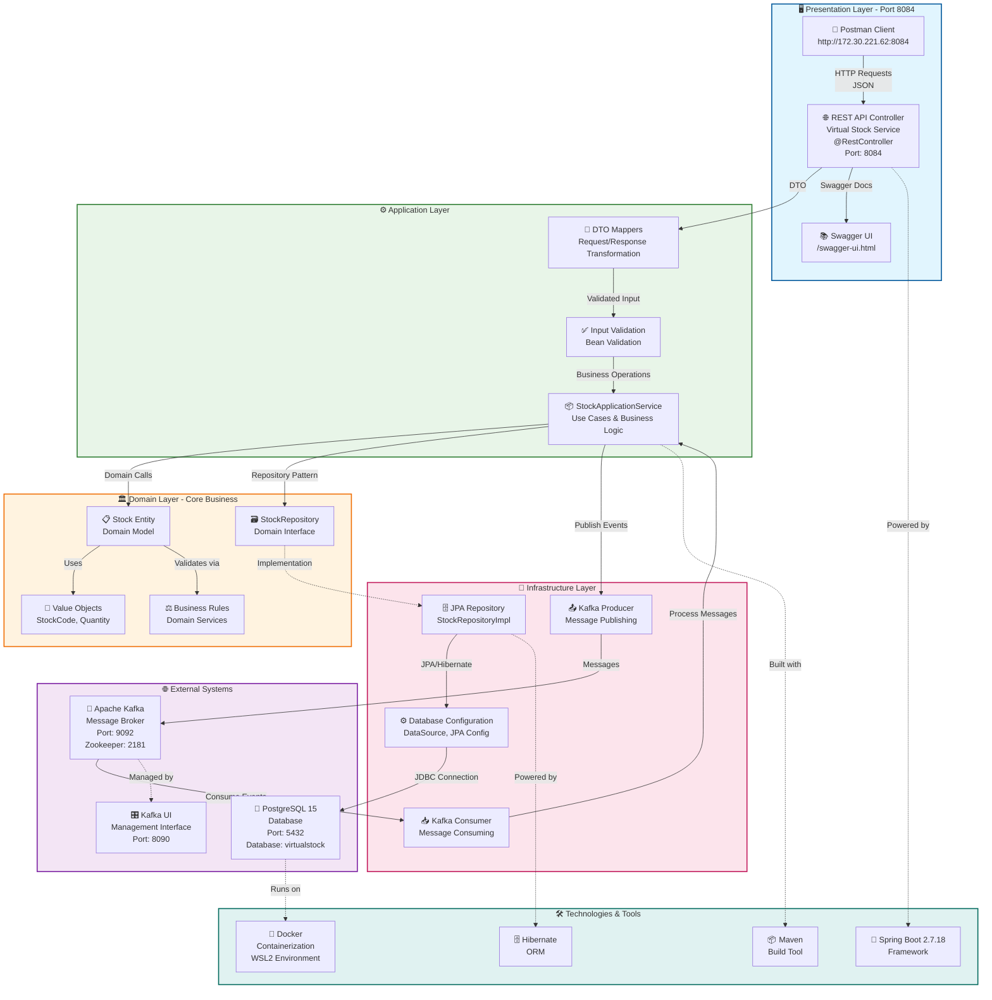
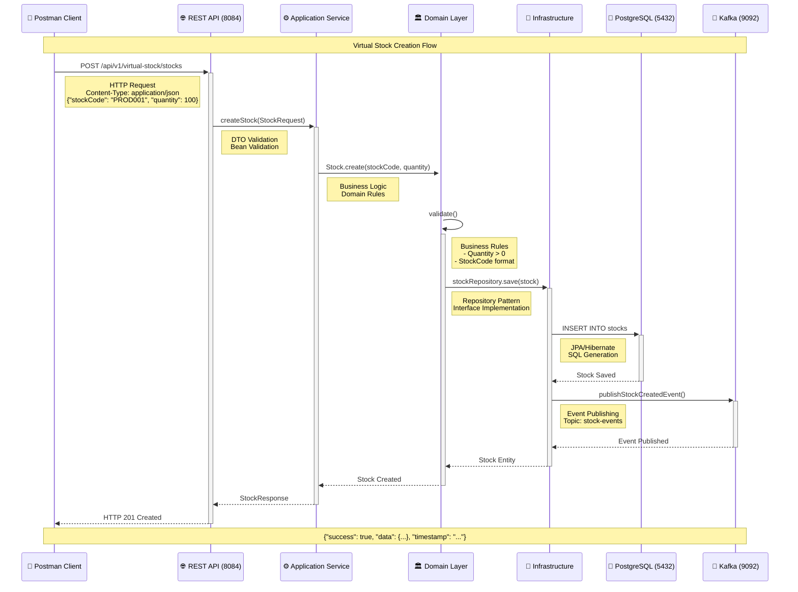
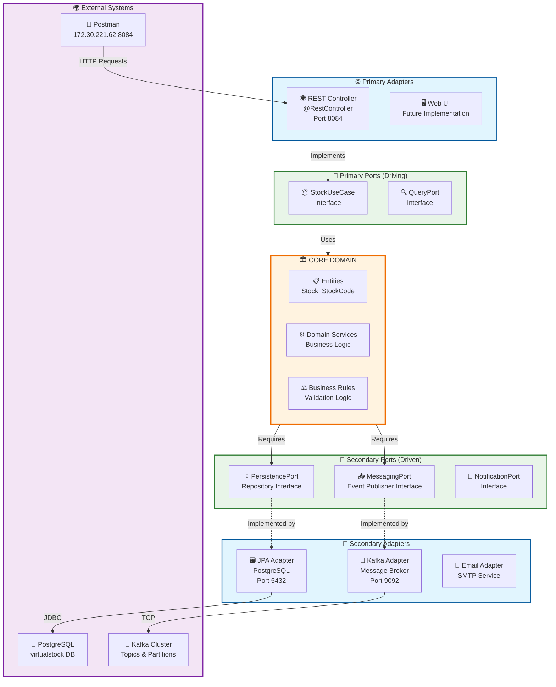
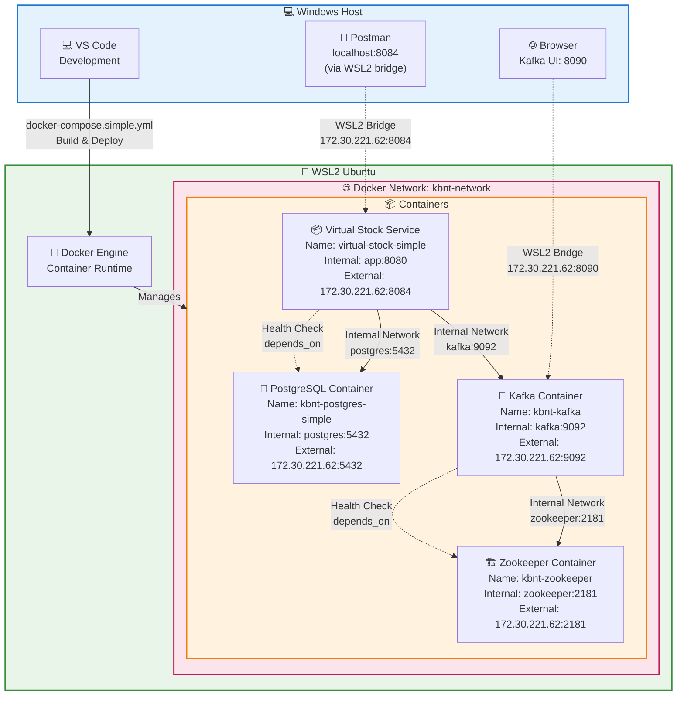
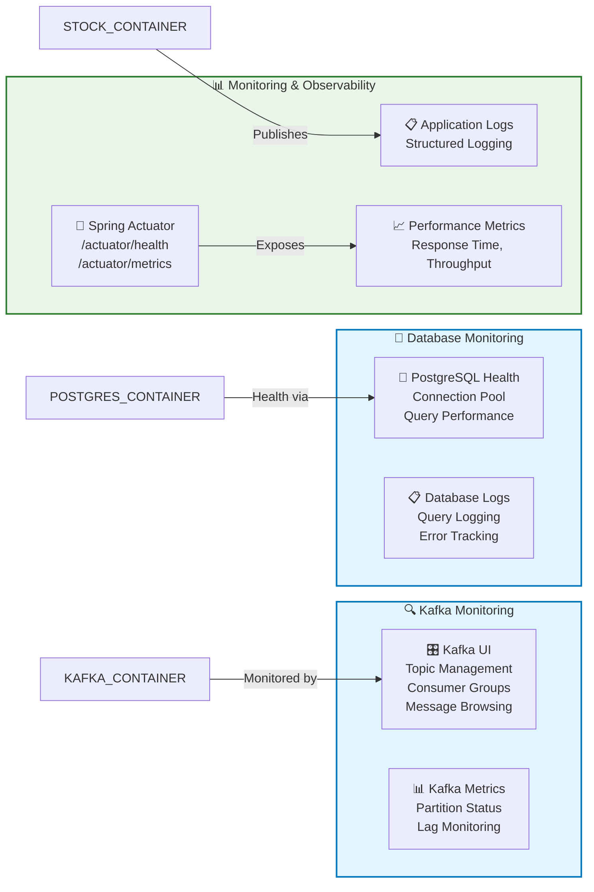

# 📊 Diagrama de Arquitetura KBNT Kafka Logs - Clean Architecture v2.1

## 🏗️ Visão Geral da Arquitetura

## 🔄 Fluxo de Mensagens e Dados

## 🏗️ Arquitetura Hexagonal (Ports & Adapters)

## 🐳 Infraestrutura Docker & WSL2

## 📊 Métricas e Monitoramento

## 🚀 Status da Implementação

### ✅ Componentes Implementados
- ✅ Clean Architecture com 4 camadas bem definidas
- ✅ Arquitetura Hexagonal (Ports & Adapters)
- ✅ PostgreSQL configurado e funcionando
- ✅ Virtual Stock Service API REST completa
- ✅ Docker containerização com WSL2
- ✅ Kafka para mensageria (infraestrutura pronta)
- ✅ Health checks e monitoramento
- ✅ Testes de conectividade WSL2 ↔ Windows

### 🎯 Endpoints Funcionais
- **GET** `/api/v1/virtual-stock/stocks` - Listar stocks
- **POST** `/api/v1/virtual-stock/stocks` - Criar stock
- **GET** `/api/v1/virtual-stock/stocks/{id}` - Buscar por ID
- **PUT** `/api/v1/virtual-stock/stocks/{id}/quantity` - Atualizar quantidade

### 🌐 Acesso
- **API URL**: `http://172.30.221.62:8084`
- **Database**: PostgreSQL na porta 5432
- **Kafka**: Disponível na porta 9092
- **Status**: 🟢 ONLINE e FUNCIONAL
