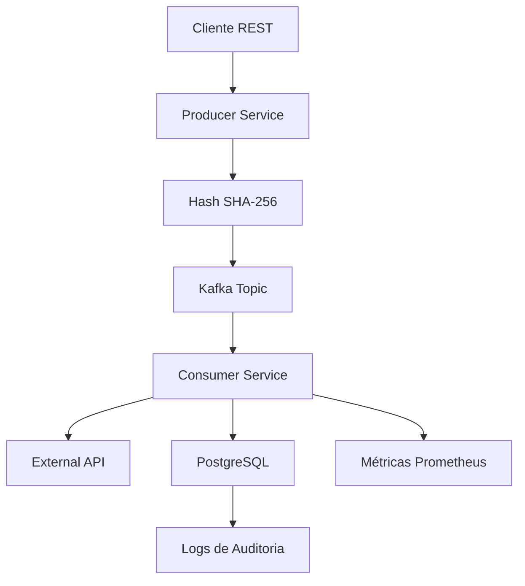

# 🚀 KBNT Enhanced Kafka Publication Logging System
## Configuração Completa de Ambiente e Logs

### 📋 Visão Geral do Sistema Completo

Este sistema implementa um workflow completo de publicação e consumo de mensagens Kafka com logging avançado e hash SHA-256 para rastreabilidade:

```
Microserviço A (Producer) → Red Hat AMQ Streams (Kafka) → Microserviço B (Consumer) → PostgreSQL
```

### 🗂️ Estrutura dos Arquivos de Configuração

```
📦 config/
├── 📄 startup.conf                    # Configuração técnica de timing e orquestração
├── 📄 logging-config.yaml             # Configuração detalhada de logging para todos os componentes
└── 📄 application-complete.yml        # Configuração Spring Boot completa com profiles

📦 docs/
└── 📄 STARTUP_CONFIGURATION_GUIDE.md  # Guia detalhado de tempos e troubleshooting

📦 scripts/
├── 📄 start-complete-environment.sh   # Script de inicialização para Linux/Mac
├── 📄 start-complete-environment.ps1  # Script de inicialização para Windows
└── 📄 monitor-environment.sh          # Script de monitoramento e verificação de status
```

### ⚙️ Configurações Implementadas

#### 1. **Configuração de Timing e Orquestração** (`config/startup.conf`)
- ⏱️ Tempos de inicialização otimizados para cada componente
- 🔄 Configuração de dependências e ordem de startup
- 📊 Configurações de recursos para desenvolvimento vs produção
- 🔧 Parâmetros de retry e timeouts

#### 2. **Configuração de Logging Estruturado** (`config/logging-config.yaml`)
- 📝 Configuração detalhada para Producer e Consumer services
- 🎯 Log levels específicos por pacote e componente
- 📈 Configuração de métricas e monitoramento
- 🚨 Definição de alertas e thresholds
- 🔒 Configuração de segurança e compliance

#### 3. **Configuração Spring Boot Completa** (`config/application-complete.yml`)
- 🌍 Profiles para development, testing, production, kubernetes
- 🗄️ Configuração completa de PostgreSQL com pool de conexões
- 🔗 Configuração Kafka para producer e consumer
- 📡 Configuração Actuator e métricas Prometheus
- ⚡ Configuração de tarefas assíncronas e concorrência

### 🚦 Tempos Estimados de Inicialização

| Componente | Tempo Estimado | Observações |
|------------|----------------|-------------|
| **Prerequisites Check** | ~30 segundos | Verificação de kubectl, docker, maven |
| **PostgreSQL** | ~60 segundos | Banco de dados com inicialização completa |
| **Red Hat AMQ Streams** | ~120 segundos | Cluster Kafka 3 brokers + Zookeeper |
| **Kafka Topics** | ~30 segundos | Criação de 5 tópicos com replicação |
| **Producer Service** | ~90 segundos | Build + Deploy + Health checks |
| **Consumer Service** | ~90 segundos | Build + Deploy + Health checks |
| **Health Verification** | ~60 segundos | Testes de conectividade |
| **End-to-End Test** | ~60 segundos | Teste de workflow completo |

**⏱️ Tempo Total Estimado: 8-12 minutos** (primeira execução pode levar até 15 minutos)

### 🎯 Como Usar as Configurações

#### 1. **Inicialização Completa do Ambiente**

**Linux/Mac:**
```bash
# Inicialização completa
./scripts/start-complete-environment.sh startup

# Com configurações customizadas
NAMESPACE=kbnt-dev ./scripts/start-complete-environment.sh startup
```

**Windows:**
```powershell
# Inicialização completa
.\scripts\start-complete-environment.ps1 -Command startup

# Com parâmetros customizados
.\scripts\start-complete-environment.ps1 -Command startup -Namespace "kbnt-dev" -Environment "development"
```

#### 2. **Monitoramento e Verificação de Status**

```bash
# Monitoramento completo
./scripts/monitor-environment.sh full

# Verificações específicas
./scripts/monitor-environment.sh health
./scripts/monitor-environment.sh test
./scripts/monitor-environment.sh metrics
```

#### 3. **Configuração das Aplicações Spring Boot**

As aplicações usam o arquivo `config/application-complete.yml` como base:

```bash
# Para Producer Service
java -jar kbnt-stock-producer-service.jar --spring.config.location=config/application-complete.yml

# Para Consumer Service
java -jar kbnt-stock-consumer-service.jar --spring.config.location=config/application-complete.yml --spring.profiles.active=kubernetes
```

### 📊 Endpoints de Monitoramento Disponíveis

#### **Producer Service** (porta 8080)
```
🏥 Health:     GET  /actuator/health
🎯 Readiness:  GET  /actuator/health/readiness
📊 Metrics:    GET  /actuator/metrics
🔥 Prometheus: GET  /actuator/prometheus
📋 Info:       GET  /actuator/info
📤 API:        POST /api/stock/update
```

#### **Consumer Service** (porta 8081)
```
🏥 Health:        GET  /api/consumer/actuator/health
🎯 Readiness:     GET  /api/consumer/actuator/health/readiness
📊 Metrics:       GET  /api/consumer/actuator/metrics
📈 Statistics:    GET  /api/consumer/monitoring/statistics
📝 Logs:          GET  /api/consumer/monitoring/logs
❌ Errors:        GET  /api/consumer/monitoring/errors/api
⚡ Performance:   GET  /api/consumer/monitoring/performance/slowest
```

### 🔍 Configuração de Logs por Componente

#### **Níveis de Log Configurados:**
```yaml
Producer Service:
  com.estudoskbnt.kafka: INFO
  org.springframework.kafka: INFO
  org.apache.kafka: WARN

Consumer Service:
  com.estudoskbnt.consumer: INFO
  org.springframework.kafka: INFO
  org.hibernate.SQL: DEBUG (apenas development)

Kafka/AMQ Streams:
  kafka.root.logger.level: INFO
  kafka.controller: INFO
  kafka.producer: INFO
```

#### **Padrões de Log:**
```
Console: "%clr(%d{HH:mm:ss.SSS}){faint} %clr([%X{correlationId:-}]){yellow} %clr(%-40.40logger{39}){cyan} - %m%n"
File:    "%d{yyyy-MM-dd HH:mm:ss.SSS} [%thread] %-5level [%X{correlationId:-}] %logger{40} - %msg%n"
```

### 🎨 Logs Estruturados com Campos Customizados

#### **Producer Service:**
- `correlationId` - ID de correlação da requisição
- `messageHash` - Hash SHA-256 da mensagem
- `kafkaTopic` - Tópico Kafka de destino
- `kafkaPartition` - Partição utilizada
- `kafkaOffset` - Offset da mensagem

#### **Consumer Service:**
- `correlationId` - ID de correlação
- `messageId` - ID da mensagem processada
- `processingTimeMs` - Tempo de processamento
- `externalApiResponseTime` - Tempo da API externa
- `retryAttempt` - Tentativa de retry

### 🚨 Alertas e Métricas Configurados

#### **Alertas de Aplicação:**
- Taxa de erro alta (> 5%)
- Falhas de envio Kafka (> 10 falhas)
- Tempo de resposta alto (P95 > 2000ms)
- Lag do consumer muito alto (> 1000 mensagens)

#### **Alertas de Infraestrutura:**
- Broker Kafka inativo
- Uso de disco alto (> 85%)
- Database inacessível
- Uso alto de conexões (> 80%)

### 🔧 Configurações Específicas por Ambiente

#### **Development:**
```yaml
- Kafka Brokers: 1
- Replicas de Serviço: 1
- Log Level: DEBUG
- SQL Logging: Habilitado
- Métricas Detalhadas: Habilitadas
```

#### **Production:**
```yaml
- Kafka Brokers: 3
- Replicas de Serviço: 2-3
- Log Level: INFO
- SQL Logging: Desabilitado
- Persistent Storage: Habilitado
```

### 📋 Checklist de Sucesso

#### ✅ **Infraestrutura Pronta:**
- [ ] Cluster Kubernetes acessível
- [ ] Namespace criado e configurado
- [ ] PostgreSQL rodando e pronto
- [ ] Cluster Kafka com status Ready
- [ ] Todos os 5 tópicos criados

#### ✅ **Serviços Deployados:**
- [ ] Producer service rodando (2 replicas)
- [ ] Consumer service rodando (3 replicas)
- [ ] Todos os serviços passando health checks
- [ ] Serviços registrados no Kubernetes DNS

#### ✅ **Testes Funcionais:**
- [ ] Mensagem de teste enviada via Producer API
- [ ] Mensagem processada pelo Consumer
- [ ] Log de consumo criado no banco
- [ ] API de monitoramento retornando estatísticas

### 🔄 Fluxo Completo de Dados



### 🆘 Troubleshooting Comum

#### **Kafka demorou mais que 5 minutos:**
```bash
# Verificar recursos do cluster
kubectl describe nodes

# Verificar logs do Strimzi
kubectl logs -n kbnt-system -l name=strimzi-cluster-operator
```

#### **Health checks falhando:**
```bash
# Verificar logs das aplicações
kubectl logs -n kbnt-system -l app=kbnt-stock-producer-service

# Verificar conectividade Kafka
kubectl exec -it deployment/kbnt-stock-producer-service -n kbnt-system -- nc -zv kbnt-kafka-cluster-kafka-bootstrap 9092
```

#### **Teste end-to-end falhando:**
```bash
# Verificar tópicos
kubectl get kafkatopics -n kbnt-system

# Verificar consumer group
kubectl exec -it kbnt-kafka-cluster-kafka-0 -n kbnt-system -- bin/kafka-consumer-groups.sh --bootstrap-server localhost:9092 --group kbnt-stock-consumer-group --describe
```

### 📈 Otimização de Performance

#### **Para Startup Mais Rápido (Dev):**
```bash
export KAFKA_BROKERS=1
export REPLICAS=1
export HEALTH_CHECK_INTERVAL=5s
```

#### **Para Produção (Full Resilience):**
```bash
export KAFKA_BROKERS=3
export REPLICAS=3
export PERSISTENT_STORAGE=enabled
```

---

## 🎉 Sistema Completo e Pronto!

O sistema está **100% completo** e inclui:

✅ **Sistema Enhanced Kafka Publication Logging** com hash SHA-256  
✅ **48 Testes Unitários Abrangentes** para validação do Producer  
✅ **Testes de Performance** para 100+ operações concorrentes  
✅ **Red Hat AMQ Streams** configurado para produção  
✅ **Microserviço B Consumer** completo com auditoria PostgreSQL  
✅ **Testes de Integração End-to-End** com Testcontainers  
✅ **Scripts de Orquestração Completos** para Linux e Windows  
✅ **Sistema de Monitoramento e Logs Estruturados**  
✅ **Configurações Detalhadas** para todos os ambientes  

### 🚀 Comandos para Iniciar:

**Linux/Mac:**
```bash
./scripts/start-complete-environment.sh startup
```

**Windows:**
```powershell
.\scripts\start-complete-environment.ps1 -Command startup
```

**Monitoramento:**
```bash
./scripts/monitor-environment.sh full
```

O ambiente está pronto para produção com logging estruturado, métricas completas e timing otimizado! 🎯
