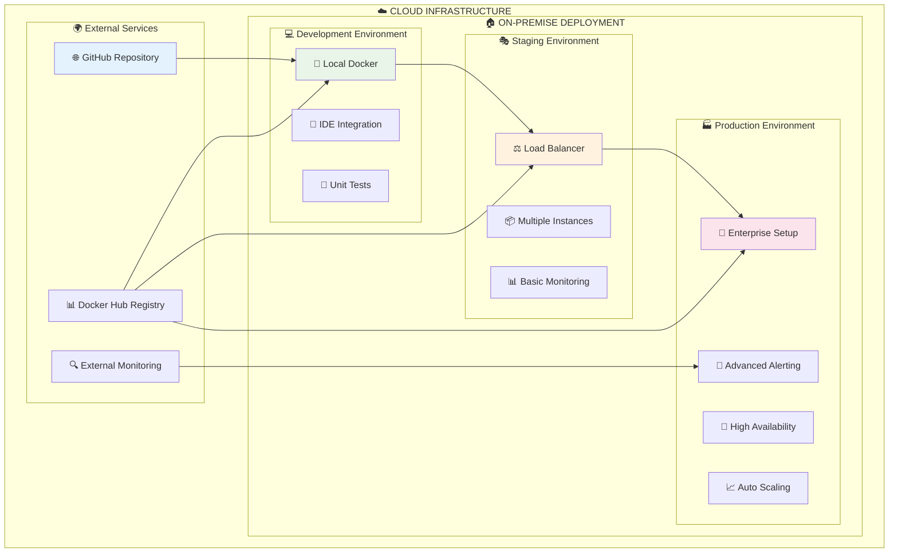
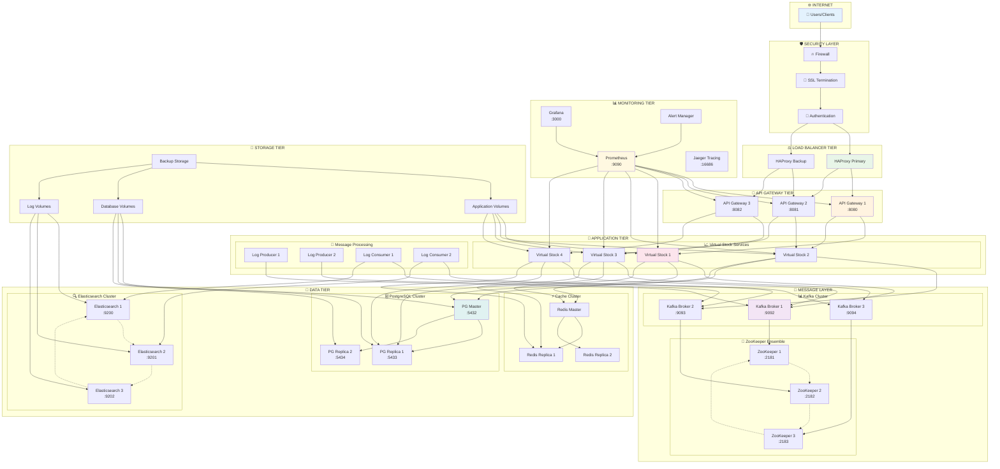
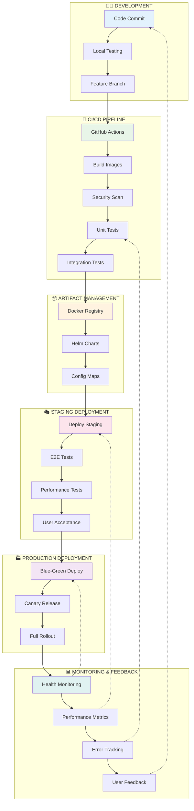
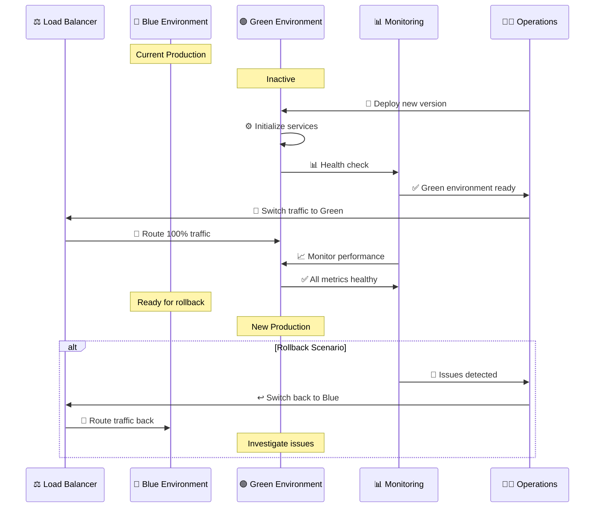
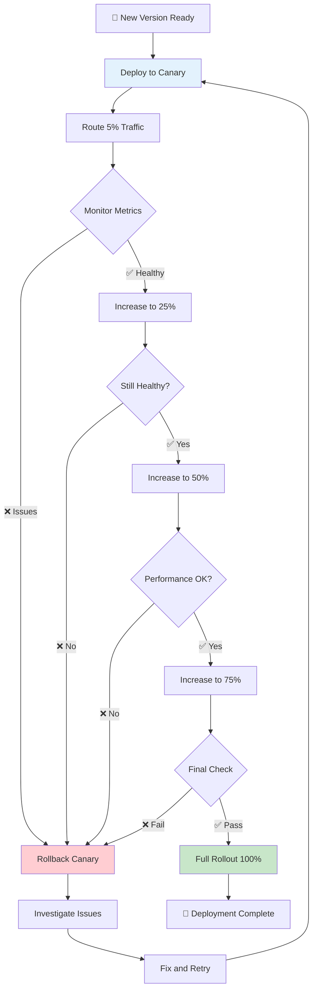
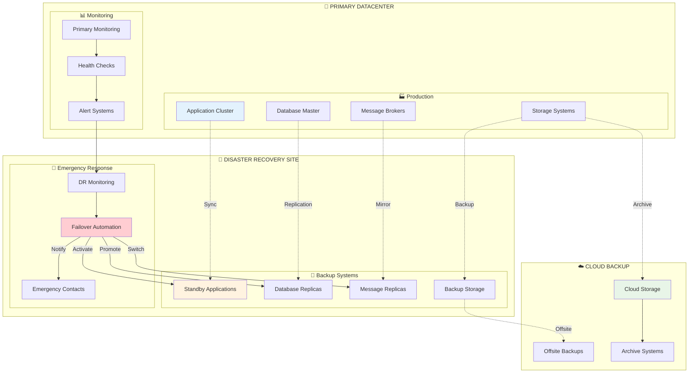
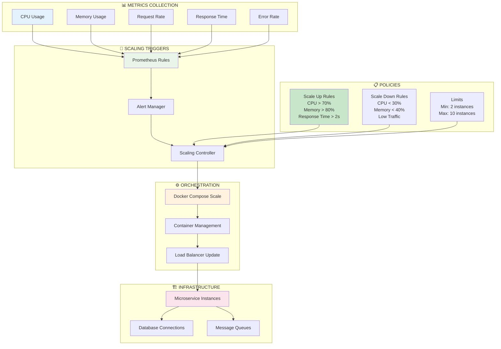
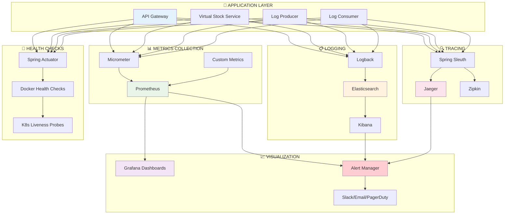

# 🏗️ ARQUITETURA DE DEPLOYMENT - KBNT Kafka Logs

## 🎯 Visão Geral da Arquitetura

Este documento apresenta a arquitetura completa de deployment do sistema KBNT Kafka Logs, mostrando como os componentes são organizados em diferentes ambientes e estratégias de escalabilidade.

---

## 🌐 Arquitetura Global de Deployment

---

## 🏢 Arquitetura Enterprise de Produção

---

## 🔄 Pipeline de Deployment Automatizado

---

## 📊 Matriz de Deployment por Ambiente

```mermaid
graph TB
    subgraph "🏗️ DEPLOYMENT MATRIX"
        subgraph "📱 BASIC (Local)"
            B1[1x API Gateway]
            B2[1x Virtual Stock]
            B3[1x PostgreSQL]
            B4[1x Kafka]
            B5[1x ZooKeeper]
            B6[Basic Monitoring]
        end
        
        subgraph "🧪 TESTING (Free-Tier)"
            T1[1x API Gateway<br/>Limited CPU]
            T2[1x Virtual Stock<br/>512MB RAM]
            T3[1x PostgreSQL<br/>Limited Storage]
            T4[1x Kafka<br/>Single Broker]
            T5[1x ZooKeeper]
            T6[Basic Health Checks]
        end
        
        subgraph "📈 SCALABLE (Simple)"
            S1[2x API Gateway<br/>Load Balanced]
            S2[2x Virtual Stock<br/>1GB RAM each]
            S3[1x PostgreSQL<br/>Master-Replica]
            S4[3x Kafka Brokers<br/>Cluster Mode]
            S5[3x ZooKeeper<br/>Ensemble]
            S6[Prometheus + Grafana]
        end
        
        subgraph "🏢 ENTERPRISE (Full)"
            E1[3x API Gateway<br/>HA + Auto-Scale]
            E2[4x Virtual Stock<br/>2GB RAM each]
            E3[3x PostgreSQL<br/>Master + 2 Replicas]
            E4[3x Kafka Brokers<br/>HA Cluster]
            E5[3x ZooKeeper<br/>Production Ensemble]
            E6[Full Monitoring Stack<br/>Alerting + Tracing]
            E7[HAProxy Load Balancer]
            E8[Elasticsearch Cluster]
            E9[Redis Cache Cluster]
        end
    end
    
    subgraph "📊 RESOURCE ALLOCATION"
        R1[CPU: 2-4 cores<br/>RAM: 2-4GB<br/>Storage: 10-20GB]
        R2[CPU: 4-6 cores<br/>RAM: 4-6GB<br/>Storage: 20-30GB]
        R3[CPU: 8-12 cores<br/>RAM: 8-12GB<br/>Storage: 50-100GB]
        R4[CPU: 16+ cores<br/>RAM: 16+ GB<br/>Storage: 100+ GB]
    end
    
    B1 --> R1
    T1 --> R2
    S1 --> R3
    E1 --> R4
    
    style B1 fill:#e3f2fd
    style T1 fill:#e8f5e8
    style S1 fill:#fff3e0
    style E1 fill:#fce4ec
```

---

## 🚀 Estratégias de Deployment

### 🔵 Blue-Green Deployment

### 🕯️ Canary Deployment

---

## 🛡️ Disaster Recovery Architecture

---

## 📈 Auto-Scaling Architecture

---

## 🔍 Monitoring and Observability

---

*Esta documentação apresenta a arquitetura completa de deployment do sistema KBNT Kafka Logs, mostrando todas as estratégias, componentes e fluxos de trabalho implementados para suportar desde desenvolvimento local até produção enterprise de alta disponibilidade.*
