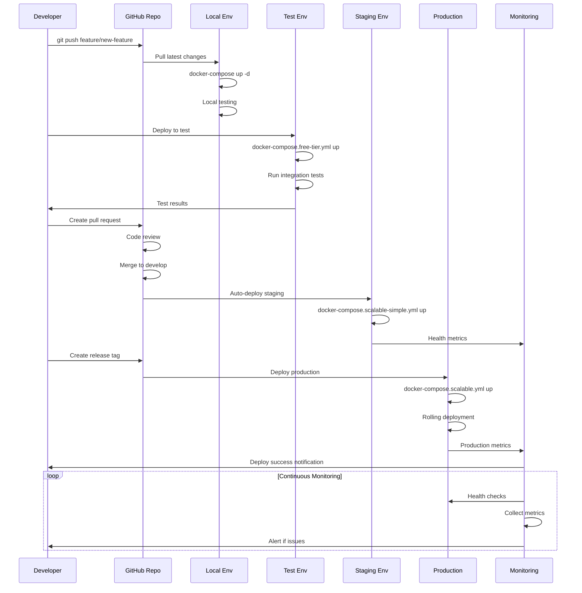
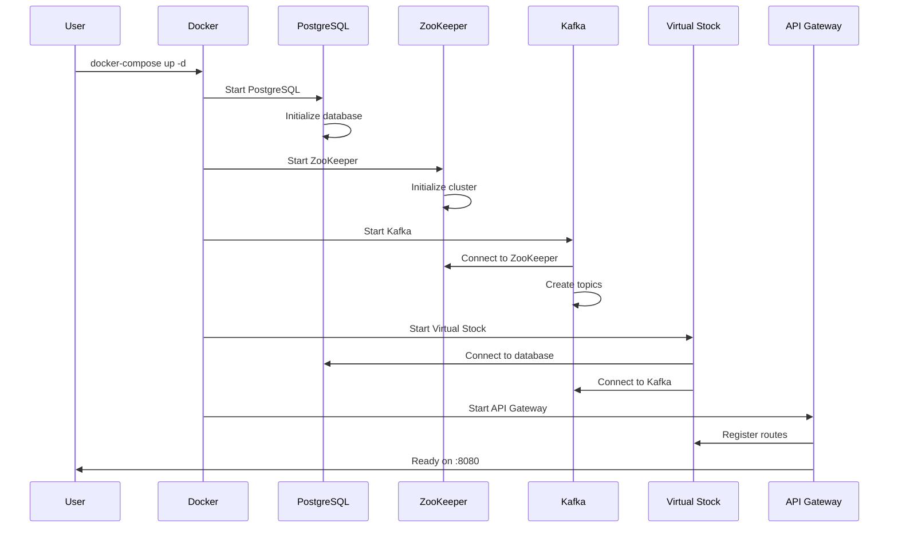
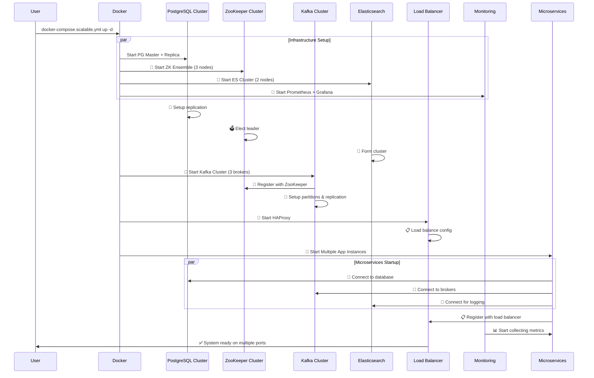
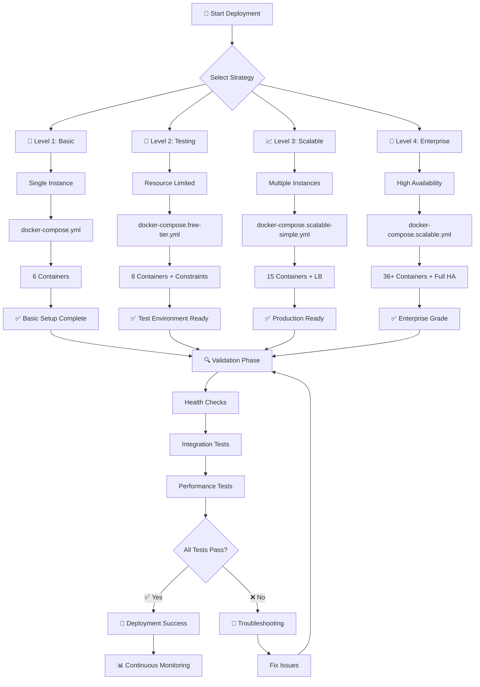
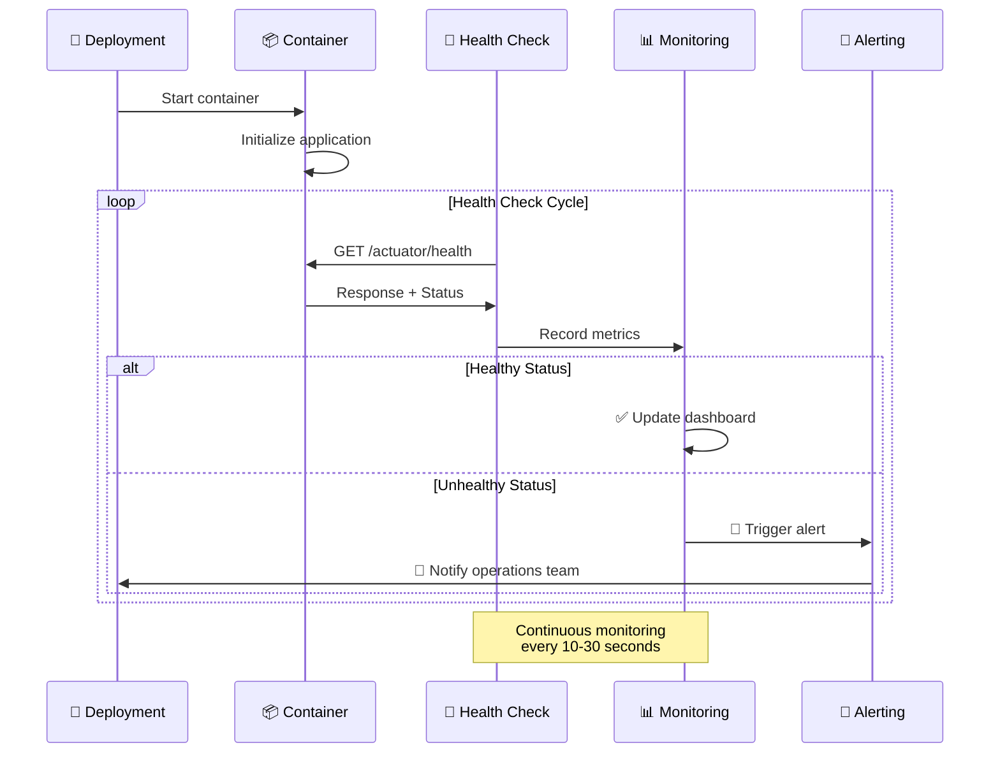
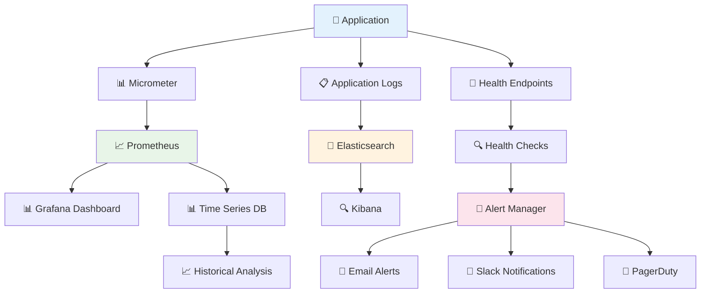
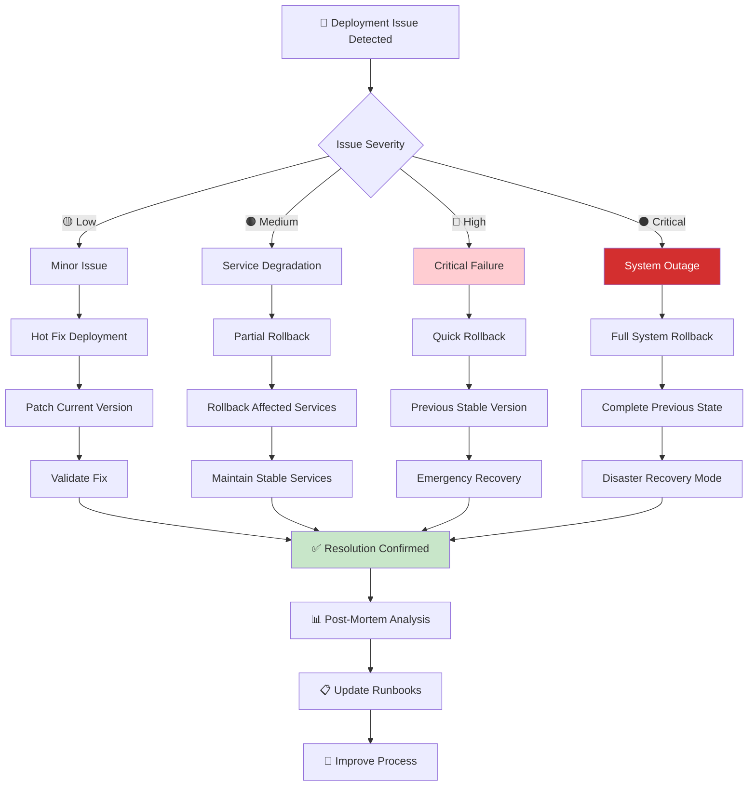
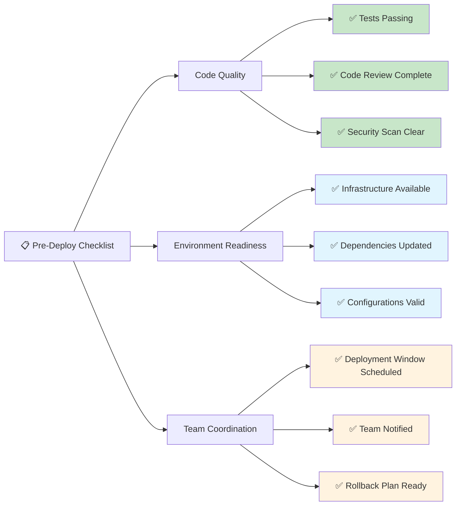

# SEQUÊNCIA DE DEPLOYMENT - KBNT Kafka Logs

## Fluxo Completo de Deployment

---

## Sequência de Inicialização por Ambiente

### Ambiente Local (docker-compose.yml)

### Ambiente Escalável (docker-compose.scalable.yml)

---

## 🔄 Estratégias de Deployment por Complexidade

### 📊 Deployment Progressivo

---

## 🎛️ Configuração de Deployment por Ambiente

### 🔧 Matriz de Configuração

```mermaid
graph TB
    subgraph "🎚️ CONFIGURAÇÕES"
        A[Environment Variables]
        B[Resource Limits]
        C[Network Configuration]
        D[Volume Mounts]
        E[Health Checks]
    end
    
    subgraph "🧪 DEVELOPMENT"
        A --> A1[DEBUG=true<br/>LOG_LEVEL=debug<br/>PROFILE=dev]
        B --> B1[CPU: unlimited<br/>Memory: unlimited<br/>Minimal constraints]
        C --> C1[Bridge network<br/>Port mapping<br/>Host networking]
        D --> D1[Local volumes<br/>Hot reload<br/>Source mounts]
        E --> E1[Basic checks<br/>30s intervals<br/>Simple endpoints]
    end
    
    subgraph "🔧 TESTING"
        A --> A2[DEBUG=false<br/>LOG_LEVEL=info<br/>PROFILE=test]
        B --> B2[CPU: 1 core<br/>Memory: 512MB<br/>Strict limits]
        C --> C2[Isolated network<br/>Internal communication<br/>No host access]
        D --> D2[Named volumes<br/>Persistent data<br/>Test fixtures]
        E --> E2[Comprehensive checks<br/>15s intervals<br/>Deep health validation]
    end
    
    subgraph "📈 STAGING"
        A --> A3[DEBUG=false<br/>LOG_LEVEL=warn<br/>PROFILE=staging]
        B --> B3[CPU: 2 cores<br/>Memory: 1GB<br/>Production-like]
        C --> C3[Production network<br/>Load balancing<br/>Service discovery]
        D --> D3[Persistent volumes<br/>Backup enabled<br/>Data replication]
        E --> E3[Production checks<br/>10s intervals<br/>Full monitoring]
    end
    
    subgraph "🏭 PRODUCTION"
        A --> A4[DEBUG=false<br/>LOG_LEVEL=error<br/>PROFILE=prod]
        B --> B4[CPU: 4+ cores<br/>Memory: 2GB+<br/>High limits]
        C --> C4[HA networking<br/>Multiple subnets<br/>Security groups]
        D --> D4[Replicated storage<br/>Automated backup<br/>Disaster recovery]
        E --> E4[Critical checks<br/>5s intervals<br/>Advanced alerting]
    end
    
    style A1 fill:#e3f2fd
    style A2 fill:#e8f5e8
    style A3 fill:#fff3e0
    style A4 fill:#fce4ec
```

---

## 🚀 Processo de CI/CD Pipeline

```mermaid
flowchart LR
    subgraph "👨‍💻 DEVELOPMENT"
        A[Code Changes] --> B[Local Testing]
        B --> C[Git Commit]
        C --> D[Push to Feature Branch]
    end
    
    subgraph "🔄 CONTINUOUS INTEGRATION"
        D --> E[GitHub Actions Trigger]
        E --> F[Build Docker Images]
        F --> G[Run Unit Tests]
        G --> H[Security Scan]
        H --> I[Integration Tests]
    end
    
    subgraph "📋 CODE REVIEW"
        I --> J[Create Pull Request]
        J --> K[Code Review]
        K --> L[Approval Required]
        L --> M[Merge to Develop]
    end
    
    subgraph "🎭 STAGING DEPLOYMENT"
        M --> N[Auto-deploy Staging]
        N --> O[Run E2E Tests]
        O --> P[Performance Tests]
        P --> Q[User Acceptance Tests]
    end
    
    subgraph "🏷️ RELEASE"
        Q --> R[Create Release Tag]
        R --> S[Generate Release Notes]
        S --> T[Deploy to Production]
    end
    
    subgraph "🏭 PRODUCTION"
        T --> U[Blue-Green Deployment]
        U --> V[Health Validation]
        V --> W[Traffic Switch]
        W --> X[Monitor & Alert]
    end
    
    style A fill:#e3f2fd
    style E fill:#e8f5e8
    style J fill:#fff3e0
    style N fill:#f3e5f5
    style R fill:#fce4ec
    style T fill:#ffebee
```

---

## 📊 Monitoramento de Deployment

### 🔍 Health Check Sequence

### 📈 Metrics Collection Flow

---

## 🛡️ Estratégias de Rollback

---

## 📋 Deployment Checklist Template

### ✅ Pre-Deployment Verification

---

*Este documento apresenta todas as estratégias e sequências de deployment implementadas no projeto KBNT Kafka Logs, servindo como guia completo para operações de deployment em todos os ambientes.*
