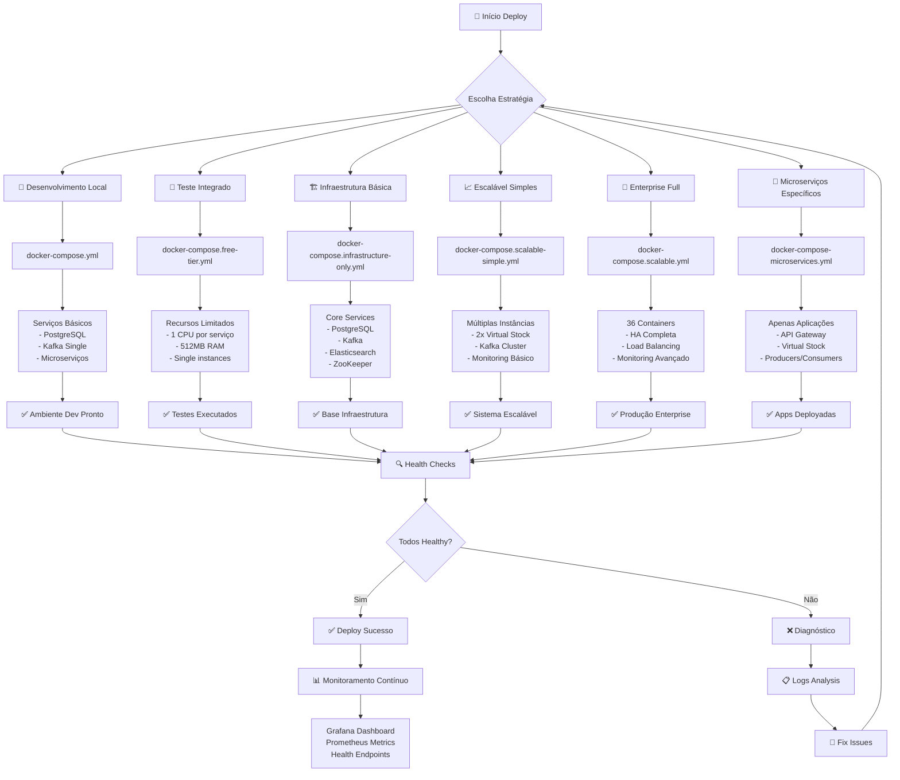
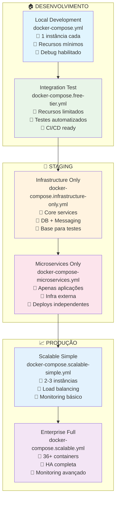
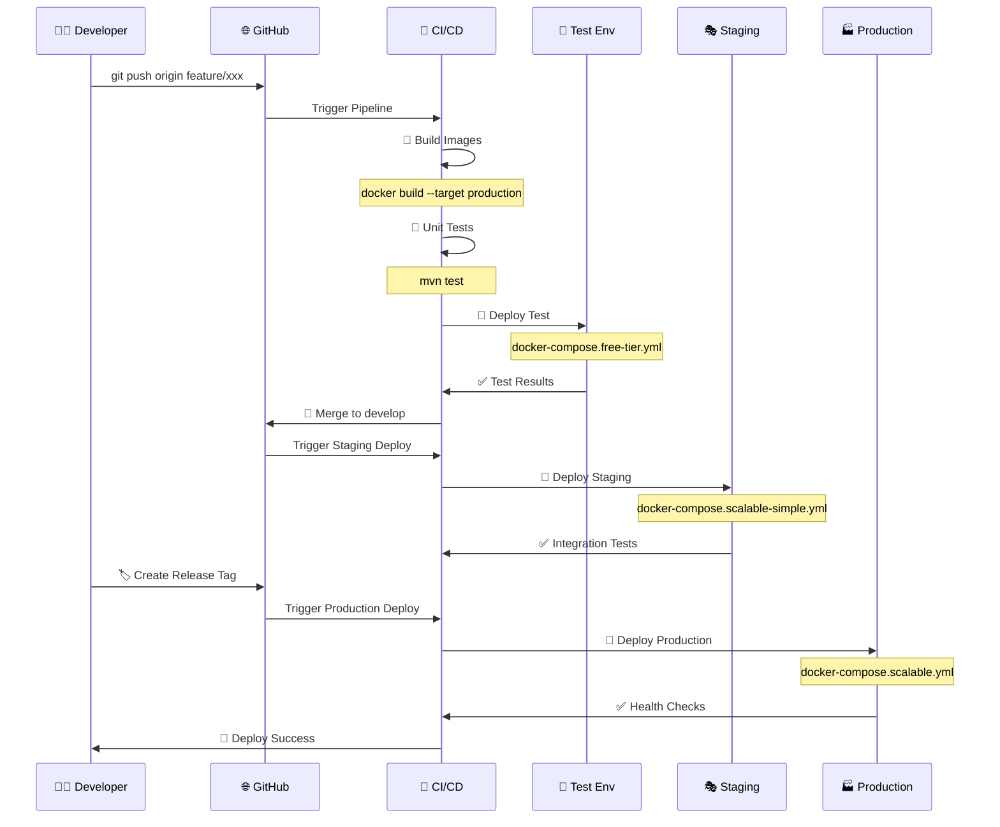
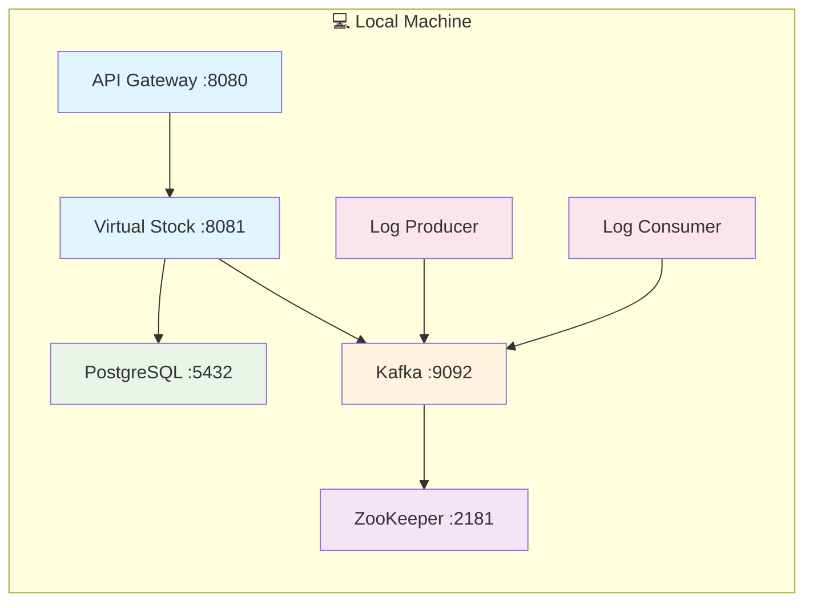
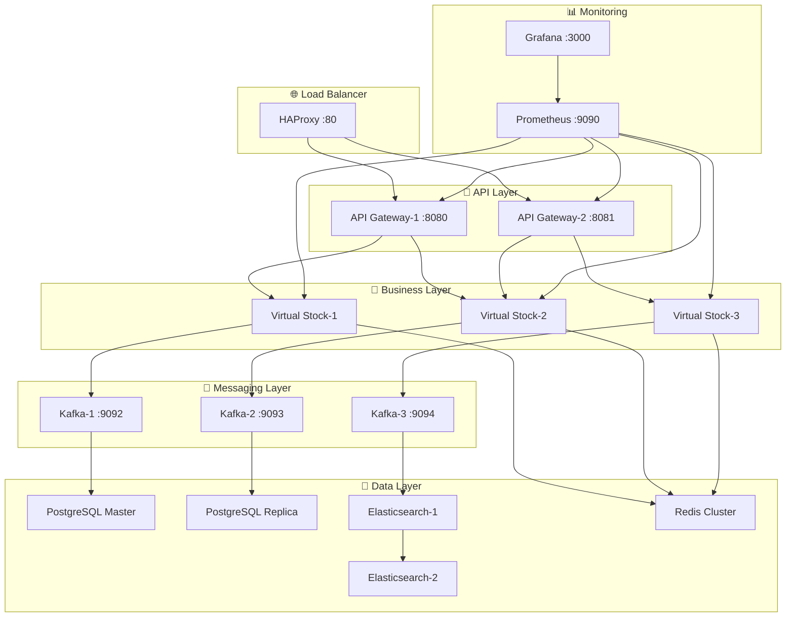
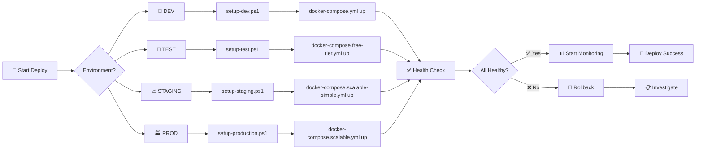
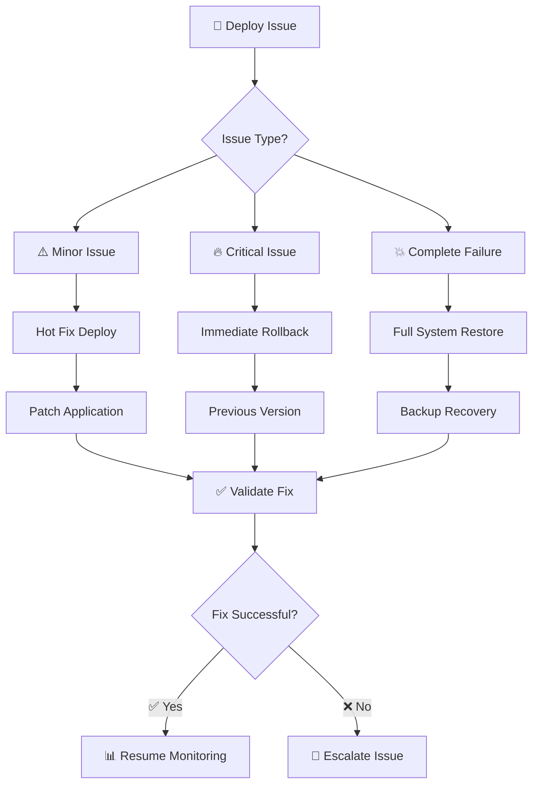

# 🚀 ESTRATÉGIAS DE DEPLOYMENT - KBNT Kafka Logs

## 📊 Visão Geral das Estratégias Implementadas

Este documento apresenta todas as estratégias de deployment implementadas no projeto KBNT Kafka Logs, desde desenvolvimento local até produção enterprise com alta disponibilidade.

---

## 🎯 Fluxograma Completo de Deployment



---

## 📋 Matriz de Estratégias de Deployment



---

## 🔄 Fluxo de CI/CD Implementado



---

## 🏗️ Arquitetura de Deployment por Ambiente

### 🧪 Desenvolvimento Local


### 📈 Produção Escalável


---

## 🛠️ Scripts de Deployment

### 📝 Deploy Automatizado


---

## 📊 Comparativo de Recursos por Estratégia

| Estratégia | Containers | CPU | RAM | Disk | HA | Monitoring | Load Balancer |
|------------|-----------|-----|-----|------|----|-----------| -------------|
| 🧪 **Local Dev** | 6 | 2 cores | 2GB | 10GB | ❌ | Basic | ❌ |
| 🔧 **Free Tier** | 8 | 4 cores | 3GB | 15GB | ❌ | Basic | ❌ |
| 🏗️ **Infrastructure** | 4 | 2 cores | 2GB | 20GB | ❌ | ❌ | ❌ |
| 🔧 **Microservices** | 5 | 3 cores | 2.5GB | 5GB | ❌ | Basic | ❌ |
| 📈 **Scalable Simple** | 15 | 8 cores | 6GB | 30GB | ✅ | Full | ✅ |
| 🏢 **Enterprise Full** | 36+ | 16+ cores | 12GB+ | 50GB+ | ✅ | Advanced | ✅ |

---

## 🎯 Comandos de Deployment

### 🧪 Desenvolvimento Local
```bash
# Desenvolvimento básico
docker-compose up -d

# Com rebuild
docker-compose up -d --build
```

### 🔧 Teste e Validação
```bash
# Ambiente de teste
docker-compose -f docker-compose.free-tier.yml up -d

# Testes automatizados
docker-compose -f docker-compose.free-tier.yml exec api-gateway curl http://localhost:8080/actuator/health
```

### 📈 Produção Escalável
```bash
# Deploy simples escalável
docker-compose -f docker-compose.scalable-simple.yml up -d

# Deploy enterprise completo
docker-compose -f docker-compose.scalable.yml up -d

# Scaling horizontal
docker-compose -f docker-compose.scalable-simple.yml up --scale virtual-stock-service=4 -d
```

### 🔍 Monitoramento e Health Checks
```bash
# Verificar status
docker-compose ps

# Logs em tempo real
docker-compose logs -f

# Health check específico
curl http://localhost:8080/actuator/health
curl http://localhost:9090/metrics # Prometheus
```

---

## 📋 Checklist de Deployment

### ✅ Pré-Deployment
- [ ] Código testado e validado
- [ ] Imagens Docker buildadas
- [ ] Configurações de ambiente validadas
- [ ] Recursos de infraestrutura disponíveis
- [ ] Backups realizados (produção)

### ✅ Durante Deployment
- [ ] Containers inicializando corretamente
- [ ] Health checks passando
- [ ] Conectividade entre serviços
- [ ] Logs sem erros críticos
- [ ] Métricas sendo coletadas

### ✅ Pós-Deployment
- [ ] Testes de integração executados
- [ ] Performance dentro do esperado
- [ ] Monitoramento ativo
- [ ] Alertas configurados
- [ ] Documentação atualizada

---

## 🔄 Rollback Strategies



---

## 📞 Contatos e Suporte

### 🛠️ Suporte Técnico
- **Desenvolvedor Principal:** Italo Costa
- **Repository:** [estudosKBNT_Kafka_Logs](https://github.com/italo-costa/estudosKBNT_Kafka_Logs)
- **Issues:** GitHub Issues para reportar problemas
- **Documentação:** README.md e arquivos MD específicos

### 📊 Monitoring URLs
- **Grafana:** http://localhost:3000 (admin/admin)
- **Prometheus:** http://localhost:9090
- **API Gateway:** http://localhost:8080/actuator/health
- **Elasticsearch:** http://localhost:9200/_cluster/health

---

*Última atualização: Setembro 2025*
*Versão: 2.0.0*
