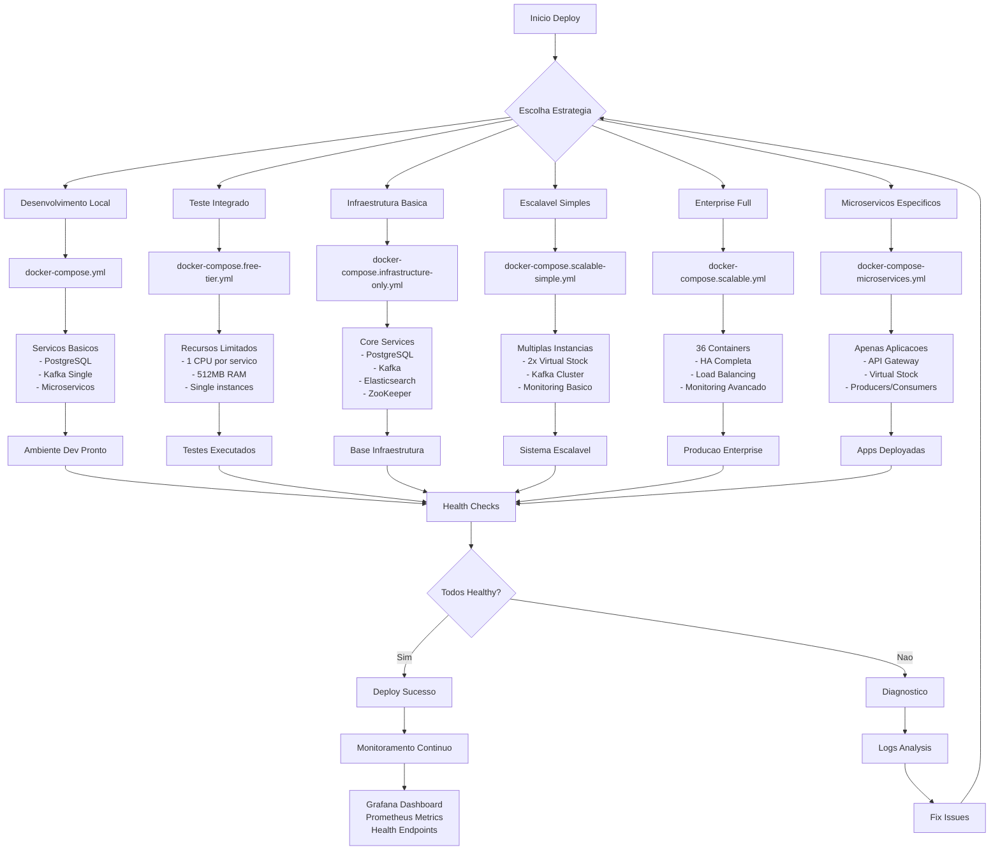
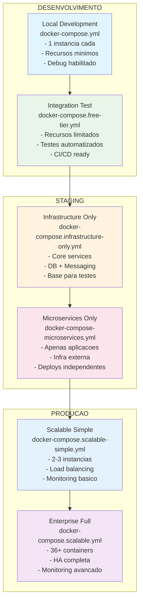
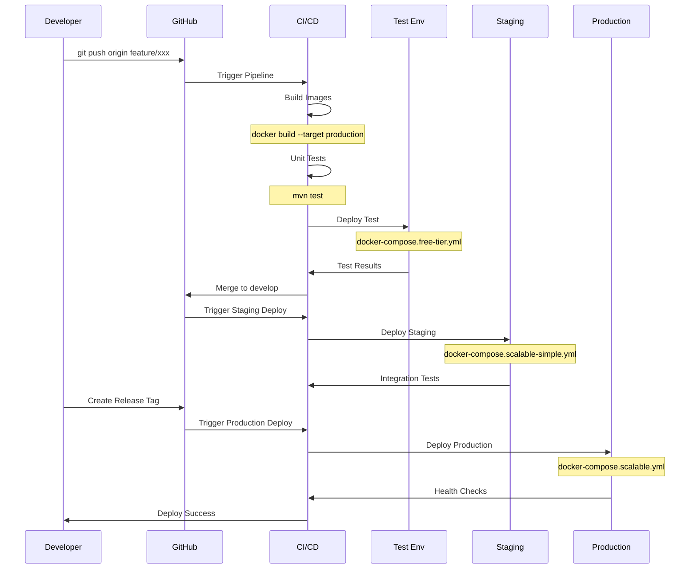
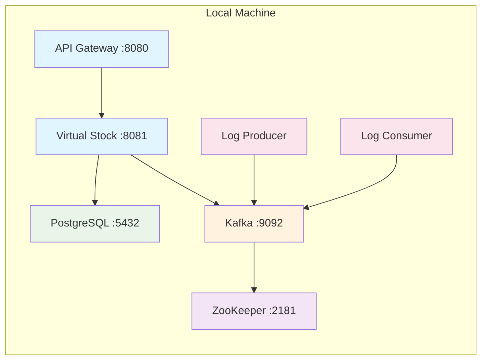
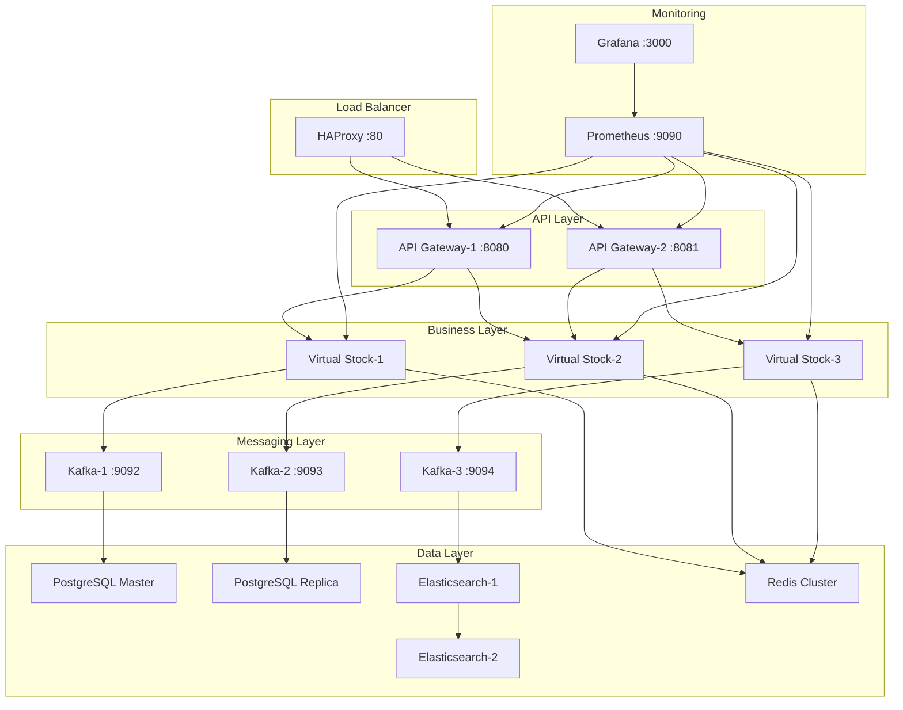
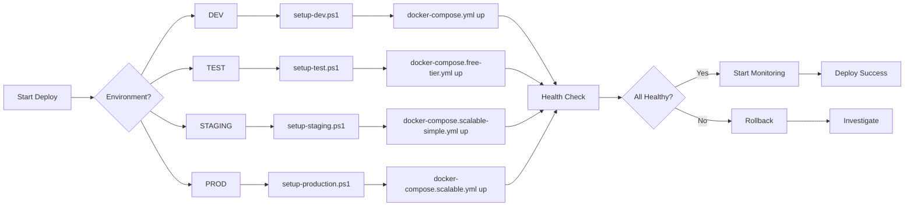
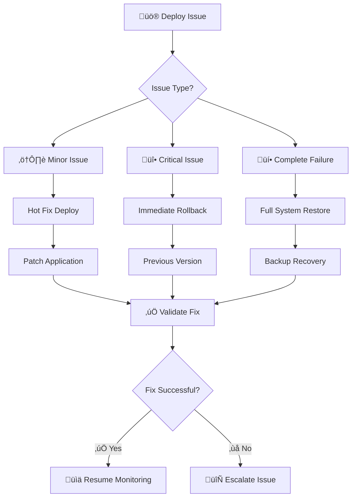

# ESTRATÉGIAS DE DEPLOYMENT - KBNT Kafka Logs

## Visão Geral das Estratégias Implementadas

Este documento apresenta todas as estratégias de deployment implementadas no projeto KBNT Kafka Logs, desde desenvolvimento local até produção enterprise com alta disponibilidade.

---

## Fluxograma Completo de Deployment


```mermaid
flowchart TD
    A[Inicio Deploy] --> B{Escolha Estrategia}
    
    %% Desenvolvimento Local
    B --> C[Desenvolvimento Local]
    C --> C1[docker-compose.yml]
    C1 --> C2[Servicos Basicos<br/>- PostgreSQL<br/>- Kafka Single<br/>- Microservicos]
    C2 --> C3[Ambiente Dev Pronto]
    
    %% Teste Integrado
    B --> D[Teste Integrado]
    D --> D1[docker-compose.free-tier.yml]
    D1 --> D2[Recursos Limitados<br/>- 1 CPU por servico<br/>- 512MB RAM<br/>- Single instances]
    D2 --> D3[Testes Executados]
    
    %% Infraestrutura B√°sica
    B --> E[Infraestrutura Basica]
    E --> E1[docker-compose.infrastructure-only.yml]
    E1 --> E2[Core Services<br/>- PostgreSQL<br/>- Kafka<br/>- Elasticsearch<br/>- ZooKeeper]
    E2 --> E3[Base Infraestrutura]
    
    %% Escalabilidade Simples
    B --> F[Escalavel Simples]
    F --> F1[docker-compose.scalable-simple.yml]
    F1 --> F2[Multiplas Instancias<br/>- 2x Virtual Stock<br/>- Kafka Cluster<br/>- Monitoring Basico]
    F2 --> F3[Sistema Escalavel]
    
    %% Enterprise Full
    B --> G[Enterprise Full]
    G --> G1[docker-compose.scalable.yml]
    G1 --> G2[36 Containers<br/>- HA Completa<br/>- Load Balancing<br/>- Monitoring Avancado]
    G2 --> G3[Producao Enterprise]
    
    %% Microserviços Específicos
    B --> H[Microservicos Especificos]
    H --> H1[docker-compose-microservices.yml]
    H1 --> H2[Apenas Aplicacoes<br/>- API Gateway<br/>- Virtual Stock<br/>- Producers/Consumers]
    H2 --> H3[Apps Deployadas]
    
    %% Verificações Pós-Deploy
    C3 --> I[Health Checks]
    D3 --> I
    E3 --> I
    F3 --> I
    G3 --> I
    H3 --> I
    
    I --> J{Todos Healthy?}
    J -->|Sim| K[Deploy Sucesso]
    J -->|Nao| L[Diagnostico]
    L --> M[Logs Analysis]
    M --> N[Fix Issues]
    N --> B
    
    K --> O[Monitoramento Continuo]
    O --> P[Grafana Dashboard<br/>Prometheus Metrics<br/>Health Endpoints]
```

---

## Matriz de Estratégias de Deployment


```mermaid
graph TB
    subgraph "DESENVOLVIMENTO"
        A1[Local Development<br/>docker-compose.yml<br/>- 1 instancia cada<br/>- Recursos minimos<br/>- Debug habilitado]
        A2[Integration Test<br/>docker-compose.free-tier.yml<br/>- Recursos limitados<br/>- Testes automatizados<br/>- CI/CD ready]
    end
    
    subgraph "STAGING"
        B1[Infrastructure Only<br/>docker-compose.infrastructure-only.yml<br/>- Core services<br/>- DB + Messaging<br/>- Base para testes]
        B2[Microservices Only<br/>docker-compose-microservices.yml<br/>- Apenas aplicacoes<br/>- Infra externa<br/>- Deploys independentes]
    end
    
    subgraph "PRODUCAO"
        C1[Scalable Simple<br/>docker-compose.scalable-simple.yml<br/>- 2-3 instancias<br/>- Load balancing<br/>- Monitoring basico]
        C2[Enterprise Full<br/>docker-compose.scalable.yml<br/>- 36+ containers<br/>- HA completa<br/>- Monitoring avancado]
    end
    
    A1 --> A2
    A2 --> B1
    B1 --> B2
    B2 --> C1
    C1 --> C2
    
    style A1 fill:#e1f5fe
    style A2 fill:#e8f5e8
    style B1 fill:#fff3e0
    style B2 fill:#fce4ec
    style C1 fill:#e3f2fd
    style C2 fill:#f3e5f5
```

---

## Fluxo de CI/CD Implementado


```mermaid
sequenceDiagram
    participant Dev as Developer
    participant Git as GitHub
    participant CI as CI/CD
    participant Test as Test Env
    participant Staging as Staging
    participant Prod as Production
    
    Dev->>Git: git push origin feature/xxx
    Git->>CI: Trigger Pipeline
    
    CI->>CI: Build Images
    note over CI: docker build --target production
    
    CI->>CI: Unit Tests
    note over CI: mvn test
    
    CI->>Test: Deploy Test
    note over Test: docker-compose.free-tier.yml
    
    Test->>CI: Test Results
    
    CI->>Git: Merge to develop
    Git->>CI: Trigger Staging Deploy
    
    CI->>Staging: Deploy Staging
    note over Staging: docker-compose.scalable-simple.yml
    
    Staging->>CI: Integration Tests
    
    Dev->>Git: Create Release Tag
    Git->>CI: Trigger Production Deploy
    
    CI->>Prod: Deploy Production
    note over Prod: docker-compose.scalable.yml
    
    Prod->>CI: Health Checks
    CI->>Dev: Deploy Success
```

---

## Arquitetura de Deployment por Ambiente

### Desenvolvimento Local

```mermaid
graph LR
    subgraph "Local Machine"
        A[API Gateway :8080] --> B[Virtual Stock :8081]
        B --> C[PostgreSQL :5432]
        B --> D[Kafka :9092]
        E[Log Producer] --> D
        F[Log Consumer] --> D
        D --> G[ZooKeeper :2181]
    end
    
    style A fill:#e1f5fe
    style B fill:#e1f5fe
    style C fill:#e8f5e8
    style D fill:#fff3e0
    style E fill:#fce4ec
    style F fill:#fce4ec
    style G fill:#f3e5f5
```

### Producao Escalavel

```mermaid
graph TB
    subgraph "Load Balancer"
        LB[HAProxy :80]
    end
    
    subgraph "API Layer"
        A1[API Gateway-1 :8080]
        A2[API Gateway-2 :8081]
    end
    
    subgraph "Business Layer"
        B1[Virtual Stock-1]
        B2[Virtual Stock-2]
        B3[Virtual Stock-3]
    end
    
    subgraph "Messaging Layer"
        C1[Kafka-1 :9092]
        C2[Kafka-2 :9093]
        C3[Kafka-3 :9094]
    end
    
    subgraph "Data Layer"
        D1[PostgreSQL Master]
        D2[PostgreSQL Replica]
        E1[Elasticsearch-1]
        E2[Elasticsearch-2]
        F1[Redis Cluster]
    end
    
    subgraph "Monitoring"
        G1[Prometheus :9090]
        G2[Grafana :3000]
    end
    
    LB --> A1
    LB --> A2
    A1 --> B1
    A1 --> B2
    A2 --> B2
    A2 --> B3
    B1 --> C1
    B2 --> C2
    B3 --> C3
    C1 --> D1
    C2 --> D2
    C3 --> E1
    E1 --> E2
    B1 --> F1
    B2 --> F1
    B3 --> F1
    
    G1 --> A1
    G1 --> A2
    G1 --> B1
    G1 --> B2
    G1 --> B3
    G2 --> G1
```

---

## Scripts de Deployment

### Deploy Automatizado

```mermaid
flowchart LR
    A[Start Deploy] --> B{Environment?}
    
    B --> C[DEV]
    C --> C1[setup-dev.ps1]
    C1 --> C2[docker-compose.yml up]
    
    B --> D[TEST]
    D --> D1[setup-test.ps1]
    D1 --> D2[docker-compose.free-tier.yml up]
    
    B --> E[STAGING]
    E --> E1[setup-staging.ps1]
    E1 --> E2[docker-compose.scalable-simple.yml up]
    
    B --> F[PROD]
    F --> F1[setup-production.ps1]
    F1 --> F2[docker-compose.scalable.yml up]
    
    C2 --> G[Health Check]
    D2 --> G
    E2 --> G
    F2 --> G
    
    G --> H{All Healthy?}
    H -->|Yes| I[Start Monitoring]
    H -->|No| J[Rollback]
    
    I --> K[Deploy Success]
    J --> L[Investigate]
```

---

## Comparativo de Recursos por Estratégia

| Estratégia | Containers | CPU | RAM | Disk | HA | Monitoring | Load Balancer |
|------------|-----------|-----|-----|------|----|-----------| -------------|
| **Local Dev** | 6 | 2 cores | 2GB | 10GB | No | Basic | No |
| **Free Tier** | 8 | 4 cores | 3GB | 15GB | No | Basic | No |
| **Infrastructure** | 4 | 2 cores | 2GB | 20GB | No | No | No |
| **Microservices** | 5 | 3 cores | 2.5GB | 5GB | No | Basic | No |
| **Scalable Simple** | 15 | 8 cores | 6GB | 30GB | Yes | Full | Yes |
| **Enterprise Full** | 36+ | 16+ cores | 12GB+ | 50GB+ | Yes | Advanced | Yes |

---

## Comandos de Deployment

### Desenvolvimento Local
```bash
# Desenvolvimento b√°sico
docker-compose up -d

# Com rebuild
docker-compose up -d --build
```

### Teste e Validação
```bash
# Ambiente de teste
docker-compose -f docker-compose.free-tier.yml up -d

# Testes automatizados
docker-compose -f docker-compose.free-tier.yml exec api-gateway curl http://localhost:8080/actuator/health
```

### Produção Escalável
```bash
# Deploy simples escal√°vel
docker-compose -f docker-compose.scalable-simple.yml up -d

# Deploy enterprise completo
docker-compose -f docker-compose.scalable.yml up -d

# Scaling horizontal
docker-compose -f docker-compose.scalable-simple.yml up --scale virtual-stock-service=4 -d
```

### üîç Monitoramento e Health Checks
```bash
# Verificar status
docker-compose ps

# Logs em tempo real
docker-compose logs -f

# Health check específico
curl http://localhost:8080/actuator/health
curl http://localhost:9090/metrics # Prometheus
```

---

## üìã Checklist de Deployment

### ✅ Pré-Deployment
- [ ] Código testado e validado
- [ ] Imagens Docker buildadas
- [ ] Configurações de ambiente validadas
- [ ] Recursos de infraestrutura disponíveis
- [ ] Backups realizados (produção)

### ‚úÖ Durante Deployment
- [ ] Containers inicializando corretamente
- [ ] Health checks passando
- [ ] Conectividade entre serviços
- [ ] Logs sem erros críticos
- [ ] Métricas sendo coletadas

### ✅ Pós-Deployment
- [ ] Testes de integração executados
- [ ] Performance dentro do esperado
- [ ] Monitoramento ativo
- [ ] Alertas configurados
- [ ] Documentação atualizada

---

## 🔄 Rollback Strategies


```mermaid
flowchart TD
    A[üö® Deploy Issue] --> B{Issue Type?}
    
    B --> C[⚠️ Minor Issue]
    C --> C1[Hot Fix Deploy]
    C1 --> C2[Patch Application]
    
    B --> D[üî• Critical Issue]
    D --> D1[Immediate Rollback]
    D1 --> D2[Previous Version]
    
    B --> E[üí• Complete Failure]
    E --> E1[Full System Restore]
    E1 --> E2[Backup Recovery]
    
    C2 --> F[‚úÖ Validate Fix]
    D2 --> F
    E2 --> F
    
    F --> G{Fix Successful?}
    G -->|‚úÖ Yes| H[üìä Resume Monitoring]
    G -->|❌ No| I[🔄 Escalate Issue]
```

---

## üìû Contatos e Suporte

### 🛠️ Suporte Técnico
- **Desenvolvedor Principal:** Italo Costa
- **Repository:** [estudosKBNT_Kafka_Logs](https://github.com/italo-costa/estudosKBNT_Kafka_Logs)
- **Issues:** GitHub Issues para reportar problemas
- **Documentação:** README.md e arquivos MD específicos

### Monitoring URLs
- **Grafana:** http://localhost:3000 (admin/admin)
- **Prometheus:** http://localhost:9090
- **API Gateway:** http://localhost:8080/actuator/health
- **Elasticsearch:** http://localhost:9200/_cluster/health

---

*Última atualização: Setembro 2025*
*Vers√£o: 2.0.0*
