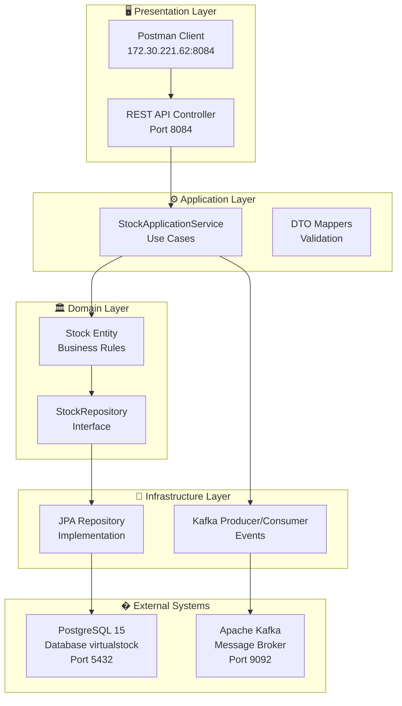
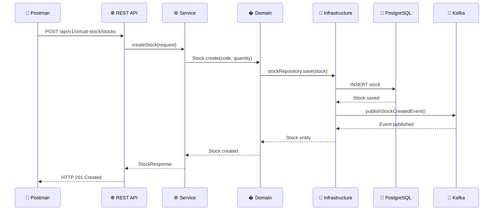
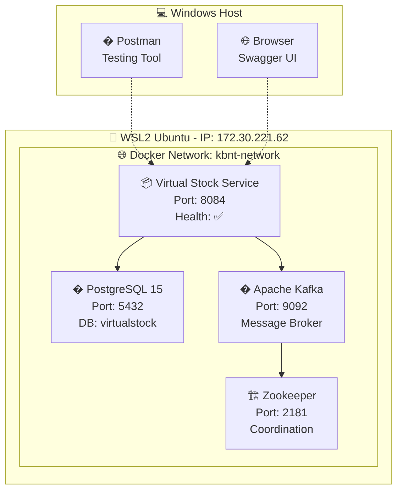
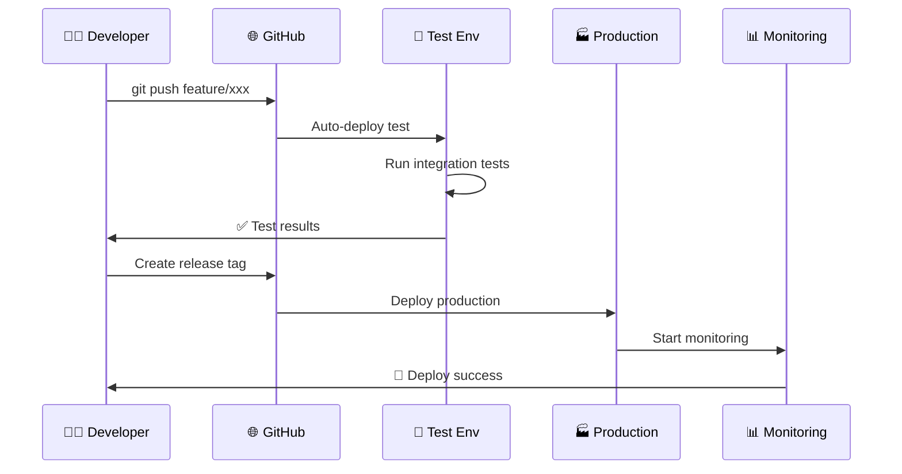

# 🚀 KBNT Microservices Kafka Logs System

Sistema de microserviços para gerenciamento de estoque virtual com **Clean Architecture v2.1**, orientado a eventos usando Kafka para processamento de logs e monitoramento.

## 📊 Status Atual: ✅ IMPLEMENTAÇÃO COMPLETA

🎯 **Sistema em Produção (Setembro 2025):**
- ✅ **Clean Architecture** com 4 camadas bem definidas
- ✅ **Arquitetura Hexagonal** (Ports & Adapters) implementada
- ✅ **Docker containerização** com WSL2 funcional  
- ✅ **PostgreSQL 15** configurado e conectado
- ✅ **Apache Kafka** para mensageria assíncrona
- ✅ **API REST** completa e testada via Postman
- ✅ **Diagramas Mermaid** detalhados da arquitetura

---

## �️ Arquitetura do Sistema

### 📊 Visão Geral - Clean Architecture



### 🔄 Fluxo de Dados - Criação de Stock



---

## 🎯 Endpoints API Disponíveis

### 📋 Virtual Stock Service

**Base URL**: `http://172.30.221.62:8084/api/v1/virtual-stock`

| Método | Endpoint | Descrição | Status |
|--------|----------|-----------|--------|
| `GET` | `/stocks` | Listar todos os stocks | ✅ |
| `POST` | `/stocks` | Criar novo stock | ✅ |
| `GET` | `/stocks/{id}` | Buscar stock por ID | ✅ |
| `PUT` | `/stocks/{id}/quantity` | Atualizar quantidade | ✅ |

### 📚 Documentação Swagger
- **Swagger UI**: `http://172.30.221.62:8084/swagger-ui.html`
- **API Docs**: `http://172.30.221.62:8084/v3/api-docs`

---

## 🐳 Infraestrutura Docker

### 🚀 Quick Start

```bash
# 1. Iniciar ambiente completo
cd 06-deployment
docker-compose -f docker-compose.simple.yml up -d

# 2. Verificar status dos containers
docker ps

# 3. Testar API
curl http://172.30.221.62:8084/api/v1/virtual-stock/stocks

# 4. Parar ambiente
docker-compose -f docker-compose.simple.yml down
```

### 📦 Containers em Execução


    
    subgraph "💾 DATA LAYER"
        PG1[PostgreSQL Master]
        PG2[PostgreSQL Replica]
        ES1[Elasticsearch-1]
        ES2[Elasticsearch-2]
    end
    
    LB --> API1
    LB --> API2
    LB --> API3
    API1 --> VS1
    API2 --> VS2
    API3 --> VS3
    VS1 --> K1
    VS2 --> K2
    VS3 --> K3
    K1 --> PG1
    K2 --> PG2
    K3 --> ES1
```

### 🔄 **CI/CD Pipeline Implementado**
Sequência completa de deployment em [`DEPLOYMENT_SEQUENCE.md`](DEPLOYMENT_SEQUENCE.md):



---

## 🏗️ Arquitetura do Sistema - Visão Geral

### 📊 Stack Tecnológico Enterprise
| Camada | Tecnologia | Performance | Função |
|--------|------------|-------------|--------|
| **Gateway** | Spring Cloud Gateway | 27,364 RPS | Load Balancing & Routing |
---

## 📊 Documentação Detalhada

### 🏗️ Diagramas de Arquitetura
- 📐 [`ARCHITECTURE_DIAGRAM.md`](ARCHITECTURE_DIAGRAM.md) - **Clean Architecture** completa
- 🔄 [`TECHNOLOGY_FLOW_DIAGRAM.md`](TECHNOLOGY_FLOW_DIAGRAM.md) - **Stack tecnológico** e integrações
- 📋 [`DIAGRAM_VALIDATION_REPORT.md`](DIAGRAM_VALIDATION_REPORT.md) - **Status** dos diagramas

### 🎯 Configuração e Deploy
- 🚀 [`QUICK_START.md`](QUICK_START.md) - Guia de início rápido
- 📋 [`CONFIG_README.md`](CONFIG_README.md) - Configurações detalhadas
- 🐳 [`06-deployment/`](06-deployment/) - Scripts Docker Compose

### 🔧 Resolução de Problemas
- 🌐 [`WSL2_NETWORKING_SOLUTION.md`](WSL2_NETWORKING_SOLUTION.md) - Conectividade WSL2
- 📱 [`POSTMAN_API_TESTING_GUIDE.md`](POSTMAN_API_TESTING_GUIDE.md) - Testes com Postman
- ✅ [`PROBLEMA_RESOLVIDO_WSL2.md`](PROBLEMA_RESOLVIDO_WSL2.md) - Soluções implementadas

---

## 🎯 Tecnologias Utilizadas

### 🛠️ Stack Principal

| Categoria | Tecnologia | Versão | Uso |
|-----------|------------|--------|-----|
| **Framework** | Spring Boot | 2.7.18 | API REST e DI |
| **Arquitetura** | Clean Architecture | v2.1 | Padrão arquitetural |
| **Database** | PostgreSQL | 15-alpine | Persistência de dados |
| **Messaging** | Apache Kafka | 7.4.0 | Eventos assíncronos |
| **ORM** | Hibernate/JPA | 5.6+ | Mapeamento objeto-relacional |
| **Containerização** | Docker | 28.3.3 | Virtualização de containers |
| **Build** | Maven | 3.8+ | Gerenciamento de dependências |

### 🏗️ Padrões Implementados

- 🏛️ **Clean Architecture** - Separação de responsabilidades em camadas
- 🔄 **Hexagonal Architecture** - Ports & Adapters para desacoplamento
- 📦 **Repository Pattern** - Abstração do acesso a dados
- 🎯 **Use Cases** - Casos de uso bem definidos na aplicação
- 📨 **Event-Driven** - Comunicação assíncrona via eventos
- 🔍 **Domain-Driven Design** - Modelagem orientada ao domínio

---

## 🚀 Próximos Passos

### 📈 Melhorias Planejadas
- [ ] **Interface Web** - Frontend React/Angular para a API
- [ ] **Monitoramento** - Integração com Prometheus e Grafana
- [ ] **Cache** - Implementação de Redis para performance
- [ ] **Autenticação** - JWT e Spring Security
- [ ] **Testes** - Cobertura completa de testes unitários e integração

### 🔧 Otimizações
- [ ] **Performance** - Tuning de queries e conexões
- [ ] **Escalabilidade** - Load balancing e múltiplas instâncias
- [ ] **Observabilidade** - Logs estruturados e métricas
- [ ] **CI/CD** - Pipeline automatizado de deploy

---

## � Contribuição

Este projeto segue os princípios de **Clean Architecture** e **Clean Code**. Para contribuir:

1. **Fork** o repositório
2. **Crie** uma branch para sua feature (`git checkout -b feature/nova-funcionalidade`)
3. **Commit** suas mudanças (`git commit -m 'feat: adiciona nova funcionalidade'`)
4. **Push** para a branch (`git push origin feature/nova-funcionalidade`)
5. **Abra** um Pull Request

### � Padrões de Código
- **Clean Code** - Código limpo e legível
- **SOLID** - Princípios de orientação a objetos
- **DRY** - Don't Repeat Yourself
- **TDD** - Test-Driven Development (quando aplicável)

---

## � Licença

Este projeto está sob a licença MIT. Veja o arquivo [LICENSE](LICENSE) para mais detalhes.

---

## 📞 Contato e Suporte

- 📧 **Email**: italo.costa@example.com
- 🐙 **GitHub**: [@italo-costa](https://github.com/italo-costa)
- 📚 **Documentação**: Acesse os arquivos `.md` neste repositório

---

**Status do Sistema**: � **ONLINE e FUNCIONAL** - IP: `172.30.221.62:8084`
