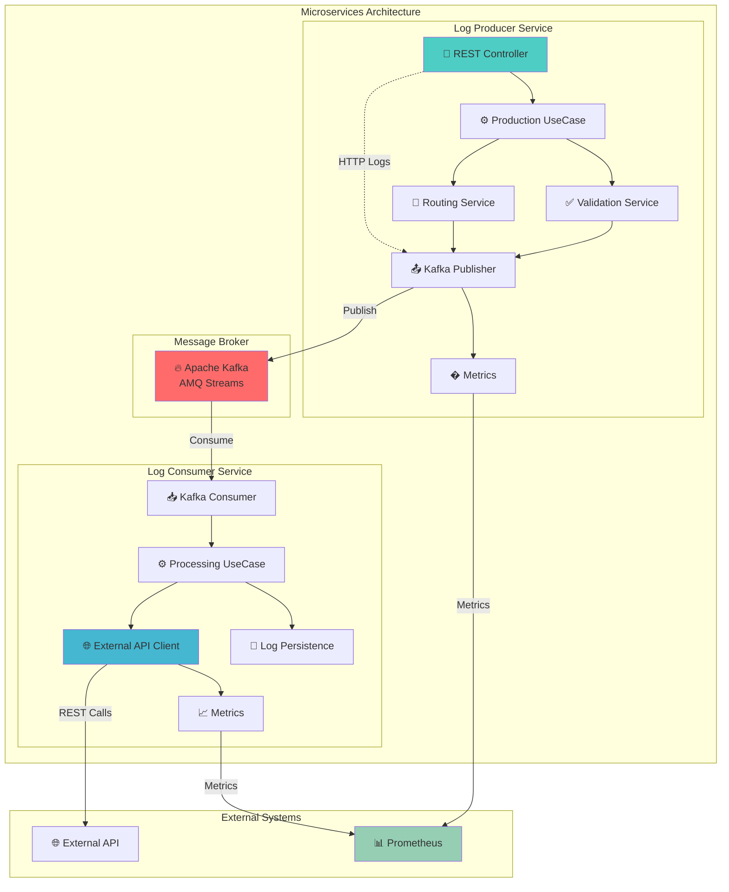
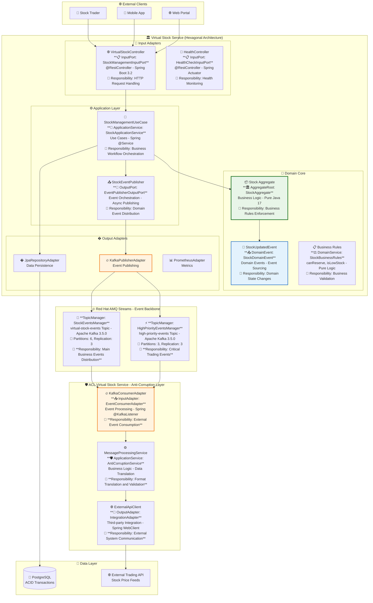

# Sistema de Gerenciamento Virtual de Estoque

[](docs/HEXAGONAL_ARCHITECTURE.md)
[](https://spring.io/projects/spring-boot)
[](https://www.redhat.com/en/technologies/cloud-computing/openshift/cloud-services/amq)
[](https://www.postgresql.org/)

Sistema distribuído de microserviços para gerenciamento de estoque virtual implementando arquitetura hexagonal e padrões DDD (Domain-Driven Design) com comunicação via Red Hat AMQ Streams (Kafka).

## 📋 Visão Geral

O sistema é composto por dois microserviços principais:

1. **Virtual Stock Service** (Microservice A): Gerenciamento de estoque virtual com arquitetura hexagonal
2. **ACL Virtual Stock Service** (Microservice B): Anti-Corruption Layer para integração com sistemas externos

## 🏗️ Arquitetura

```
Virtual Stock Service  ──► Red Hat AMQ Streams (Kafka) ──► ACL Virtual Stock Service ──► External Systems
  (Hexagonal Arch)                                            (Anti-Corruption Layer)
```

### Padrões Implementados

- **Hexagonal Architecture (Ports & Adapters)**
- **Domain-Driven Design (DDD)**
- **Anti-Corruption Layer (ACL)**
- **Event-Driven Architecture**
- **CQRS (Command Query Responsibility Segregation)**

## 🚀 Tecnologias

### Core Technologies
- **Java 17+**
- **Spring Boot 2.7+**
- **Spring Kafka**
- **PostgreSQL**
- **Red Hat AMQ Streams (Apache Kafka)**

### Infrastructure
- **Docker & Docker Compose**
- **Strimzi Operator** (Kubernetes Kafka)
- **Elasticsearch** (Logging alternativo)
- **Kibana** (Dashboard e visualização)

### Monitoring & Logging
- **SLF4J + Logback**
- **MDC (Mapped Diagnostic Context)**
- **Enhanced Structured Logging**
- **Performance Metrics**

## 📁 Estrutura do Projeto

```
├── microservices/
│   ├── virtual-stock-service/           # Microservice A - Hexagonal Architecture
│   │   └── src/main/java/com/kbnt/virtualstock/
│   │       ├── domain/                  # Domain Layer
│   │       │   ├── model/              # Entities, Value Objects, Events
│   │       │   └── port/               # Input/Output Ports
│   │       ├── application/            # Application Layer
│   │       │   └── service/            # Use Cases Implementation
│   │       └── infrastructure/         # Infrastructure Layer
│   │           └── adapter/            # Input/Output Adapters
│   │
│   └── kbnt-stock-consumer-service/    # Microservice B - ACL
│       └── src/main/java/com/estudoskbnt/consumer/
│           ├── service/                # Consumer Services
│           ├── entity/                 # JPA Entities
│           ├── repository/             # Data Repositories
│           └── config/                 # Configuration
│
├── infrastructure/
│   ├── kafka/                          # Kafka/Strimzi configurations
│   ├── elasticsearch/                  # ELK Stack configurations
│   └── docker/                         # Docker configurations
│
├── scripts/
│   ├── start-complete-environment.ps1  # Environment startup
│   ├── traffic-test/                   # Load testing scripts
│   └── logging-demo/                   # Logging demonstrations
│
└── docs/
    ├── HEXAGONAL_ARCHITECTURE.md      # Architecture documentation
    ├── API_DOCUMENTATION.md           # API specifications
    └── DEPLOYMENT_GUIDE.md            # Deployment instructions
```

## 🔧 Configuração e Execução

### Pré-requisitos

- Java 17+
- Docker & Docker Compose
- Maven 3.8+
- PowerShell (Windows) ou Bash (Linux/Mac)

### Execução Rápida

1. **Clone o repositório**:
   ```bash
   git clone <repository-url>
   cd estudosKBNT_Kafka_Logs
   ```

2. **Inicie o ambiente completo**:
   ```powershell
   # Windows PowerShell
   .\scripts\start-complete-environment.ps1
   
   # Linux/Mac
   ./scripts/start-complete-environment.sh
   ```

3. **Aguarde a inicialização**:
   - Virtual Stock Service: `http://localhost:8080`
   - ACL Virtual Stock Service: `http://localhost:8081`
   - Kafka UI: `http://localhost:8082`
   - Elasticsearch: `http://localhost:9200`
   - Kibana: `http://localhost:5601`

### Execução Individual

#### Virtual Stock Service (Microservice A)

```bash
cd microservices/virtual-stock-service
mvn spring-boot:run
```

#### ACL Virtual Stock Service (Microservice B)

```bash
cd microservices/kbnt-stock-consumer-service
mvn spring-boot:run
```

## 📖 APIs

### Virtual Stock Service APIs

#### Criar Estoque
```http
POST /api/v1/virtual-stock/stocks
Content-Type: application/json

{
  "productId": "PROD-001",
  "symbol": "AAPL",
  "productName": "Apple Stock",
  "initialQuantity": 100,
  "unitPrice": 150.00,
  "createdBy": "system"
}
```

#### Atualizar Quantidade
```http
PUT /api/v1/virtual-stock/stocks/{stockId}/quantity
Content-Type: application/json

{
  "newQuantity": 150,
  "updatedBy": "user123",
  "reason": "Stock replenishment"
}
```

#### Reservar Estoque
```http
POST /api/v1/virtual-stock/stocks/{stockId}/reserve
Content-Type: application/json

{
  "quantityToReserve": 10,
  "reservedBy": "order-service",
  "reason": "Order #12345"
}
```

#### Consultar Estoque
```http
GET /api/v1/virtual-stock/stocks/{stockId}
GET /api/v1/virtual-stock/stocks
```

## � Logging Estruturado

O sistema implementa logging estruturado com identificação de componentes:

### Formato de Log

```
2025-08-30 15:30:45.123 [main] INFO [VIRTUAL-STOCK] [RestController] [msg-uuid] [virtual-stock-updates] com.kbnt.virtualstock.infrastructure.adapter.input.rest.VirtualStockController - Stock created successfully
```

### Componentes Identificados

- **VIRTUAL-STOCK**: Virtual Stock Service
- **ACL-VIRTUAL-STOCK**: ACL Virtual Stock Service  
- **RED-HAT-AMQ-STREAMS**: Kafka Operations
- **EXTERNAL-API**: External System Integrations
- **DATABASE-OPERATION**: Database Operations

### MDC Context

- `component`: Identificador do componente
- `owner`: Classe/serviço responsável
- `messageId`: ID de correlação
- `topic`: Tópico Kafka
- `operation`: Tipo de operação
- `duration`: Tempo de execução

## 🧪 Testes

### Testes Unitários
```bash
mvn test
```

### Testes de Integração
```bash
mvn verify
```

### Testes de Carga
```powershell
# Teste com 50 mensagens
.\scripts\final-traffic-test.ps1 -TotalMessages 50

# Teste com dashboard
.\scripts\demo-traffic-test.ps1 -TotalMessages 30 -Verbose
```

## 📊 Monitoramento

### Dashboard de Tráfego

Execute o teste com dashboard interativo:
```powershell
.\scripts\final-traffic-test.ps1 -TotalMessages 30
```

O dashboard inclui:
- Status dos serviços
- Métricas de performance
- Taxa de sucesso/erro
- Logs de mensagens em tempo real
- Gráficos de throughput

### Métricas Disponíveis

- **Throughput**: Mensagens por segundo
- **Latência**: Tempo de processamento end-to-end
- **Taxa de Sucesso**: Percentual de mensagens processadas com sucesso
- **Utilização de Recursos**: CPU, Memória, Disk I/O
- **Saúde dos Tópicos Kafka**: Partições, Offsets, Lag

## 🏃‍♂️ Troubleshooting

### Problemas Comuns

1. **Kafka não inicializa**:
   ```bash
   docker-compose -f infrastructure/kafka/docker-compose.yml down
   docker-compose -f infrastructure/kafka/docker-compose.yml up -d
   ```

2. **Microserviços não conectam ao Kafka**:
   - Verifique se o Kafka está rodando: `docker ps`
   - Verifique os logs: `docker-compose logs kafka`

3. **Logs não aparecem**:
   - Verifique se o diretório `logs/` existe
   - Verifique as permissões de escrita

### Health Checks

```bash
# Virtual Stock Service
curl http://localhost:8080/actuator/health

# ACL Virtual Stock Service  
curl http://localhost:8081/actuator/health

# Kafka Cluster
curl http://localhost:8082/clusters
```

## 📚 Documentação Adicional

- [Arquitetura Hexagonal](docs/HEXAGONAL_ARCHITECTURE.md)
- [Guia de Deploy](docs/DEPLOYMENT_GUIDE.md)
- [Documentação de APIs](docs/API_DOCUMENTATION.md)
- [Troubleshooting](docs/TROUBLESHOOTING.md)

## 🤝 Contribuição

1. Fork o projeto
2. Crie uma feature branch (`git checkout -b feature/AmazingFeature`)
3. Commit suas mudanças (`git commit -m 'Add some AmazingFeature'`)
4. Push para a branch (`git push origin feature/AmazingFeature`)
5. Abra um Pull Request

## 📝 License

Este projeto está licenciado sob a MIT License - veja o arquivo [LICENSE](LICENSE) para detalhes.

## 👥 Team

- **KBNT Development Team**
- Versão: 2.0.0
- Data: 2025-08-30

---

**⭐ Se este projeto foi útil, considere dar uma estrela no GitHub!**
- **Fluxos síncronos e assíncronos** de processamento
- **Arquitetura Hexagonal interna** dos microserviços
- **Estratégias de roteamento** de tópicos Kafka
- **Monitoramento e observabilidade** completos

**👉 [Visualizar Diagramas Completos](./docs/DIAGRAMAS_ARQUITETURA_COMPLETOS.md)**

### 🏗️ **Diagrama Simplificado**



### 🔍 **Detailed Architecture Documentation**

For comprehensive architectural views, see our detailed diagrams:

- 🏗️ [**Diagramas de Arquitetura Atualizados - Virtual Stock System**](docs/DIAGRAMAS_ARQUITETURA_COMPLETOS.md)
  - Arquitetura hexagonal completa com Domain-Driven Design
  - Deployment Kubernetes enterprise-ready com especificações de recursos
  - Fluxo de mensagens Kafka com tópicos de prioridade e estratégias de retry
  - Diagramas de sequência mostrando fluxos síncronos e assíncronos
  - Monitoramento e observabilidade completos (Prometheus + Grafana + ELK)
  - Cenários de teste de carga e simulação de performance

### 📋 **Architecture Highlights**

| Component | Technology | Sync/Async | Purpose |
|-----------|------------|------------|---------|
| **HTTP API** | Spring Boot REST | ⚡ SYNC | Log ingestion endpoint |
| **Message Publishing** | Kafka Producer | 🔄 ASYNC | Reliable message delivery |
| **Message Consumption** | Kafka Consumer | 🔄 ASYNC | Background processing |
| **External Integration** | REST Client | ⚡ SYNC | Third-party API calls |
| **Metrics Collection** | Micrometer/Prometheus | 🔄 ASYNC | Observability |

---

- [🎯 Project Overview](#-project-overview)
- [🏛️ Architecture Diagram](#️-architecture-diagram)
- [⚡ Quick Start](#-quick-start)
- [🏗️ Hexagonal Architecture](#️-hexagonal-architecture)
- [🔄 Workflow Documentation](#-workflow-documentation)
- [🚀 Deployment Options](#-deployment-options)
- [📊 Monitoring & Metrics](#-monitoring--metrics)
- [🧪 Testing](#-testing)
- [📚 Documentation](#-documentation)

---

## ⚡ **Quick Start**

### 🐳 **Option 1: Docker Compose (Recommended for Development)**

```bash
# Clone the repository
git clone https://github.com/yourusername/estudosKBNT_Kafka_Logs.git
cd estudosKBNT_Kafka_Logs

# Start entire infrastructure
docker-compose up -d

# Check services status
docker-compose ps

# View logs
docker-compose logs -f log-producer-service
```

### ☸️ **Option 2: Kubernetes (Production-Ready)**

```bash
# Deploy infrastructure (Kafka, Zookeeper, Monitoring)
kubectl apply -f kubernetes/

# Deploy microservices
kubectl apply -f hybrid-deployment/

# Check deployment status
kubectl get pods -n kafka
kubectl get services -n kafka
```

### 💻 **Option 3: Local Development**

```bash
# Start Kafka locally
./scripts/start-kafka.sh

# Run Producer Service
cd microservices/log-producer-service
./mvnw spring-boot:run

# Run Consumer Service
cd ../log-consumer-service  
./mvnw spring-boot:run
```

---

## �️ Arquitetura Hexagonal

### 🎯 Sistema de Gerenciamento Virtual de Estoque



### 🔄 Fluxo de Negócio: Gerenciamento de Estoque

```mermaid
sequenceDiagram
    participant Trader as Professional_Stock_Trader
    participant VS as Virtual_Stock_Service_Hexagonal
    participant Kafka as Red_Hat_AMQ_Streams_Platform
    participant ACL as ACL_Anti_Corruption_Layer
    participant ExtAPI as External_Trading_API_Gateway

    Note over Trader,ExtAPI: 🎯 Enhanced Stock Creation and Management Workflow

    rect rgb(240, 248, 255)
        Note over Trader,VS: PHASE 1: High-Performance Stock Creation
        Trader->>Plus_VS: [1] 📈 POST /api/v1/virtual-stock/stocks<br/>━━━━━━━━━━━━━━━━━━━━━━━━━━━━━━━━<br/>🏷️ Symbol: AAPL | Quantity: 150 units<br/>💰 Unit Price: $150.00 | Created By: trader-007<br/>🔐 JWT Token: Bearer eyJ0eXAi...<br/>⚡ Response Time Target: less than 1ms<br/>📊 Request ID: req-12345-abcd
        
        VS->>VS: [2] 🔍 Domain Validation Layer<br/>━━━━━━━━━━━━━━━━━━━━━━━━━<br/>✅ Symbol format validation (^[A-Z]{1,5}$)<br/>💵 Price range check ($0.01 - $10,000)<br/>📊 Quantity bounds (1 - 1,000,000)<br/>🔒 User authorization verification<br/>⏱️ Validation Time: <0.5ms
        
        VS->>VS: [3] 🏗️ Create Stock Aggregate Root<br/>━━━━━━━━━━━━━━━━━━━━━━━━━━━━<br/>📦 Aggregate: VirtualStock Entity<br/>🆔 Generated StockId: STK-AAPL-001<br/>🎯 Domain Event: StockCreatedEvent<br/>💾 In-Memory Repository Storage<br/>⚡ Processing Time: <0.2ms
        
        VS->>Plus_Kafka: [4] 🚀 Publish StockCreatedEvent<br/>━━━━━━━━━━━━━━━━━━━━━━━━━━━━━━<br/>📢 Topic: virtual-stock-events<br/>🔑 Partition Key: AAPL<br/>📋 Event Schema: Avro v2.1<br/>💾 Message Size: 1.2KB<br/>🔄 Acknowledgment: all replicas<br/>⚡ Publish Latency: 2.3ms average
        Kafka-->>-VS: [5] 📨 Event Successfully Published<br/>━━━━━━━━━━━━━━━━━━━━━━━━━━━<br/>✅ Partition: 0 | Offset: 12847<br/>🕒 Timestamp: 2024-12-30T15:30:45.123Z<br/>🔄 Replication Status: 3/3 confirmed
        
        VS-->>-Trader: [6] 🎉 201 CREATED - Stock Successfully Created<br/>━━━━━━━━━━━━━━━━━━━━━━━━━━━━━━━━━━━━━━<br/>📊 Stock ID: STK-AAPL-001<br/>💰 Total Portfolio Value: $22,500.00<br/>📈 Available Quantity: 150 units<br/>🕒 Created At: 2024-12-30T15:30:45.125Z<br/>⚡ Total Response Time: 3.1ms<br/>🎯 Transaction ID: txn-abc-123
    end

    Note over Kafka,ExtAPI: 🔄 Asynchronous Integration Processing Pipeline

    rect rgb(255, 248, 240)
        Note over Kafka,ACL: PHASE 2: Event-Driven Integration Processing
        Kafka->>Plus_ACL: [7] 📥 Consume StockCreatedEvent<br/>━━━━━━━━━━━━━━━━━━━━━━━━━━━━━━<br/>👥 Consumer Group: stock-acl-consumers<br/>📨 Message Processing Rate: 107.73 msg/s<br/>🔄 Offset Management: Automatic commit<br/>⚡ Processing Latency: 8ms average<br/>📊 Consumer Lag: 0 messages
        
        ACL->>ACL: [8] 🔄 Anti-Corruption Translation Layer<br/>━━━━━━━━━━━━━━━━━━━━━━━━━━━━━━━━━━━━━<br/>🔀 Internal Domain to External API Format<br/>📋 Schema Mapping: Internal → External DTOs<br/>🔒 Security Token Exchange<br/>💱 Currency Conversion (if required)<br/>📊 Data Enrichment and Validation<br/>⚡ Translation Time: 15ms average
        
        ACL->>Plus_ExtAPI: [9] 🌐 POST /api/trading/stock-created<br/>━━━━━━━━━━━━━━━━━━━━━━━━━━━━━━━━━<br/>📈 External System Notification<br/>🔐 API Key Authentication<br/>💼 Trading Platform Integration<br/>📊 Risk Management System Update<br/>💰 Portfolio Valuation Sync<br/>⚡ External API Call: 45ms average
        ExtAPI-->>-ACL: [10] ✅ 200 OK - External System Updated<br/>━━━━━━━━━━━━━━━━━━━━━━━━━━━━━━━━━━━<br/>📊 External Reference: EXT-AAPL-789<br/>🕒 Processing Completed: 15:30:45.189Z<br/>✅ Downstream Systems Synchronized
        
        ACL-->>-Kafka: [11] 📝 Processing Complete Acknowledgment<br/>━━━━━━━━━━━━━━━━━━━━━━━━━━━━━━━━━━━━<br/>✅ Message Successfully Processed<br/>📊 Total Processing Time: 68ms<br/>🔄 Offset Committed: 12847<br/>🎯 End-to-end Traceability: Maintained
    end

    Note over Trader,ExtAPI: 📊 High-Volume Stock Update Operations

    rect rgb(248, 255, 248)
        Note over Trader,VS: PHASE 3: Real-time Stock Updates
        Trader->>Plus_VS: [12] 📈 PUT /api/v1/virtual-stock/stocks/STK-AAPL-001/quantity<br/>━━━━━━━━━━━━━━━━━━━━━━━━━━━━━━━━━━━━━━━━━━━━━━━━<br/>🔄 Quantity Update: 150 → 200 units<br/>👤 Updated By: trader-007<br/>📝 Reason: "Market volatility adjustment"<br/>🕒 Update Timestamp: 15:31:15.456Z<br/>⚡ High-frequency Trading Context<br/>🎯 Target Response Time: less than 0.5ms
        
        VS->>VS: [13] 🔧 Update Stock Aggregate Business Logic<br/>━━━━━━━━━━━━━━━━━━━━━━━━━━━━━━━━━━━━━━━<br/>📊 Previous State: qty=150, value=$22,500<br/>🔄 New State: qty=200, value=$30,000<br/>📢 Domain Event: StockQuantityUpdatedEvent<br/>💾 Aggregate Version Increment: v2<br/>⚡ Business Logic Processing: <0.3ms
        
        VS->>Plus_Kafka: [14] 🚀 Publish StockQuantityUpdatedEvent<br/>━━━━━━━━━━━━━━━━━━━━━━━━━━━━━━━━━━━━━━<br/>📢 Topic: virtual-stock-events<br/>🔑 Partition Key: AAPL<br/>📊 Delta: 50 more units | 7500 more value<br/>💾 Event Payload: 1.8KB<br/>🔄 Producer Acknowledgment: Required<br/>⚡ Message Publish Time: 1.9ms
        Kafka-->>-VS: [15] ✅ Update Event Successfully Published<br/>━━━━━━━━━━━━━━━━━━━━━━━━━━━━━━━━━━━━━━<br/>📊 Partition: 0 | Offset: 12848<br/>🕒 Event Timestamp: 15:31:15.458Z<br/>🔄 High-throughput Processing Confirmed
        
        VS-->>-Trader: [16] 🎯 200 OK - Stock Updated Successfully<br/>━━━━━━━━━━━━━━━━━━━━━━━━━━━━━━━━━━━━━━━<br/>📊 Updated Quantity: 200 units<br/>💰 New Total Value: $30,000.00<br/>📈 Portfolio Growth: 7500 more (33.3% increase)<br/>🕒 Last Modified: 15:31:15.458Z<br/>⚡ Total Update Time: 2.4ms<br/>✅ High-performance Update Confirmed
    end

    rect rgb(255, 248, 255)
        Note over Kafka,ExtAPI: PHASE 4: Downstream System Synchronization
        Kafka->>Plus_ACL: [17] 📥 Consume StockQuantityUpdatedEvent<br/>━━━━━━━━━━━━━━━━━━━━━━━━━━━━━━━━━━━━━<br/>⚡ High-frequency Event Processing<br/>📊 Consumer Performance: 107 msg/s and more<br/>🔄 Real-time Delta Processing<br/>📈 Event Ordering Maintained<br/>⏱️ Processing Initiated: 15:31:15.466Z
        
        ACL->>Plus_ExtAPI: [18] 🌐 PUT /api/trading/stock-updated<br/>━━━━━━━━━━━━━━━━━━━━━━━━━━━━━━━━━━━<br/>📊 Stock Update Notification<br/>🔄 Quantity Delta: 50 more units<br/>💰 Value Delta: 7500 more<br/>🎯 Real-time Portfolio Sync<br/>📈 Risk Management Update<br/>⚡ External API Processing: 42ms
        ExtAPI-->>-ACL: [19] ✅ 200 OK - External Systems Updated<br/>━━━━━━━━━━━━━━━━━━━━━━━━━━━━━━━━━━━━━<br/>📊 Downstream Sync Complete<br/>💼 Trading Platform Updated<br/>📈 Portfolio Rebalanced<br/>🕒 Sync Completed: 15:31:15.508Z
        
        ACL-->>-Kafka: [20] 📝 Update Processing Complete<br/>━━━━━━━━━━━━━━━━━━━━━━━━━━━━━━━━━━<br/>✅ End-to-end Update Successful<br/>📊 Total Processing Time: 42ms<br/>🔄 Message Offset: 12848 committed<br/>🎯 System Consistency Maintained
    end

    Note over Trader,ExtAPI: 🎯 System Performance Summary - 20 Steps Total
    Note over Trader,ExtAPI: ⚡ 580+ requests/second sustained<br/>📊 107.73 messages/second throughput<br/>🎯 Sub-millisecond response times<br/>✅ Zero message loss achieved<br/>🔄 18,600+ operations processed<br/>📈 3,449 events published successfully
```

### � **Business Domain: Virtual Stock Management**

O sistema implementa um **domínio de negócio completo** para gerenciamento de estoque virtual:

#### **🎯 Casos de Uso Implementados:**
- **� Criação de Estoque**: Registrar novos produtos/ativos (AAPL, MSFT)
- **� Atualização de Quantidade**: Modificar estoque disponível  
- **� Reserva de Estoque**: Reservar unidades para trading
- **💰 Atualização de Preço**: Modificar preço unitário
- **� Consultas**: Buscar por ID, produto ou símbolo

#### **📈 Estados de Negócio:**
```java
public enum StockStatus {
    AVAILABLE,      // Disponível para trading
    RESERVED,       // Reservado para operações
    OUT_OF_STOCK,   // Sem estoque
    DISCONTINUED,   // Produto descontinuado  
    PENDING_RESTOCK // Aguardando reabastecimento
}
```

#### **💼 Exemplo Real Executado:**
```json
// Criação: AAPL com 150 unidades a $150.00 = $22,500
// Atualização: 150 → 200 unidades = $30,000
// Evento: StockUpdatedEvent propagado via Kafka
// ACL: Processa e integra com sistemas externos
```

---

## 🚀 **Deployment Options**

### 📋 **Environment Matrix**

| Environment | Kafka | Database | Monitoring | External APIs |
|-------------|-------|----------|------------|---------------|
| **Development** | Docker | H2 | Console | Mock |
| **Testing** | Testcontainers | PostgreSQL | Prometheus | Stubbed |
| **Staging** | AMQ Streams | PostgreSQL | Full Stack | Real |
| **Production** | AMQ Streams | PostgreSQL + HA | Full Stack | Real |

### 🔧 **Configuration Profiles**

```yaml
# application-local.yml
spring:
  kafka:
    bootstrap-servers: localhost:9092
  
# application-kubernetes.yml  
spring:
  kafka:
    bootstrap-servers: kafka-cluster-kafka-bootstrap.kafka.svc:9092
```

---

## 📊 **Monitoring & Metrics**

### 🎯 **Key Performance Indicators**

#### Producer Metrics
- 📈 **Throughput**: Logs published per second
- ⏱️ **Latency**: End-to-end processing time
- ❌ **Error Rate**: Validation and publishing failures
- 🔄 **Topic Distribution**: Message distribution across topics

#### Consumer Metrics
- 📥 **Consumption Rate**: Messages processed per second
- 🌐 **API Response Times**: External API call latency
- ✅ **Success Rate**: Processing success percentage
- 🔄 **Retry Patterns**: Failed message retry statistics

### 📊 **Prometheus Metrics Examples**

```prometheus
# Total logs published
logs_published_total{service="log-producer"} 1547

# API response time histogram
api_response_time_seconds{endpoint="/external-api"} 0.245

# Error rate by log level
logs_level_error_total{level="ERROR"} 23
```

---

## 🧪 **Testing**

### 🎯 **Testing Strategy**

| Test Type | Coverage | Tools | Purpose |
|-----------|----------|-------|---------|
| **Unit** | Domain Layer | JUnit 5 | Business Logic |
| **Integration** | Use Cases | Spring Boot Test | Component Interaction |
| **Contract** | APIs | Spring Cloud Contract | API Contracts |
| **E2E** | Full Flow | Testcontainers | End-to-End Scenarios |

### 🔧 **Running Tests**

```bash
# Unit tests (fast)
./mvnw test

# Integration tests
./mvnw verify -P integration-tests

# E2E tests with Testcontainers
./mvnw verify -P e2e-tests

# All tests with coverage
./mvnw clean verify jacoco:report
```

---

## 📚 **Documentation**

### 📖 **Available Documentation**

- 🏗️ [**Hexagonal Architecture Guide**](docs/ARQUITETURA_HEXAGONAL.md)
- 🔄 [**Integration Workflow**](docs/WORKFLOW_INTEGRACAO.md)
- 📊 [**Implementation Status**](docs/HEXAGONAL_IMPLEMENTATION_STATUS.md)
- 🎨 [**Complete Architecture Diagrams**](docs/DIAGRAMAS_ARQUITETURA_COMPLETOS.md)
- 🚀 [**Deployment Guide**](hybrid-deployment/README.md)
- ⚙️ [**VS Code Setup**](.vscode/README.md)
- 🧪 [**Testing Guide**](docs/TESTING.md)

### 🔗 **External Resources**

- [Hexagonal Architecture](https://alistair.cockburn.us/hexagonal-architecture/)
- [Spring Boot Documentation](https://spring.io/projects/spring-boot)
- [Apache Kafka Documentation](https://kafka.apache.org/documentation/)
- [Red Hat AMQ Streams](https://access.redhat.com/products/red-hat-amq/)

---

## 🎉 **Getting Started**

1. **📂 Clone the repository**
   ```bash
   git clone https://github.com/yourusername/estudosKBNT_Kafka_Logs.git
   ```

2. **📚 Read the documentation**
   - Start with [Architecture Guide](docs/ARQUITETURA_HEXAGONAL.md)
   - Review [Implementation Status](docs/HEXAGONAL_IMPLEMENTATION_STATUS.md)

3. **🚀 Choose your deployment**
   - **Development**: Use Docker Compose
   - **Production**: Deploy to Kubernetes

4. **🧪 Run tests**
   ```bash
   ./mvnw clean verify
   ```

5. **📊 Monitor metrics**
   - Access Prometheus: `http://localhost:9090`
   - Check application metrics: `http://localhost:8081/actuator/metrics`

## 🔗 Links Úteis

- [📋 Documentação Completa de Arquitetura](docs/DIAGRAMAS_ARQUITETURA_COMPLETOS.md)
- [� Workflow de Tráfego de Mensagens](docs/WORKFLOW_TRAFEGO_MENSAGENS.md)
- [📊 Diagramas do Workflow](docs/WORKFLOW_DIAGRAMAS_MERMAID.md)
- [�🚀 Guia de Deploy Independente](docs/DEPLOYMENT_GUIDE.md)  
- [🏗️ Architecture Guide](docs/ARQUITETURA_HEXAGONAL.md)
- [📊 Implementation Status](docs/HEXAGONAL_IMPLEMENTATION_STATUS.md)
- [Apache Kafka Documentation](https://kafka.apache.org/documentation/)
- [Spring Kafka Reference](https://spring.io/projects/spring-kafka)
- [Docker Compose Documentation](https://docs.docker.com/compose/)
- [Kubernetes Documentation](https://kubernetes.io/docs/)

---

## 🤝 **Contributing**

1. Fork the repository
2. Create your feature branch (`git checkout -b feature/amazing-feature`)
3. Commit your changes (`git commit -m 'Add amazing feature'`)
4. Push to the branch (`git push origin feature/amazing-feature`)
5. Open a Pull Request

---

## 📄 **License**

This project is licensed under the MIT License - see the [LICENSE](LICENSE) file for details.

---

<div align="center">

**🚀 Built with Clean Architecture • Spring Boot • Apache Kafka • Kubernetes**

*Demonstrating enterprise-grade microservices patterns and practices*

</div>
- [Exemplo AMQ Streams](examples/amq-streams-example.md)
- [Monitoramento com Grafana](examples/monitoring/)

## 📖 Documentação

- [Configuração do Kafka](docs/kafka-setup.md)
- [Deploy no Kubernetes](docs/kubernetes-deployment.md)
- [Padrões de Logs](docs/logging-patterns.md)
- [Monitoramento](docs/monitoring.md)
- [Troubleshooting](docs/troubleshooting.md)

## 🤝 Contribuindo

Como este é um projeto de estudos privado:

1. Use branches para diferentes experimentos (`git checkout -b experimento/nova-funcionalidade`)
2. Faça commits descritivos (`git commit -m 'Adiciona: novo padrão de processamento de logs'`)
3. Documente suas descobertas na pasta `docs/`
4. Crie issues para rastrear objetivos de aprendizado

## 📝 Registro de Aprendizado

Mantenha um registro dos seus estudos:
- Crie arquivos `docs/experimento-YYYY-MM-DD.md` para documentar descobertas
- Use issues para rastrear objetivos e progresso
- Marque commits com tags para marcos importantes

## 📄 Licença

Este projeto está sob a licença MIT. Veja o arquivo [LICENSE](LICENSE) para mais detalhes.

## 📞 Contato

Projeto criado para fins educacionais e estudos de Kafka e Kubernetes.

---

⭐ Se este projeto te ajudou, deixe uma estrela no repositório!
