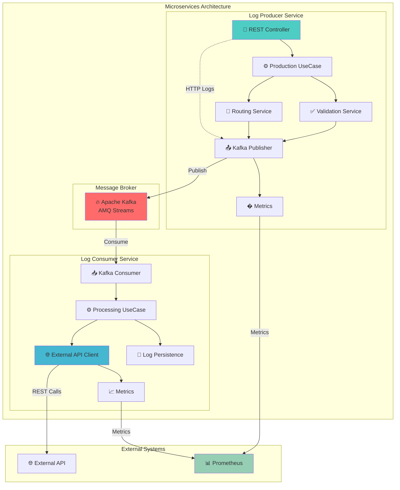
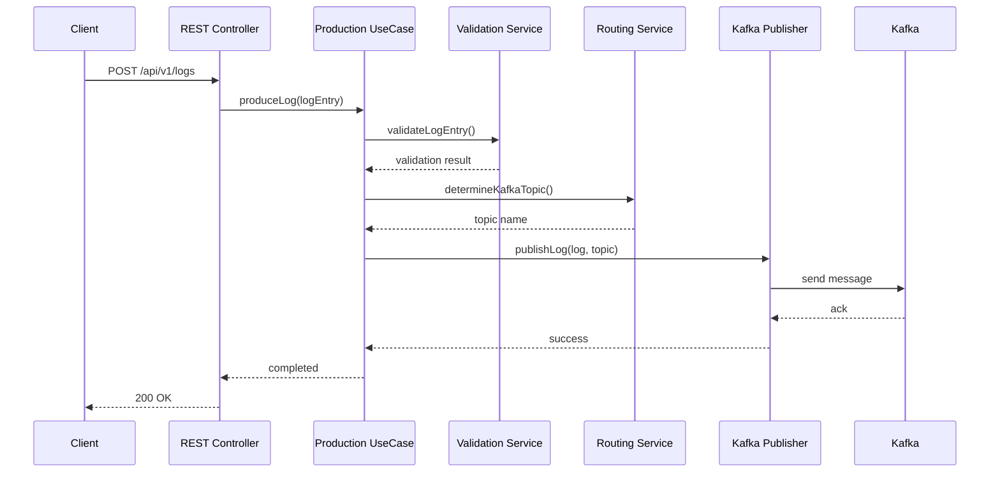

# 🚀 Estudos KBNT - Kafka Logs Architecture

[](https://spring.io/projects/spring-boot)
[](https://kafka.apache.org/)
[](https://alistair.cockburn.us/hexagonal-architecture/)
[](https://kubernetes.io/)
[](LICENSE)

> **Enterprise-grade microservices architecture** demonstrating message streaming with Apache Kafka (AMQ Streams) using **Clean Architecture** and **Hexagonal Architecture** patterns.

---

## 🎯 **Project Overview**

This project showcases a **production-ready microservices architecture** for log processing and external API integration using:

- **🏗️ Hexagonal Architecture** (Ports & Adapters)
- **📨 Message Streaming** with Apache Kafka / Red Hat AMQ Streams
- **🔄 External API Integration** replacing database persistence
- **☸️ Kubernetes-Ready** deployment configurations
- **📊 Complete Observability** with Prometheus metrics

---

## 🏛️ **Architecture Diagram**



## 📋 **Table of Contents**

- [🎯 Project Overview](#-project-overview)
- [🏛️ Architecture Diagram](#️-architecture-diagram)
- [⚡ Quick Start](#-quick-start)
- [🏗️ Hexagonal Architecture](#️-hexagonal-architecture)
- [🔄 Workflow Documentation](#-workflow-documentation)
- [🚀 Deployment Options](#-deployment-options)
- [📊 Monitoring & Metrics](#-monitoring--metrics)
- [🧪 Testing](#-testing)
- [📚 Documentation](#-documentation)

---

## ⚡ **Quick Start**

### 🐳 **Option 1: Docker Compose (Recommended for Development)**

```bash
# Clone the repository
git clone https://github.com/yourusername/estudosKBNT_Kafka_Logs.git
cd estudosKBNT_Kafka_Logs

# Start entire infrastructure
docker-compose up -d

# Check services status
docker-compose ps

# View logs
docker-compose logs -f log-producer-service
```

### ☸️ **Option 2: Kubernetes (Production-Ready)**

```bash
# Deploy infrastructure (Kafka, Zookeeper, Monitoring)
kubectl apply -f kubernetes/

# Deploy microservices
kubectl apply -f hybrid-deployment/

# Check deployment status
kubectl get pods -n kafka
kubectl get services -n kafka
```

### 💻 **Option 3: Local Development**

```bash
# Start Kafka locally
./scripts/start-kafka.sh

# Run Producer Service
cd microservices/log-producer-service
./mvnw spring-boot:run

# Run Consumer Service
cd ../log-consumer-service  
./mvnw spring-boot:run
```

---

## 🏗️ **Hexagonal Architecture**

This project implements **Clean Architecture** principles with a **Hexagonal Architecture** pattern:

### 🎯 **Architecture Principles**

| Layer | Responsibility | Dependencies |
|-------|---------------|--------------|
| **🏛️ Domain** | Business Logic, Entities, Value Objects | None (Pure) |
| **⚙️ Application** | Use Cases, Orchestration | Domain Only |
| **🌐 Infrastructure** | External Systems, Adapters | Application + Domain |

### 📂 **Project Structure**

```
microservices/
├── log-producer-service/           # ✅ COMPLETE HEXAGONAL IMPLEMENTATION
│   ├── domain/
│   │   ├── model/                  # 🏛️ Entities & Value Objects
│   │   │   ├── LogEntry.java       # Domain Entity
│   │   │   ├── LogLevel.java       # Value Object
│   │   │   └── ...
│   │   ├── port/
│   │   │   ├── input/              # 📥 Use Case Interfaces
│   │   │   └── output/             # 📤 Repository Interfaces
│   │   └── service/                # 🎯 Domain Services
│   ├── application/
│   │   └── usecase/                # ⚙️ Use Case Implementations
│   └── infrastructure/
│       ├── adapter/
│       │   ├── input/rest/         # 🌐 REST Controllers
│       │   └── output/             # 📊 Kafka, Metrics Adapters
│       └── config/                 # ⚙️ Spring Configuration
│
└── log-consumer-service/           # 🚧 FOUNDATION READY
    ├── domain/                     # ✅ Complete Domain Layer
    ├── application/                # 🔄 Next: Use Cases
    └── infrastructure/             # 🔄 Next: Adapters
```

### 🔄 **Data Flow Example**



---

## 🔄 **Workflow Documentation**

### 📊 **Message Flow Architecture**

The system processes logs through the following workflow:

1. **📡 HTTP Request** → Log Producer Service REST endpoint
2. **✅ Validation** → Business rules and data validation
3. **🔄 Routing** → Smart topic routing based on log content
4. **📤 Publishing** → Kafka message publication
5. **📥 Consumption** → Log Consumer Service processes messages
6. **🌐 External API** → Integration with external systems
7. **📈 Metrics** → Complete observability and monitoring

### 📋 **Detailed Workflow**

| Step | Component | Action | Technology |
|------|-----------|--------|------------|
| 1 | **Log Producer** | Receive HTTP logs | Spring Boot REST |
| 2 | **Validation** | Apply business rules | Domain Services |
| 3 | **Routing** | Determine Kafka topic | Routing Logic |
| 4 | **Publishing** | Send to Kafka | AMQ Streams |
| 5 | **Consumption** | Process messages | Kafka Consumer |
| 6 | **Integration** | Call external APIs | REST Client |
| 7 | **Persistence** | Store processing status | Repository |
| 8 | **Monitoring** | Collect metrics | Micrometer/Prometheus |

---

## 🚀 **Deployment Options**

### 📋 **Environment Matrix**

| Environment | Kafka | Database | Monitoring | External APIs |
|-------------|-------|----------|------------|---------------|
| **Development** | Docker | H2 | Console | Mock |
| **Testing** | Testcontainers | PostgreSQL | Prometheus | Stubbed |
| **Staging** | AMQ Streams | PostgreSQL | Full Stack | Real |
| **Production** | AMQ Streams | PostgreSQL + HA | Full Stack | Real |

### 🔧 **Configuration Profiles**

```yaml
# application-local.yml
spring:
  kafka:
    bootstrap-servers: localhost:9092
  
# application-kubernetes.yml  
spring:
  kafka:
    bootstrap-servers: kafka-cluster-kafka-bootstrap.kafka.svc:9092
```

---

## 📊 **Monitoring & Metrics**

### 🎯 **Key Performance Indicators**

#### Producer Metrics
- 📈 **Throughput**: Logs published per second
- ⏱️ **Latency**: End-to-end processing time
- ❌ **Error Rate**: Validation and publishing failures
- 🔄 **Topic Distribution**: Message distribution across topics

#### Consumer Metrics
- 📥 **Consumption Rate**: Messages processed per second
- 🌐 **API Response Times**: External API call latency
- ✅ **Success Rate**: Processing success percentage
- 🔄 **Retry Patterns**: Failed message retry statistics

### 📊 **Prometheus Metrics Examples**

```prometheus
# Total logs published
logs_published_total{service="log-producer"} 1547

# API response time histogram
api_response_time_seconds{endpoint="/external-api"} 0.245

# Error rate by log level
logs_level_error_total{level="ERROR"} 23
```

---

## 🧪 **Testing**

### 🎯 **Testing Strategy**

| Test Type | Coverage | Tools | Purpose |
|-----------|----------|-------|---------|
| **Unit** | Domain Layer | JUnit 5 | Business Logic |
| **Integration** | Use Cases | Spring Boot Test | Component Interaction |
| **Contract** | APIs | Spring Cloud Contract | API Contracts |
| **E2E** | Full Flow | Testcontainers | End-to-End Scenarios |

### 🔧 **Running Tests**

```bash
# Unit tests (fast)
./mvnw test

# Integration tests
./mvnw verify -P integration-tests

# E2E tests with Testcontainers
./mvnw verify -P e2e-tests

# All tests with coverage
./mvnw clean verify jacoco:report
```

---

## 📚 **Documentation**

### 📖 **Available Documentation**

- 🏗️ [**Hexagonal Architecture Guide**](docs/ARQUITETURA_HEXAGONAL.md)
- 🔄 [**Integration Workflow**](docs/WORKFLOW_INTEGRACAO.md)
- 📊 [**Implementation Status**](docs/HEXAGONAL_IMPLEMENTATION_STATUS.md)
- 🚀 [**Deployment Guide**](hybrid-deployment/README.md)
- ⚙️ [**VS Code Setup**](.vscode/README.md)
- 🧪 [**Testing Guide**](docs/TESTING.md)

### 🔗 **External Resources**

- [Hexagonal Architecture](https://alistair.cockburn.us/hexagonal-architecture/)
- [Spring Boot Documentation](https://spring.io/projects/spring-boot)
- [Apache Kafka Documentation](https://kafka.apache.org/documentation/)
- [Red Hat AMQ Streams](https://access.redhat.com/products/red-hat-amq/)

---

## 🎉 **Getting Started**

1. **📂 Clone the repository**
   ```bash
   git clone https://github.com/yourusername/estudosKBNT_Kafka_Logs.git
   ```

2. **📚 Read the documentation**
   - Start with [Architecture Guide](docs/ARQUITETURA_HEXAGONAL.md)
   - Review [Implementation Status](docs/HEXAGONAL_IMPLEMENTATION_STATUS.md)

3. **🚀 Choose your deployment**
   - **Development**: Use Docker Compose
   - **Production**: Deploy to Kubernetes

4. **🧪 Run tests**
   ```bash
   ./mvnw clean verify
   ```

5. **📊 Monitor metrics**
   - Access Prometheus: `http://localhost:9090`
   - Check application metrics: `http://localhost:8081/actuator/metrics`

---

## 🤝 **Contributing**

1. Fork the repository
2. Create your feature branch (`git checkout -b feature/amazing-feature`)
3. Commit your changes (`git commit -m 'Add amazing feature'`)
4. Push to the branch (`git push origin feature/amazing-feature`)
5. Open a Pull Request

---

## 📄 **License**

This project is licensed under the MIT License - see the [LICENSE](LICENSE) file for details.

---

<div align="center">

**🚀 Built with Clean Architecture • Spring Boot • Apache Kafka • Kubernetes**

*Demonstrating enterprise-grade microservices patterns and practices*

</div>
- [Exemplo AMQ Streams](examples/amq-streams-example.md)
- [Monitoramento com Grafana](examples/monitoring/)

## 📖 Documentação

- [Configuração do Kafka](docs/kafka-setup.md)
- [Deploy no Kubernetes](docs/kubernetes-deployment.md)
- [Padrões de Logs](docs/logging-patterns.md)
- [Monitoramento](docs/monitoring.md)
- [Troubleshooting](docs/troubleshooting.md)

## 🤝 Contribuindo

Como este é um projeto de estudos privado:

1. Use branches para diferentes experimentos (`git checkout -b experimento/nova-funcionalidade`)
2. Faça commits descritivos (`git commit -m 'Adiciona: novo padrão de processamento de logs'`)
3. Documente suas descobertas na pasta `docs/`
4. Crie issues para rastrear objetivos de aprendizado

## 📝 Registro de Aprendizado

Mantenha um registro dos seus estudos:
- Crie arquivos `docs/experimento-YYYY-MM-DD.md` para documentar descobertas
- Use issues para rastrear objetivos e progresso
- Marque commits com tags para marcos importantes

## 📄 Licença

Este projeto está sob a licença MIT. Veja o arquivo [LICENSE](LICENSE) para mais detalhes.

## 📞 Contato

Projeto criado para fins educacionais e estudos de Kafka e Kubernetes.

---

⭐ Se este projeto te ajudou, deixe uma estrela no repositório!
