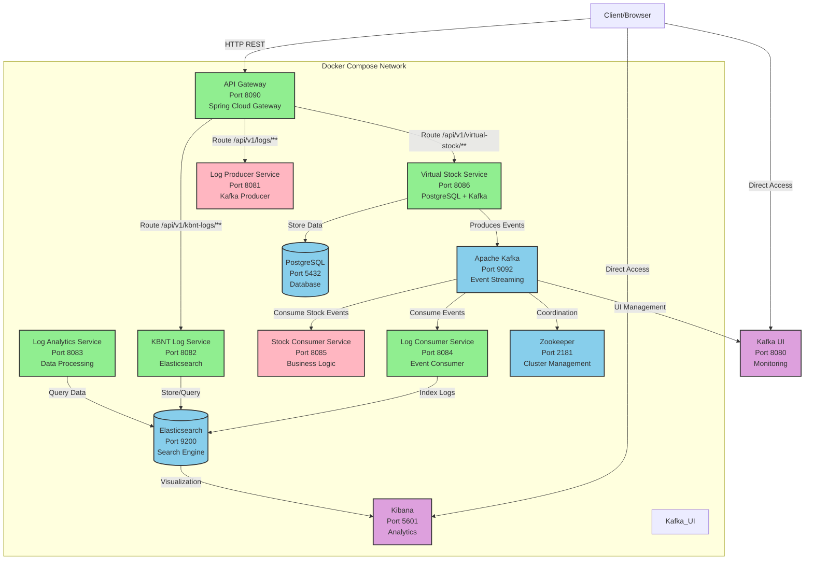
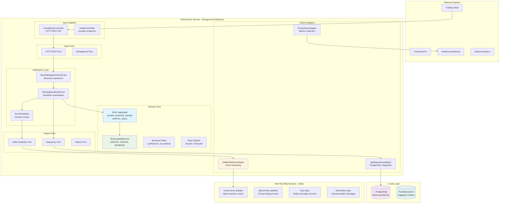
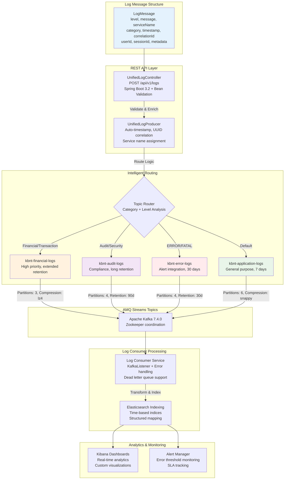
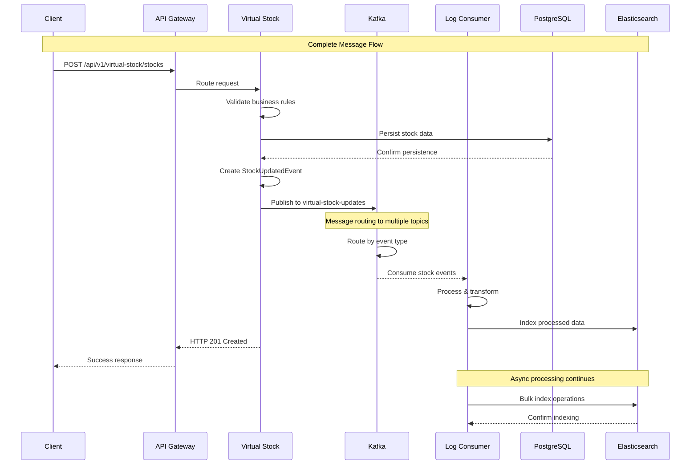

# KBNT Microservices Kafka Logs System

Sistema de microserviços para gerenciamento de estoque virtual com arquitetura orientada a eventos usando Kafka para processamento de logs e monitoramento.

## 🏗️ Arquitetura do Sistema - Visão Geral



## 🏛️ Arquitetura Hexagonal - Virtual Stock Service



## 🔄 Workflow de Processamento de Logs



## 🔄 Fluxo de Mensagens Kafka Detalhado



## 🚀 Serviços e Status

### ✅ **Serviços Funcionais:**
- **API Gateway** (Port 8090) - Spring Cloud Gateway
- **Virtual Stock Service** (Port 8086) - Hexagonal Architecture + PostgreSQL
- **KBNT Log Service** (Port 8082) - Elasticsearch Integration
- **Log Analytics Service** (Port 8083) - Data Processing
- **Log Consumer Service** (Port 8084) - Kafka Consumer
- **PostgreSQL** (Port 5432) - Database
- **Apache Kafka** (Port 9092) - Event Streaming
- **Zookeeper** (Port 2181) - Cluster Coordination
- **Elasticsearch** (Port 9200) - Search Engine
- **Kibana** (Port 5601) - Analytics Dashboard
- **Kafka UI** (Port 8080) - Monitoring Interface

### ❌ **Serviços com Problemas:**
- **Log Producer Service** (Port 8081) - Exit 1
- **Stock Consumer Service** (Port 8085) - Exit 1

## 🛠️ Tecnologias Utilizadas

### **Backend Services:**
- **Java 17** - Runtime
- **Spring Boot 3.2.0 / 2.7.18** - Framework
- **Spring Cloud Gateway** - API Gateway
- **Maven** - Build Tool
- **Hexagonal Architecture** - Design Pattern

### **Data & Messaging:**
- **Apache Kafka 7.4.0** - Event Streaming
- **PostgreSQL 15** - Relational Database
- **Elasticsearch 8.8.0** - Search Engine
- **Zookeeper** - Kafka Cluster Management

### **Monitoring & Analytics:**
- **Kibana** - Data Visualization
- **Kafka UI** - Kafka Monitoring
- **Spring Boot Actuator** - Health Checks
- **Elasticsearch** - Log Aggregation

### **Infrastructure:**
- **Docker & Docker Compose** - Containerization
- **WSL Ubuntu** - Development Environment

## 🔧 Como Executar

### **Pré-requisitos:**
- Docker & Docker Compose
- WSL Ubuntu (Windows)
- Java 17+ e Maven (para desenvolvimento)

### **Iniciar Sistema:**
```bash
cd docker
docker-compose up -d
```

### **Verificar Status:**
```bash
docker-compose ps
```

### **Parar Sistema:**
```bash
docker-compose down
```

## 📡 Endpoints da API

### **Via API Gateway (Port 8090):**

#### **Virtual Stock Service:**
```bash
# GET - Listar stocks
curl -X GET "http://localhost:8090/api/v1/virtual-stock/stocks"

# POST - Criar stock
curl -X POST "http://localhost:8090/api/v1/virtual-stock/stocks" \
  -H "Content-Type: application/json" \
  -d '{
    "productId": "PROD001",
    "symbol": "AAPL",
    "productName": "Apple Inc.",
    "initialQuantity": 100,
    "unitPrice": 150.50,
    "createdBy": "admin"
  }'
```

#### **KBNT Log Service:**
```bash
# GET - Health check
curl -X GET "http://localhost:8090/api/v1/kbnt-logs/health"

# POST - Criar log
curl -X POST "http://localhost:8090/api/v1/kbnt-logs/logs" \
  -H "Content-Type: application/json" \
  -d '{
    "message": "Test log via gateway",
    "level": "INFO"
  }'
```

#### **Health Check:**
```bash
curl -X GET "http://localhost:8090/actuator/health"
```

### **Acesso Direto aos Serviços:**
- **Kafka UI:** http://localhost:8080
- **Kibana:** http://localhost:5601
- **Elasticsearch:** http://localhost:9200
- **Virtual Stock Service:** http://localhost:8086
- **KBNT Log Service:** http://localhost:8082

## 🔍 Monitoramento

### **Logs dos Serviços:**
```bash
# Logs do API Gateway
docker-compose logs api-gateway

# Logs do Virtual Stock Service
docker-compose logs virtual-stock-service

# Logs do Kafka
docker-compose logs kafka
```

### **Health Checks:**
Todos os serviços Spring Boot expõem endpoints `/actuator/health` para monitoramento.

## 🗂️ Estrutura do Projeto

```
estudosKBNT_Kafka_Logs/
├── docker/
│   ├── docker-compose.yml          # Orquestração dos containers
│   └── ...
├── microservices/
│   ├── api-gateway/                 # Spring Cloud Gateway
│   ├── virtual-stock-service/       # Gestão de Estoque + PostgreSQL
│   ├── kbnt-log-service/           # Logging + Elasticsearch
│   ├── log-producer-service/       # Kafka Producer
│   ├── log-consumer-service/       # Kafka Consumer
│   ├── log-analytics-service/      # Analytics
│   └── kbnt-stock-consumer-service/ # Stock Event Consumer
└── README.md                       # Este arquivo
```

## 🚦 Fluxo de Dados

1. **Cliente** → **API Gateway** (entrada unificada)
2. **API Gateway** → **Virtual Stock Service** (operações de estoque)
3. **Virtual Stock Service** → **Kafka** (eventos de negócio)
4. **Virtual Stock Service** → **PostgreSQL** (persistência)
5. **Kafka** → **Log Consumer Service** (processamento assíncrono)
6. **Log Consumer** → **Elasticsearch** (indexação)
7. **Elasticsearch** → **Kibana** (visualização)
8. **Kafka UI** ↔ **Kafka** (monitoramento)

## 🎯 Principais Features

- ✅ **API Gateway** com roteamento inteligente
- ✅ **Arquitetura Hexagonal** no Virtual Stock Service
- ✅ **Event Sourcing** com Kafka
- ✅ **Full-text Search** com Elasticsearch
- ✅ **Real-time Analytics** com Kibana
- ✅ **Health Monitoring** com Actuator
- ✅ **Containerização** completa
- ✅ **CORS** configurado
- ✅ **Database Integration** PostgreSQL

## 🔧 Desenvolvimento

### **Build dos Serviços:**
```bash
# Build individual
cd microservices/virtual-stock-service
mvn clean compile

# Build via Docker
docker-compose build --no-cache
```

### **Logs de Debug:**
Os serviços principais têm logging detalhado configurado para debugging.

## 📝 Licença

Projeto educacional para estudos de microserviços e Kafka.
