# 🔄 Fluxo de Dados e Tecnologias - KBNT Kafka Logs

## 📊 Mapa Tecnológico Completo

```mermaid
flowchart TD
    %% Estilos
    classDef frontend fill:#e3f2fd,stroke:#1565c0,stroke-width:2px
    classDef api fill:#e8f5e8,stroke:#2e7d32,stroke-width:2px
    classDef business fill:#fff3e0,stroke:#ef6c00,stroke-width:2px
    classDef data fill:#fce4ec,stroke:#ad1457,stroke-width:2px
    classDef messaging fill:#f3e5f5,stroke:#6a1b9a,stroke-width:2px
    classDef infrastructure fill:#e0f2f1,stroke:#00695c,stroke-width:2px

    %% Cliente e Interface
    subgraph CLIENT ["👤 Client Layer"]
        POSTMAN["📱 Postman Client<br/>HTTP Testing Tool<br/>172.30.221.62:8084"]
        SWAGGER_UI["📚 Swagger UI<br/>API Documentation<br/>/swagger-ui.html"]
        FUTURE_WEB["🌐 Future Web App<br/>React/Angular/Vue"]
    end

    %% API Gateway e Controllers
    subgraph API_LAYER ["🌐 API Layer - Spring Boot"]
        REST_CONTROLLER["🎯 Virtual Stock Controller<br/>@RestController<br/>@RequestMapping('/api/v1/virtual-stock')<br/>Port: 8084"]
        EXCEPTION_HANDLER["⚠️ Global Exception Handler<br/>@ControllerAdvice<br/>Error Response Standard"]
        VALIDATION["✅ Bean Validation<br/>@Valid, @NotNull<br/>DTO Validation"]
    end

    %% Camada de Aplicação
    subgraph APPLICATION_LAYER ["⚙️ Application Layer"]
        STOCK_APP_SERVICE["📦 StockApplicationService<br/>@Service<br/>Use Case Implementation"]
        DTO_MAPPING["🔄 DTO Mapping<br/>Request → Domain<br/>Domain → Response"]
        TRANSACTION_MGMT["🔄 Transaction Management<br/>@Transactional<br/>ACID Properties"]
    end

    %% Camada de Domínio
    subgraph DOMAIN_LAYER ["🏛️ Domain Layer - Core Business"]
        STOCK_ENTITY["📋 Stock Entity<br/>@Entity<br/>Domain Model<br/>Business Logic"]
        STOCK_REPOSITORY_INTERFACE["📚 StockRepository<br/>Interface<br/>Domain Contract"]
        VALUE_OBJECTS["💎 Value Objects<br/>StockCode<br/>Quantity<br/>Immutable Objects"]
        DOMAIN_SERVICES["⚖️ Domain Services<br/>Complex Business Rules<br/>Multi-Entity Operations"]
    end

    %% Camada de Infraestrutura
    subgraph INFRASTRUCTURE_LAYER ["🔧 Infrastructure Layer"]
        JPA_REPOSITORY["🗄️ JPA Repository Impl<br/>@Repository<br/>Spring Data JPA<br/>CRUD Operations"]
        DATABASE_CONFIG["⚙️ Database Configuration<br/>@Configuration<br/>DataSource, EntityManager"]
        KAFKA_PRODUCER_IMPL["📤 Kafka Producer<br/>@Component<br/>Event Publishing"]
        KAFKA_CONSUMER_IMPL["📥 Kafka Consumer<br/>@KafkaListener<br/>Event Processing"]
    end

    %% Dados e Persistência
    subgraph DATA_LAYER ["🗄️ Data Layer"]
        POSTGRESQL["🐘 PostgreSQL 15<br/>Database: virtualstock<br/>Port: 5432<br/>ACID Compliance"]
        JPA_HIBERNATE["🗃️ JPA/Hibernate<br/>ORM Framework<br/>Entity Mapping<br/>Query Generation"]
        CONNECTION_POOL["🏊 Connection Pool<br/>HikariCP<br/>Performance Optimization"]
    end

    %% Mensageria
    subgraph MESSAGING_LAYER ["📨 Messaging Layer"]
        KAFKA_CLUSTER["🔄 Apache Kafka<br/>Message Broker<br/>Port: 9092<br/>Event Streaming"]
        ZOOKEEPER["🏗️ Apache Zookeeper<br/>Cluster Coordination<br/>Port: 2181<br/>Metadata Management"]
        KAFKA_TOPICS["📋 Kafka Topics<br/>stock-events<br/>stock-notifications<br/>audit-events"]
        KAFKA_UI_TOOL["🎛️ Kafka UI<br/>Management Interface<br/>Port: 8090<br/>Topic Monitoring"]
    end

    %% Infraestrutura Docker
    subgraph DOCKER_INFRASTRUCTURE ["🐳 Docker Infrastructure"]
        DOCKER_COMPOSE["📋 Docker Compose<br/>docker-compose.simple.yml<br/>Service Orchestration"]
        DOCKER_NETWORK["🌐 Docker Network<br/>kbnt-network<br/>Container Communication"]
        WSL2_BRIDGE["🌉 WSL2 Bridge<br/>172.30.221.62<br/>Windows ↔ Linux"]
        VOLUME_MOUNTS["💾 Volume Mounts<br/>Data Persistence<br/>Configuration Files"]
    end

    %% Fluxo de dados principais
    POSTMAN -->|HTTP POST/GET/PUT| REST_CONTROLLER
    REST_CONTROLLER -->|DTO Validation| VALIDATION
    VALIDATION -->|Validated Data| STOCK_APP_SERVICE
    STOCK_APP_SERVICE -->|Domain Operations| STOCK_ENTITY
    STOCK_ENTITY -->|Repository Pattern| STOCK_REPOSITORY_INTERFACE
    STOCK_REPOSITORY_INTERFACE -.->|Implementation| JPA_REPOSITORY
    JPA_REPOSITORY -->|SQL Operations| JPA_HIBERNATE
    JPA_HIBERNATE -->|JDBC| POSTGRESQL

    %% Fluxo de eventos
    STOCK_APP_SERVICE -->|Domain Events| KAFKA_PRODUCER_IMPL
    KAFKA_PRODUCER_IMPL -->|Publish Messages| KAFKA_CLUSTER
    KAFKA_CLUSTER -->|Consume Messages| KAFKA_CONSUMER_IMPL
    KAFKA_CONSUMER_IMPL -->|Process Events| STOCK_APP_SERVICE

    %% Fluxo de configuração
    DOCKER_COMPOSE -->|Orchestrates| POSTGRESQL
    DOCKER_COMPOSE -->|Orchestrates| KAFKA_CLUSTER
    DOCKER_COMPOSE -->|Orchestrates| REST_CONTROLLER
    WSL2_BRIDGE -->|Network Bridge| DOCKER_NETWORK

    %% Monitoramento e Documentação
    REST_CONTROLLER -->|API Docs| SWAGGER_UI
    KAFKA_CLUSTER -->|Management| KAFKA_UI_TOOL

    %% Aplicação de estilos
    class CLIENT frontend
    class API_LAYER api
    class APPLICATION_LAYER,DOMAIN_LAYER business
    class INFRASTRUCTURE_LAYER,DATA_LAYER data
    class MESSAGING_LAYER messaging
    class DOCKER_INFRASTRUCTURE infrastructure
```



## 🏗️ Stack Tecnológico Detalhado

```mermaid
mindmap
  root((🚀 KBNT Stack))
    (🌐 Frontend)
      📱 Postman
      📚 Swagger UI
      🌍 Future Web App
    (☕ Backend)
      🍃 Spring Boot 2.7.18
        📦 Spring Web
        🗄️ Spring Data JPA
        🔄 Spring Kafka
        🏥 Spring Actuator
        ✅ Spring Validation
      📋 Java 11+
        ☕ OpenJDK
        🧠 JVM Optimizations
    (🗄️ Database)
      🐘 PostgreSQL 15
        🏊 HikariCP Pool
        🗃️ JPA/Hibernate
        📊 ACID Transactions
    (📨 Messaging)
      🔄 Apache Kafka
        🏗️ Zookeeper
        📋 Topics & Partitions
        🎛️ Kafka UI
    (🐳 Infrastructure)
      🐋 Docker Engine
        📋 Docker Compose
        🌐 Container Networking
        💾 Volume Persistence
      🐧 WSL2 Ubuntu
        🌉 Port Forwarding
        📂 File System Bridge
    (🔧 DevOps)
      📦 Maven
        🔨 Build Automation
        📚 Dependency Management
      🏥 Health Checks
        📊 Metrics Collection
        📋 Structured Logging
```



## 🌊 Fluxo de Requisição Completo

```mermaid
journey
    title Jornada de uma Requisição Stock API
    section 🚀 Iniciação
      Cliente envia POST: 5: Postman
      WSL2 recebe request: 4: Network
      Container processa: 5: Docker
    section 🔍 Validação
      Spring recebe HTTP: 5: Controller
      Valida JSON payload: 4: Validation
      Mapeia para DTO: 5: Mapping
    section ⚙️ Processamento
      Service processa: 5: Application
      Aplica regras negócio: 5: Domain
      Valida entidade: 4: Entity
    section 💾 Persistência
      Repository salva: 5: JPA
      Hibernate gera SQL: 4: ORM
      PostgreSQL persiste: 5: Database
    section 📨 Eventos
      Publica evento: 4: Kafka Producer
      Kafka recebe mensagem: 5: Message Broker
      Consumer processa: 4: Event Handler
    section 📤 Resposta
      Monta response DTO: 5: Mapping
      Serializa para JSON: 4: Jackson
      Cliente recebe 201: 5: Success
```



## 🔄 Padrões de Integração

```mermaid
graph LR
    %% Estilos
    classDef syncStyle fill:#e8f5e8,stroke:#2e7d32,stroke-width:2px
    classDef asyncStyle fill:#fff3e0,stroke:#ef6c00,stroke-width:2px
    classDef eventStyle fill:#f3e5f5,stroke:#6a1b9a,stroke-width:2px

    subgraph SYNC_INTEGRATION ["🔄 Synchronous Integration"]
        HTTP_API["🌐 HTTP REST API<br/>Request-Response<br/>Immediate Feedback"]
        DATABASE_CALL["🗄️ Database Calls<br/>JPA Repository<br/>ACID Transactions"]
        VALIDATION_CALL["✅ Validation Calls<br/>Bean Validation<br/>Immediate Errors"]
    end

    subgraph ASYNC_INTEGRATION ["⚡ Asynchronous Integration"]
        KAFKA_EVENTS["📨 Kafka Events<br/>Event Publishing<br/>Fire and Forget"]
        EMAIL_NOTIFICATIONS["📧 Email Notifications<br/>Background Processing<br/>Non-blocking"]
        BACKGROUND_TASKS["⏰ Background Tasks<br/>Scheduled Jobs<br/>Batch Processing"]
    end

    subgraph EVENT_PATTERNS ["🎯 Event Patterns"]
        DOMAIN_EVENTS["🏛️ Domain Events<br/>Business State Changes<br/>Eventual Consistency"]
        INTEGRATION_EVENTS["🔗 Integration Events<br/>Cross-Service Communication<br/>Decoupled Systems"]
        AUDIT_EVENTS["📋 Audit Events<br/>Change Tracking<br/>Compliance Logging"]
    end

    %% Fluxos
    HTTP_API -->|Triggers| DOMAIN_EVENTS
    DATABASE_CALL -->|Success| KAFKA_EVENTS
    DOMAIN_EVENTS -->|Publishes| INTEGRATION_EVENTS
    INTEGRATION_EVENTS -->|Archives| AUDIT_EVENTS

    %% Estilos
    class SYNC_INTEGRATION syncStyle
    class ASYNC_INTEGRATION asyncStyle
    class EVENT_PATTERNS eventStyle
```



## 📋 Configurações de Ambiente

### 🐳 Docker Compose Configuration
```yaml
# docker-compose.simple.yml
services:
  postgres:
    image: postgres:15-alpine
    ports: ["5432:5432"]
    environment:
      POSTGRES_DB: virtualstock
      POSTGRES_USER: postgres
      POSTGRES_PASSWORD: postgres
    networks: [kbnt-network]

  virtual-stock-service:
    build: .
    ports: ["8084:8080"]
    depends_on: [postgres, kafka]
    environment:
      SPRING_DATASOURCE_URL: jdbc:postgresql://postgres:5432/virtualstock
      SPRING_KAFKA_BOOTSTRAP_SERVERS: kafka:9092
    networks: [kbnt-network]

  kafka:
    image: confluentinc/cp-kafka:7.4.0
    ports: ["9092:9092"]
    depends_on: [zookeeper]
    networks: [kbnt-network]
```

### 🌐 Network Configuration
- **WSL2 IP**: `172.30.221.62`
- **Docker Network**: `kbnt-network`
- **Port Mappings**: API:8084, DB:5432, Kafka:9092
- **Health Checks**: Enabled for all services
- **Volume Persistence**: Database and Kafka data

### 🎯 API Endpoints Status
✅ **GET** `/api/v1/virtual-stock/stocks` - Lista todos os stocks  
✅ **POST** `/api/v1/virtual-stock/stocks` - Cria novo stock  
✅ **GET** `/api/v1/virtual-stock/stocks/{id}` - Busca stock por ID  
✅ **PUT** `/api/v1/virtual-stock/stocks/{id}/quantity` - Atualiza quantidade  
✅ **Health Check** `/actuator/health` - Status da aplicação  

**Status Geral**: 🟢 **ONLINE e FUNCIONAL**
