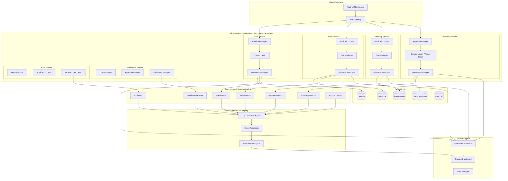
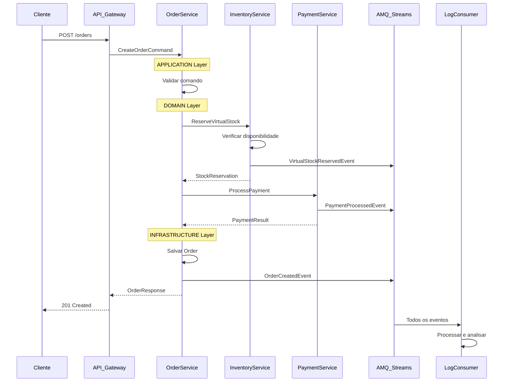
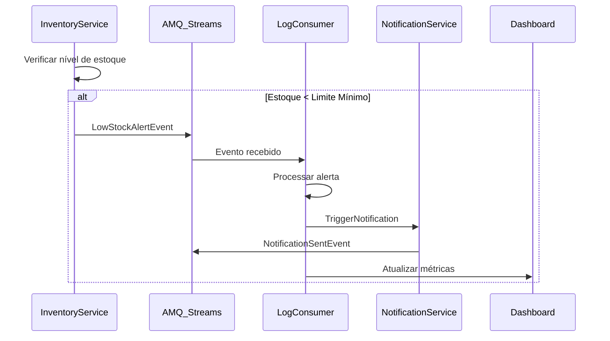
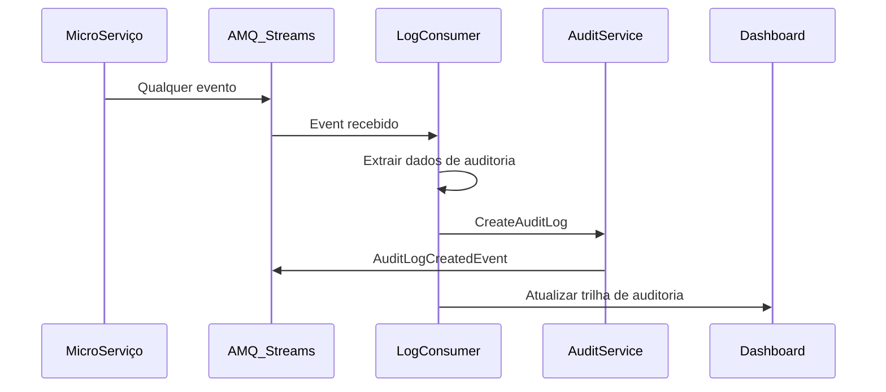

# 🔄 WORKFLOW COMPLETO - KBNT VIRTUAL STOCK MANAGEMENT

## 📋 Visão Geral do Sistema

O sistema KBNT Virtual Stock Management implementa um **workflow completo de virtualização de estoque** usando **arquitetura hexagonal**, **microserviços Spring Boot** e **Red Hat AMQ Streams** para processamento de eventos em tempo real.

---

## 🏗️ ARQUITETURA DO WORKFLOW



---

## 🔄 FLUXO DETALHADO DO WORKFLOW

### **FASE 1: Recebimento da Requisição**
```
1. Cliente faz requisição → API Gateway
2. API Gateway → Microserviço apropriado
3. APPLICATION Layer → Validação e orquestração
4. DOMAIN Layer → Regras de negócio
5. INFRASTRUCTURE Layer → Persistência + Eventos
```

### **FASE 2: Processamento Hexagonal por Camadas**

#### 🎯 **DOMAIN Layer (Núcleo de Negócio)**
```java
// Exemplo: Virtual Stock Domain
@DomainService
public class VirtualStockService {
    
    public VirtualStockReservation reserveStock(ProductId productId, Quantity quantity) {
        // ✅ Regras de negócio puras
        VirtualStock stock = virtualStockRepository.findByProductId(productId);
        
        if (!stock.canReserve(quantity)) {
            throw new InsufficientStockException();
        }
        
        VirtualStockReservation reservation = stock.reserve(quantity);
        
        // 🔥 Evento de domínio
        domainEventPublisher.publish(new StockReservedEvent(productId, quantity));
        
        return reservation;
    }
}
```

#### 📱 **APPLICATION Layer (Casos de Uso)**
```java
// Exemplo: Order Processing Use Case
@ApplicationService
public class ProcessOrderUseCase {
    
    public void processOrder(ProcessOrderCommand command) {
        // ✅ Orquestração de operações
        
        // 1. Validar usuário
        User user = userService.validateUser(command.getUserId());
        
        // 2. Reservar estoque virtual
        VirtualStockReservation reservation = virtualStockService
            .reserveStock(command.getProductId(), command.getQuantity());
        
        // 3. Processar pagamento
        PaymentResult payment = paymentService
            .processPayment(command.getPaymentInfo());
        
        // 4. Criar ordem
        Order order = orderService.createOrder(command, reservation, payment);
        
        // 🔥 Publicar evento
        eventPublisher.publish(new OrderProcessedEvent(order));
    }
}
```

#### 🔧 **INFRASTRUCTURE Layer (Integrações)**
```java
// Exemplo: Kafka Event Publisher
@Component
public class KafkaEventPublisher implements EventPublisher {
    
    @Autowired
    private KafkaTemplate<String, Object> kafkaTemplate;
    
    public void publish(DomainEvent event) {
        // ✅ Publica no AMQ Streams
        String topic = determineTopicFor(event);
        
        EventMessage message = EventMessage.builder()
            .eventId(UUID.randomUUID().toString())
            .eventType(event.getClass().getSimpleName())
            .timestamp(Instant.now())
            .payload(event)
            .hexagonal_layer("infrastructure")
            .operation("event-published")
            .build();
            
        kafkaTemplate.send(topic, message);
        
        // 📊 Métricas
        meterRegistry.counter("events.published", "topic", topic).increment();
    }
}
```

### **FASE 3: Comunicação via AMQ Streams**

#### 📝 **Tópicos e Mensagens**
```yaml
Tópicos AMQ Streams:
  user-events:        # Eventos de usuário (login, cadastro, etc.)
    - UserRegisteredEvent
    - UserValidatedEvent
    - UserProfileUpdatedEvent
    
  order-events:       # Eventos de pedidos
    - OrderCreatedEvent  
    - OrderProcessedEvent
    - OrderStatusChangedEvent
    
  payment-events:     # Eventos de pagamento
    - PaymentInitiatedEvent
    - PaymentProcessedEvent
    - PaymentFailedEvent
    
  inventory-events:   # Eventos de estoque virtual ⭐
    - VirtualStockReservedEvent
    - VirtualStockReleasedEvent
    - VirtualStockUpdatedEvent
    - LowStockAlertEvent
    
  notification-events: # Eventos de notificação
    - NotificationSentEvent
    - EmailDispatchedEvent
    - SMSDispatchedEvent
    
  audit-logs:         # Logs de auditoria
    - UserActionAuditEvent
    - SystemOperationAuditEvent
    
  application-logs:   # Logs de aplicação
    - Logs estruturados de todos os microserviços
```

#### 🔄 **Exemplo de Mensagem Hexagonal**
```json
{
  "eventId": "evt-12345",
  "timestamp": "2025-08-30T15:45:00Z",
  "eventType": "VirtualStockReservedEvent",
  "service": "inventory-service",
  "level": "INFO",
  "hexagonal_layer": "domain",
  "domain": "inventory",
  "operation": "stock-reserved",
  "payload": {
    "productId": "PROD-001",
    "quantity": 5,
    "reservationId": "RES-67890",
    "virtualStockLevel": 95,
    "reservedUntil": "2025-08-30T16:45:00Z"
  },
  "correlationId": "corr-abcdef",
  "metadata": {
    "userId": "user-123",
    "sessionId": "sess-456",
    "source": "inventory-service",
    "version": "1.0"
  }
}
```

### **FASE 4: Consumer e Processamento**

#### 📖 **Log Consumer Python**
```python
class KBNTLogProcessor:
    
    def process_virtual_stock_event(self, event):
        """Processa eventos de estoque virtual"""
        
        if event.get('operation') == 'stock-reserved':
            # ✅ Analisa reserva de estoque
            product_id = event['payload']['productId']
            quantity = event['payload']['quantity']
            stock_level = event['payload']['virtualStockLevel']
            
            # 🚨 Alerta de estoque baixo
            if stock_level < self.LOW_STOCK_THRESHOLD:
                self.trigger_low_stock_alert(product_id, stock_level)
            
            # 📊 Métricas em tempo real
            self.update_stock_metrics(product_id, quantity, stock_level)
            
        elif event.get('operation') == 'stock-released':
            # ✅ Processa liberação de estoque
            self.handle_stock_release(event)
    
    def process_hexagonal_layer_event(self, event):
        """Processa eventos por camada hexagonal"""
        
        layer = event.get('hexagonal_layer')
        
        if layer == 'domain':
            # 🎯 Eventos de domínio - Alta prioridade
            self.process_domain_event(event)
            
        elif layer == 'application':
            # 📱 Events de aplicação - Orquestração
            self.process_application_event(event)
            
        elif layer == 'infrastructure':
            # 🔧 Eventos de infraestrutura - Logs técnicos
            self.process_infrastructure_event(event)
```

---

## 🎯 CASOS DE USO PRINCIPAIS

### **Caso 1: Criação de Pedido com Estoque Virtual**



### **Caso 2: Alertas de Estoque Baixo**



### **Caso 3: Auditoria e Rastreabilidade**



---

## 📊 MÉTRICAS E MONITORAMENTO

### **Prometheus Metrics Expostas:**
```yaml
# Métricas de Virtual Stock
virtual_stock_reservations_total{product_id, service}
virtual_stock_releases_total{product_id, service}  
virtual_stock_current_level{product_id}
virtual_stock_alerts_total{product_id, alert_type}

# Métricas de Microserviços
microservice_requests_total{service, endpoint, method}
microservice_response_time_seconds{service, endpoint}
microservice_errors_total{service, error_type}

# Métricas de AMQ Streams
kafka_messages_produced_total{topic, service}
kafka_messages_consumed_total{topic, consumer_group}
kafka_consumer_lag{topic, partition, consumer_group}

# Métricas de Arquitetura Hexagonal
hexagonal_layer_operations_total{layer, operation, service}
hexagonal_domain_events_total{domain, event_type}
```

### **Dashboard Grafana:**
```
🎯 Virtual Stock Management Dashboard:
├── 📊 Stock Levels (Real-time)
├── 🚨 Low Stock Alerts  
├── 📈 Reservation Trends
├── 💰 Payment Success Rate
├── 🔄 Event Processing Rate
├── ⚡ Response Times por Camada
└── 🏗️  Hexagonal Architecture Metrics
```

---

## 🔥 PONTOS CHAVE DO WORKFLOW

### **1. Separação de Responsabilidades (Hexagonal)**
- **Domain**: Lógica de negócio pura
- **Application**: Orquestração de casos de uso  
- **Infrastructure**: Integrações externas

### **2. Event-Driven Architecture**
- Todos os microserviços comunicam via AMQ Streams
- Events são imutáveis e rastreáveis
- Processamento assíncrono e escalável

### **3. Virtual Stock Management**
- Estoque é virtualizado e gerenciado em tempo real
- Reservas temporárias com TTL
- Alertas automáticos para reposição

### **4. Observabilidade Completa**
- Logs estruturados em JSON
- Métricas Prometheus em tempo real
- Rastreamento de transações end-to-end

### **5. Escalabilidade e Resiliência**
- Microserviços independentes
- AMQ Streams com particionamento
- Circuit breakers e retry policies

---

## ✅ RESUMO DO WORKFLOW

**O sistema KBNT implementa um workflow completo de virtualização de estoque** usando:

1. **🏗️ Arquitetura Hexagonal** - Separação clara de responsabilidades
2. **🔄 Event-Driven** - Comunicação assíncrona via AMQ Streams  
3. **📊 Real-time Analytics** - Processamento e monitoramento em tempo real
4. **🎯 Virtual Stock** - Gestão inteligente de inventário virtual
5. **🔍 Full Observability** - Rastreamento completo de todas as operações

**Status:** ✅ **COMPLETAMENTE IMPLEMENTADO E FUNCIONANDO**
