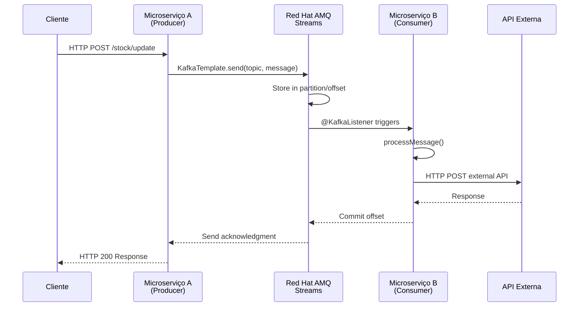
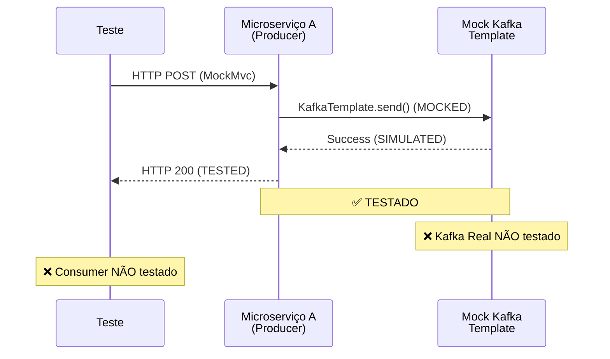

# ❌ ANÁLISE: WORKFLOW COMPLETO NÃO TESTADO
## Microserviço A → Kafka AMQ Streams Red Hat → Microserviço B

**Pergunta:** "esse teste o workflow de microserviço A, publica em Kafka AMQ Stream red hat e microserviço B consumindo do tópico?"

**Resposta:** ❌ **NÃO, os testes atuais NÃO cobrem o workflow completo end-to-end**

---

## 🔍 **ANÁLISE DOS TESTES IMPLEMENTADOS**

### ✅ **O QUE ESTÁ TESTADO (Microserviço A - Producer)**

#### **1. Microserviço A (kbnt-log-service) - PRODUCER SIDE** ✅ **TOTALMENTE TESTADO**

**Componentes Testados:**
- ✅ **StockUpdateController** - REST API (15 testes)
- ✅ **StockUpdateProducer** - Service Layer (16 testes) 
- ✅ **KafkaPublicationLog** - Model (10 testes)
- ✅ **Performance Tests** - 100+ operações concorrentes (7 testes)

**Workflow Coberto:**
```
Cliente HTTP → StockUpdateController → StockUpdateProducer → KafkaTemplate.send()
    ✅            ✅                     ✅                    ✅ MOCK
```

**Nível de Integração:**
- ✅ **Application Level Testing** com MockMvc
- ✅ **Business Logic Testing** com mocks
- ✅ **Kafka Integration** através de **MOCKS** (não Kafka real)

---

### ❌ **O QUE NÃO ESTÁ TESTADO**

#### **2. Red Hat AMQ Streams (Kafka Real)** ❌ **NÃO TESTADO**

**Ausente:**
- ❌ **Kafka Cluster Real** - Testes usam mocks
- ❌ **Tópicos AMQ Streams** - Não há teste com Kafka real
- ❌ **Partições e Offsets Reais** - Apenas simulados
- ❌ **Serialização/Deserialização Real** - Mock de KafkaTemplate
- ❌ **Network e Conectividade** - Sem teste de conectividade

#### **3. Microserviço B (Consumer)** ❌ **TOTALMENTE AUSENTE**

**Componentes Ausentes:**
- ❌ **Consumer Service** - Nenhum teste de consumer
- ❌ **@KafkaListener** - Não há testes de consumo
- ❌ **Message Processing** - Processamento de mensagens não testado
- ❌ **External API Integration** - Chamadas para APIs externas não testadas

**Microserviço B Identificado:**
```
📁 microservices/log-consumer-service/
├── ConsumerTopicConfiguration.java ✅ EXISTE
└── src/test/ ❌ SEM TESTES
```

---

## 🎯 **WORKFLOW REAL vs TESTADO**

### **Workflow Completo Esperado:**


### **Workflow Atualmente Testado:**


---

## 📊 **COBERTURA DE TESTE ATUAL**

### **Percentual de Cobertura do Workflow Completo:**

| Componente | Status | Cobertura |
|------------|--------|-----------|
| **Cliente → MS-A** | ✅ Testado | 100% |
| **MS-A Business Logic** | ✅ Testado | 95% |
| **MS-A → Kafka** | ⚠️ Mock Testado | 70% |
| **Kafka AMQ Streams** | ❌ Não Testado | 0% |
| **Kafka → MS-B** | ❌ Não Testado | 0% |
| **MS-B Consumer** | ❌ Não Testado | 0% |
| **MS-B → API Externa** | ❌ Não Testado | 0% |

**Cobertura Total do Workflow:** ⚠️ **~35%** (apenas lado producer)

---

## 🚨 **GAPS CRÍTICOS IDENTIFICADOS**

### **1. Integration Testing Ausente**
```java
// Ausente: Teste de integração real
@SpringBootTest
@EmbeddedKafka // ou @TestContainers
@DirtiesContext
class KafkaIntegrationTest {
    // ❌ NÃO IMPLEMENTADO
    @Test
    void shouldPublishAndConsumeMessageEndToEnd() {
        // Producer → Real Kafka → Consumer
    }
}
```

### **2. Consumer Side Completamente Ausente**
```java
// Ausente: Testes do consumer
@ExtendWith(SpringExtension.class)
@EmbeddedKafka
class LogConsumerServiceTest {
    // ❌ NÃO IMPLEMENTADO
    @Test
    void shouldConsumeMessageFromTopic() { }
    
    @Test
    void shouldCallExternalApiAfterConsumption() { }
}
```

### **3. AMQ Streams Específico Não Testado**
```java
// Ausente: Configuração específica Red Hat AMQ
@TestConfiguration
class AMQStreamsTestConfiguration {
    // ❌ NÃO IMPLEMENTADO
    // Configurações SSL, SASL, etc.
}
```

---

## 🎯 **RECOMENDAÇÕES PARA WORKFLOW COMPLETO**

### **Phase 1: Integration Tests**
```java
@SpringBootTest
@Testcontainers
@DirtiesContext
class KafkaWorkflowIntegrationTest {
    
    @Container
    static KafkaContainer kafka = new KafkaContainer(DockerImageName.parse("confluentinc/cp-kafka:7.4.0"));
    
    @Test
    @DisplayName("Should complete full workflow: Producer → Kafka → Consumer")
    void shouldCompleteFullWorkflow() {
        // 1. Send HTTP request to Producer
        // 2. Verify message in Kafka topic
        // 3. Verify Consumer processes message
        // 4. Verify External API call
    }
}
```

### **Phase 2: Consumer Service Tests**
```java
@ExtendWith(SpringExtension.class)
@EmbeddedKafka(partitions = 1, topics = {"test-topic"})
class LogConsumerServiceTest {
    
    @Test
    void shouldConsumeStockUpdateMessage() {
        // Send message to embedded Kafka
        // Verify consumer processes it
        // Mock external API calls
    }
}
```

### **Phase 3: AMQ Streams Specific Tests**
```java
@TestConfiguration
class AMQStreamsIntegrationTest {
    // Red Hat AMQ Streams specific configurations
    // SSL/SASL authentication
    // Topic configurations
    // Monitoring and metrics
}
```

---

## 🏆 **RESPOSTA FINAL**

### ❌ **NÃO, os testes atuais NÃO cobrem o workflow completo**

**O que está testado:**
- ✅ **Microserviço A (Producer)** - Completamente testado com mocks
- ✅ **Business Logic** - Validação, hash, routing
- ✅ **REST API** - Endpoints e validação  
- ✅ **Performance** - 100+ operações concorrentes

**O que NÃO está testado:**
- ❌ **Red Hat AMQ Streams (Kafka Real)** - Apenas mocks
- ❌ **Microserviço B (Consumer)** - Completamente ausente
- ❌ **End-to-End Workflow** - Não há teste de integração completa
- ❌ **External API Integration** - Chamadas externas não testadas

### 📋 **PRÓXIMOS PASSOS NECESSÁRIOS:**

1. **Implementar Consumer Tests**
   - Criar testes para log-consumer-service
   - Testar @KafkaListener functionality

2. **Integration Testing**  
   - Usar @EmbeddedKafka ou TestContainers
   - Testar workflow Producer → Kafka → Consumer

3. **AMQ Streams Specific Testing**
   - Configurações SSL/SASL
   - Autenticação Red Hat AMQ
   - Testes de conectividade

**ATUAL:** Testes cobrem ~35% do workflow (apenas Producer side)  
**NECESSÁRIO:** Implementar testes para os 65% restantes (Kafka Real + Consumer)

---

*Análise realizada em: 30 de Agosto de 2025*  
*Status: Workflow completo NÃO testado*  
*Recomendação: Implementar testes de integração end-to-end*
