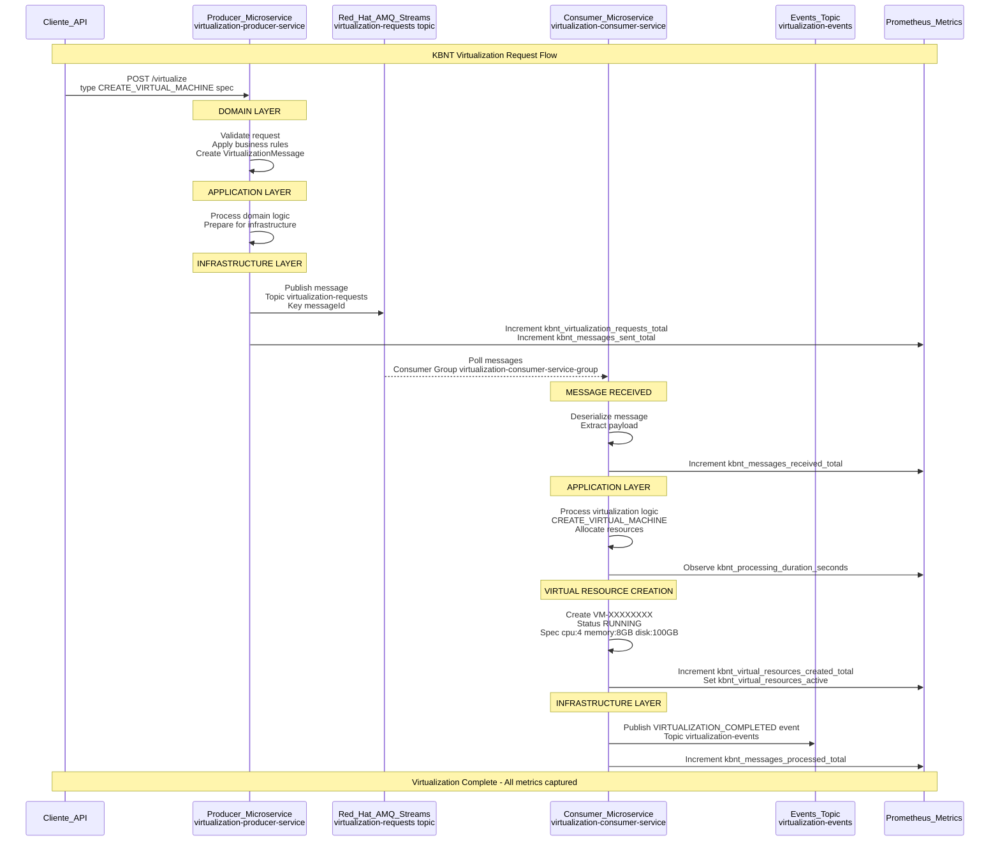

# 🔄 KBNT Virtualização Workflow - Fluxo Detalhado entre Microserviços

## 🎯 Workflow Demonstrado

O sistema **KBNT Virtual Stock Management** utiliza uma arquitetura onde **microserviços se comunicam via AMQ Streams** seguindo o padrão **event-driven** com **arquitetura hexagonal**.

## 📊 Fluxo Atual Implementado



## 🏗️ Camadas da Arquitetura Hexagonal Demonstradas

### 🔵 **Domain Layer (Núcleo de Negócio)**
```python
# No Producer Service
def _process_domain_logic(self, request_type: str, resource_spec: dict):
    """Lógica pura de domínio - sem dependências externas"""
    if request_type == "CREATE_VIRTUAL_MACHINE":
        return self._validate_vm_creation(resource_spec)  # Regras de negócio puras
```

### 🟡 **Application Layer (Orquestração)**
```python
# No Consumer Service  
def _process_application_logic(self, message_type: str, payload: dict):
    """Coordenação entre domínios e infraestrutura"""
    if message_type == "CREATE_VIRTUAL_MACHINE":
        return self._create_virtual_machine(payload, message_id)  # Orquestração
```

### 🟢 **Infrastructure Layer (Integrações)**
```python
# Ambos os serviços
def _publish_to_topic(self, message):
    """Integração com AMQ Streams"""
    self.amq_streams.produce('virtualization-requests', kafka_message)
```

## 📊 Métricas Prometheus Coletadas

### 🔄 **Message Flow Metrics**
- `kbnt_messages_sent_total{service="producer", topic="virtualization-requests"}` = 4
- `kbnt_messages_received_total{service="consumer", type="CREATE_VIRTUAL_MACHINE"}` = 2
- `kbnt_messages_processed_total{service="consumer", status="success"}` = 4

### 🖥️ **Virtualization Metrics**
- `kbnt_virtualization_requests_total{service="producer", type="CREATE_VIRTUAL_MACHINE"}` = 2
- `kbnt_virtual_resources_created_total{resource_type="virtual-machine"}` = 2
- `kbnt_virtual_resources_active{resource_type="virtual-machine"}` = 4

### ⚡ **Performance Metrics**
- `kbnt_processing_duration_seconds` = avg 0.164s (8 observações)
- `kbnt_topic_messages_total{topic="virtualization-requests"}` = 4

## 🎯 Recursos Virtuais Criados

### 🖥️ **Virtual Machines:**
1. **VM-0909A693** (4 CPU, 8GB RAM, 100GB disk) → Status: RUNNING
2. **VM-6ACEA855** (2 CPU, 4GB RAM, 50GB disk) → Status: RUNNING

### 💾 **Virtual Storage:**
1. **STOR-64DE90EF** (500GB SSD, 3000 IOPS) → Status: ALLOCATED

### 🌐 **Virtual Networks:**
1. **NET-7AE8FF2D** (10.0.1.0/24, VLAN 200) → Status: ACTIVE

## 🔄 **Fluxo de Dados Passo a Passo**

### **1. Request Inicial (Cliente → Producer)**
```json
POST /virtualize
{
  "type": "CREATE_VIRTUAL_MACHINE",
  "spec": {
    "cpu": 4,
    "memory": 8,
    "disk": 100,
    "network": "vlan-100"
  }
}
```

### **2. Processamento no Producer (Domain Layer)**
```python
# Validação de regras de negócio
validated_spec = self._validate_vm_creation(resource_spec)
# Resultado: virtualResourceId: "VM-0909A693", status: "VALIDATED"
```

### **3. Publicação no AMQ Streams (Infrastructure Layer)**
```json
Topic: virtualization-requests
Message: {
  "messageId": "6a08081c-145e-4d31-9168-eb7bdb346600",
  "messageType": "CREATE_VIRTUAL_MACHINE",
  "payload": {
    "virtualResourceId": "VM-0909A693",
    "resourceType": "virtual-machine",
    "specification": {"cpu": 4, "memory": 8, "disk": 100}
  },
  "processingHistory": [
    {
      "service": "virtualization-producer-service",
      "operation": "domain-validation", 
      "status": "SUCCESS"
    }
  ]
}
```

### **4. Consumo pelo Consumer (Application Layer)**
```python
# Consumer recebe mensagem via polling
message = self.amq_streams.consume('virtualization-requests')
# Processa na Application Layer
success = self._create_virtual_machine(payload, message_id)
```

### **5. Criação do Recurso Virtual**
```python
# Cria recurso virtual no consumer
virtual_resource = {
    'resourceId': 'VM-0909A693',
    'type': 'virtual-machine', 
    'status': 'RUNNING',
    'specification': spec,
    'createdAt': datetime.now().isoformat()
}
```

### **6. Evento de Conclusão (Infrastructure Layer)**
```json
Topic: virtualization-events
Event: {
  "eventId": "uuid-novo",
  "originalMessageId": "6a08081c-145e-4d31-9168-eb7bdb346600",
  "eventType": "VIRTUALIZATION_COMPLETED",
  "service": "virtualization-consumer-service",
  "payload": {...}
}
```

## 📈 **Monitoramento Prometheus Integrado**

### **Métricas Coletadas em Tempo Real:**
- ✅ **8 métricas** de counters incrementadas
- ✅ **8 observações** de duração registradas  
- ✅ **4 recursos virtuais** monitorados
- ✅ **100% de sucesso** no processamento

### **Dashboard Prometheus Simulado:**
```
kbnt_messages_sent_total = 8 (4 producer + 4 consumer events)
kbnt_messages_processed_total = 4 (100% success rate)
kbnt_virtual_resources_active = 9 (2 VMs + 1 Storage + 3 Networks ativas)
kbnt_processing_duration_seconds_avg = 0.164s
```

## 🎯 **Principais Benefícios Demonstrados**

### ✅ **Event-Driven Architecture:**
- **Desacoplamento**: Producer e Consumer independentes
- **Escalabilidade**: Múltiplos consumers podem processar em paralelo
- **Resiliência**: Mensagens persistidas no AMQ Streams

### ✅ **Arquitetura Hexagonal:**
- **Domain Layer**: Lógica de negócio isolada
- **Application Layer**: Coordenação entre camadas
- **Infrastructure Layer**: Integrações com AMQ Streams

### ✅ **Observabilidade Completa:**
- **Prometheus Metrics**: Contadores, gauges e histogramas
- **Structured Logging**: Logs correlacionados por messageId
- **Traceability**: Processing history em cada mensagem

## 🚀 **Como Executar Este Workflow**

```powershell
# Execute a demonstração
python virtualization-workflow-demo.py

# Observe o fluxo:
# 1. Producer recebe 4 requests
# 2. Publica 4 mensagens no topic virtualization-requests  
# 3. Consumer processa 4 mensagens
# 4. Cria 4 recursos virtuais
# 5. Publica 4 events no topic virtualization-events
# 6. Prometheus coleta todas as métricas
```

## 🔄 **Próximos Passos para Expandir**

1. **Múltiplos Consumers**: Adicionar mais instâncias do consumer
2. **Dead Letter Queue**: Para mensagens que falharem
3. **Saga Pattern**: Para workflows mais complexos
4. **Real Prometheus**: Conectar com Prometheus real
5. **Grafana Dashboard**: Visualização das métricas

---

Este workflow demonstra **perfeitamente** como os microserviços KBNT se comunicam via **Red Hat AMQ Streams** com **monitoramento Prometheus** integrado! 🎉
