# 🔄 KBNT Virtualização Workflow - Fluxo Detalhado entre Microserviços

## 🎯 Workflow Demonstrado

O sistema **KBNT Virtual Stock Management** utiliza uma arquitetura onde **microserviços se comunicam via AMQ Streams** seguindo o padrão **event-driven** com **arquitetura hexagonal**.

## 📊 Fluxo Atual Implementado

```mermaid
sequenceDiagram
    participant Client as 💻 Cliente_API<br/>📱 Mobile/Web<br/>🔗 External Systems
    participant Producer as 🏗️ Producer_Microservice<br/>📦 virtualization-producer-service<br/>🌐 Port 8080<br/>🐳 Container virtualization-producer
    participant AMQ as 🔄 Red_Hat_AMQ_Streams<br/>📢 Topic virtualization-requests<br/>🔧 Partitions 3 Replicas 3<br/>⚖️ Load Balanced Consumer Groups
    participant Consumer as 🏗️ Consumer_Microservice<br/>📦 virtualization-consumer-service<br/>🌐 Port 8081<br/>🐳 Container virtualization-consumer
    participant Events as 📊 Events_Topic<br/>📢 Topic virtualization-events<br/>📈 Metrics and Audit Trail<br/>🔍 Event Sourcing Pattern
    participant Prometheus as 📈 Prometheus_Metrics<br/>🗄️ Time Series Database<br/>📊 Real-time Dashboards<br/>🚨 Alerting Rules

    rect rgb(240, 248, 255)
        Note over Client,Prometheus: 🎯 KBNT VIRTUALIZATION REQUEST FLOW - END-TO-END PROCESSING
    end

    rect rgb(245, 255, 245)
        Note over Client,Producer: 📥 REQUEST PHASE - Client Interaction
        Client->>+Producer: [1] 🚀 POST /api/v1/virtualize<br/>━━━━━━━━━━━━━━━━━━━━━━━━━━<br/>📋 Request Body<br/>├── type CREATE_VIRTUAL_MACHINE<br/>├── resourceId vm-12345<br/>├── specifications<br/>│   ├── cpu 4 cores<br/>│   ├── memory 8GB RAM<br/>│   ├── disk 100GB SSD<br/>│   └── network bridged<br/>└── metadata<br/>    ├── requestId req-abc123<br/>    ├── userId user-789<br/>    └── priority HIGH
    end

    rect rgb(255, 250, 240)
        Note over Producer: 🔵 HEXAGONAL ARCHITECTURE - DOMAIN LAYER
        Producer->>Producer: [2] 🔍 Domain Validation Process<br/>━━━━━━━━━━━━━━━━━━━━━━━━━━━━━<br/>┌─ Business Rules Engine<br/>├── ✅ Validate resource specifications<br/>├── ✅ Check user permissions<br/>├── ✅ Verify quota limits<br/>├── ✅ Apply security policies<br/>└── ✅ Create VirtualizationMessage<br/>    ├── messageId msg-xyz789<br/>    ├── correlationId corr-456<br/>    ├── timestamp 2025-08-30T10:30:00Z<br/>    └── payload validated-specs
    end

    rect rgb(248, 248, 255)
        Note over Producer: 🟡 HEXAGONAL ARCHITECTURE - APPLICATION LAYER
        Producer->>Producer: [3] ⚙️ Application Service Processing<br/>━━━━━━━━━━━━━━━━━━━━━━━━━━━━━━━━━━<br/>┌─ Use Case Orchestration<br/>├── 🔄 Process domain aggregates<br/>├── 📝 Generate integration events<br/>├── 🎯 Prepare infrastructure calls<br/>├── 📊 Collect business metrics<br/>└── 🚀 Ready for infrastructure layer<br/>    ├── Duration 45ms processing<br/>    ├── Memory usage 128MB allocated<br/>    └── CPU utilization 12% spike
    end

    rect rgb(240, 255, 240)
        Note over Producer: 🟢 HEXAGONAL ARCHITECTURE - INFRASTRUCTURE LAYER
        Producer->>+AMQ: [4] 📤 Message Publication<br/>━━━━━━━━━━━━━━━━━━━━━━━━━<br/>┌─ AMQ Streams Integration<br/>├── 📢 Topic virtualization-requests<br/>├── 🔑 Partition Key messageId<br/>├── 🔄 Serialization Avro Schema v2.1<br/>├── ⚡ Async publication mode<br/>├── 🛡️ Exactly-once semantics<br/>└── ✅ Acknowledgment confirmed<br/>    ├── Latency 2.3ms publish<br/>    ├── Size 1.2KB message<br/>    └── Offset partition-0 offset-12456
        
        Producer->>Prometheus: [5] 📊 Business Metrics Collection<br/>━━━━━━━━━━━━━━━━━━━━━━━━━━━━━━━━<br/>┌─ Custom Metrics Export<br/>├── 📈 kbnt_virtualization_requests_total<br/>│   └── labels service=producer type=CREATE_VM<br/>├── 📈 kbnt_messages_sent_total<br/>│   └── labels topic=virtualization-requests<br/>├── ⏱️ kbnt_request_processing_duration_ms<br/>│   └── histogram bucket 45ms<br/>└── 🎯 kbnt_business_operations_total<br/>    └── labels operation=virtualization status=success
        AMQ-->>-Producer: [6] ✅ Publication Confirmed<br/>━━━━━━━━━━━━━━━━━━━━━━━━━━━<br/>📋 Response Details<br/>├── offset 12456<br/>├── partition 0<br/>├── timestamp 2025-08-30T10:30:00.123Z<br/>└── checksum crc32-abc123
    end

    Producer-->>-Client: [7] ✅ 202 ACCEPTED<br/>━━━━━━━━━━━━━━━━━━━━━━━<br/>📋 Response Payload<br/>├── requestId req-abc123<br/>├── status PROCESSING<br/>├── estimatedTime 30 seconds<br/>├── trackingUrl /api/v1/requests/req-abc123<br/>└── correlationId corr-456<br/>    ├── responseTime 52ms total<br/>    └── queuePosition 3 in processing queue

    rect rgb(255, 245, 245)
        Note over AMQ,Consumer: 🔄 MESSAGE BROKER PROCESSING - ASYNC FLOW
        AMQ->>+Consumer: [8] 📥 Message Consumption<br/>━━━━━━━━━━━━━━━━━━━━━━━━━━━<br/>┌─ Consumer Group Processing<br/>├── 👥 Group virtualization-consumer-service-group<br/>├── 🔄 Auto-commit enabled interval 1s<br/>├── ⚖️ Partition assignment rebalancing<br/>├── 📊 Consumer lag monitoring 0ms<br/>└── 🎯 Processing mode parallel<br/>    ├── Batch size 1 message<br/>    ├── Poll timeout 5000ms<br/>    └── Session timeout 30000ms
    end

    rect rgb(245, 245, 255)
        Note over Consumer: 📥 MESSAGE PROCESSING LAYER
        Consumer->>Consumer: [9] 🔄 Message Deserialization<br/>━━━━━━━━━━━━━━━━━━━━━━━━━━━━━━<br/>┌─ Data Processing Pipeline<br/>├── 📋 Avro schema validation v2.1<br/>├── 🔍 Message integrity verification<br/>├── 📦 Payload extraction and mapping<br/>├── 🎯 Business context reconstruction<br/>└── ✅ Ready for application processing<br/>    ├── Processing time 8ms deserialize<br/>    ├── Memory allocated 64MB working set<br/>    └── Schema registry lookup cached
        
        Consumer->>Prometheus: [10] 📊 Consumer Metrics Update<br/>━━━━━━━━━━━━━━━━━━━━━━━━━━━━━━━<br/>├── 📈 kbnt_messages_received_total<br/>├── ⏱️ kbnt_message_processing_latency_ms<br/>└── 🎯 kbnt_consumer_lag_seconds current=0
    end

    rect rgb(255, 248, 240)
        Note over Consumer: 🏗️ BUSINESS LOGIC EXECUTION - APPLICATION LAYER
        Consumer->>Consumer: [11] ⚙️ Virtualization Processing Engine<br/>━━━━━━━━━━━━━━━━━━━━━━━━━━━━━━━━━━━━━━<br/>┌─ Virtual Machine Creation Pipeline<br/>├── 🎯 Operation CREATE_VIRTUAL_MACHINE<br/>├── 🏗️ Resource allocation planning<br/>│   ├── CPU cores 4 reserved<br/>│   ├── Memory 8GB allocated<br/>│   ├── Disk 100GB SSD provisioned<br/>│   └── Network bridge configured<br/>├── 🔧 Infrastructure provisioning<br/>│   ├── Hypervisor KVM selected<br/>│   ├── Operating system Ubuntu 22.04<br/>│   ├── Security groups applied<br/>│   └── Monitoring agents installed<br/>└── ✅ Virtual resource ready<br/>    ├── Provisioning time 18.5 seconds<br/>    ├── Resource utilization optimal<br/>    └── Health checks passed all 5
        
        Consumer->>Prometheus: [12] 📊 Processing Metrics Collection<br/>━━━━━━━━━━━━━━━━━━━━━━━━━━━━━━━━━━━<br/>├── ⏱️ kbnt_processing_duration_seconds<br/>│   └── histogram bucket 18.5s<br/>├── 🎯 kbnt_resource_allocation_success_total<br/>└── 📈 kbnt_virtual_machines_active_gauge increment=1
    end

    rect rgb(240, 255, 250)
        Note over Consumer: 🖥️ VIRTUAL RESOURCE MANAGEMENT - INFRASTRUCTURE RESULT
        Consumer->>Consumer: [13] 🎉 Virtual Machine Creation Success<br/>━━━━━━━━━━━━━━━━━━━━━━━━━━━━━━━━━━━━━━━<br/>┌─ Resource Instance Details<br/>├── 🏷️ VM ID VM-KBNT-20250830-001<br/>├── 📊 Status RUNNING healthy<br/>├── 🔧 Specifications confirmed<br/>│   ├── vCPU 4 cores allocated<br/>│   ├── RAM 8192MB active<br/>│   ├── Storage 102400MB SSD<br/>│   └── Network 10.10.1.45/24<br/>├── 🌐 Connectivity endpoints<br/>│   ├── SSH 10.10.1.45:22<br/>│   ├── HTTP 10.10.1.45:80<br/>│   └── Management UI https://vm-001.kbnt.local<br/>├── 📈 Performance baselines<br/>│   ├── CPU usage 2% idle<br/>│   ├── Memory usage 1.2GB used<br/>│   └── Disk IO 150 IOPS<br/>└── ✅ Ready for user access<br/>    ├── Boot time 45 seconds<br/>    ├── Service startup 12 seconds<br/>    └── Health verification passed
        
        Consumer->>Prometheus: [14] 📊 Resource Creation Metrics<br/>━━━━━━━━━━━━━━━━━━━━━━━━━━━━━━━━━<br/>├── 📈 kbnt_virtual_resources_created_total<br/>│   └── labels type=vm status=success region=us-east-1<br/>├── 🎯 kbnt_virtual_resources_active gauge=157<br/>├── 💰 kbnt_resource_cost_usd_total increment=0.045<br/>└── ⏱️ kbnt_vm_boot_time_seconds histogram=45s
    end

    rect rgb(248, 255, 248)
        Note over Consumer: 🟢 EVENT PUBLICATION - INFRASTRUCTURE LAYER
        Consumer->>+Events: [15] 📢 Success Event Publication<br/>━━━━━━━━━━━━━━━━━━━━━━━━━━━━━━━━<br/>┌─ Event Sourcing Pattern<br/>├── 📊 Event Type VIRTUALIZATION_COMPLETED<br/>├── 🔗 Correlation ID corr-456<br/>├── 📋 Event Payload<br/>│   ├── vmId VM-KBNT-20250830-001<br/>│   ├── requestId req-abc123<br/>│   ├── userId user-789<br/>│   ├── status SUCCESS<br/>│   ├── resourceSpecs allocated-confirmed<br/>│   ├── endpoints network-details<br/>│   └── metrics performance-baselines<br/>├── 🕒 Timestamp 2025-08-30T10:30:45.789Z<br/>├── 🏷️ Version v1.2.3<br/>└── 🔒 Checksum sha256-def456<br/>    ├── Event size 2.8KB serialized<br/>    ├── Schema version events-v3.0<br/>    └── Partition routing by userId
        
        Consumer->>Prometheus: [16] 📊 Final Processing Metrics<br/>━━━━━━━━━━━━━━━━━━━━━━━━━━━━━━━━━<br/>├── 📈 kbnt_messages_processed_total<br/>├── ✅ kbnt_processing_success_rate 99.97%<br/>├── ⏱️ kbnt_end_to_end_latency_seconds 45.8s<br/>└── 🎯 kbnt_business_sla_compliance 99.95%
        Events-->>-Consumer: [17] ✅ Event Published Successfully<br/>━━━━━━━━━━━━━━━━━━━━━━━━━━━━━━━━━━<br/>📊 Final Acknowledgment Complete
    end

    rect rgb(240, 255, 240)
        Note over Client,Prometheus: 🎉 VIRTUALIZATION WORKFLOW COMPLETED SUCCESSFULLY - 17 Steps Total
        Note over Client,Prometheus: 📊 END-TO-END METRICS CAPTURED AND MONITORED
        Note over Client,Prometheus: ⏱️ Total Processing Time 45.8 seconds
        Note over Client,Prometheus: 🎯 SLA Compliance 99.95% - Within Target
        Note over Client,Prometheus: 💰 Resource Cost $0.045/hour - Budget Approved  
        Note over Client,Prometheus: 🔄 System Ready for Next Request
    end
```



## 🏗️ Camadas da Arquitetura Hexagonal Demonstradas

### 🔵 **Domain Layer (Núcleo de Negócio)**
```python
# No Producer Service
def _process_domain_logic(self, request_type: str, resource_spec: dict):
    """Lógica pura de domínio - sem dependências externas"""
    if request_type == "CREATE_VIRTUAL_MACHINE":
        return self._validate_vm_creation(resource_spec)  # Regras de negócio puras
```

### 🟡 **Application Layer (Orquestração)**
```python
# No Consumer Service  
def _process_application_logic(self, message_type: str, payload: dict):
    """Coordenação entre domínios e infraestrutura"""
    if message_type == "CREATE_VIRTUAL_MACHINE":
        return self._create_virtual_machine(payload, message_id)  # Orquestração
```

### 🟢 **Infrastructure Layer (Integrações)**
```python
# Ambos os serviços
def _publish_to_topic(self, message):
    """Integração com AMQ Streams"""
    self.amq_streams.produce('virtualization-requests', kafka_message)
```

## 📊 Métricas Prometheus Coletadas

### 🔄 **Message Flow Metrics**
- `kbnt_messages_sent_total{service="producer", topic="virtualization-requests"}` = 4
- `kbnt_messages_received_total{service="consumer", type="CREATE_VIRTUAL_MACHINE"}` = 2
- `kbnt_messages_processed_total{service="consumer", status="success"}` = 4

### 🖥️ **Virtualization Metrics**
- `kbnt_virtualization_requests_total{service="producer", type="CREATE_VIRTUAL_MACHINE"}` = 2
- `kbnt_virtual_resources_created_total{resource_type="virtual-machine"}` = 2
- `kbnt_virtual_resources_active{resource_type="virtual-machine"}` = 4

### ⚡ **Performance Metrics**
- `kbnt_processing_duration_seconds` = avg 0.164s (8 observações)
- `kbnt_topic_messages_total{topic="virtualization-requests"}` = 4

## 🎯 Recursos Virtuais Criados

### 🖥️ **Virtual Machines:**
1. **VM-0909A693** (4 CPU, 8GB RAM, 100GB disk) → Status: RUNNING
2. **VM-6ACEA855** (2 CPU, 4GB RAM, 50GB disk) → Status: RUNNING

### 💾 **Virtual Storage:**
1. **STOR-64DE90EF** (500GB SSD, 3000 IOPS) → Status: ALLOCATED

### 🌐 **Virtual Networks:**
1. **NET-7AE8FF2D** (10.0.1.0/24, VLAN 200) → Status: ACTIVE

## 🔄 **Fluxo de Dados Passo a Passo**

### **1. Request Inicial (Cliente → Producer)**
```json
POST /virtualize
{
  "type": "CREATE_VIRTUAL_MACHINE",
  "spec": {
    "cpu": 4,
    "memory": 8,
    "disk": 100,
    "network": "vlan-100"
  }
}
```

### **2. Processamento no Producer (Domain Layer)**
```python
# Validação de regras de negócio
validated_spec = self._validate_vm_creation(resource_spec)
# Resultado: virtualResourceId: "VM-0909A693", status: "VALIDATED"
```

### **3. Publicação no AMQ Streams (Infrastructure Layer)**
```json
Topic: virtualization-requests
Message: {
  "messageId": "6a08081c-145e-4d31-9168-eb7bdb346600",
  "messageType": "CREATE_VIRTUAL_MACHINE",
  "payload": {
    "virtualResourceId": "VM-0909A693",
    "resourceType": "virtual-machine",
    "specification": {"cpu": 4, "memory": 8, "disk": 100}
  },
  "processingHistory": [
    {
      "service": "virtualization-producer-service",
      "operation": "domain-validation", 
      "status": "SUCCESS"
    }
  ]
}
```

### **4. Consumo pelo Consumer (Application Layer)**
```python
# Consumer recebe mensagem via polling
message = self.amq_streams.consume('virtualization-requests')
# Processa na Application Layer
success = self._create_virtual_machine(payload, message_id)
```

### **5. Criação do Recurso Virtual**
```python
# Cria recurso virtual no consumer
virtual_resource = {
    'resourceId': 'VM-0909A693',
    'type': 'virtual-machine', 
    'status': 'RUNNING',
    'specification': spec,
    'createdAt': datetime.now().isoformat()
}
```

### **6. Evento de Conclusão (Infrastructure Layer)**
```json
Topic: virtualization-events
Event: {
  "eventId": "uuid-novo",
  "originalMessageId": "6a08081c-145e-4d31-9168-eb7bdb346600",
  "eventType": "VIRTUALIZATION_COMPLETED",
  "service": "virtualization-consumer-service",
  "payload": {...}
}
```

## 📈 **Monitoramento Prometheus Integrado**

### **Métricas Coletadas em Tempo Real:**
- ✅ **8 métricas** de counters incrementadas
- ✅ **8 observações** de duração registradas  
- ✅ **4 recursos virtuais** monitorados
- ✅ **100% de sucesso** no processamento

### **Dashboard Prometheus Simulado:**
```
kbnt_messages_sent_total = 8 (4 producer + 4 consumer events)
kbnt_messages_processed_total = 4 (100% success rate)
kbnt_virtual_resources_active = 9 (2 VMs + 1 Storage + 3 Networks ativas)
kbnt_processing_duration_seconds_avg = 0.164s
```

## 🎯 **Principais Benefícios Demonstrados**

### ✅ **Event-Driven Architecture:**
- **Desacoplamento**: Producer e Consumer independentes
- **Escalabilidade**: Múltiplos consumers podem processar em paralelo
- **Resiliência**: Mensagens persistidas no AMQ Streams

### ✅ **Arquitetura Hexagonal:**
- **Domain Layer**: Lógica de negócio isolada
- **Application Layer**: Coordenação entre camadas
- **Infrastructure Layer**: Integrações com AMQ Streams

### ✅ **Observabilidade Completa:**
- **Prometheus Metrics**: Contadores, gauges e histogramas
- **Structured Logging**: Logs correlacionados por messageId
- **Traceability**: Processing history em cada mensagem

## 🚀 **Como Executar Este Workflow**

```powershell
# Execute a demonstração
python virtualization-workflow-demo.py

# Observe o fluxo:
# 1. Producer recebe 4 requests
# 2. Publica 4 mensagens no topic virtualization-requests  
# 3. Consumer processa 4 mensagens
# 4. Cria 4 recursos virtuais
# 5. Publica 4 events no topic virtualization-events
# 6. Prometheus coleta todas as métricas
```

## 🔄 **Próximos Passos para Expandir**

1. **Múltiplos Consumers**: Adicionar mais instâncias do consumer
2. **Dead Letter Queue**: Para mensagens que falharem
3. **Saga Pattern**: Para workflows mais complexos
4. **Real Prometheus**: Conectar com Prometheus real
5. **Grafana Dashboard**: Visualização das métricas

---

Este workflow demonstra **perfeitamente** como os microserviços KBNT se comunicam via **Red Hat AMQ Streams** com **monitoramento Prometheus** integrado! 🎉
