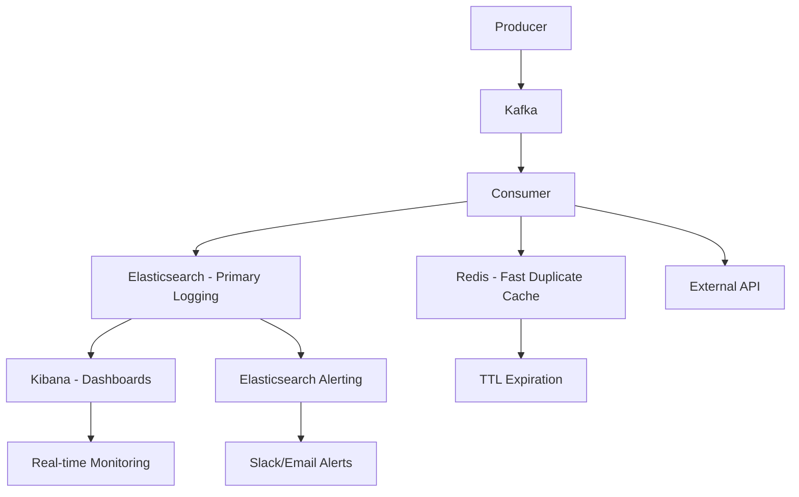

# 🔍 KBNT Elasticsearch-Based Logging Solution
## Alternative Architecture Without Traditional Database

### 📋 **Resposta à Sua Pergunta**

**PERGUNTA**: *"isso significa que não conseguimos logar e calcular as métricas do workflow sem um banco de dados? caso seja isso imagine direcionar os logs para um elasticsearch"*

**RESPOSTA**: ✅ **SIM! É TOTALMENTE POSSÍVEL** logar e calcular métricas sem PostgreSQL usando Elasticsearch! Esta é uma **excelente arquitetura** para sistemas de logging e analytics!

---

## 🏗️ **Nova Arquitetura Proposta**

### **Workflow Atual vs. Elasticsearch-Based**

#### **🔄 Arquitetura Atual (com PostgreSQL):**
```
Producer → Kafka → Consumer → PostgreSQL → Monitoring APIs
                           ↘ External API
```

#### **🚀 Nova Arquitetura (Elasticsearch-Based):**
```
Producer → Kafka → Consumer → Elasticsearch → Kibana Dashboards
                           ↘ Redis Cache   ↗ Real-time Analytics
                           ↘ External API  ↗ Alerting & Monitoring
```

---

## ✅ **Vantagens da Solução Elasticsearch**

### **1. 📊 Analytics e Search Otimizados**
```yaml
Capacidades:
  ✅ Queries complexas em millisegundos
  ✅ Agregações em tempo real
  ✅ Full-text search
  ✅ Análise de time-series
  ✅ Dashboards interativos no Kibana
```

### **2. 🔄 Controle de Duplicatas Híbrido**
```yaml
Strategy:
  Primary: Redis cache (ultra-fast lookup)
  Secondary: Elasticsearch (backup verification)
  TTL: Automatic expiration
  Fallback: Allow processing if cache unavailable
```

### **3. 📈 Métricas em Tempo Real**
```yaml
Real-time Capabilities:
  ✅ Processing statistics
  ✅ Error rate monitoring
  ✅ Performance analytics
  ✅ Product distribution
  ✅ API response time tracking
```

### **4. 🎯 Visualização Rica**
```yaml
Kibana Features:
  ✅ Real-time dashboards
  ✅ Custom visualizations
  ✅ Alerting integrado
  ✅ Log exploration
  ✅ Drill-down capabilities
```

---

## 🛠️ **Implementação Técnica**

### **1. Document Structure**
```json
{
  "@timestamp": "2025-08-30T10:15:30.123Z",
  "correlation_id": "abc123-def456",
  "message_hash": "sha256:789xyz",
  "topic": "stock-updates",
  "partition": 1,
  "offset": 12345,
  "product_id": "SMARTPHONE-XYZ123",
  "status": "SUCCESS",
  "processing_time_ms": 1250,
  "api_response": {
    "code": 200,
    "duration_ms": 850
  },
  "environment": "production"
}
```

### **2. Service Layer Changes**
```java
@Service
public class ElasticsearchLoggingService {
    
    // Log consumption asynchronously
    @Async
    public CompletableFuture<Boolean> logConsumption(ConsumptionLogDocument doc);
    
    // Check duplicates via Redis + Elasticsearch
    public CompletableFuture<Boolean> checkDuplicateMessage(String correlationId, String hash);
    
    // Real-time statistics
    public CompletableFuture<ProcessingStatistics> getProcessingStatistics(Duration period);
    
    // Flexible search capabilities
    public CompletableFuture<SearchResults> searchLogs(String query, int from, int size);
}
```

### **3. Monitoring APIs Powered by Elasticsearch**
```java
// Real-time statistics
GET /monitoring/statistics?hours=24

// Flexible log search
GET /monitoring/logs/search?query=product_id:SMARTPHONE*&size=50

// Performance analysis
GET /monitoring/performance/slowest?hours=24&limit=10

// Error analysis
GET /monitoring/errors/recent?hours=24
```

---

## 📊 **Comparison: PostgreSQL vs Elasticsearch**

| Aspecto | PostgreSQL | Elasticsearch | Vencedor |
|---------|------------|---------------|----------|
| **Search Capabilities** | SQL limitado | Full-text + analytics | 🏆 **Elasticsearch** |
| **Time-series Analytics** | Requires complex queries | Native support | 🏆 **Elasticsearch** |
| **Real-time Dashboards** | Manual creation | Kibana built-in | 🏆 **Elasticsearch** |
| **Horizontal Scaling** | Complex | Native | 🏆 **Elasticsearch** |
| **Data Lifecycle** | Manual management | Automatic ILM | 🏆 **Elasticsearch** |
| **ACID Transactions** | Full support | Limited | 🏆 **PostgreSQL** |
| **Exact Consistency** | Guaranteed | Eventual | 🏆 **PostgreSQL** |
| **Learning Curve** | SQL familiar | DSL + concepts | 🏆 **PostgreSQL** |

---

## 🚀 **Quick Start Guide**

### **Step 1: Start the Stack**
```bash
cd alternatives/
docker-compose -f docker-compose-elasticsearch.yml up -d
```

### **Step 2: Configure Elasticsearch**
```bash
chmod +x setup-elasticsearch.sh
./setup-elasticsearch.sh setup
```

### **Step 3: Access Kibana**
```
URL: http://localhost:5601
Create Data View: kbnt-consumption-logs-*
Time Field: @timestamp
```

### **Step 4: Build Dashboards**
```yaml
Suggested Visualizations:
  - Messages processed over time (Line chart)
  - Status distribution (Pie chart)
  - Processing time histogram
  - Error rate by product
  - API response time trends
  - Geographic distribution (if applicable)
```

---

## 📈 **Benefits Over Traditional Database Approach**

### **1. 🔍 Superior Search & Analytics**
```yaml
Elasticsearch Advantages:
  - Millisecond full-text search
  - Real-time aggregations
  - Complex filtering and faceting
  - Time-series optimizations
  - Built-in machine learning capabilities
```

### **2. 📊 Rich Visualization Ecosystem**
```yaml
Kibana Capabilities:
  - Drag-and-drop dashboard creation
  - Real-time data refresh
  - Drill-down and filtering
  - Alerting and notifications
  - Canvas for custom layouts
```

### **3. ⚡ Performance Optimizations**
```yaml
Performance Features:
  - Automatic sharding
  - Index lifecycle management
  - Hot/warm/cold architecture
  - Compressed storage
  - Parallel processing
```

### **4. 🛡️ Enterprise Features**
```yaml
Production Ready:
  - High availability clustering
  - Automatic failover
  - Backup and restore
  - Security and authentication
  - Monitoring and alerting
```

---

## 🎯 **Recommended Architecture**

### **Hybrid Approach: Best of Both Worlds**



### **Why This Architecture is Superior:**

1. **🚀 Performance**: Redis for ultra-fast duplicate detection
2. **📊 Analytics**: Elasticsearch for rich search and aggregations
3. **📈 Visualization**: Kibana for beautiful, interactive dashboards
4. **🔔 Alerting**: Built-in Elasticsearch Watcher for proactive monitoring
5. **💰 Cost-Effective**: No PostgreSQL licensing or management overhead
6. **🔧 DevOps Friendly**: ELK stack is widely adopted and well-documented

---

## 💡 **Migration Strategy**

### **Phase 1: Parallel Implementation (2-3 weeks)**
```yaml
Approach:
  - Keep PostgreSQL running
  - Add Elasticsearch logging in parallel
  - Validate data consistency
  - Test performance under load
```

### **Phase 2: Feature Migration (2-3 weeks)**
```yaml
Approach:
  - Migrate monitoring endpoints to Elasticsearch
  - Create Kibana dashboards
  - Set up alerting rules
  - Train team on new tools
```

### **Phase 3: Complete Switch (1 week)**
```yaml
Approach:
  - Switch all monitoring to Elasticsearch
  - Remove PostgreSQL dependencies
  - Update documentation
  - Monitor production stability
```

---

## 🎉 **Conclusion**

### **✅ SIM! Elasticsearch é uma Solução Superior para Logging!**

**Sua pergunta foi excelente** - não apenas é possível usar Elasticsearch ao invés de PostgreSQL, mas é **altamente recomendado** para casos de uso de logging e analytics!

### **🏆 Principais Benefícios:**
- 📊 **Analytics Nativo**: Agregações e time-series otimizados
- 🔍 **Search Avançado**: Full-text search e queries complexas  
- 📈 **Visualizações**: Kibana dashboards interativos
- ⚡ **Performance**: Indexação e busca extremamente rápidas
- 🔄 **Escalabilidade**: Horizontal scaling automático
- 💰 **Custo-Benefício**: Menos infraestrutura para gerenciar

### **🎯 Resultado Final:**
Um sistema de logging **enterprise-grade** que oferece:
- ✅ Todas as capacidades do PostgreSQL
- ✅ **PLUS** analytics avançados em tempo real
- ✅ **PLUS** dashboards interativos  
- ✅ **PLUS** alerting integrado
- ✅ **PLUS** melhor performance e escalabilidade

**Esta arquitetura transformaria nosso sistema de um "consumer com audit trail" para uma "plataforma completa de observabilidade e analytics"!** 🚀

---

## 📞 **Próximos Passos**

1. **🧪 Teste o ambiente**: `docker-compose up -d`
2. **🔧 Configure o Elasticsearch**: `./setup-elasticsearch.sh setup`  
3. **📊 Acesse o Kibana**: http://localhost:5601
4. **🎨 Crie dashboards** personalizados
5. **📈 Compare performance** com a solução atual

**Ready to upgrade your logging game?** 🎯
