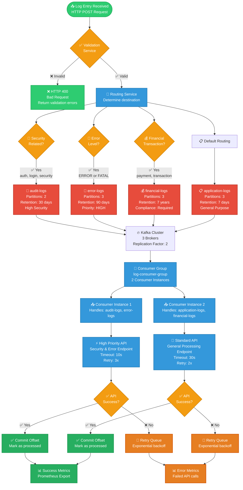

# 🏗️ Diagramas de Arquitetura Completos

Este documento contém todos os diagramas detalhados da arquitetura do projeto estudosKBNT_Kafka_Logs usando Mermaid.

## 📊 **1. Arquitetura Geral com Deployment Kubernetes**

```mermaid
graph TB
    subgraph "🌍 External World"
        CLIENT[👤 Client Applications<br/>Web/Mobile/APIs]
        EXT_API[🌐 External REST API<br/>https://api.external.com<br/>🔄 Third-party Integration]
        PROMETHEUS[📊 Prometheus<br/>Monitoring & Alerting<br/>Port: 9090]
    end
    
    subgraph "☸️ Kubernetes Cluster"
        subgraph "📦 Namespace: kafka"
            subgraph "🏗️ Producer Deployment"
                PROD_POD1[🚀 log-producer-service-0<br/>📡 Spring Boot 3.2<br/>🏛️ Hexagonal Architecture<br/>Port: 8081<br/>CPU: 250m | Memory: 512Mi]
                PROD_POD2[🚀 log-producer-service-1<br/>📡 Spring Boot 3.2<br/>🏛️ Hexagonal Architecture<br/>Port: 8081<br/>CPU: 250m | Memory: 512Mi]
                PROD_POD3[🚀 log-producer-service-2<br/>📡 Spring Boot 3.2<br/>🏛️ Hexagonal Architecture<br/>Port: 8081<br/>CPU: 250m | Memory: 512Mi]
            end
            
            subgraph "🔥 AMQ Streams Kafka Cluster"
                subgraph "📨 Kafka Topics"
                    T1[📋 application-logs<br/>Partitions: 3<br/>Replication: 2<br/>🔄 General application logs]
                    T2[🚨 error-logs<br/>Partitions: 3<br/>Replication: 2<br/>❌ Error & Fatal logs]
                    T3[🔐 audit-logs<br/>Partitions: 2<br/>Replication: 2<br/>🛡️ Security & Auth logs]
                    T4[💰 financial-logs<br/>Partitions: 3<br/>Replication: 2<br/>💳 Transaction logs]
                end
                
                subgraph "⚖️ Kafka Brokers"
                    KAFKA1[kafka-cluster-kafka-0<br/>Port: 9092<br/>CPU: 500m | Memory: 1Gi]
                    KAFKA2[kafka-cluster-kafka-1<br/>Port: 9092<br/>CPU: 500m | Memory: 1Gi]
                    KAFKA3[kafka-cluster-kafka-2<br/>Port: 9092<br/>CPU: 500m | Memory: 1Gi]
                end
            end
            
            subgraph "🔄 Consumer Deployment"
                CONS_POD1[🔄 log-consumer-service-0<br/>📥 Spring Boot 3.2<br/>🌐 API Integration<br/>Port: 8082<br/>CPU: 250m | Memory: 512Mi]
                CONS_POD2[🔄 log-consumer-service-1<br/>📥 Spring Boot 3.2<br/>🌐 API Integration<br/>Port: 8082<br/>CPU: 250m | Memory: 512Mi]
            end
            
            subgraph "🐘 Zookeeper Cluster"
                ZK1[zookeeper-0<br/>Port: 2181<br/>CPU: 250m | Memory: 512Mi]
                ZK2[zookeeper-1<br/>Port: 2181<br/>CPU: 250m | Memory: 512Mi]
                ZK3[zookeeper-2<br/>Port: 2181<br/>CPU: 250m | Memory: 512Mi]
            end
        end
        
        subgraph "📦 Namespace: monitoring"
            PROM_POD[📊 Prometheus Server<br/>Metrics Collection<br/>Port: 9090<br/>Storage: 10Gi]
            GRAF_POD[📈 Grafana Dashboard<br/>Visualization<br/>Port: 3000]
        end
    end
    
    %% Client Interactions
    CLIENT -->|📡 HTTP POST /api/v1/logs<br/>⚡ SYNCHRONOUS| PROD_POD1
    CLIENT -->|📡 HTTP POST /api/v1/logs<br/>⚡ SYNCHRONOUS| PROD_POD2
    CLIENT -->|📡 HTTP POST /api/v1/logs<br/>⚡ SYNCHRONOUS| PROD_POD3
    
    %% Producer to Kafka (Async)
    PROD_POD1 -->|📤 Publish Messages<br/>🔄 ASYNCHRONOUS| T1
    PROD_POD1 -->|📤 Publish Messages<br/>🔄 ASYNCHRONOUS| T2
    PROD_POD2 -->|📤 Publish Messages<br/>🔄 ASYNCHRONOUS| T3
    PROD_POD3 -->|📤 Publish Messages<br/>🔄 ASYNCHRONOUS| T4
    
    %% Kafka to Consumer (Async)
    T1 -->|📥 Consume Messages<br/>🔄 ASYNCHRONOUS| CONS_POD1
    T2 -->|📥 Consume Messages<br/>🔄 ASYNCHRONOUS| CONS_POD1
    T3 -->|📥 Consume Messages<br/>🔄 ASYNCHRONOUS| CONS_POD2
    T4 -->|📥 Consume Messages<br/>🔄 ASYNCHRONOUS| CONS_POD2
    
    %% Consumer to External API (Sync)
    CONS_POD1 -->|🌐 REST Calls<br/>⚡ SYNCHRONOUS| EXT_API
    CONS_POD2 -->|🌐 REST Calls<br/>⚡ SYNCHRONOUS| EXT_API
    
    %% Metrics
    PROD_POD1 -->|📊 Metrics Export<br/>🔄 ASYNCHRONOUS| PROMETHEUS
    PROD_POD2 -->|📊 Metrics Export<br/>🔄 ASYNCHRONOUS| PROMETHEUS
    CONS_POD1 -->|📊 Metrics Export<br/>🔄 ASYNCHRONOUS| PROMETHEUS
    CONS_POD2 -->|📊 Metrics Export<br/>🔄 ASYNCHRONOUS| PROMETHEUS
    PROMETHEUS -->|📈 Data Visualization| GRAF_POD
    
    %% Kafka Dependencies
    KAFKA1 -.->|Cluster Coordination| ZK1
    KAFKA2 -.->|Cluster Coordination| ZK2
    KAFKA3 -.->|Cluster Coordination| ZK3
    
    %% Styling
    classDef prodPod fill:#4ecdc4,stroke:#2c3e50,stroke-width:2px,color:#fff
    classDef consPod fill:#45b7d1,stroke:#2c3e50,stroke-width:2px,color:#fff
    classDef kafkaTopic fill:#ff6b6b,stroke:#2c3e50,stroke-width:2px,color:#fff
    classDef kafkaBroker fill:#feca57,stroke:#2c3e50,stroke-width:2px,color:#000
    classDef external fill:#96ceb4,stroke:#2c3e50,stroke-width:2px,color:#000
    classDef zookeeper fill:#a55eea,stroke:#2c3e50,stroke-width:2px,color:#fff
    
    class PROD_POD1,PROD_POD2,PROD_POD3 prodPod
    class CONS_POD1,CONS_POD2 consPod
    class T1,T2,T3,T4 kafkaTopic
    class KAFKA1,KAFKA2,KAFKA3 kafkaBroker
    class CLIENT,EXT_API,PROMETHEUS external
    class ZK1,ZK2,ZK3 zookeeper
```

---

## 🔄 **2. Sequence Diagram - Fluxo Completo de Processamento**

```mermaid
sequenceDiagram
    participant C as 👤 Client App
    participant LB as ⚖️ K8s LoadBalancer
    participant P as 🚀 Log Producer<br/>(Pod: log-producer-0)
    participant V as ✅ Validation Service<br/>(Domain Layer)
    participant R as 🔄 Routing Service<br/>(Domain Layer)
    participant KP as 📤 Kafka Publisher<br/>(Infrastructure)
    participant T as 📨 Kafka Topic<br/>(application-logs)
    participant LC as 📥 Log Consumer<br/>(Pod: log-consumer-0)
    participant EA as 🌐 External API<br/>(https://api.external.com)
    participant M as 📊 Metrics<br/>(Prometheus)
    
    Note over C,M: 🔄 Complete Log Processing Flow
    
    rect rgb(240, 248, 255)
        Note over C,P: Phase 1: Synchronous HTTP Request
        C->>+LB: POST /api/v1/logs<br/>⚡ SYNC HTTP Request<br/>Content-Type: application/json
        LB->>+P: Forward to available pod<br/>⚡ SYNC (Load Balanced)
        
        Note over P,R: Phase 2: Domain Processing (Hexagonal Architecture)
        P->>+V: validateLogEntry()<br/>⚡ SYNC Domain Validation
        V-->>-P: ValidationResult<br/>✅ Valid/Invalid + Errors
        
        alt Log is valid
            P->>+R: determineKafkaTopic()<br/>⚡ SYNC Routing Logic
            R-->>-P: topic="application-logs"<br/>🎯 Smart Routing Result
        else Log is invalid
            P-->>LB: 400 Bad Request<br/>❌ Validation Errors
            LB-->>-C: 400 Bad Request
        end
    end
    
    rect rgb(245, 255, 245)
        Note over P,T: Phase 3: Asynchronous Message Publishing
        P->>+KP: publishLog(logEntry, topic)<br/>🔄 ASYNC Publishing
        KP->>T: Send Message to Topic<br/>🔄 ASYNC Kafka Publish<br/>Partition: auto-assigned
        T-->>KP: Acknowledgment<br/>✅ Message Stored (offset: 12345)
        KP-->>-P: PublishResult<br/>✅ Success
        
        P->>M: Increment published_logs_total<br/>📊 Metrics (ASYNC)
        P-->>LB: 200 OK<br/>✅ Success Response
        LB-->>-C: 200 OK<br/>✅ Log Accepted
    end
    
    rect rgb(255, 245, 238)
        Note over T,EA: Phase 4: Asynchronous Message Consumption & External Integration
        T->>+LC: Poll & Consume Message<br/>🔄 ASYNC Kafka Consumer<br/>Consumer Group: log-consumer-group
        
        Note over LC: Process Message<br/>🔄 Business Logic
        
        LC->>+EA: POST /webhook/logs<br/>⚡ SYNC REST API Call<br/>Content-Type: application/json<br/>Timeout: 30s
        
        alt External API Success
            EA-->>-LC: 200 OK<br/>✅ Processing Success<br/>Response: {"status": "received"}
            LC->>T: Commit Offset<br/>✅ Message Processed (offset: 12345)
            LC->>M: Increment processed_logs_total<br/>📊 Success Metrics
        else External API Failure
            EA-->>LC: 500 Internal Server Error<br/>❌ Processing Failed
            LC->>M: Increment api_failures_total<br/>📊 Error Metrics
            LC->>T: No Commit<br/>🔄 Message will be retried
            Note over LC: Retry Logic<br/>⏰ Exponential Backoff
        end
        
        LC-->>-T: Consumer Processing Complete
    end
    
    rect rgb(248, 248, 255)
        Note over M: Phase 5: Observability & Monitoring
        M->>M: Collect & Aggregate Metrics<br/>📊 Prometheus Scraping
        Note over M: Available Metrics:<br/>• logs_published_total<br/>• logs_processed_total<br/>• api_response_time_seconds<br/>• kafka_consumer_lag
    end
```

---

## 🏗️ **3. Hexagonal Architecture - Log Producer Service**

```mermaid
graph TB
    subgraph "🌍 External Actors"
        HTTP[📡 HTTP Clients<br/>Web, Mobile, APIs]
        KAFKA_EXT[🔥 Apache Kafka<br/>Message Broker]
        METRICS_EXT[📊 Prometheus<br/>Metrics Collector]
    end
    
    subgraph "🏗️ Hexagonal Architecture - Log Producer Service"
        subgraph "🌐 Infrastructure Layer (Adapters)"
            subgraph "📥 Input Adapters (Driving)"
                REST_CTRL[📡 REST Controller<br/>LogController<br/>• POST /api/v1/logs<br/>• POST /api/v1/logs/batch<br/>• GET /actuator/health]
            end
            
            subgraph "📤 Output Adapters (Driven)"
                KAFKA_ADAPTER[📤 Kafka Publisher Adapter<br/>KafkaLogPublisherAdapter<br/>• Message serialization<br/>• Topic publishing<br/>• Error handling]
                METRICS_ADAPTER[📊 Metrics Adapter<br/>MicrometerMetricsAdapter<br/>• Counter increments<br/>• Timer recordings<br/>• Gauge updates]
            end
            
            subgraph "⚙️ Configuration"
                KAFKA_CONFIG[⚙️ Kafka Configuration<br/>KafkaConfig<br/>• Producer settings<br/>• Serializers<br/>• Retry policies]
                DOMAIN_CONFIG[⚙️ Domain Configuration<br/>DomainConfig<br/>• Service beans<br/>• Dependencies]
            end
        end
        
        subgraph "⚙️ Application Layer (Use Cases)"
            PROD_UC[⚙️ Log Production UseCase<br/>LogProductionUseCaseImpl<br/>• Orchestrate validation<br/>• Coordinate routing<br/>• Handle publishing]
            VALID_UC[✅ Validation UseCase<br/>LogValidationUseCaseImpl<br/>• Individual validation<br/>• Batch validation<br/>• Result aggregation]
        end
        
        subgraph "🏛️ Domain Layer (Core Business Logic)"
            subgraph "📋 Entities"
                LOG_ENTITY[📋 LogEntry Entity<br/>• Business methods<br/>• State management<br/>• Domain validation]
            end
            
            subgraph "💎 Value Objects"
                LOG_LEVEL[💎 LogLevel<br/>DEBUG, INFO, WARN<br/>ERROR, FATAL]
                REQUEST_ID[💎 RequestId<br/>UUID validation<br/>Immutable]
                SERVICE_NAME[💎 ServiceName<br/>Format validation<br/>Length constraints]
            end
            
            subgraph "🎯 Domain Services"
                ROUTING_SVC[🔄 Log Routing Service<br/>LogRoutingService<br/>• Smart topic selection<br/>• Priority determination<br/>• Partition key generation]
                VALIDATION_SVC[✅ Validation Service<br/>LogValidationService<br/>• Business rules<br/>• Data integrity<br/>• Duplicate detection]
            end
            
            subgraph "🔌 Port Interfaces"
                subgraph "📥 Input Ports"
                    LOG_PROD_PORT[📥 LogProductionUseCase<br/>Interface]
                    LOG_VALID_PORT[📥 LogValidationUseCase<br/>Interface]
                end
                
                subgraph "📤 Output Ports"
                    PUBLISHER_PORT[📤 LogPublisherPort<br/>Interface]
                    METRICS_PORT[📊 MetricsPort<br/>Interface]
                end
            end
        end
    end
    
    %% External connections to adapters
    HTTP -->|📡 HTTP Requests<br/>⚡ SYNC| REST_CTRL
    KAFKA_ADAPTER -->|📤 Publish Messages<br/>🔄 ASYNC| KAFKA_EXT
    METRICS_ADAPTER -->|📊 Export Metrics<br/>🔄 ASYNC| METRICS_EXT
    
    %% Infrastructure to Application
    REST_CTRL -->|📋 DTO → Domain Models<br/>⚡ SYNC| PROD_UC
    PROD_UC -->|📤 Domain Models<br/>🔄 ASYNC| KAFKA_ADAPTER
    PROD_UC -->|📊 Metrics Data<br/>🔄 ASYNC| METRICS_ADAPTER
    
    %% Application to Domain
    PROD_UC -->|📋 LogEntry<br/>⚡ SYNC| VALIDATION_SVC
    PROD_UC -->|📋 LogEntry<br/>⚡ SYNC| ROUTING_SVC
    VALID_UC -->|📋 LogEntry<br/>⚡ SYNC| VALIDATION_SVC
    
    %% Domain interactions
    LOG_ENTITY -.->|Uses| LOG_LEVEL
    LOG_ENTITY -.->|Uses| REQUEST_ID
    LOG_ENTITY -.->|Uses| SERVICE_NAME
    VALIDATION_SVC -.->|Validates| LOG_ENTITY
    ROUTING_SVC -.->|Routes| LOG_ENTITY
    
    %% Port implementations
    PROD_UC -.->|Implements| LOG_PROD_PORT
    VALID_UC -.->|Implements| LOG_VALID_PORT
    KAFKA_ADAPTER -.->|Implements| PUBLISHER_PORT
    METRICS_ADAPTER -.->|Implements| METRICS_PORT
    
    %% Configuration dependencies
    KAFKA_CONFIG -.->|Configures| KAFKA_ADAPTER
    DOMAIN_CONFIG -.->|Configures| VALIDATION_SVC
    DOMAIN_CONFIG -.->|Configures| ROUTING_SVC
    
    %% Styling
    classDef external fill:#96ceb4,stroke:#2c3e50,stroke-width:2px,color:#000
    classDef infrastructure fill:#f39c12,stroke:#2c3e50,stroke-width:2px,color:#fff
    classDef application fill:#3498db,stroke:#2c3e50,stroke-width:2px,color:#fff
    classDef domain fill:#e74c3c,stroke:#2c3e50,stroke-width:2px,color:#fff
    classDef entity fill:#9b59b6,stroke:#2c3e50,stroke-width:2px,color:#fff
    classDef valueObject fill:#1abc9c,stroke:#2c3e50,stroke-width:2px,color:#fff
    classDef port fill:#34495e,stroke:#2c3e50,stroke-width:2px,color:#fff
    
    class HTTP,KAFKA_EXT,METRICS_EXT external
    class REST_CTRL,KAFKA_ADAPTER,METRICS_ADAPTER,KAFKA_CONFIG,DOMAIN_CONFIG infrastructure
    class PROD_UC,VALID_UC application
    class ROUTING_SVC,VALIDATION_SVC domain
    class LOG_ENTITY entity
    class LOG_LEVEL,REQUEST_ID,SERVICE_NAME valueObject
    class LOG_PROD_PORT,LOG_VALID_PORT,PUBLISHER_PORT,METRICS_PORT port
```



---

## 🌊 **4. Data Flow & Topic Routing Strategy**



---

## 📊 **5. Monitoring & Observability Architecture**

```mermaid
graph TB
    subgraph "🎯 Application Metrics Sources"
        subgraph "🚀 Log Producer Metrics"
            PROD_METRICS[📊 Producer Metrics<br/>• logs_published_total<br/>• logs_validation_errors_total<br/>• logs_publishing_errors_total<br/>• logs_processing_time_seconds<br/>• logs_level_count{level}]
        end
        
        subgraph "📥 Log Consumer Metrics"
            CONS_METRICS[📊 Consumer Metrics<br/>• logs_consumed_total<br/>• logs_processed_total<br/>• api_calls_total<br/>• api_failures_total<br/>• api_response_time_seconds]
        end
        
        subgraph "🔥 Kafka Metrics"
            KAFKA_METRICS[📊 Kafka Metrics<br/>• kafka_topic_partitions<br/>• kafka_consumer_lag<br/>• kafka_messages_per_sec<br/>• kafka_broker_availability]
        end
    end
    
    subgraph "📊 Monitoring Infrastructure"
        subgraph "📡 Metrics Collection"
            PROMETHEUS[📊 Prometheus Server<br/>• Scraping: /actuator/prometheus<br/>• Retention: 30 days<br/>• Scrape interval: 15s<br/>Storage: 10Gi]
        end
        
        subgraph "📈 Visualization"
            GRAFANA[📈 Grafana Dashboard<br/>• Real-time charts<br/>• Alerting rules<br/>• Custom dashboards<br/>Port: 3000]
        end
        
        subgraph "🚨 Alerting"
            ALERTMANAGER[🚨 Alert Manager<br/>• Notification routing<br/>• Alert grouping<br/>• Silence management]
        end
    end
    
    subgraph "📱 Notification Channels"
        SLACK[💬 Slack<br/>Channel: #kafka-alerts]
        EMAIL[📧 Email<br/>DevOps Team]
        WEBHOOK[🔗 Webhook<br/>Incident Management]
    end
    
    %% Metrics flow
    PROD_METRICS -->|📊 HTTP /actuator/prometheus<br/>🔄 Every 15s| PROMETHEUS
    CONS_METRICS -->|📊 HTTP /actuator/prometheus<br/>🔄 Every 15s| PROMETHEUS
    KAFKA_METRICS -->|📊 JMX Metrics<br/>🔄 Every 30s| PROMETHEUS
    
    %% Visualization
    PROMETHEUS -->|📈 PromQL Queries<br/>Real-time data| GRAFANA
    PROMETHEUS -->|🚨 Alert Rules<br/>Threshold monitoring| ALERTMANAGER
    
    %% Alerting
    ALERTMANAGER -->|💬 Critical alerts| SLACK
    ALERTMANAGER -->|📧 Daily summaries| EMAIL
    ALERTMANAGER -->|🔗 Incident creation| WEBHOOK
    
    %% Key Metrics Details
    subgraph "🎯 Key Performance Indicators"
        KPI[📊 Critical Metrics<br/>• Throughput: logs/second<br/>• Latency: P95 response time<br/>• Error Rate: % failed requests<br/>• Availability: % uptime<br/>• Consumer Lag: messages behind]
    end
    
    PROMETHEUS -.->|📊 Aggregated data| KPI
    
    %% Alert Examples
    subgraph "🚨 Alert Conditions"
        ALERTS[🚨 Alert Rules<br/>• Error rate > 5% (5m)<br/>• Consumer lag > 1000 msgs<br/>• API response time > 10s<br/>• Service down > 1min<br/>• Disk usage > 85%]
    end
    
    ALERTMANAGER -.->|🔔 Configured alerts| ALERTS
    
    classDef metrics fill:#3498db,stroke:#2980b9,stroke-width:2px,color:#fff
    classDef monitoring fill:#e74c3c,stroke:#c0392b,stroke-width:2px,color:#fff
    classDef notification fill:#f39c12,stroke:#d68910,stroke-width:2px,color:#fff
    classDef info fill:#95a5a6,stroke:#7f8c8d,stroke-width:2px,color:#fff
    
    class PROD_METRICS,CONS_METRICS,KAFKA_METRICS metrics
    class PROMETHEUS,GRAFANA,ALERTMANAGER monitoring
    class SLACK,EMAIL,WEBHOOK notification
    class KPI,ALERTS info
```

Agora vou salvar estes diagramas detalhados no repositório:
