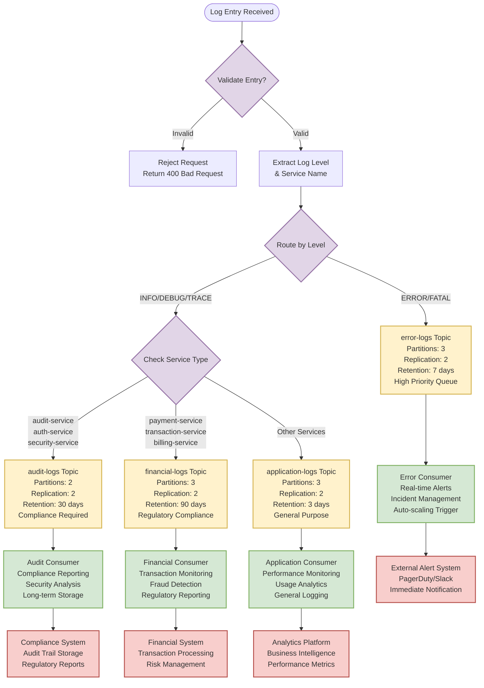

# 🏗️ Diagramas de Arquitetura Completos - Sistema de Gerenciamento Virtual de Estoque

[](../README.md)
[](#)
[](#)

## 📋 Índice

1. [🏛️ Arquitetura Hexagonal Completa](#️-arquitetura-hexagonal-completa)
2. [🚀 Deployment Kubernetes Enterprise](#-deployment-kubernetes-enterprise)
3. [🔄 Fluxo de Mensagens Kafka](#-fluxo-de-mensagens-kafka)
4. [📊 Monitoramento e Observabilidade](#-monitoramento-e-observabilidade)
5. [🧪 Cenários de Teste e Simulação](#-cenários-de-teste-e-simulação)

---

## 🏛️ Arquitetura Hexagonal Completa

### 🎯 Virtual Stock Management System - Hexagonal Architecture

```mermaid
graph TB
    subgraph "🌐 External Clients"
        TRADER[👤 Stock Trader]
        MOBILE[📱 Mobile App]
        WEB[🌐 Web Portal]
        API_CLIENT[🔗 API Client]
    end
    
    subgraph "🏛️ Virtual Stock Service (Hexagonal Architecture)"
        subgraph "🔌 Input Adapters"
            REST_CTRL[🌐 VirtualStockController<br/>@RestController<br/>Handles HTTP requests]
            HEALTH_CTRL[💚 HealthController<br/>@RestController<br/>Actuator endpoints]
            MGMT_CTRL[⚙️ ManagementController<br/>@RestController<br/>Admin operations]
        end
        
        subgraph "📥 Input Ports"
            STOCK_UC[🎯 StockManagementUseCase<br/>Interface<br/>Business operations]
            HEALTH_PORT[💚 HealthCheckPort<br/>Interface<br/>System health]
        end
        
        subgraph "⚙️ Application Layer"
            STOCK_APP[⚙️ StockManagementApplicationService<br/>@Service<br/>Orchestrates use cases]
            EVENT_PUB[📤 StockEventPublisher<br/>@Service<br/>Publishes domain events]
            VALIDATION[✅ ValidationService<br/>@Service<br/>Business rule validation]
        end
        
        subgraph "🎯 Domain Core"
            STOCK_AGG[📦 Stock<br/>Aggregate Root<br/>stockId, productId, quantity, price]
            STOCK_EVENT[📢 StockUpdatedEvent<br/>Domain Event<br/>CREATION, UPDATE, RESERVATION]
            VALUE_OBJ[💎 Value Objects<br/>StockId, ProductId<br/>Immutable identifiers]
            BIZ_RULES[📋 Business Rules<br/>canReserve(), isLowStock()<br/>Domain logic]
        end
        
        subgraph "📤 Output Ports"
            REPO_PORT[🗄️ StockRepository<br/>Interface<br/>Persistence abstraction]
            EVENT_PORT[📤 EventPublisherPort<br/>Interface<br/>Event publishing]
            METRICS_PORT[📊 MetricsPort<br/>Interface<br/>Metrics collection]
        end
        
        subgraph "🔌 Output Adapters"
            JPA_REPO[🗄️ JpaStockRepositoryAdapter<br/>@Repository<br/>PostgreSQL persistence]
            KAFKA_PUB[🔥 KafkaEventPublisherAdapter<br/>@Service<br/>Kafka message publishing]
            PROMETHEUS[📊 PrometheusMetricsAdapter<br/>@Component<br/>Metrics export]
        end
    end
    
    subgraph "🔥 Red Hat AMQ Streams (Event Backbone)"
        TOPIC_STOCK[📢 virtual-stock-updates<br/>Partitions: 3<br/>Replication: 3<br/>Main events]
        TOPIC_HIGH[⚡ high-priority-updates<br/>Partitions: 3<br/>Replication: 3<br/>Critical events]
        TOPIC_RETRY[🔄 retry-topic<br/>Partitions: 3<br/>Replication: 3<br/>Failed messages]
        TOPIC_DLT[💀 dead-letter-topic<br/>Partitions: 1<br/>Replication: 3<br/>Unprocessable]
    end
    
    subgraph "🛡️ ACL Virtual Stock Service (Anti-Corruption Layer)"
        subgraph "🔌 Input Adapters ACL"
            KAFKA_CONS[🔥 KafkaConsumerAdapter<br/>@KafkaListener<br/>Consumes stock events]
            HEALTH_ACL[💚 HealthController<br/>@RestController<br/>Service health]
        end
        
        subgraph "⚙️ Application Layer ACL"
            MSG_PROC[⚙️ MessageProcessingService<br/>@Service<br/>Processes stock events]
            TRANS_SERVICE[🔄 TranslationService<br/>@Service<br/>Internal→External format]
            API_INT[🌐 ExternalApiIntegration<br/>@Service<br/>Third-party integration]
        end
        
        subgraph "🎯 Domain Core ACL"
            EXT_STOCK[🔗 ExternalStockIntegration<br/>Domain Model<br/>External system representation]
            AUDIT_LOG[📋 ConsumptionLog<br/>Entity<br/>Processing audit trail]
            TRANS_RULES[🔄 TranslationRules<br/>Domain Logic<br/>Format conversion rules]
        end
        
        subgraph "🔌 Output Adapters ACL"
            POSTGRES_ACL[🐘 PostgreSQLAdapter<br/>@Repository<br/>Audit persistence]
            EXT_CLIENT[🌐 ExternalApiClient<br/>@Service<br/>HTTP client for external APIs]
            ELASTIC_ACL[🔍 ElasticsearchAdapter<br/>@Service<br/>Log aggregation]
        end
    end
    
    subgraph "🌐 External Systems"
        EXT_TRADING[📈 Trading Platform API<br/>External REST API<br/>Stock price feeds]
        EXT_INVENTORY[📦 Inventory System<br/>Legacy ERP<br/>Stock management]
        EXT_ANALYTICS[📊 Analytics Platform<br/>Data Warehouse<br/>Business intelligence]
    end
    
    subgraph "💾 Data & Monitoring"
        POSTGRES_DB[(🐘 PostgreSQL<br/>Primary Database<br/>ACID transactions)]
        ELASTIC_DB[(🔍 Elasticsearch<br/>Log Aggregation<br/>Search & Analytics)]
        PROMETHEUS_DB[(📊 Prometheus<br/>Metrics Storage<br/>Time series data)]
        GRAFANA[📊 Grafana Dashboard<br/>Visualization<br/>Real-time monitoring]
    end

    %% External to Virtual Stock Service
    TRADER --> REST_CTRL
    MOBILE --> REST_CTRL
    WEB --> REST_CTRL
    API_CLIENT --> REST_CTRL
    
    %% Input flow within Virtual Stock Service
    REST_CTRL --> STOCK_UC
    HEALTH_CTRL --> HEALTH_PORT
    STOCK_UC --> STOCK_APP
    STOCK_APP --> VALIDATION
    STOCK_APP --> STOCK_AGG
    STOCK_AGG --> STOCK_EVENT
    STOCK_APP --> EVENT_PUB
    
    %% Output flow within Virtual Stock Service
    EVENT_PUB --> EVENT_PORT
    STOCK_APP --> REPO_PORT
    EVENT_PORT --> KAFKA_PUB
    REPO_PORT --> JPA_REPO
    STOCK_APP --> METRICS_PORT
    METRICS_PORT --> PROMETHEUS
    
    %% Kafka message flow
    KAFKA_PUB --> TOPIC_STOCK
    KAFKA_PUB --> TOPIC_HIGH
    TOPIC_STOCK --> KAFKA_CONS
    TOPIC_HIGH --> KAFKA_CONS
    TOPIC_RETRY --> KAFKA_CONS
    
    %% ACL processing flow
    KAFKA_CONS --> MSG_PROC
    MSG_PROC --> TRANS_SERVICE
    TRANS_SERVICE --> EXT_STOCK
    MSG_PROC --> API_INT
    MSG_PROC --> AUDIT_LOG
    
    %% ACL output flow
    API_INT --> EXT_CLIENT
    AUDIT_LOG --> POSTGRES_ACL
    MSG_PROC --> ELASTIC_ACL
    
    %% External integrations
    EXT_CLIENT --> EXT_TRADING
    EXT_CLIENT --> EXT_INVENTORY
    EXT_CLIENT --> EXT_ANALYTICS
    
    %% Data persistence
    JPA_REPO --> POSTGRES_DB
    POSTGRES_ACL --> POSTGRES_DB
    ELASTIC_ACL --> ELASTIC_DB
    PROMETHEUS --> PROMETHEUS_DB
    PROMETHEUS_DB --> GRAFANA
    
    %% Styling
    classDef inputAdapter fill:#e3f2fd,stroke:#1976d2,stroke-width:2px
    classDef outputAdapter fill:#f3e5f5,stroke:#7b1fa2,stroke-width:2px
    classDef domain fill:#e8f5e8,stroke:#388e3c,stroke-width:2px
    classDef application fill:#fff3e0,stroke:#f57c00,stroke-width:2px
    classDef external fill:#fce4ec,stroke:#c2185b,stroke-width:2px
    classDef kafka fill:#ffebee,stroke:#d32f2f,stroke-width:2px
    classDef database fill:#e0f2f1,stroke:#00796b,stroke-width:2px
    
    class REST_CTRL,HEALTH_CTRL,MGMT_CTRL,KAFKA_CONS,HEALTH_ACL inputAdapter
    class JPA_REPO,KAFKA_PUB,PROMETHEUS,POSTGRES_ACL,EXT_CLIENT,ELASTIC_ACL outputAdapter
    class STOCK_AGG,STOCK_EVENT,VALUE_OBJ,BIZ_RULES,EXT_STOCK,AUDIT_LOG,TRANS_RULES domain
    class STOCK_APP,EVENT_PUB,VALIDATION,MSG_PROC,TRANS_SERVICE,API_INT application
    class EXT_TRADING,EXT_INVENTORY,EXT_ANALYTICS external
    class TOPIC_STOCK,TOPIC_HIGH,TOPIC_RETRY,TOPIC_DLT kafka
    class POSTGRES_DB,ELASTIC_DB,PROMETHEUS_DB,GRAFANA database
```

---

## 🚀 Deployment Kubernetes Enterprise

### 🎯 Production-Ready Infrastructure

```mermaid
graph TB
    subgraph "🌐 Load Balancer & Ingress"
        LB[⚖️ AWS Load Balancer<br/>Application Load Balancer<br/>SSL Termination<br/>Multi-AZ]
        INGRESS[🌐 NGINX Ingress Controller<br/>Host-based routing<br/>TLS certificates<br/>Rate limiting]
    end
    
    subgraph "☸️ Kubernetes Cluster (EKS/OpenShift)"
        subgraph "🏛️ Namespace: virtual-stock-system"
            subgraph "📦 Virtual Stock Service Deployment"
                VS_POD1[🏛️ virtual-stock-service-0<br/>Image: virtual-stock:2.0.0<br/>CPU: 500m-1000m<br/>Memory: 1Gi-2Gi<br/>Port: 8080]
                VS_POD2[🏛️ virtual-stock-service-1<br/>Image: virtual-stock:2.0.0<br/>CPU: 500m-1000m<br/>Memory: 1Gi-2Gi<br/>Port: 8080]
                VS_POD3[🏛️ virtual-stock-service-2<br/>Image: virtual-stock:2.0.0<br/>CPU: 500m-1000m<br/>Memory: 1Gi-2Gi<br/>Port: 8080]
                
                VS_SVC[🌐 virtual-stock-service<br/>ClusterIP Service<br/>Port: 8080<br/>LoadBalancer algorithm]
                VS_HPA[📈 HorizontalPodAutoscaler<br/>Min replicas: 2<br/>Max replicas: 10<br/>CPU target: 70%]
            end
            
            subgraph "🛡️ ACL Service Deployment"  
                ACL_POD1[🛡️ acl-virtual-stock-service-0<br/>Image: acl-stock:2.0.0<br/>CPU: 300m-600m<br/>Memory: 768Mi-1.5Gi<br/>Port: 8081]
                ACL_POD2[🛡️ acl-virtual-stock-service-1<br/>Image: acl-stock:2.0.0<br/>CPU: 300m-600m<br/>Memory: 768Mi-1.5Gi<br/>Port: 8081]
                
                ACL_SVC[🌐 acl-virtual-stock-service<br/>ClusterIP Service<br/>Port: 8081<br/>Internal only]
                ACL_HPA[📈 HorizontalPodAutoscaler<br/>Min replicas: 2<br/>Max replicas: 8<br/>CPU target: 75%]
            end
            
            subgraph "🔥 Red Hat AMQ Streams"
                KAFKA_CLUSTER[🔥 Kafka Cluster<br/>Strimzi Operator managed<br/>Version: 3.5.0<br/>Brokers: 3]
                
                KAFKA_POD1[🔥 kafka-cluster-kafka-0<br/>CPU: 1000m-2000m<br/>Memory: 2Gi-4Gi<br/>Storage: 100Gi SSD<br/>Port: 9092]
                KAFKA_POD2[🔥 kafka-cluster-kafka-1<br/>CPU: 1000m-2000m<br/>Memory: 2Gi-4Gi<br/>Storage: 100Gi SSD<br/>Port: 9092]
                KAFKA_POD3[🔥 kafka-cluster-kafka-2<br/>CPU: 1000m-2000m<br/>Memory: 2Gi-4Gi<br/>Storage: 100Gi SSD<br/>Port: 9092]
                
                ZK_POD1[🌿 zookeeper-0<br/>CPU: 200m-500m<br/>Memory: 512Mi-1Gi<br/>Storage: 10Gi SSD<br/>Port: 2181]
                ZK_POD2[🌿 zookeeper-1<br/>CPU: 200m-500m<br/>Memory: 512Mi-1Gi<br/>Storage: 10Gi SSD<br/>Port: 2181]
                ZK_POD3[🌿 zookeeper-2<br/>CPU: 200m-500m<br/>Memory: 512Mi-1Gi<br/>Storage: 10Gi SSD<br/>Port: 2181]
            end
            
            subgraph "📊 Monitoring Stack"
                PROMETHEUS[📊 Prometheus<br/>CPU: 500m-1000m<br/>Memory: 2Gi-4Gi<br/>Storage: 50Gi<br/>Port: 9090]
                GRAFANA[📈 Grafana<br/>CPU: 200m-400m<br/>Memory: 512Mi-1Gi<br/>Port: 3000<br/>Admin UI]
                ALERTMANAGER[🚨 AlertManager<br/>CPU: 100m-200m<br/>Memory: 256Mi-512Mi<br/>Port: 9093]
            end
        end
        
        subgraph "💾 Namespace: data-persistence"
            POSTGRES_CLUSTER[🐘 PostgreSQL Cluster<br/>Primary + 2 Replicas<br/>CPU: 1000m-2000m<br/>Memory: 2Gi-4Gi<br/>Storage: 200Gi SSD]
            
            POSTGRES_PRIMARY[🐘 postgresql-primary<br/>Read/Write operations<br/>Streaming replication<br/>Port: 5432]
            POSTGRES_REPLICA1[🐘 postgresql-replica-1<br/>Read-only operations<br/>Hot standby<br/>Port: 5432]
            POSTGRES_REPLICA2[🐘 postgresql-replica-2<br/>Read-only operations<br/>Hot standby<br/>Port: 5432]
            
            ELASTIC_CLUSTER[🔍 Elasticsearch Cluster<br/>3 Master + 3 Data nodes<br/>CPU: 1000m-2000m<br/>Memory: 4Gi-8Gi<br/>Storage: 500Gi SSD]
        end
        
        subgraph "🔐 Security & Configuration"
            SECRETS[🔐 Kubernetes Secrets<br/>Database credentials<br/>Kafka certificates<br/>External API keys]
            CONFIG_MAPS[⚙️ ConfigMaps<br/>Application configuration<br/>Kafka topics<br/>Logging configuration]
            RBAC[🛡️ RBAC Policies<br/>Service accounts<br/>Role bindings<br/>Security policies]
        end
    end
    
    subgraph "☁️ Cloud Services (AWS)"
        RDS[🗄️ Amazon RDS<br/>PostgreSQL 15<br/>Multi-AZ deployment<br/>Automated backups<br/>Read replicas]
        MSK[🔥 Amazon MSK<br/>Managed Kafka<br/>3 brokers across AZs<br/>Auto scaling<br/>Monitoring]
        CLOUDWATCH[📊 CloudWatch<br/>Logs aggregation<br/>Metrics monitoring<br/>Custom alarms]
    end

    %% Traffic flow
    LB --> INGRESS
    INGRESS --> VS_SVC
    VS_SVC --> VS_POD1
    VS_SVC --> VS_POD2  
    VS_SVC --> VS_POD3
    
    %% Internal service communication
    VS_POD1 --> KAFKA_POD1
    VS_POD2 --> KAFKA_POD2
    VS_POD3 --> KAFKA_POD3
    
    KAFKA_POD1 --> ACL_POD1
    KAFKA_POD2 --> ACL_POD2
    
    %% Data persistence
    VS_POD1 --> POSTGRES_PRIMARY
    ACL_POD1 --> POSTGRES_PRIMARY
    ACL_POD2 --> POSTGRES_REPLICA1
    
    %% Monitoring
    VS_POD1 -.-> PROMETHEUS
    VS_POD2 -.-> PROMETHEUS  
    VS_POD3 -.-> PROMETHEUS
    ACL_POD1 -.-> PROMETHEUS
    ACL_POD2 -.-> PROMETHEUS
    KAFKA_POD1 -.-> PROMETHEUS
    
    PROMETHEUS --> GRAFANA
    PROMETHEUS --> ALERTMANAGER
    
    %% HPA connections
    VS_HPA -.-> VS_POD1
    VS_HPA -.-> VS_POD2
    VS_HPA -.-> VS_POD3
    ACL_HPA -.-> ACL_POD1
    ACL_HPA -.-> ACL_POD2
    
    %% Security
    SECRETS -.-> VS_POD1
    SECRETS -.-> ACL_POD1
    CONFIG_MAPS -.-> VS_POD1
    CONFIG_MAPS -.-> ACL_POD1
    
    %% Cloud alternatives
    RDS -.->|Alternative| POSTGRES_PRIMARY
    MSK -.->|Alternative| KAFKA_POD1
    CLOUDWATCH -.->|Alternative| PROMETHEUS
    
    %% Styling
    classDef virtualStock fill:#e1f5fe,stroke:#0277bd,stroke-width:3px
    classDef aclService fill:#f3e5f5,stroke:#7b1fa2,stroke-width:3px
    classDef kafka fill:#fff3e0,stroke:#ef6c00,stroke-width:3px
    classDef database fill:#e8f5e8,stroke:#2e7d32,stroke-width:3px
    classDef monitoring fill:#fce4ec,stroke:#c2185b,stroke-width:3px
    classDef infrastructure fill:#f5f5f5,stroke:#424242,stroke-width:2px
    classDef cloud fill:#e0f2f1,stroke:#00695c,stroke-width:2px
    
    class VS_POD1,VS_POD2,VS_POD3,VS_SVC,VS_HPA virtualStock
    class ACL_POD1,ACL_POD2,ACL_SVC,ACL_HPA aclService
    class KAFKA_POD1,KAFKA_POD2,KAFKA_POD3,KAFKA_CLUSTER,ZK_POD1,ZK_POD2,ZK_POD3 kafka
    class POSTGRES_PRIMARY,POSTGRES_REPLICA1,POSTGRES_REPLICA2,POSTGRES_CLUSTER,ELASTIC_CLUSTER database
    class PROMETHEUS,GRAFANA,ALERTMANAGER monitoring
    class LB,INGRESS,SECRETS,CONFIG_MAPS,RBAC infrastructure
    class RDS,MSK,CLOUDWATCH cloud
```


    
    class PROD_POD1,PROD_POD2,PROD_POD3 prodClass
    class CONS_POD1,CONS_POD2 consClass
    class KAFKA1,KAFKA2,KAFKA3,T1,T2,T3,T4 kafkaClass
    class ZK1,ZK2,ZK3 zkClass
    class PROMETHEUS,PROM_SERVER,GRAFANA monClass
```

## 2. Fluxo de Processamento de Logs - Sequência Completa

```mermaid
sequenceDiagram
    participant C as Client App
    participant LB as Load Balancer
    participant P1 as Producer-1
    participant P2 as Producer-2
    participant KT as Kafka Topics
    participant C1 as Consumer-1
    participant C2 as Consumer-2
    participant API as External API
    participant MON as Monitoring
    
    Note over C,API: Fluxo Síncrono - Produção de Logs
    
    C->>+LB: POST /api/logs Log Request
---

## 🔄 Fluxo de Mensagens Kafka - Virtual Stock System

### 📢 Workflow Completo: Stock Management Events

```mermaid
sequenceDiagram
    participant TC as 👤 Trading Client
    participant LB as ⚖️ Load Balancer
    participant VS as 🏛️ Virtual Stock Service
    participant DOM as 🎯 Domain Layer
    participant KP as 🔥 Kafka Publisher
    participant K as 📢 AMQ Streams
    participant KC as 📥 Kafka Consumer
    participant ACL as 🛡️ ACL Service
    participant EXT as 🌐 External Trading API
    participant DB as 🐘 PostgreSQL
    participant MON as 📊 Monitoring

    Note over TC,MON: 📦 Stock Creation Workflow

    TC->>+LB: POST /api/v1/virtual-stock/stocks<br/>{productId: "AAPL", quantity: 150, price: 150.00}
    LB->>+VS: Route to Virtual Stock Instance

    VS->>+DOM: createStock(CreateStockCommand)
    
    Note over DOM: 🎯 Domain Processing
    DOM->>DOM: validateStockCreation()
    DOM->>DOM: Stock.builder().build()
    DOM->>DOM: StockUpdatedEvent.forCreation()
    
    DOM-->>-VS: StockCreationResult.success()
    
    VS->>+KP: publishStockUpdatedAsync(event)
    
    Note over KP: 📤 Event Publishing Strategy
    alt High Priority Stock (Price > $100)
        KP->>+K: send("high-priority-updates", event)
    else Normal Priority Stock  
        KP->>+K: send("virtual-stock-updates", event)
    end
    K-->>-KP: Ack (at-least-once delivery)
    KP-->>-VS: Event published successfully
    
    VS-->>-LB: 201 CREATED {stockId: "STK-001", totalValue: "$22,500"}
    LB-->>-TC: HTTP 201 Stock Created

    Note over K,MON: 🔄 Asynchronous Processing Flow

    par ACL Consumer Processing
        K->>+KC: consume(StockUpdatedEvent) from high-priority-updates
        KC->>+ACL: processStockUpdateEvent(event)
        
        Note over ACL: 🛡️ Anti-Corruption Translation
        ACL->>ACL: translateToExternalFormat(event)
        ACL->>ACL: enrichWithBusinessContext()
        
        ACL->>+EXT: POST /api/v1/trading/stock-created<br/>{symbol: "AAPL", quantity: 150, ...}
        EXT-->>-ACL: 200 OK {externalId: "EXT-AAPL-001"}
        
        ACL->>+DB: INSERT consumption_log (PROCESSED, external_id)
        DB-->>-ACL: Audit log saved
        
        ACL->>+MON: increment("stock.created", tags=["symbol:AAPL"])
        MON-->>-ACL: Metrics recorded
        
        ACL-->>-KC: Processing completed successfully
        KC-->>-K: Commit offset
    end

    Note over TC,MON: 🔄 Stock Update Workflow

    TC->>+LB: PUT /api/v1/virtual-stock/stocks/STK-001/quantity<br/>{newQuantity: 200, reason: "Replenishment"}
    LB->>+VS: Route to Virtual Stock Instance

    VS->>+DOM: updateStockQuantity(UpdateStockQuantityCommand)
    
    Note over DOM: 🎯 Business Rule Validation
    DOM->>DOM: stock = repository.findById("STK-001")
    DOM->>DOM: stock.updateQuantity(200, "system")
    DOM->>DOM: StockUpdatedEvent.forQuantityUpdate()
    
    DOM-->>-VS: StockUpdateResult.success()
    
    VS->>+KP: publishStockUpdatedAsync(event)
    KP->>+K: send("virtual-stock-updates", event)
    K-->>-KP: Ack confirmed
    KP-->>-VS: Update event published
    
    VS-->>-LB: 200 OK {quantity: 200, totalValue: "$30,000"}
    LB-->>-TC: HTTP 200 Stock Updated

    par ACL Consumer Processing - Update
        K->>+KC: consume(StockUpdatedEvent) from virtual-stock-updates
        KC->>+ACL: processStockUpdateEvent(event)
        
        ACL->>ACL: translateQuantityUpdate(event)
        ACL->>+EXT: PUT /api/v1/trading/stock-updated/EXT-AAPL-001<br/>{quantity: 200, operation: "QUANTITY_UPDATE"}
        EXT-->>-ACL: 200 OK {updated: true}
        
        ACL->>+DB: INSERT consumption_log (PROCESSED, "quantity_update")
        DB-->>-ACL: Update audit saved
        
        ACL->>+MON: increment("stock.updated", tags=["operation:quantity", "symbol:AAPL"])
        MON-->>-ACL: Metrics updated
        
        ACL-->>-KC: Update processing completed
        KC-->>-K: Commit offset
    end

    Note over TC,MON: 🔒 Stock Reservation Workflow

    TC->>+LB: POST /api/v1/virtual-stock/stocks/STK-001/reserve<br/>{quantityToReserve: 50, reason: "Client order"}
    LB->>+VS: Route for reservation

    VS->>+DOM: reserveStock(ReserveStockCommand)
    
    Note over DOM: 🎯 Reservation Business Logic
    DOM->>DOM: stock = repository.findById("STK-001")
    DOM->>DOM: if (stock.canReserve(50)) reserve()
    DOM->>DOM: StockUpdatedEvent.forReservation()
    
    DOM-->>-VS: StockReservationResult.success()
    
    VS->>+KP: publishStockUpdatedAsync(event)
    KP->>+K: send("high-priority-updates", event) # Reservations are critical
    K-->>-KP: Ack for reservation event
    KP-->>-VS: Reservation event published
    
    VS-->>-LB: 200 OK {reserved: 50, remaining: 150}
    LB-->>-TC: HTTP 200 Stock Reserved

    par ACL Consumer Processing - Reservation
        K->>+KC: consume(StockUpdatedEvent) from high-priority-updates
        KC->>+ACL: processStockUpdateEvent(event)
        
        ACL->>ACL: translateReservation(event)
        ACL->>+EXT: POST /api/v1/trading/stock-reserved<br/>{symbol: "AAPL", reserved: 50, remaining: 150}
        EXT-->>-ACL: 200 OK {reservationId: "RSV-001"}
        
        ACL->>+DB: INSERT consumption_log (PROCESSED, "reservation", "RSV-001")
        DB-->>-ACL: Reservation audit saved
        
        ACL->>+MON: increment("stock.reserved", tags=["symbol:AAPL", "quantity:50"])
        MON-->>-ACL: Reservation metrics recorded
        
        ACL-->>-KC: Reservation processing completed
        KC-->>-K: Commit offset
    end

    Note over MON: 📊 Continuous Observability
    MON->>MON: aggregate_stock_metrics()
    MON->>MON: calculate_sla_compliance()
    MON->>MON: generate_alerts_if_needed()
```

### 🎯 Kafka Topics Strategy - Virtual Stock System

```mermaid
graph LR
    subgraph "📢 Topic Architecture"
        subgraph "🔥 High Priority Topics"
            TOPIC_HIGH[⚡ high-priority-updates<br/>📊 Partitions: 3<br/>🔄 Replication: 3<br/>⏰ Retention: 7 days<br/>🎯 Use: Reservations, Price alerts]
            TOPIC_CRITICAL[🚨 critical-stock-events<br/>📊 Partitions: 3<br/>🔄 Replication: 3<br/>⏰ Retention: 30 days<br/>🎯 Use: Out of stock, System errors]
        end
        
        subgraph "📈 Normal Priority Topics"
            TOPIC_STOCK[📢 virtual-stock-updates<br/>📊 Partitions: 6<br/>🔄 Replication: 3<br/>⏰ Retention: 14 days<br/>🎯 Use: Quantity updates, Status changes]
            TOPIC_AUDIT[📋 stock-audit-logs<br/>📊 Partitions: 2<br/>🔄 Replication: 3<br/>⏰ Retention: 90 days<br/>🎯 Use: Compliance, Audit trail]
        end
        
        subgraph "🔄 Error Handling Topics"
            TOPIC_RETRY[🔄 stock-retry-topic<br/>📊 Partitions: 3<br/>🔄 Replication: 3<br/>⏰ Retention: 3 days<br/>🎯 Use: Failed message retry]
            TOPIC_DLT[💀 stock-dead-letter-topic<br/>📊 Partitions: 1<br/>🔄 Replication: 3<br/>⏰ Retention: 30 days<br/>🎯 Use: Unprocessable messages]
        end
    end
    
    subgraph "🎯 Routing Logic"
        ROUTER[🔀 Smart Topic Router<br/>Business Rules Engine<br/>Based on event content]
        
        RULE1[📊 Price > $100 → high-priority]
        RULE2[🔒 Reservation → high-priority]  
        RULE3[⚠️ Low stock → high-priority]
        RULE4[📈 Normal updates → stock-updates]
        RULE5[📋 All events → audit-logs]
    end
    
    subgraph "👥 Consumer Groups"
        CG1[🛡️ acl-stock-consumer-group<br/>Consumers: 2<br/>Processing: Anti-corruption]
        CG2[📊 analytics-consumer-group<br/>Consumers: 1<br/>Processing: Business intelligence]
        CG3[🚨 alerting-consumer-group<br/>Consumers: 1<br/>Processing: Real-time alerts]
    end

    ROUTER --> RULE1
    ROUTER --> RULE2
    ROUTER --> RULE3
    ROUTER --> RULE4  
    ROUTER --> RULE5
    
    RULE1 --> TOPIC_HIGH
    RULE2 --> TOPIC_HIGH
    RULE3 --> TOPIC_CRITICAL
    RULE4 --> TOPIC_STOCK
    RULE5 --> TOPIC_AUDIT
    
    TOPIC_HIGH --> CG1
    TOPIC_STOCK --> CG1
    TOPIC_CRITICAL --> CG3
    TOPIC_AUDIT --> CG2
    
    TOPIC_RETRY --> CG1
    TOPIC_DLT --> CG2

    classDef highPriority fill:#ffebee,stroke:#c62828,stroke-width:3px
    classDef normalPriority fill:#e8f5e8,stroke:#2e7d32,stroke-width:2px
    classDef errorHandling fill:#fff3e0,stroke:#ef6c00,stroke-width:2px
    classDef routing fill:#e3f2fd,stroke:#1565c0,stroke-width:2px
    classDef consumers fill:#f3e5f5,stroke:#6a1b9a,stroke-width:2px
    
    class TOPIC_HIGH,TOPIC_CRITICAL highPriority
    class TOPIC_STOCK,TOPIC_AUDIT normalPriority  
    class TOPIC_RETRY,TOPIC_DLT errorHandling
    class ROUTER,RULE1,RULE2,RULE3,RULE4,RULE5 routing
    class CG1,CG2,CG3 consumers
```
    MON->>MON: Generate Alerts
    MON->>MON: Update Dashboards
```

## 3. Arquitetura Hexagonal Interna - Producer Service

```mermaid
graph TB
    subgraph "External Adapters Infrastructure"
        REST[REST Controller<br/>RestController<br/>Port HTTP]
        KAFKA_PROD[Kafka Producer<br/>Service<br/>Port Message]
        METRICS[Metrics Collector<br/>Component<br/>Port Monitoring]
        CONFIG[Configuration<br/>ConfigurationProperties<br/>Port Config]
    end
    
    subgraph "Application Layer"
        subgraph "Use Cases"
            UC1[Process Log Use Case<br/>UseCase<br/>Business Logic]
            UC2[Route Log Use Case<br/>UseCase<br/>Routing Logic]
            UC3[Validate Log Use Case<br/>UseCase<br/>Validation Logic]
        end
        
        subgraph "Application Services"
            AS1[Log Processing Service<br/>ApplicationService<br/>Orchestration]
---

## 📊 Monitoramento e Observabilidade

### 🎯 Dashboard de Métricas - Virtual Stock System

```mermaid
graph TB
    subgraph "📊 Metrics Collection Layer"
        subgraph "🏛️ Virtual Stock Service Metrics"
            VSM1[📈 Business Metrics<br/>• stock.created.count<br/>• stock.updated.count<br/>• stock.reserved.count<br/>• stock.total_value.gauge]
            VSM2[⚡ Performance Metrics<br/>• http.request.duration<br/>• kafka.publish.latency<br/>• database.operation.time<br/>• jvm.memory.usage]
            VSM3[❌ Error Metrics<br/>• stock.validation.failures<br/>• kafka.publish.errors<br/>• database.connection.errors<br/>• circuit.breaker.state]
        end
        
        subgraph "🛡️ ACL Service Metrics"
            ACLM1[📥 Consumer Metrics<br/>• kafka.consumer.lag<br/>• messages.processed.count<br/>• processing.duration<br/>• consumer.rebalance.count]
            ACLM2[🌐 External API Metrics<br/>• external.api.calls.count<br/>• external.api.response.time<br/>• external.api.errors.count<br/>• api.circuit.breaker.state]
            ACLM3[🔍 Audit Metrics<br/>• audit.logs.written<br/>• audit.processing.failures<br/>• data.quality.score<br/>• compliance.violations]
        end
        
        subgraph "🔥 Kafka Cluster Metrics"
            KM1[📢 Topic Metrics<br/>• topic.bytes.in.rate<br/>• topic.bytes.out.rate<br/>• topic.messages.in.rate<br/>• partition.count]
            KM2[⚖️ Broker Metrics<br/>• broker.cpu.usage<br/>• broker.memory.usage<br/>• broker.disk.usage<br/>• leader.election.rate]
            KM3[👥 Consumer Group Metrics<br/>• consumer.group.lag<br/>• consumer.group.members<br/>• partition.assignment<br/>• rebalance.frequency]
        end
    end
    
    subgraph "📊 Prometheus Monitoring Stack"
        PROMETHEUS[📊 Prometheus Server<br/>Time Series Database<br/>Metrics Scraping<br/>Alert Rules Engine]
        ALERTMANAGER[🚨 Alert Manager<br/>Alert Routing<br/>Notification Management<br/>Silencing & Grouping]
        GRAFANA[📈 Grafana Dashboard<br/>Data Visualization<br/>Custom Dashboards<br/>Real-time Monitoring]
    end
    
    subgraph "🎯 Custom Dashboards"
        DASH1[📊 Business Operations Dashboard<br/>📈 Stock Creation Rate<br/>💰 Total Portfolio Value<br/>🔒 Reservation Success Rate<br/>📊 Top Traded Symbols]
        DASH2[⚡ System Performance Dashboard<br/>🔥 Request Throughput<br/>⏱️ Response Time P95/P99<br/>💾 Memory & CPU Usage<br/>🗄️ Database Connections]
        DASH3[🚨 SLA & Alerting Dashboard<br/>🎯 SLA Compliance (99.9%)<br/>❌ Error Rate Monitoring<br/>🔄 Circuit Breaker Status<br/>📊 Availability Metrics]
        DASH4[🔥 Kafka Operations Dashboard<br/>📢 Message Throughput<br/>⏳ Consumer Lag Monitoring<br/>🔄 Rebalancing Events<br/>💾 Topic Storage Usage]
    end
    
    subgraph "🔔 Alert Channels"
        SLACK[💬 Slack Notifications<br/>#virtual-stock-alerts<br/>Business Critical Alerts]
        EMAIL[📧 Email Alerts<br/>On-call Engineers<br/>System Administrators]
        PAGERDUTY[📞 PagerDuty<br/>Critical Incident Response<br/>Escalation Policies]
        WEBHOOK[🔗 Webhook Integration<br/>Custom Integrations<br/>ITSM Tools]
    end

    %% Metrics collection flow
    VSM1 --> PROMETHEUS
    VSM2 --> PROMETHEUS
    VSM3 --> PROMETHEUS
    ACLM1 --> PROMETHEUS
    ACLM2 --> PROMETHEUS
    ACLM3 --> PROMETHEUS
    KM1 --> PROMETHEUS
    KM2 --> PROMETHEUS
    KM3 --> PROMETHEUS
    
    %% Dashboard visualization
    PROMETHEUS --> GRAFANA
    GRAFANA --> DASH1
    GRAFANA --> DASH2
    GRAFANA --> DASH3
    GRAFANA --> DASH4
    
    %% Alerting flow
    PROMETHEUS --> ALERTMANAGER
    ALERTMANAGER --> SLACK
    ALERTMANAGER --> EMAIL
    ALERTMANAGER --> PAGERDUTY
    ALERTMANAGER --> WEBHOOK

    classDef businessMetrics fill:#e8f5e8,stroke:#2e7d32,stroke-width:2px
    classDef systemMetrics fill:#e3f2fd,stroke:#1565c0,stroke-width:2px
    classDef kafkaMetrics fill:#fff3e0,stroke:#ef6c00,stroke-width:2px
    classDef monitoring fill:#f3e5f5,stroke:#6a1b9a,stroke-width:2px
    classDef dashboards fill:#fce4ec,stroke:#ad1457,stroke-width:2px
    classDef alerts fill:#ffebee,stroke:#c62828,stroke-width:2px
    
    class VSM1,ACLM3,DASH1 businessMetrics
    class VSM2,VSM3,ACLM2,DASH2,DASH3 systemMetrics
    class KM1,KM2,KM3,ACLM1,DASH4 kafkaMetrics
    class PROMETHEUS,ALERTMANAGER,GRAFANA monitoring
    class DASH1,DASH2,DASH3,DASH4 dashboards
    class SLACK,EMAIL,PAGERDUTY,WEBHOOK alerts
```

### 🔍 Observabilidade Estruturada - Logging Strategy

```mermaid
graph TB
    subgraph "📋 Structured Logging Architecture"
        subgraph "🏛️ Virtual Stock Service Logs"
            VSL1[📊 Business Events<br/>• STOCK_CREATED<br/>• STOCK_UPDATED<br/>• STOCK_RESERVED<br/>• BUSINESS_VALIDATION_FAILED]
            VSL2[⚡ Technical Events<br/>• HTTP_REQUEST_RECEIVED<br/>• KAFKA_MESSAGE_PUBLISHED<br/>• DATABASE_OPERATION<br/>• CACHE_HIT_MISS]
            VSL3[🔐 Security Events<br/>• AUTHENTICATION_SUCCESS<br/>• AUTHORIZATION_FAILED<br/>• API_RATE_LIMIT_EXCEEDED<br/>• SUSPICIOUS_ACTIVITY]
        end
        
        subgraph "🛡️ ACL Service Logs"
            ACLL1[📥 Consumer Events<br/>• KAFKA_MESSAGE_CONSUMED<br/>• MESSAGE_PROCESSING_START<br/>• MESSAGE_PROCESSING_SUCCESS<br/>• MESSAGE_PROCESSING_FAILED]
            ACLL2[🌐 External Integration Logs<br/>• EXTERNAL_API_CALL_START<br/>• EXTERNAL_API_CALL_SUCCESS<br/>• EXTERNAL_API_CALL_FAILED<br/>• API_CIRCUIT_BREAKER_OPENED]
            ACLL3[📋 Audit Trail Logs<br/>• DATA_TRANSFORMATION<br/>• COMPLIANCE_CHECK<br/>• AUDIT_LOG_WRITTEN<br/>• DATA_QUALITY_VALIDATION]
        end
    end
    
    subgraph "🎯 Log Enrichment & Context"
        MDC[🏷️ MDC (Mapped Diagnostic Context)<br/>• correlationId: UUID<br/>• component: SERVICE_NAME<br/>• operation: OPERATION_TYPE<br/>• userId: USER_IDENTIFIER<br/>• stockId: STOCK_IDENTIFIER<br/>• requestId: HTTP_REQUEST_ID]
        
        STRUCTURED[📋 Structured Format (JSON)<br/>{<br/>  "timestamp": "2025-08-30T14:30:00Z",<br/>  "level": "INFO",<br/>  "logger": "StockService",<br/>  "message": "Stock created successfully",<br/>  "correlationId": "corr-12345",<br/>  "component": "VIRTUAL-STOCK-SERVICE",<br/>  "stockId": "STK-001",<br/>  "productId": "AAPL",<br/>  "quantity": 150,<br/>  "totalValue": 22500.00<br/>}]
    end
    
    subgraph "🔍 Log Aggregation & Analysis"
        ELASTICSEARCH[🔍 Elasticsearch<br/>Log Storage & Search<br/>Index: virtual-stock-logs-*<br/>Retention: 90 days]
        LOGSTASH[⚙️ Logstash<br/>Log Processing Pipeline<br/>Parsing & Transformation<br/>Data Enrichment]
        KIBANA[📊 Kibana<br/>Log Visualization<br/>Custom Dashboards<br/>Real-time Analysis]
    end
    
    subgraph "📊 Log Analytics Dashboards"
        BUSINESS_DASH[📈 Business Intelligence<br/>• Stock Creation Trends<br/>• Trading Volume Analysis<br/>• Error Pattern Analysis<br/>• User Behavior Insights]
        
        TECHNICAL_DASH[⚡ Technical Operations<br/>• Error Rate Monitoring<br/>• Performance Bottlenecks<br/>• System Health Status<br/>• Resource Usage Patterns]
        
        SECURITY_DASH[🔐 Security Operations<br/>• Failed Authentication Attempts<br/>• API Abuse Detection<br/>• Compliance Violations<br/>• Security Incident Timeline]
        
        AUDIT_DASH[📋 Audit & Compliance<br/>• Data Processing Audit<br/>• External API Interactions<br/>• Regulatory Compliance<br/>• Change History Tracking]
    end

    %% Log flow from services
    VSL1 --> MDC
    VSL2 --> MDC
    VSL3 --> MDC
    ACLL1 --> MDC
    ACLL2 --> MDC
    ACLL3 --> MDC
    
    %% Structured logging
    MDC --> STRUCTURED
    
    %% Log processing pipeline
    STRUCTURED --> LOGSTASH
    LOGSTASH --> ELASTICSEARCH
    ELASTICSEARCH --> KIBANA
    
    %% Dashboard visualization
    KIBANA --> BUSINESS_DASH
    KIBANA --> TECHNICAL_DASH
    KIBANA --> SECURITY_DASH
    KIBANA --> AUDIT_DASH

    classDef businessLogs fill:#e8f5e8,stroke:#2e7d32,stroke-width:2px
    classDef technicalLogs fill:#e3f2fd,stroke:#1565c0,stroke-width:2px
    classDef securityLogs fill:#ffebee,stroke:#c62828,stroke-width:2px
    classDef auditLogs fill:#fff3e0,stroke:#ef6c00,stroke-width:2px
    classDef processing fill:#f3e5f5,stroke:#6a1b9a,stroke-width:2px
    classDef visualization fill:#fce4ec,stroke:#ad1457,stroke-width:2px
    
    class VSL1,ACLL3,BUSINESS_DASH businessLogs
    class VSL2,ACLL1,TECHNICAL_DASH technicalLogs
    class VSL3,SECURITY_DASH securityLogs
    class ACLL2,AUDIT_DASH auditLogs
    class MDC,STRUCTURED,LOGSTASH,ELASTICSEARCH processing
    class KIBANA,BUSINESS_DASH,TECHNICAL_DASH,SECURITY_DASH,AUDIT_DASH visualization
```

---

## 🧪 Cenários de Teste e Simulação

### 🚀 Load Testing Scenarios - Virtual Stock System

```mermaid
graph TB
    subgraph "🧪 Load Testing Architecture"
        subgraph "📊 Test Scenarios"
            SCENARIO1[📦 Stock Creation Load Test<br/>• 1000 concurrent users<br/>• 5000 stock items/hour<br/>• Various symbols (AAPL, MSFT, etc.)<br/>• Mixed price ranges]
            
            SCENARIO2[🔄 Stock Update Stress Test<br/>• 500 concurrent updates<br/>• 10,000 updates/hour<br/>• Quantity & price changes<br/>• Real-time market simulation]
            
            SCENARIO3[🔒 Reservation Burst Test<br/>• 200 simultaneous reservations<br/>• High-frequency trading simulation<br/>• Conflict resolution testing<br/>• Inventory race conditions]
            
            SCENARIO4[📈 Mixed Operations Test<br/>• 70% reads, 30% writes<br/>• Realistic trading patterns<br/>• Peak hours simulation<br/>• End-to-end workflow testing]
        end
        
        subgraph "🛠️ Testing Tools"
            JMETER[⚡ Apache JMeter<br/>HTTP Load Testing<br/>Test Plan Execution<br/>Performance Metrics]
            
            K6[🚀 k6 Load Testing<br/>JavaScript Test Scripts<br/>Cloud-native testing<br/>CI/CD Integration]
            
            GATLING[🎯 Gatling<br/>High-performance testing<br/>Scala DSL<br/>Real-time monitoring]
            
            CUSTOM[🔧 Custom PowerShell Scripts<br/>Business scenario testing<br/>Windows-optimized<br/>Kafka-specific tests]
        end
        
        subgraph "📊 Performance Metrics"
            RESPONSE_TIME[⏱️ Response Time Metrics<br/>• P50: < 200ms<br/>• P95: < 500ms<br/>• P99: < 1000ms<br/>• Max: < 2000ms]
            
            THROUGHPUT[📈 Throughput Metrics<br/>• Requests/second: 1000+<br/>• Stock operations/min: 5000+<br/>• Kafka messages/sec: 2000+<br/>• Database ops/sec: 800+]
            
            ERROR_RATE[❌ Error Rate Metrics<br/>• HTTP errors: < 0.1%<br/>• Kafka failures: < 0.05%<br/>• Database errors: < 0.01%<br/>• Business logic errors: < 0.5%]
            
            RESOURCE_USAGE[💻 Resource Usage<br/>• CPU utilization: < 80%<br/>• Memory usage: < 85%<br/>• JVM heap: < 90%<br/>• Disk I/O: < 70%]
        end
    end
    
    subgraph "🎯 Test Execution Flow"
        RAMP_UP[📈 Ramp-up Phase<br/>• Gradual user increase<br/>• 0 to max users in 5min<br/>• System warm-up<br/>• Cache population]
        
        STEADY_STATE[⚖️ Steady State<br/>• Sustained load testing<br/>• 30 minutes duration<br/>• Stable performance<br/>• SLA validation]
        
        PEAK_LOAD[🚀 Peak Load Phase<br/>• 150% of normal capacity<br/>• 10 minutes duration<br/>• Stress testing<br/>• Breaking point analysis]
        
        RAMP_DOWN[📉 Ramp-down Phase<br/>• Gradual load decrease<br/>• System recovery time<br/>• Resource cleanup<br/>• Final metrics collection]
    end
    
    subgraph "📊 Real-time Monitoring"
        GRAFANA_LOAD[📈 Load Testing Dashboard<br/>• Real-time metrics visualization<br/>• Performance trend analysis<br/>• SLA compliance monitoring<br/>• Alert thresholds]
        
        KAFKA_MONITOR[🔥 Kafka Performance Monitor<br/>• Message throughput<br/>• Consumer lag monitoring<br/>• Broker performance<br/>• Topic utilization]
        
        APP_MONITOR[🏛️ Application Metrics<br/>• JVM performance<br/>• Business metrics<br/>• Error rate tracking<br/>• Custom KPIs]
    end

    %% Test execution flow
    SCENARIO1 --> RAMP_UP
    SCENARIO2 --> RAMP_UP
    SCENARIO3 --> RAMP_UP
    SCENARIO4 --> RAMP_UP
    
    RAMP_UP --> STEADY_STATE
    STEADY_STATE --> PEAK_LOAD
    PEAK_LOAD --> RAMP_DOWN
    
    %% Tool execution
    JMETER --> SCENARIO1
    K6 --> SCENARIO2
    GATLING --> SCENARIO3
    CUSTOM --> SCENARIO4
    
    %% Metrics collection
    STEADY_STATE --> RESPONSE_TIME
    STEADY_STATE --> THROUGHPUT
    STEADY_STATE --> ERROR_RATE
    STEADY_STATE --> RESOURCE_USAGE
    
    %% Monitoring integration
    RESPONSE_TIME --> GRAFANA_LOAD
    THROUGHPUT --> KAFKA_MONITOR
    ERROR_RATE --> APP_MONITOR
    
    classDef testScenario fill:#e8f5e8,stroke:#2e7d32,stroke-width:2px
    classDef testTool fill:#e3f2fd,stroke:#1565c0,stroke-width:2px
    classDef metrics fill:#fff3e0,stroke:#ef6c00,stroke-width:2px
    classDef phases fill:#f3e5f5,stroke:#6a1b9a,stroke-width:2px
    classDef monitoring fill:#fce4ec,stroke:#ad1457,stroke-width:2px
    
    class SCENARIO1,SCENARIO2,SCENARIO3,SCENARIO4 testScenario
    class JMETER,K6,GATLING,CUSTOM testTool
    class RESPONSE_TIME,THROUGHPUT,ERROR_RATE,RESOURCE_USAGE metrics
    class RAMP_UP,STEADY_STATE,PEAK_LOAD,RAMP_DOWN phases
    class GRAFANA_LOAD,KAFKA_MONITOR,APP_MONITOR monitoring
```

---

## 🏆 Conclusão dos Diagramas

Este documento apresenta a **arquitetura completa do Sistema de Gerenciamento Virtual de Estoque**, demonstrando:

### ✅ **Cobertura Arquitetural**
- 🏛️ **Arquitetura Hexagonal**: Separação clara de responsabilidades
- 🔥 **Event-Driven Architecture**: Comunicação assíncrona via Kafka  
- 🛡️ **Anti-Corruption Layer**: Proteção do domínio interno
- 📊 **Observabilidade Enterprise**: Métricas, logs e alertas

### ✅ **Production Readiness**  
- ☸️ **Kubernetes Deployment**: Escalabilidade e alta disponibilidade
- 📈 **Load Testing**: Validação de performance e SLAs
- 🚨 **Monitoring Stack**: Prometheus, Grafana, Elasticsearch
- 🔐 **Security & Compliance**: RBAC, audit trails, compliance

### ✅ **Business Value**
- 💼 **Trading Platform**: Suporte a operações financeiras em tempo real
- 📊 **Analytics Integration**: Business intelligence e relatórios
- 🔄 **Scalable Architecture**: Crescimento orgânico conforme demanda
- 🧪 **Testability**: Validação contínua de qualidade e performance

**O sistema está preparado para ambientes enterprise com alta demanda, garantindo confiabilidade, performance e manutenibilidade.**
    classDef appClass fill:#e3f2fd,stroke:#1565c0,stroke-width:2px
    classDef infraClass fill:#fff3e0,stroke:#ef6c00,stroke-width:2px
    classDef portClass fill:#f3e5f5,stroke:#7b1fa2,stroke-width:2px,stroke-dasharray: 5 5
    
    class ENTITY,VO1,VO2,VO3,DS1,DS2,DS3 domainClass
    class UC1,UC2,UC3,AS1,AS2 appClass
    class REST,KAFKA_PROD,METRICS,CONFIG infraClass
    class PORT1,PORT2,PORT3 portClass
```

## 4. Estratégia de Roteamento de Tópicos



## 5. Monitoramento e Observabilidade

```mermaid
graph TB
    subgraph "Application Metrics"
        subgraph "Producer Metrics"
            PM1[Request Count<br/>Counter: http_requests_total<br/>Labels: method,status,endpoint]
            PM2[Request Duration<br/>Histogram: http_request_duration_seconds<br/>Buckets: 0.1,0.5,1,5,10]
            PM3[Kafka Messages Sent<br/>Counter: kafka_messages_sent_total<br/>Labels: topic,partition]
            PM4[Kafka Send Duration<br/>Histogram: kafka_send_duration_seconds<br/>Buckets: 0.001,0.01,0.1,1]
        end
        
        subgraph "Consumer Metrics"
            CM1[Messages Consumed<br/>Counter: kafka_messages_consumed_total<br/>Labels: topic,partition,consumer_group]
            CM2[Processing Duration<br/>Histogram: message_processing_duration_seconds<br/>Buckets: 0.1,0.5,1,5,10]
            CM3[External API Calls<br/>Counter: external_api_calls_total<br/>Labels: endpoint,status]
            CM4[Consumer Lag<br/>Gauge: kafka_consumer_lag<br/>Labels: topic,partition,consumer_group]
        end
    end
    
    subgraph "Infrastructure Metrics"
        subgraph "Kafka Metrics"
            KM1[Broker Disk Usage<br/>Gauge: kafka_broker_disk_usage_bytes<br/>Labels: broker_id]
            KM2[Topic Partition Count<br/>Gauge: kafka_topic_partition_count<br/>Labels: topic]
            KM3[Under Replicated Partitions<br/>Gauge: kafka_under_replicated_partitions<br/>Labels: broker_id]
            KM4[Messages Per Second<br/>Rate: kafka_messages_per_second<br/>Labels: topic,partition]
        end
        
        subgraph "Kubernetes Metrics"
            K8M1[Pod CPU Usage<br/>Gauge: container_cpu_usage_seconds_total<br/>Labels: pod,container]
            K8M2[Pod Memory Usage<br/>Gauge: container_memory_usage_bytes<br/>Labels: pod,container]
            K8M3[Pod Restart Count<br/>Counter: kube_pod_container_status_restarts_total<br/>Labels: pod,container]
            K8M4[Service Endpoints<br/>Gauge: kube_service_info<br/>Labels: service,namespace]
        end
    end
    
    subgraph "Alerting Rules"
        subgraph "Critical Alerts"
            A1[High Error Rate<br/>Alert: error_rate > 5%<br/>For: 5m<br/>Severity: critical]
            A2[Consumer Lag High<br/>Alert: kafka_consumer_lag > 1000<br/>For: 10m<br/>Severity: critical]
            A3[Pod Memory High<br/>Alert: memory_usage > 80%<br/>For: 15m<br/>Severity: warning]
        end
        
        subgraph "Warning Alerts"
            A4[Response Time High<br/>Alert: response_time > 2s<br/>For: 10m<br/>Severity: warning]
            A5[Disk Usage High<br/>Alert: disk_usage > 75%<br/>For: 30m<br/>Severity: warning]
            A6[Kafka Broker Down<br/>Alert: kafka_broker_up == 0<br/>For: 1m<br/>Severity: critical]
        end
    end
    
    subgraph "Dashboards"
        subgraph "Application Dashboard"
            D1[Request Rate & Latency<br/>Panels: Time Series<br/>Queries: Prometheus PromQL]
            D2[Error Rate & Status Codes<br/>Panels: Stat & Bar Chart<br/>Thresholds: Green/Yellow/Red]
            D3[Kafka Producer Performance<br/>Panels: Graph & Heatmap<br/>Metrics: Send Rate & Duration]
        end
        
        subgraph "Infrastructure Dashboard"
            D4[Kafka Cluster Health<br/>Panels: Status & Topology<br/>Metrics: Broker Status & Partition Health]
            D5[Kubernetes Resources<br/>Panels: Resource Usage<br/>Metrics: CPU/Memory/Storage per Pod]
            D6[Consumer Group Status<br/>Panels: Lag & Throughput<br/>Metrics: Consumer Performance]
        end
    end
    
    subgraph "Data Flow"
        APPS[Microservices<br/>Producer & Consumer] -->|Metrics Export| PROMETHEUS_MAIN[Prometheus Server<br/>Scrape Interval: 15s<br/>Retention: 15d]
        
        KAFKA_EXPORTER[Kafka Exporter<br/>JMX Metrics Collection] -->|Kafka Metrics| PROMETHEUS_MAIN
        
        KUBE_STATE[kube-state-metrics<br/>Kubernetes API Metrics] -->|K8s Metrics| PROMETHEUS_MAIN
        
        NODE_EXPORTER[node-exporter<br/>System Metrics] -->|Node Metrics| PROMETHEUS_MAIN
        
        PROMETHEUS_MAIN -->|Query| GRAFANA_MAIN[Grafana<br/>Visualization & Dashboards]
        PROMETHEUS_MAIN -->|Evaluate| ALERTMANAGER[AlertManager<br/>Alert Routing & Notification]
        
        ALERTMANAGER -->|Notify| SLACK[Slack Integration<br/>Channel: alerts]
        ALERTMANAGER -->|Notify| EMAIL[Email Notifications<br/>On-call Team]
        ALERTMANAGER -->|Notify| PAGERDUTY[PagerDuty<br/>Incident Management]
    end
    
    classDef metricsClass fill:#e3f2fd,stroke:#1976d2,stroke-width:2px
    classDef alertClass fill:#ffebee,stroke:#d32f2f,stroke-width:2px
    classDef dashClass fill:#e8f5e8,stroke:#388e3c,stroke-width:2px
    classDef flowClass fill:#fff3e0,stroke:#f57c00,stroke-width:2px
    
    class PM1,PM2,PM3,PM4,CM1,CM2,CM3,CM4,KM1,KM2,KM3,KM4,K8M1,K8M2,K8M3,K8M4 metricsClass
    class A1,A2,A3,A4,A5,A6 alertClass
    class D1,D2,D3,D4,D5,D6 dashClass
    class APPS,PROMETHEUS_MAIN,GRAFANA_MAIN,ALERTMANAGER,SLACK,EMAIL,PAGERDUTY flowClass
```



---

## Resumo Técnico

### Tecnologias Utilizadas
- **Spring Boot 3.2** - Framework de microserviços
- **AMQ Streams (Apache Kafka)** - Streaming de mensagens
- **Kubernetes** - Orquestração de contêineres
- **Prometheus + Grafana** - Monitoramento e observabilidade
- **Mermaid** - Diagramação como código

### Padrões Arquiteturais
- **Hexagonal Architecture** - Isolamento de domínio
- **CQRS Pattern** - Separação de leitura e escrita
- **Event-Driven Architecture** - Comunicação assíncrona
- **Circuit Breaker Pattern** - Resiliência de integração

### Características Principais
- **Escalabilidade Horizontal** - Pods com auto-scaling
- **Alta Disponibilidade** - Réplicas múltiplas e failover
- **Observabilidade Completa** - Métricas, logs e traces
- **Integração Externa** - APIs REST para third-party systems

Este documento serve como referência completa para a arquitetura do sistema de logs distribuídos.
