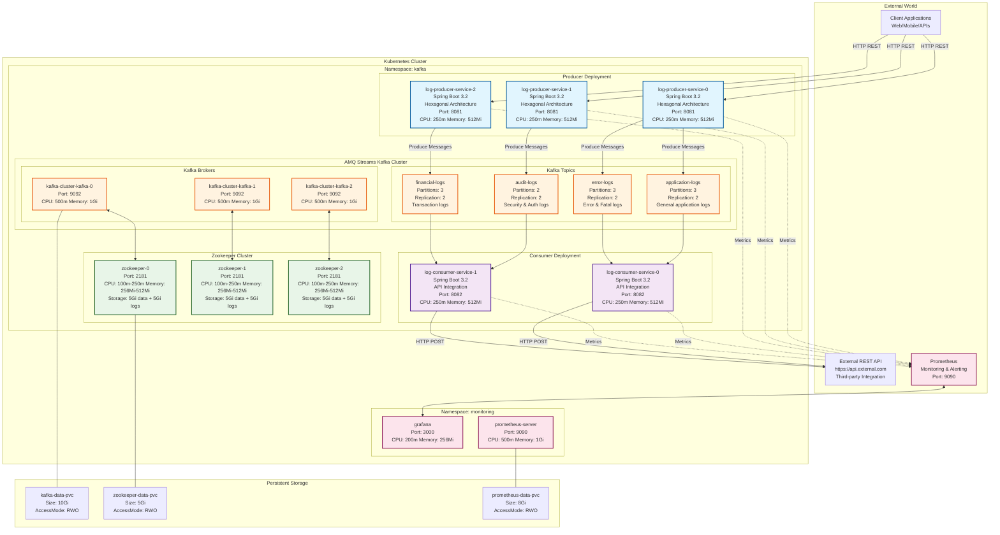
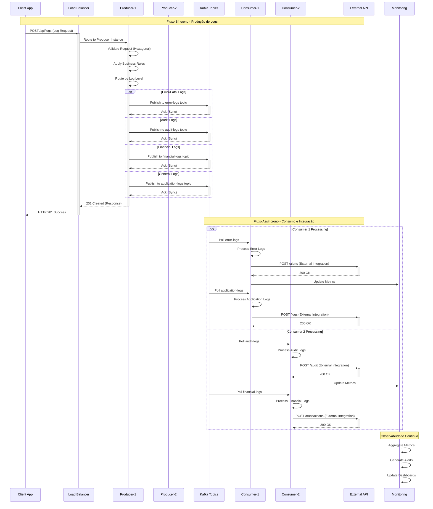
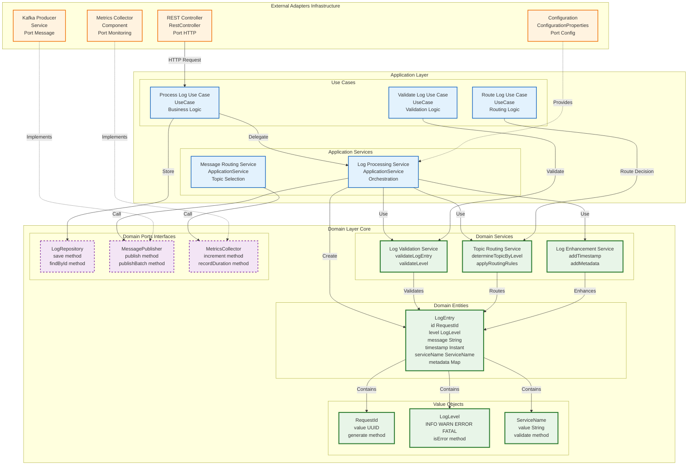

# Diagramas de Arquitetura Completos

Este documento contém todos os diagramas detalhados da arquitetura do projeto estudosKBNT_Kafka_Logs usando Mermaid.

## 1. Arquitetura Geral com Deployment Kubernetes

## 2. Fluxo de Processamento de Logs - Sequência Completa

## 3. Arquitetura Hexagonal Interna - Producer Service

## 4. Estratégia de Roteamento de Tópicos

## 5. Monitoramento e Observabilidade

```mermaid
graph TB
    subgraph "Application Metrics"
        subgraph "Producer Metrics"
            PM1[Request Count<br/>Counter: http_requests_total<br/>Labels: method,status,endpoint]
            PM2[Request Duration<br/>Histogram: http_request_duration_seconds<br/>Buckets: 0.1,0.5,1,5,10]
            PM3[Kafka Messages Sent<br/>Counter: kafka_messages_sent_total<br/>Labels: topic,partition]
            PM4[Kafka Send Duration<br/>Histogram: kafka_send_duration_seconds<br/>Buckets: 0.001,0.01,0.1,1]
        end
        
        subgraph "Consumer Metrics"
            CM1[Messages Consumed<br/>Counter: kafka_messages_consumed_total<br/>Labels: topic,partition,consumer_group]
            CM2[Processing Duration<br/>Histogram: message_processing_duration_seconds<br/>Buckets: 0.1,0.5,1,5,10]
            CM3[External API Calls<br/>Counter: external_api_calls_total<br/>Labels: endpoint,status]
            CM4[Consumer Lag<br/>Gauge: kafka_consumer_lag<br/>Labels: topic,partition,consumer_group]
        end
    end
    
    subgraph "Infrastructure Metrics"
        subgraph "Kafka Metrics"
            KM1[Broker Disk Usage<br/>Gauge: kafka_broker_disk_usage_bytes<br/>Labels: broker_id]
            KM2[Topic Partition Count<br/>Gauge: kafka_topic_partition_count<br/>Labels: topic]
            KM3[Under Replicated Partitions<br/>Gauge: kafka_under_replicated_partitions<br/>Labels: broker_id]
            KM4[Messages Per Second<br/>Rate: kafka_messages_per_second<br/>Labels: topic,partition]
        end
        
        subgraph "Kubernetes Metrics"
            K8M1[Pod CPU Usage<br/>Gauge: container_cpu_usage_seconds_total<br/>Labels: pod,container]
            K8M2[Pod Memory Usage<br/>Gauge: container_memory_usage_bytes<br/>Labels: pod,container]
            K8M3[Pod Restart Count<br/>Counter: kube_pod_container_status_restarts_total<br/>Labels: pod,container]
            K8M4[Service Endpoints<br/>Gauge: kube_service_info<br/>Labels: service,namespace]
        end
    end
    
    subgraph "Alerting Rules"
        subgraph "Critical Alerts"
            A1[High Error Rate<br/>Alert: error_rate > 5%<br/>For: 5m<br/>Severity: critical]
            A2[Consumer Lag High<br/>Alert: kafka_consumer_lag > 1000<br/>For: 10m<br/>Severity: critical]
            A3[Pod Memory High<br/>Alert: memory_usage > 80%<br/>For: 15m<br/>Severity: warning]
        end
        
        subgraph "Warning Alerts"
            A4[Response Time High<br/>Alert: response_time > 2s<br/>For: 10m<br/>Severity: warning]
            A5[Disk Usage High<br/>Alert: disk_usage > 75%<br/>For: 30m<br/>Severity: warning]
            A6[Kafka Broker Down<br/>Alert: kafka_broker_up == 0<br/>For: 1m<br/>Severity: critical]
        end
    end
    
    subgraph "Dashboards"
        subgraph "Application Dashboard"
            D1[Request Rate & Latency<br/>Panels: Time Series<br/>Queries: Prometheus PromQL]
            D2[Error Rate & Status Codes<br/>Panels: Stat & Bar Chart<br/>Thresholds: Green/Yellow/Red]
            D3[Kafka Producer Performance<br/>Panels: Graph & Heatmap<br/>Metrics: Send Rate & Duration]
        end
        
        subgraph "Infrastructure Dashboard"
            D4[Kafka Cluster Health<br/>Panels: Status & Topology<br/>Metrics: Broker Status & Partition Health]
            D5[Kubernetes Resources<br/>Panels: Resource Usage<br/>Metrics: CPU/Memory/Storage per Pod]
            D6[Consumer Group Status<br/>Panels: Lag & Throughput<br/>Metrics: Consumer Performance]
        end
    end
    
    subgraph "Data Flow"
        APPS[Microservices<br/>Producer & Consumer] -->|Metrics Export| PROMETHEUS_MAIN[Prometheus Server<br/>Scrape Interval: 15s<br/>Retention: 15d]
        
        KAFKA_EXPORTER[Kafka Exporter<br/>JMX Metrics Collection] -->|Kafka Metrics| PROMETHEUS_MAIN
        
        KUBE_STATE[kube-state-metrics<br/>Kubernetes API Metrics] -->|K8s Metrics| PROMETHEUS_MAIN
        
        NODE_EXPORTER[node-exporter<br/>System Metrics] -->|Node Metrics| PROMETHEUS_MAIN
        
        PROMETHEUS_MAIN -->|Query| GRAFANA_MAIN[Grafana<br/>Visualization & Dashboards]
        PROMETHEUS_MAIN -->|Evaluate| ALERTMANAGER[AlertManager<br/>Alert Routing & Notification]
        
        ALERTMANAGER -->|Notify| SLACK[Slack Integration<br/>Channel: alerts]
        ALERTMANAGER -->|Notify| EMAIL[Email Notifications<br/>On-call Team]
        ALERTMANAGER -->|Notify| PAGERDUTY[PagerDuty<br/>Incident Management]
    end
    
    classDef metricsClass fill:#e3f2fd,stroke:#1976d2,stroke-width:2px
    classDef alertClass fill:#ffebee,stroke:#d32f2f,stroke-width:2px
    classDef dashClass fill:#e8f5e8,stroke:#388e3c,stroke-width:2px
    classDef flowClass fill:#fff3e0,stroke:#f57c00,stroke-width:2px
    
    class PM1,PM2,PM3,PM4,CM1,CM2,CM3,CM4,KM1,KM2,KM3,KM4,K8M1,K8M2,K8M3,K8M4 metricsClass
    class A1,A2,A3,A4,A5,A6 alertClass
    class D1,D2,D3,D4,D5,D6 dashClass
    class APPS,PROMETHEUS_MAIN,GRAFANA_MAIN,ALERTMANAGER,SLACK,EMAIL,PAGERDUTY flowClass
```

---

## Resumo Técnico

### Tecnologias Utilizadas
- **Spring Boot 3.2** - Framework de microserviços
- **AMQ Streams (Apache Kafka)** - Streaming de mensagens
- **Kubernetes** - Orquestração de contêineres
- **Prometheus + Grafana** - Monitoramento e observabilidade
- **Mermaid** - Diagramação como código

### Padrões Arquiteturais
- **Hexagonal Architecture** - Isolamento de domínio
- **CQRS Pattern** - Separação de leitura e escrita
- **Event-Driven Architecture** - Comunicação assíncrona
- **Circuit Breaker Pattern** - Resiliência de integração

### Características Principais
- **Escalabilidade Horizontal** - Pods com auto-scaling
- **Alta Disponibilidade** - Réplicas múltiplas e failover
- **Observabilidade Completa** - Métricas, logs e traces
- **Integração Externa** - APIs REST para third-party systems

Este documento serve como referência completa para a arquitetura do sistema de logs distribuídos.
