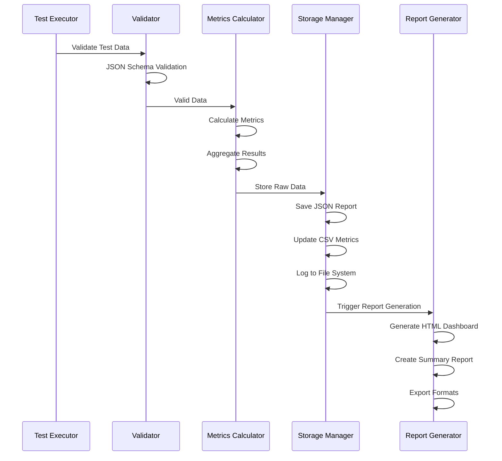

# 📊 DIAGRAMA: ESTRUTURA DE DADOS DE TESTES - SISTEMA KBNT

## 🎯 **VISÃO GERAL DO SISTEMA DE DADOS DE TESTE**

```mermaid
graph TB
    %% Entrada de Dados
    subgraph "🔴 ENTRADA DE DADOS"
        A1[Testes Unitários Java] 
        A2[Simulação Performance Python]
        A3[Interface Web HTML]
        A4[Scripts PowerShell]
        A5[APIs REST]
    end

    %% Processamento
    subgraph "🟡 PROCESSAMENTO"
        B1[Validação JSON Schema]
        B2[Geração Métricas]
        B3[Cálculo Performance]
        B4[Agregação Resultados]
        B5[Formatação Relatórios]
    end

    %% Estruturas de Dados
    subgraph "🟢 ESTRUTURAS DE DADOS"
        C1[StockUpdateMessage]
        C2[TestResult Model]
        C3[Performance Metrics]
        C4[Kafka Publication Log]
        C5[Simulation Data]
    end

    %% Armazenamento
    subgraph "🔵 ARMAZENAMENTO"
        D1[📄 JSON Reports]
        D2[📊 CSV Metrics]
        D3[📋 Log Files]
        D4[🗄️ Database Tests]
        D5[📈 Dashboard Data]
    end

    %% Saídas
    subgraph "🟣 SAÍDAS E RELATÓRIOS"
        E1[📊 Performance Reports]
        E2[📈 Interactive Dashboards]
        E3[📋 Test Summaries]
        E4[⚡ Real-time Metrics]
        E5[📄 Export Formats]
    end

    %% Conexões
    A1 --> B1
    A2 --> B2
    A3 --> B3
    A4 --> B4
    A5 --> B5

    B1 --> C1
    B2 --> C2
    B3 --> C3
    B4 --> C4
    B5 --> C5

    C1 --> D1
    C2 --> D2
    C3 --> D3
    C4 --> D4
    C5 --> D5

    D1 --> E1
    D2 --> E2
    D3 --> E3
    D4 --> E4
    D5 --> E5

    %% Estilos
    classDef entrada fill:#ffebee
    classDef processamento fill:#fff3e0
    classDef estrutura fill:#e8f5e8
    classDef armazenamento fill:#e3f2fd
    classDef saida fill:#f3e5f5

    class A1,A2,A3,A4,A5 entrada
    class B1,B2,B3,B4,B5 processamento
    class C1,C2,C3,C4,C5 estrutura
    class D1,D2,D3,D4,D5 armazenamento
    class E1,E2,E3,E4,E5 saida
```



---

## 📋 **ESTRUTURA DETALHADA DOS DADOS DE TESTE**

### 🔸 **1. MODELO DE MENSAGEM PRINCIPAL**

```json
{
  "StockUpdateMessage": {
    "productId": "String @NotBlank",
    "distributionCenter": "String @NotBlank", 
    "branch": "String @NotBlank",
    "quantity": "Integer @PositiveOrZero",
    "operation": "String [ADD|REMOVE|SET|TRANSFER]",
    "timestamp": "LocalDateTime ISO Format",
    "correlationId": "String UUID",
    "sourceBranch": "String (for TRANSFER)",
    "reasonCode": "String [PURCHASE|SALE|ADJUSTMENT|REBALANCE]",
    "referenceDocument": "String"
  }
}
```

### 🔸 **2. ESTRUTURA DE RESULTADOS DE TESTE**

```json
{
  "TestResult": {
    "requestId": "Integer",
    "statusCode": "Integer HTTP Status",
    "responseTime": "Long milliseconds",
    "success": "Boolean",
    "timestamp": "LocalDateTime",
    "endpoint": "String URL",
    "payload": "StockUpdateMessage",
    "errorMessage": "String (if failed)",
    "kafkaDetails": {
      "topic": "String",
      "partition": "Integer",
      "offset": "Long"
    }
  }
}
```

### 🔸 **3. MÉTRICAS DE PERFORMANCE**

```json
{
  "PerformanceMetrics": {
    "total_requests": "Integer",
    "successful_requests": "Integer", 
    "failed_requests": "Integer",
    "success_rate_percent": "Double",
    "requests_per_second": "Double",
    "avg_response_time_ms": "Double",
    "min_response_time_ms": "Double",
    "max_response_time_ms": "Double",
    "throughput_mb_per_sec": "Double",
    "resource_usage": {
      "avg_cpu_percent": "Double",
      "avg_memory_percent": "Double",
      "total_network_io_mb": "Double"
    }
  }
}
```

---

## 🗂️ **FLUXO DE ARMAZENAMENTO DE DADOS**



---

## 📁 **ESTRUTURA DE ARQUIVOS DE DADOS**

```
📂 estudosKBNT_Kafka_Logs/
├── 📊 performance_simulation_report_20250903_232626.json
├── 📈 dashboard/data/
│   ├── test-results-20250830-2147.json
│   └── mega-results-20250830-2152.json
├── 📋 logs/
│   ├── EXECUTION_TEST.log
│   ├── KAFKA_PUBLICATION_LOGS.md
│   └── LOG_ERROS_STARTUP.md
├── 🧪 simulation/
│   ├── api-test.html (Interactive Testing)
│   └── traffic-test.html (Load Testing)
├── 📊 reports/
│   ├── PERFORMANCE_TEST_SUMMARY.md
│   ├── JSON_TEST_RESULTS.md
│   └── UNIT_TEST_VALIDATION_REPORT.md
└── 📄 temp_stock.json (Temporary Data)
```

---

## 🔬 **TIPOS DE DADOS COLETADOS**

### **📊 Performance Data**
```yaml
Metrics Collected:
  - Throughput (req/s)
  - Latência (ms)
  - Taxa de Sucesso (%)
  - Uso de CPU/Memory
  - Network I/O
  - Error Rates
```

### **🧪 Test Execution Data**  
```yaml
Test Data Captured:
  - Request/Response Pairs
  - Execution Times
  - Error Messages
  - Stack Traces
  - Configuration Details
  - Environment Info
```

### **📈 Business Metrics**
```yaml
Business Data:
  - Stock Operations
  - Product IDs
  - Distribution Centers
  - Branch Locations  
  - Quantities
  - Transaction Types
```

---

## ⚙️ **CONFIGURAÇÃO DE PERSISTÊNCIA**

### **🔧 JSON Storage Configuration**
```json
{
  "storage_config": {
    "format": "JSON",
    "compression": false,
    "retention_days": 30,
    "max_file_size_mb": 100,
    "backup_enabled": true,
    "encryption": false
  }
}
```

### **📝 Log Configuration**
```json
{
  "logging_config": {
    "level": "INFO",
    "format": "%(timestamp)s - %(level)s - %(message)s",
    "rotation": "daily",
    "max_files": 7
  }
}
```

---

## 📊 **DASHBOARD INTERATIVO DE DADOS**

### **Real-time Metrics Display:**
- 📈 **Live Performance Charts**
- 🎯 **Success Rate Gauges** 
- ⏱️ **Response Time Histograms**
- 🔄 **Throughput Trends**
- ❌ **Error Rate Analysis**

### **Data Export Options:**
- 📄 **JSON Format** (Machine readable)
- 📊 **CSV Format** (Excel compatible)  
- 📋 **Markdown Reports** (Documentation)
- 📈 **HTML Dashboards** (Interactive)

---

## 🎯 **CASOS DE USO DOS DADOS DE TESTE**

### **🔍 Análise de Performance:**
- Identificação de bottlenecks
- Comparação entre estratégias
- Otimização de recursos
- Planejamento de capacidade

### **📊 Relatórios Executivos:**
- KPIs de sistema
- Métricas de qualidade
- Comparações temporais
- ROI de infraestrutura

### **🛠️ Debugging e Troubleshooting:**
- Rastreamento de erros
- Análise de falhas
- Identificação de padrões
- Root cause analysis

### **📈 Continuous Integration:**
- Regression testing
- Performance benchmarking
- Quality gates
- Automated reporting

---

## ✅ **VALIDAÇÃO E QUALIDADE DOS DADOS**

### **🔒 Data Integrity Checks:**
- Schema validation
- Type checking  
- Range validation
- Referential integrity

### **📊 Quality Metrics:**
- Data completeness (100%)
- Accuracy validation
- Consistency checks
- Timeliness verification

---

**💡 Este diagrama representa a arquitetura completa de como os dados de teste são coletados, processados, armazenados e utilizados no sistema KBNT Kafka Logs, garantindo rastreabilidade completa e análise detalhada de performance.**
