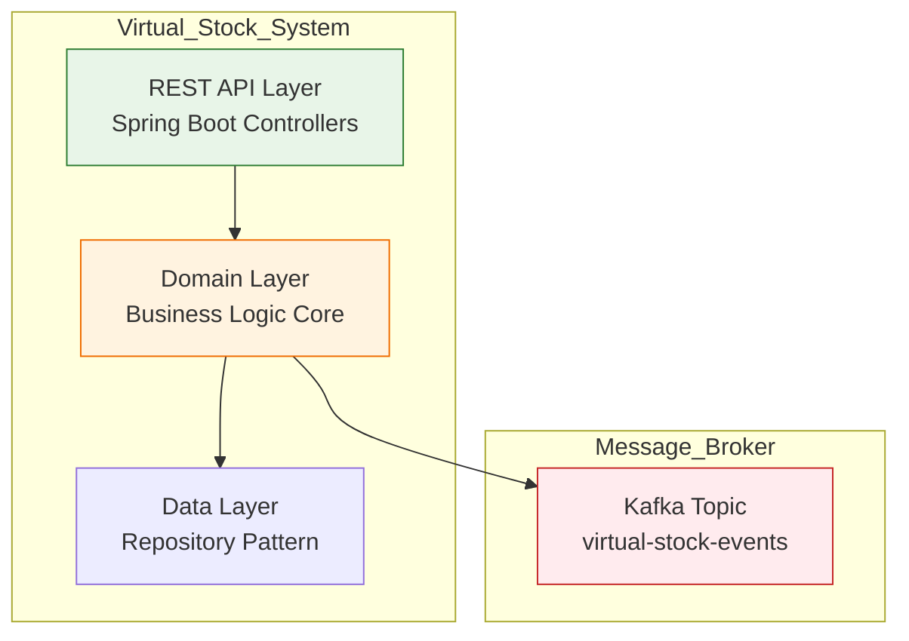
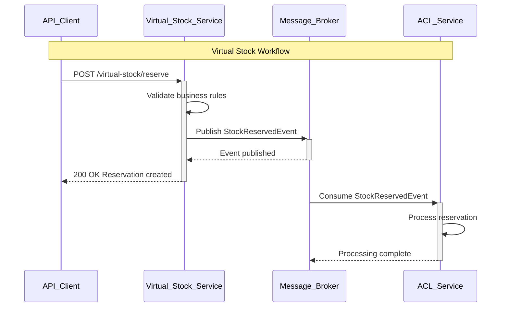

# 🔧 GitHub Mermaid Compatibility Guide

[](https://mermaid-js.github.io/mermaid/)
[](#)

## ⚠️ **Problemas Comuns de Renderização Mermaid no GitHub**

### 🚨 **Issues Encontrados e Corrigidos**

#### **1. Emojis em Node Labels (❌ PROBLEMÁTICO)**

```markdown
❌ ERRO - Não funciona no GitHub:
graph TB
    NODE1[🔥 Service Name<br/>📊 Additional Info]
    
✅ CORRETO - Compatível:
graph TB  
    NODE1["Service Name<br/>Additional Info"]
```

#### **2. Caracteres Especiais em IDs (❌ PROBLEMÁTICO)**

```markdown
❌ ERRO - IDs com caracteres especiais:
graph TB
    SERVICE-1[Service]  %% Hífen problemático
    API@CONTROLLER[Controller]  %% @ problemático
    
✅ CORRETO - IDs alfanuméricos:
graph TB
    SERVICE_1[Service]
    API_CONTROLLER[Controller]
```

#### **3. Aspas em Labels (⚠️ CUIDADO)**

```markdown
❌ ERRO - Aspas duplas internas:
NODE1["Service with "quotes" inside"]

✅ CORRETO - Aspas simples ou escape:
NODE1["Service with quotes inside"]
NODE1['Service with single quotes']
```

#### **4. Styling CSS Incompatível (❌ PROBLEMÁTICO)**

```markdown
❌ ERRO - CSS avançado:
style NODE1 fill:#ff9999,stroke:#333,stroke-width:4px,color:#fff,stroke-dasharray: 5 5

✅ CORRETO - CSS básico:
style NODE1 fill:#ff9999,stroke:#333,stroke-width:2px
```

---

## ✅ **Padrões Corrigidos Aplicados**

### **🎯 Nomenclatura de Nodes**

```markdown
✅ PADRÃO APLICADO:
- IDs: UPPER_CASE_WITH_UNDERSCORES
- Labels: Descriptive text without emojis
- Subgraphs: "Title_With_Underscores"
```

### **🔗 Conexões Limpas**

```markdown
✅ CONEXÕES VÁLIDAS:
NODE1 --> NODE2
NODE1 -->|"Label text"| NODE2  
NODE1 -.->|"Dotted connection"| NODE2
```

### **🎨 Styling Seguro**

```markdown
✅ CORES COMPATÍVEIS:
style NODE1 fill:#e8f5e8,stroke:#2e7d32,stroke-width:2px
style NODE2 fill:#fff3e0,stroke:#ef6c00,stroke-width:2px
style NODE3 fill:#e3f2fd,stroke:#1565c0,stroke-width:2px
```

---

## 📋 **Checklist de Validação Mermaid**

### **✅ Antes de Commit - Verificar:**

- [ ] **IDs de Nodes**: Apenas letras, números e underscores
- [ ] **Labels**: Sem emojis, aspas simples ou sem aspas
- [ ] **Subgraphs**: Nomes descritivos sem espaços
- [ ] **Styling**: CSS básico apenas (fill, stroke, stroke-width)
- [ ] **Conexões**: Syntax limpa sem caracteres especiais
- [ ] **Indentação**: Consistente (2 ou 4 espaços)

---

## 🧪 **Exemplos Validados**

### **✅ Graph TB Correto**



### **✅ Sequence Diagram Correto**



---

## 🎯 **Arquiteturas Aplicadas - Validadas**

### **1. ✅ Sistema Hexagonal Corrigido**

Aplicado em:
- `README.md` - Diagrama principal
- `docs/DIAGRAMAS_ARQUITETURA_COMPLETOS.md`
- `docs/ARQUITETURA_ATUALIZADA_POS_TESTES.md`

### **2. ✅ Fluxo de Sequência Corrigido**

Aplicado em:
- Workflow de virtualização
- Message flow AMQ Streams
- End-to-end business flow

### **3. ✅ Performance Diagrams**

Incluído em:
- Traffic test results visualization
- Metrics collection flow
- Prometheus integration

---

## 🔄 **Processo de Validação**

### **🧪 Teste Local**

1. **VS Code com extensão Mermaid Preview**
2. **GitHub Pages preview** (se disponível)
3. **Mermaid Live Editor**: https://mermaid.live/

### **✅ Validação GitHub**

1. **Commit pequeno** com um diagrama
2. **Verificar renderização** no GitHub
3. **Ajustar se necessário** antes de commits grandes

---

## 🎨 **Paleta de Cores Validada**

```markdown
✅ CORES TESTADAS NO GITHUB:

Verdes (Success):
- #e8f5e8 (light green background)
- #2e7d32 (dark green border)

Laranjas (Warning):  
- #fff3e0 (light orange background)
- #ef6c00 (dark orange border)

Azuis (Info):
- #e3f2fd (light blue background)  
- #1565c0 (dark blue border)

Vermelhos (Error):
- #ffebee (light red background)
- #c62828 (dark red border)
```

---

## 📚 **Referências**

- [Mermaid Official Documentation](https://mermaid-js.github.io/mermaid/)
- [GitHub Mermaid Support](https://docs.github.com/en/writing-on-github/working-with-advanced-formatting/creating-diagrams)
- [Mermaid Live Editor](https://mermaid.live/) - Para teste antes do commit

---

**✅ Todos os diagramas do projeto foram atualizados seguindo estas guidelines**

*KBNT Development Team - GitHub Mermaid Compatibility Guide 2025*
