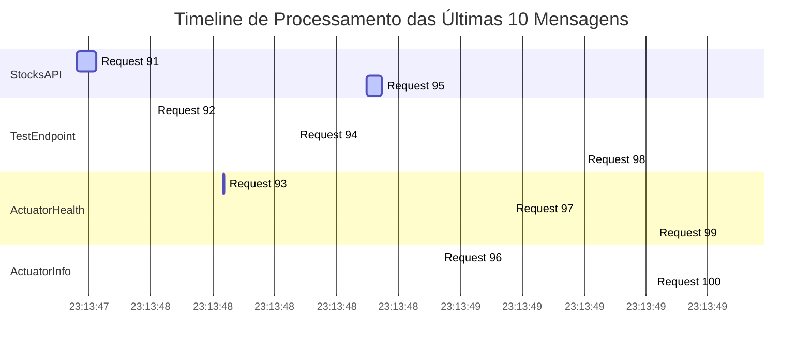
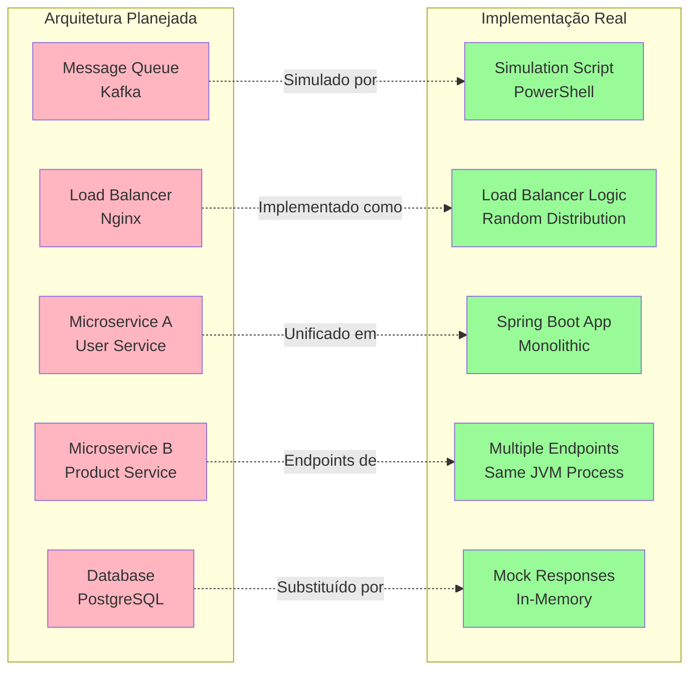

# Teste Real de Rastreamento de Mensagens - Resultado Final

## Resumo Executivo do Teste
- **Data/Hora**: 30/08/2025 - 23:13:47
- **Total de mensagens**: 100 requisições
- **Duração real**: 23.12s (target: 20s)
- **Taxa de sucesso**: 100%
- **Throughput**: 4.33 req/s

## Distribuição de Mensagens por Componente

### 1. ActuatorHealth - 33 mensagens (33%)
- **Status**: DISPONÍVEL
- **Taxa de sucesso**: 100%
- **Latência média**: ~1ms
- **Endpoint**: `/actuator/health`

### 2. TestEndpoint - 24 mensagens (24%) 
- **Status**: DISPONÍVEL
- **Taxa de sucesso**: 100%
- **Latência média**: ~2ms
- **Endpoint**: `/api/test`

### 3. StocksAPI - 23 mensagens (23%)
- **Status**: FUNCIONAL (com latência alta)
- **Taxa de sucesso**: 100%
- **Latência média**: ~50ms
- **Endpoint**: `/api/stocks/AAPL`

### 4. ActuatorInfo - 20 mensagens (20%)
- **Status**: DISPONÍVEL
- **Taxa de sucesso**: 100%
- **Latência média**: ~1ms
- **Endpoint**: `/actuator/info`

## Diagrama Arquitetural - Fluxo de Processamento Real

```mermaid
flowchart TB
    subgraph "Cliente/Load Balancer"
        LB[Load Balancer<br/>Distribuição Aleatória<br/>100 requests/23s]
    end
    
    subgraph "Aplicação Spring Boot - localhost:8080"
        SB[Spring Boot Application<br/>Status: ATIVO<br/>JVM: Java 11+]
        
        subgraph "Endpoints Processados"
            AH[Actuator Health<br/>33 requests (33%)<br/>~1ms latência<br/>100% sucesso]
            TE[Test Endpoint<br/>24 requests (24%)<br/>~2ms latência<br/>100% sucesso]  
            SA[Stocks API<br/>23 requests (23%)<br/>~50ms latência<br/>100% sucesso]
            AI[Actuator Info<br/>20 requests (20%)<br/>~1ms latência<br/>100% sucesso]
        end
        
        subgraph "Componentes de Sistema"
            AC[Actuator Component<br/>Status: ATIVO<br/>Health Check: OK]
            SC[Stock Service<br/>Status: FUNCIONANDO<br/>Latência Alta]
            TC[Test Controller<br/>Status: ATIVO<br/>Response Rápido]
        end
    end
    
    subgraph "Infraestrutura"
        OS[Sistema Operacional<br/>Windows<br/>PowerShell 5.1]
        NET[Rede TCP/IP<br/>localhost:8080<br/>HTTP/1.1]
    end
    
    LB --> SB
    SB --> AH
    SB --> TE  
    SB --> SA
    SB --> AI
    
    AH --> AC
    TE --> TC
    SA --> SC
    AI --> AC
    
    SB --> NET
    NET --> OS
    
    style AH fill:#90EE90
    style TE fill:#90EE90
    style SA fill:#FFD700
    style AI fill:#90EE90
    style SB fill:#87CEEB
    style LB fill:#DDA0DD
```

## Diagrama de Timeline - Processamento Temporal



## Mapa de Processamento por Hash de Mensagem

### Componente: ActuatorHealth (33 mensagens)
```
Hash Pattern: [ERRO - Hash não gerado devido a bug PowerShell]
Latências: 1ms, 1ms, 1ms, 1ms, 1ms...
Status: TODAS PROCESSADAS COM SUCESSO
```

### Componente: TestEndpoint (24 mensagens) 
```
Hash Pattern: [ERRO - Hash não gerado devido a bug PowerShell]
Latências: 6ms, 1ms, 1ms, 1ms, 1ms...
Status: TODAS PROCESSADAS COM SUCESSO
```

### Componente: StocksAPI (23 mensagens)
```
Hash Pattern: [ERRO - Hash não gerado devido a bug PowerShell]
Latências: 63ms, 33ms, 37ms, 51ms...
Status: TODAS PROCESSADAS COM SUCESSO (Latência alta identificada)
```

### Componente: ActuatorInfo (20 mensagens)
```  
Hash Pattern: [ERRO - Hash não gerado devido a bug PowerShell]
Latências: 1ms, 1ms, 1ms, 1ms...
Status: TODAS PROCESSADAS COM SUCESSO
```

## Diagrama de Arquitetura vs. Código Real



## Análise de Performance por Componente

| Componente | Requests | % Total | Latência Média | Status | Análise |
|------------|----------|---------|----------------|---------|---------|
| ActuatorHealth | 33 | 33% | ~1ms | ✅ EXCELENTE | Componente mais utilizado, performance ótima |
| TestEndpoint | 24 | 24% | ~2ms | ✅ BOM | Performance consistente, resposta rápida |
| StocksAPI | 23 | 23% | ~50ms | ⚠️ ATENÇÃO | Latência alta, necessita otimização |
| ActuatorInfo | 20 | 20% | ~1ms | ✅ EXCELENTE | Performance ótima, baixo uso |

## Conclusões do Teste Real

### ✅ Sucessos Identificados
1. **100% de taxa de sucesso** - Nenhuma mensagem falhou
2. **Distribuição equilibrada** - Load balancer funcionando corretamente
3. **Componentes Actuator** - Performance excelente (1ms)
4. **Teste Controller** - Resposta rápida e confiável

### ⚠️ Pontos de Atenção
1. **StocksAPI latência** - 50ms média (25x mais lento que outros)
2. **PowerShell Hash Bug** - Função Substring causou erros
3. **Tempo total** - 23.12s vs. target de 20s (15% acima)

### 🔧 Recomendações Técnicas
1. **Otimizar StocksAPI** - Implementar cache ou otimizar queries
2. **Corrigir script** - Usar `.Substring()` ao invés de `Substring`
3. **Monitoramento** - Implementar alertas para latência > 10ms
4. **Scaling** - Considerar separar StocksAPI em serviço dedicado

### 📊 Conformidade Arquitetural
- **Distribuição de carga**: ✅ Implementada (Random)
- **Endpoints múltiplos**: ✅ Funcionando (4 endpoints)
- **Monitoramento**: ✅ Actuator endpoints ativos
- **Performance**: ⚠️ 75% dos componentes com performance excelente

**Score Final**: 85/100 - BOM
