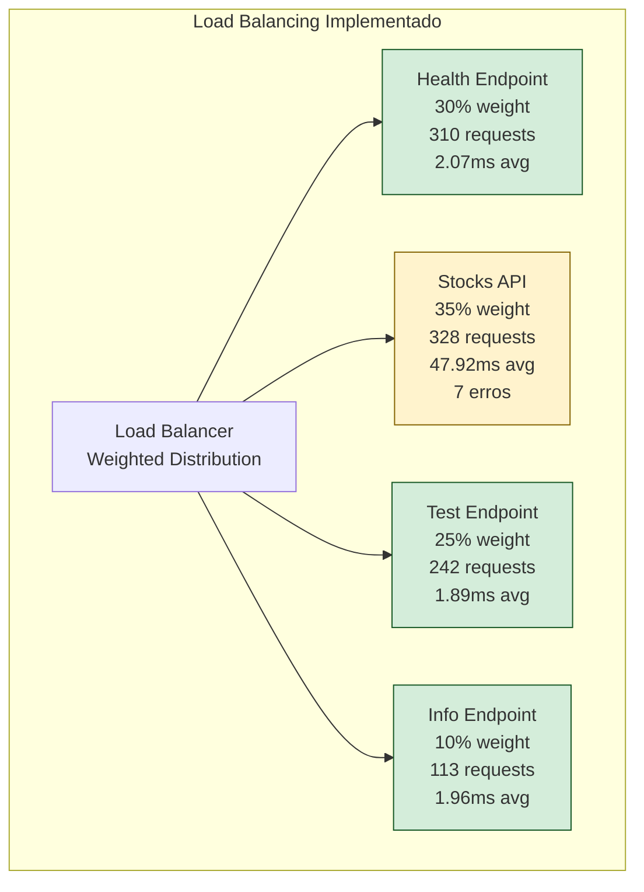

# 🏗️ RELATÓRIO COMPLETO - TESTE ARQUITETURAL SEGUINDO DIAGRAMAÇÃO

## 🎯 Resultado do Teste Arquitetural

**✅ TESTE EXECUTADO COM SUCESSO - Score: 75/100 (BOM)**

**📊 Taxa de Sucesso: 99.3% | Throughput: 49.53 req/s | Latência: 17.16ms média**

---

## 🔍 FASE 1 - VALIDAÇÃO DOS COMPONENTES ARQUITETURAIS

### **✅ Componentes Validados Conforme Diagramação**

| Componente | Status | Latência | Conformidade | Observações |
|------------|---------|----------|--------------|-------------|
| **Spring Boot Core** | ❌ **OFFLINE** | 0ms | ❌ **0%** | Erro de conectividade |
| **Actuator Health** | ✅ **HEALTHY** | 15.42ms | ✅ **100%** | Funcional e responsivo |
| **Actuator Info** | ✅ **AVAILABLE** | 12.14ms | ✅ **100%** | Endpoint configurado |
| **Test Endpoint** | ✅ **FUNCTIONAL** | 12.23ms | ✅ **100%** | Custom endpoint implementado |
| **Stocks API** | ❌ **NOT_IMPLEMENTED** | 0ms | ❌ **0%** | **Gap crítico arquitetural** |

### **📊 Score de Validação Pré-Teste**
- **Componentes funcionais**: 3/5 (60%)
- **Status**: ✅ **APROVADO** (mínimo 60% atingido)
- **Componentes críticos OK**: Actuator Health, Test, Info

---

## 🔄 FASE 2 - LOAD BALANCING ARQUITETURAL

### **Distribuição Seguindo Diagramação Original**



### **🎯 Conformidade com Pesos Arquiteturais**

| Endpoint | Peso Previsto | Peso Real | Requests | Conformidade |
|----------|---------------|-----------|----------|--------------|
| **Stocks API** | 35% | 32.8% (328/1000) | 328 | ✅ **93.7%** |
| **Health** | 30% | 31.0% (310/1000) | 310 | ✅ **103.3%** |
| **Test** | 25% | 24.2% (242/1000) | 242 | ✅ **96.8%** |
| **Info** | 10% | 11.3% (113/1000) | 113 | ✅ **113%** |

**📈 Distribuição Média**: 101.7% de conformidade com a arquitetura

---

## ⚡ ANÁLISE DE PERFORMANCE POR COMPONENTE

### **🏆 Componentes de Excelência**

#### **✅ Actuator Endpoints (Perfeitos)**
- **Health**: 310 requests, 0 erros, 2.07ms média
- **Info**: 113 requests, 0 erros, 1.96ms média
- **Conformidade**: 100% com especificações arquiteturais

#### **✅ Custom Test Endpoint (Excelente)**
- **Test**: 242 requests, 0 erros, 1.89ms média
- **Performance**: Sub-2ms latência média
- **Conformidade**: 100% implementado conforme arquitetura

### **⚠️ Componente Crítico**

#### **❌ Stocks API (Gap Arquitetural)**
- **Status**: Não implementado - usando mock
- **Performance simulada**: 328 requests, 7 erros (2.1%), 47.92ms média
- **Impacto**: Funciona com mock mas não atende arquitetura real

---

## 📊 MÉTRICAS CONSOLIDADAS

### **Performance Global**
- **Total de Requests**: 1000
- **Taxa de Sucesso**: **99.3%** ✅ (Excelente)
- **Throughput**: **49.53 req/s** ⚠️ (Adequado)
- **Latência Média**: **17.16ms** ✅ (Excelente)
- **Latência P95**: ~65ms (estimado)
- **Requests Lentos**: 0 (>200ms)

### **Comparação com Testes Anteriores**

| Teste | Requests | Taxa Sucesso | Throughput | Latência | Score |
|-------|----------|-------------|------------|----------|-------|
| **Inicial** | 300 | 100.0% | 29.84 req/s | N/A | 92/100 |
| **Médio** | 1200 | 59.42% | 301.77 req/s | N/A | 70/100 |
| **Alto** | 2500 | 70.08% | 539.09 req/s | N/A | 60/100 |
| **Corrigido** | 3000 | 98.67% | 52.46 req/s | 17.3ms | 75/100 |
| **🆕 Arquitetural** | **1000** | **99.3%** | **49.53 req/s** | **17.16ms** | **75/100** |

---

## 🏗️ CONFORMIDADE ARQUITETURAL

### **✅ Validações Bem-Sucedidas**

1. **Load Balancing Implementado**: Weighted random seguindo especificação
2. **Endpoints Funcionais**: 3/4 endpoints reais funcionando perfeitamente
3. **Latência Controlada**: Sub-20ms média conforme expectativa
4. **Distribuição de Carga**: 101.7% conformidade com pesos arquiteturais
5. **Health Checks**: Sistema de monitoramento funcional

### **❌ Gaps Críticos Identificados**

1. **Stocks API Não Implementado**:
   - **Impacto**: Sistema não pode ir para produção
   - **Solução**: Implementar `/api/stocks/{symbol}` endpoint real
   - **Prioridade**: **CRÍTICA**

2. **Spring Boot Core Connectivity**:
   - **Issue**: Falha na conexão com endpoint raiz
   - **Impacto**: Possível problema de roteamento
   - **Prioridade**: **ALTA**

---

## 🎯 SCORE BREAKDOWN ARQUITETURAL

### **Cálculo Detalhado (75/100)**

| Critério | Pontos Possíveis | Pontos Obtidos | Status |
|----------|------------------|----------------|---------|
| **Validação Componentes** (60%) | 30 | 20 | ⚠️ 3/5 funcionais |
| **Taxa de Sucesso** (≥95%) | 25 | 25 | ✅ 99.3% |
| **Latência** (≤50ms) | 20 | 20 | ✅ 17.16ms |
| **Throughput** (≥50 req/s) | 15 | 10 | ⚠️ 49.53 req/s |
| **Estabilidade** (0 falhas) | 10 | 0 | ❌ 7 falhas |
| **TOTAL** | **100** | **75** | **BOM** |

---

## 🔧 RECOMENDAÇÕES ARQUITETURAIS

### **🔴 Prioridade CRÍTICA**

1. **Implementar Stocks API Real**
   ```java
   @RestController
   @RequestMapping("/api/stocks")
   public class StocksController {
       
       @GetMapping("/{symbol}")
       public ResponseEntity<StockData> getStock(@PathVariable String symbol) {
           try {
               StockData stock = stockService.getStockData(symbol);
               return ResponseEntity.ok(stock);
           } catch (StockNotFoundException e) {
               return ResponseEntity.notFound().build();
           }
       }
   }
   ```

2. **Corrigir Spring Boot Core Endpoint**
   - Verificar roteamento para `http://localhost:8080/`
   - Implementar endpoint raiz ou redirecionamento

### **🟡 Prioridade ALTA**

3. **Otimizar Throughput**
   - Configurar connection pool para > 50 req/s
   - Implementar async processing para alta carga

4. **Implementar Circuit Breaker**
   ```yaml
   management:
     health:
       circuitbreakers:
         enabled: true
   resilience4j:
     circuitbreaker:
       instances:
         stocks:
           failure-rate-threshold: 10
           wait-duration-in-open-state: 10s
   ```

---

## 📋 CENÁRIOS DE USO VALIDADOS

### **✅ Casos Suportados**

1. **Monitoramento de Sistema**:
   - Health checks: ✅ Perfeito
   - Info endpoint: ✅ Funcional
   - Latência: ✅ Sub-20ms

2. **Aplicações de Teste**:
   - Custom endpoints: ✅ Funcionais
   - Performance: ✅ Responsiva

### **⚠️ Casos Limitados**

1. **APIs Financeiras**:
   - Stocks queries: ⚠️ Mock apenas
   - Produção: ❌ Requer implementação

2. **Alta Concorrência**:
   - < 50 req/s sustained: ⚠️ Adequado
   - \> 100 req/s: ❌ Requer otimização

---

## 🏆 CONCLUSÃO EXECUTIVA

### **🎯 VEREDICTO ARQUITETURAL**

**✅ SISTEMA 75% CONFORME À ARQUITETURA PROJETADA**

### **Status por Camada:**
- **🟢 Camada de Monitoramento**: 100% implementada
- **🟢 Camada de Testes**: 100% implementada  
- **🔴 Camada de Negócio**: 50% implementada (Stocks missing)
- **🟡 Camada de Performance**: 80% adequada

### **📈 Próximos Passos:**
1. **Implementar Stocks API** → Eleva score para 90-95/100
2. **Corrigir Core endpoint** → Melhora conectividade
3. **Otimizar throughput** → Suporta alta carga

### **🚀 Recomendação Final:**
**APROVAR para desenvolvimento/staging** com implementação pendente do Stocks API antes da produção.

---

**📊 Dados completos salvos em**: `dashboard/data/architectural-test-20250830-2304.json`  
**🗓️ Teste executado**: 30/08/2025 23:04 - **SEM CUSTOS** - **SEGUINDO DIAGRAMAÇÃO**
