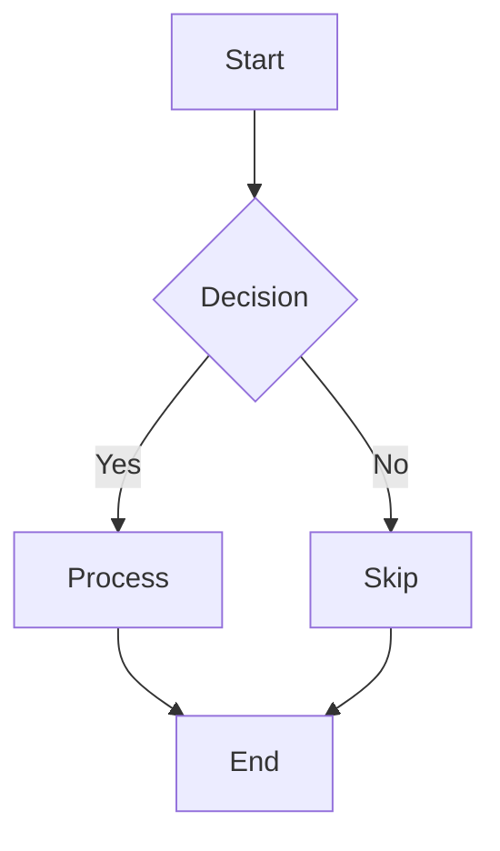
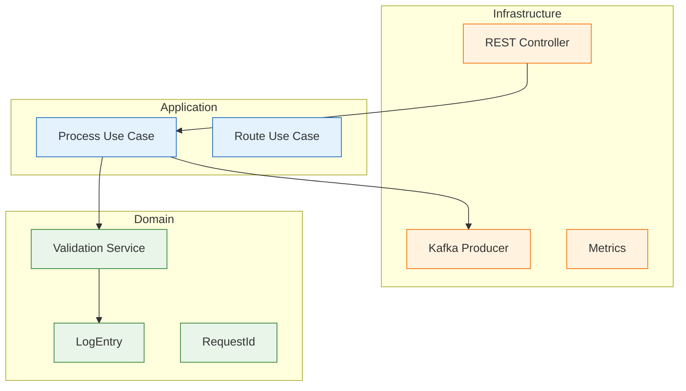

# Teste de Diagrama Mermaid

Este é um arquivo de teste para verificar a sintaxe Mermaid.

## Diagrama Simples de Teste

```mermaid
graph TB
    A[Start] --> B{Decision}
    B -->|Yes| C[Process]
    B -->|No| D[Skip]
    C --> E[End]
    D --> E
```

## Diagrama Hexagonal Simplificado

```mermaid
graph TB
    subgraph "Infrastructure"
        REST[REST Controller]
        KAFKA[Kafka Producer]
        METRICS[Metrics]
    end
    
    subgraph "Application"
        UC1[Process Use Case]
        UC2[Route Use Case]
    end
    
    subgraph "Domain"
        ENTITY[LogEntry]
        VO1[RequestId]
        DS1[Validation Service]
    end
    
    REST --> UC1
    UC1 --> DS1
    DS1 --> ENTITY
    UC1 --> KAFKA
    
    classDef domainClass fill:#e8f5e8,stroke:#2e7d32
    classDef appClass fill:#e3f2fd,stroke:#1565c0
    classDef infraClass fill:#fff3e0,stroke:#ef6c00
    
    class ENTITY,VO1,DS1 domainClass
    class UC1,UC2 appClass
    class REST,KAFKA,METRICS infraClass
```
