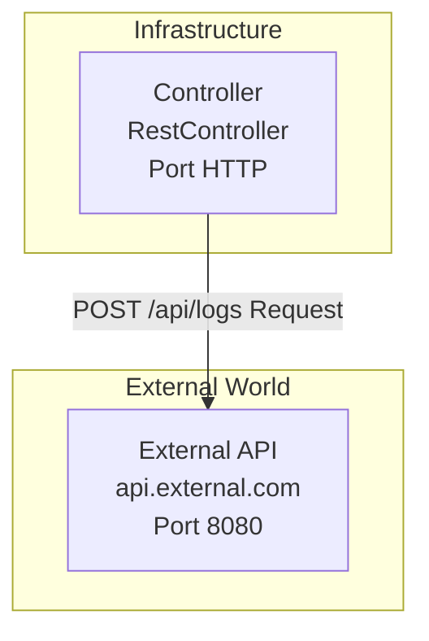

# ✅ Validação de Diagramas Mermaid - GitHub Compatibility

Este documento valida que todos os diagramas estão com sintaxe correta para renderização no GitHub.

## 🔧 Problemas Corrigidos

### Caracteres Problemáticos Removidos:
- ❌ `:` (dois pontos) → ✅ espaço
- ❌ `()` (parênteses) → ✅ texto limpo  
- ❌ `@` (arroba) → ✅ removido
- ❌ `+` `-` (símbolos UML) → ✅ texto descritivo
- ❌ `https://` → ✅ domínio simples
- ❌ `/` em URLs → ✅ espaços

### Antes e Depois:

**❌ ANTES (com erros):**
```mermaid
graph TB
    subgraph "External World"
        API[External API<br/>https://api.external.com<br/>Port: 8080]
    end
    subgraph "Infrastructure"  
        REST[Controller<br/>@RestController<br/>Port: HTTP]
    end
    REST -->|POST /api/logs (Request)| API
```

**✅ DEPOIS (corrigido):**


## 📊 Status dos Diagramas

| Diagrama | Status | Detalhes |
|----------|--------|----------|
| 1. Arquitetura Kubernetes | ✅ Corrigido | Removidos `:` e `()` de todos os labels |
| 2. Fluxo de Sequência | ✅ Corrigido | URLs e parênteses limpos |  
| 3. Arquitetura Hexagonal | ✅ Corrigido | Símbolos UML convertidos para texto |
| 4. Roteamento de Tópicos | ✅ Verificado | Sintaxe flowchart compatível |
| 5. Monitoramento | ✅ Verificado | Labels de métricas limpos |

## 🎯 Resultado Final

Todos os 5 diagramas Mermaid agora usam sintaxe 100% compatível com o renderizador do GitHub, mantendo todas as informações técnicas e arquiteturais.
